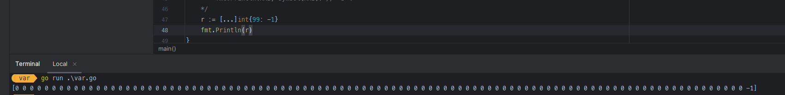
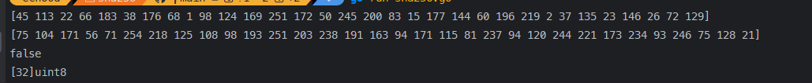
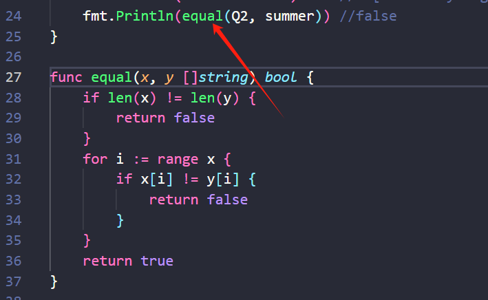

# 4. 复合数据类型

* 主要讨论四种类型——数组、slice、map和结构体
* 演示如何使用结构体来解码和编码到对应JSON格式的数据，并且通过结合使用模板来生成HTML页面。

数组和结构体是聚合类型，它们的值由许多元素或成员字段的值组成。

数组是由同构的元素组成——每个数组元素都是完全相同的类型——结构体则是由异构的元素组成的。数组和结构体都是有固定内存大小的数据结构。相比之下，slice和map则是动态的数据结构，它们将根据需要动态增长。

## 4.1. 数组

* 数组是一个由固定长度的特定类型元素组成的序列，一个数组可以由零个或多个元素组成。
* 数组的每个元素可以通过索引下标来访问，索引下标的范围是从0开始到数组长度减1的位置。
* 内置的len函数将返回数组中元素的个数。

因为数组的长度是固定的，因此在Go语言中很少直接使用数组。和数组对应的类型是Slice（切片），它是可以增长和收缩的动态序列，slice功能也更灵活，但是要理解slice工作原理的话需要先理解数组。

### 数组定义

默认情况下，数组的每个元素都被初始化为元素类型对应的零值，对于数字类型来说就是0。

```Go
var a [3]int             // array of 3 integers
fmt.Println(a[0])        // print the first element
fmt.Println(a[len(a)-1]) // print the last element, a[2]

// Print the indices and elements.
for i, v := range a {
    fmt.Printf("%d %d\n", i, v)
}

// Print the elements only.
for _, v := range a {
    fmt.Printf("%d\n", v)
}
```

我们也可以使用数组字面值语法用一组值来初始化数组：

```Go
	var q [3]int = [3]int{1, 2, 3}
	var r [3]int = [3]int{1, 2}
	fmt.Println(q[1]) // "2"
	fmt.Println(r[2]) // "0"
```

如果在数组的长度位置出现的是“...”省略号，则表示数组的长度是根据初始化值的个数来计算。因此，上面q数组的定义可以简化为

```Go
q := [...]int{1, 2, 3}
fmt.Printf("%T\n", q) // "[3]int"
```

### 数组长度

数组的长度是数组类型的一个组成部分，因此[3]int和[4]int是两种不同的数组类型。数组的长度必须是常量表达式，因为数组的长度需要在编译阶段确定。

```Go
q := [3]int{1, 2, 3}
q = [4]int{1, 2, 3, 4} // compile error: cannot assign [4]int to [3]int
```

### 数组-键值对

上面的形式是直接提供顺序初始化值序列，但是也可以指定一个索引和对应值列表的方式初始化，就像下面这样：

```Go
type Currency int

const (
    USD Currency = iota // 美元
    EUR                 // 欧元
    GBP                 // 英镑
    RMB                 // 人民币
)

symbol := [...]string{USD: "$", EUR: "€", GBP: "￡", RMB: "￥"}

fmt.Println(RMB, symbol[RMB]) // "3 ￥"
```

在这种形式的数组字面值形式中，初始化索引的顺序是无关紧要的，而且没用到的索引可以省略，和前面提到的规则一样，未指定初始值的元素将用零值初始化。例如，

```Go
r := [...]int{99: -1}
// 定义了一个含有100个元素的数组r，最后一个元素被初始化为-1，其它元素都是用0初始化。
```



### 数组比较

只有数组的数据类型完全相同，两个数组才能比较；可以直接通过==比较运算符来比较两个数组，只有当两个数组的所有元素都是相等的时候数组才是相等的。不相等比较运算符!=遵循同样的规则。

```Go
a := [2]int{1, 2}
b := [...]int{1, 2}
c := [2]int{1, 3}
fmt.Println(a == b, a == c, b == c) // "true false false"
d := [3]int{1, 2}
fmt.Println(a == d) // compile error: cannot compare [2]int == [3]int
```

下面的例子用SHA256算法分别生成“x”和“X”两个信息的摘要：

```Go
import "crypto/sha256"

func main() {
    c1 := sha256.Sum256([]byte("x"))
    c2 := sha256.Sum256([]byte("X"))
    // Printf函数的%x以十六进制 %t打印布尔型数据，%T用于显示一个值对应的数据类型。
    fmt.Printf("%x\n%x\n%t\n%T\n", c1, c2, c1 == c2, c1)
    // Output:
    // 2d711642b726b04401627ca9fbac32f5c8530fb1903cc4db02258717921a4881
    // 4b68ab3847feda7d6c62c1fbcbeebfa35eab7351ed5e78f4ddadea5df64b8015
    // false
    // [32]uint8
}
```

如果写成这样

```go
fmt.Printf("%v\n%v\n%v\n%T\n", c1, c2, c1 == c2, c1)
```

将会输出如下，所以能够看出，c1 c2本身是一个十进制数组。



上面例子中，两个消息虽然只有一个字符的差异，但是生成的消息摘要则几乎有一半的bit位是不相同的。

### 练习 4.1

编写一个函数，计算两个SHA256哈希码中不同bit的数目。（参考2.6.2节的PopCount函数。)

```go

// NOTE: 练习 4.1： 编写一个函数，计算两个SHA256哈希码中不同bit的数目。

type SHA256 [32]byte

func main() {
	md1, md2 := SHA256{14: 252, 31: 8}, SHA256{31: 5}
	bitDiff(&md1, &md2)
}

func bitDiff(md1, md2 *SHA256) int {
	diffCnt := 0
	fmt.Println("  sha1  \t  sha2 ")
	for i := range md1 {
		b1 := md1[i]
		b2 := md2[i]
		for i := 0; i < 8; i++ {
			// NOTE: get last bit of a byte
			lb1, lb2 := (b1>>i)&1, (b2>>i)&1
			if (lb1 ^ lb2) == 1 {
				diffCnt++
			}
		}
		fmt.Printf("%08b\t%08b\n", b1, b2)
	}
	fmt.Printf("bit diff count: %d\n", diffCnt)
	return diffCnt
}

```

### 练习 4.2

 编写一个程序，默认情况下打印标准输入的SHA256编码，并支持通过命令行flag定制，输出SHA384或SHA512哈希算法。flag包：[flag package - flag - Go Packages](https://pkg.go.dev/flag)

```go
package main

import (
	"crypto/sha256"
	"crypto/sha512"
	"flag"
	"fmt"
	"os"
)

// NOTE: 练习 4.2： 编写一个程序，默认情况下打印标准输入的SHA256编码，并支持通过命令行flag定制，输出SHA384或SHA512哈希算法。
func main() {
	var shaType string
	// 命令参数shaType，默认SHA256
	flag.StringVar(&shaType, "shaType", "SHA256", "SHA256（default）or SHA384 or SHA512")
	flag.Parse()
	for _, s := range flag.Args() {
		resultStr := ""
		switch shaType {
		case "SHA256":
			c := sha256.Sum256([]byte(s))
			resultStr = fmt.Sprintf("%x", c)
		case "SHA384":
			c := sha512.Sum384([]byte(s))
			resultStr = fmt.Sprintf("%x", c)
		case "SHA512":
			c := sha512.Sum512([]byte(s))
			resultStr = fmt.Sprintf("%x", c)
		default:
			fmt.Printf("Hash Type %s 不支持，SHA256（default）or SHA384 or SHA512\n", shaType)
			os.Exit(1)
		}
		fmt.Printf("str:%s\tshaType:%s\t sha:%s\n", s, shaType, resultStr)
	}
}

```

## 4.2. Slice

#### Slice结构

数组是一个由固定长度的特定类型元素组成的序列，而Slice（切片）代表变长的序列，序列中每个元素都有相同的类型。slice类型一般写作`[]T`，其中T代表slice中元素的类型。

一个slice由三个部分构成：指针、长度和容量。指针指向第一个slice元素对应的底层数组元素的地址；长度对应slice中元素的数目，长度不能超过容量；容量一般是从slice的开始位置到底层数据的结尾位置。内置的len和cap函数分别返回slice的长度和容量。

#### 切片操作

数组这样定义

```Go
months := [...]string{1: "January", /* ... */, 12: "December"}
```

一月份是months[1]，十二月份是months[12]。这里声明数组时直接跳过第0个元素，第0个元素会被自动初始化为空字符串。

slice的切片操作`s[i:j]`，其中`0 ≤ i≤ j≤ cap(s)`，表示创建一个新的slice，引用s的从第i个元素开始到第j-1个元素的子序列。新的slice将只有j-i个元素。如果i位置的索引被省略的话将使用0代替，如果j位置的索引被省略的话将使用len(s)代替。例如

* months[1:13]切片操作将引用全部有效的月份，和months[1:]操作等价；
* months[:]切片操作则是引用整个数组。

```go
Q2 := months[4:7]
summer := months[6:9]
fmt.Println(Q2)     // ["April" "May" "June"]
fmt.Println(summer) // ["June" "July" "August"]

// 两个slice都包含了六月份
for _, s := range summer {
    for _, q := range Q2 {
        if s == q {
            fmt.Printf("%s appears in both\n", s)
        }
    }
}
```

字符串的切片操作和`[]byte`字节类型切片的切片操作是类似的，都写作`x[m:n]`，`x[m:n]`切片操作对于字符串则生成一个新字符串，如果x是`[]byte`的话则生成一个新的`[]byte`。

#### slice异常

如果切片操作超出cap(s)的上限将导致一个panic异常，但是超出len(s)则是意味着扩展了slice，因为新slice的长度会变大：

```go
fmt.Println(summer[:20]) // panic: out of range

endlessSummer := summer[:5] // extend a slice (within capacity)
fmt.Println(endlessSummer)  // "[June July August September October]"
```


#### slice反转

> slice值包含指向第一个slice元素的指针，因此向函数传递slice将允许在函数内部修改底层数组的元素。换句话说，复制一个slice只是对底层的数组创建了一个新的slice别名（§2.3.2）。

下面的reverse函数在原内存空间将`[]int`类型的slice反转，而且它可以用于任意长度的slice。一种将slice元素循环向左旋转n个元素的方法是三次调用reverse反转函数如果是向右循环旋转，则将第三个函数调用移到第一个调用位置就可以了。）

```go

// reverse reverses a slice of ints in place.
func reverse(s []int) {
	for i, j := 0, len(s)-1; i < j; i, j = i+1, j-1 {
		s[i], s[j] = s[j], s[i]
	}
}
func main() {
	// 反转
	a := [...]int{0, 1, 2, 3, 4, 5}
	reverse(a[:])
	fmt.Println(a) // "[5 4 3 2 1 0]"
	// 将slice元素循环向左旋转n个元素
	s := []int{0, 1, 2, 3, 4, 5}
	// Rotate s left by two positions.
	reverse(s[:2])
	reverse(s[2:])
	reverse(s)
	fmt.Println(s) // "[2 3 4 5 0 1]"
}

```

#### slice和数组

**初始化差异：**slice和数组的字面值语法很类似，它们都是用花括弧包含一系列的初始化元素，但是slice并没有指明序列的长度，这会隐式地创建一个合适大小的数组，然后slice的指针指向底层的数组。

**字面值初始化：**和数组字面值一样，slice的字面值也可以按顺序指定初始化值序列，或者是通过索引和元素值指定，或者用两种风格的混合语法初始化。

#### slice比较

**比较上的差异：**和数组不同的是，slice之间不能比较，不能使用==操作符来判断两个slice是否含有全部相等元素。标准库提供了`bytes.Equal`函数来判断两个`[]byte`型slice是否相等，其他类型的slice必须自己展开每个元素进行比较：

```go
func equal(x, y []string) bool {
    if len(x) != len(y) {
        return false
    }
    for i := range x {
        if x[i] != y[i] {
            return false
        }
    }
    return true
}

```



slice唯一合法的比较操作是和nil比较，例如：

```Go
if summer == nil { /* ... */ }
```

一个零值的slice等于nil。一个nil值的slice并没有底层数组。一个nil值的slice的长度和容量都是0，但是也有非nil值的slice的长度和容量也是0的，例如`[]int{}`或`make([]int, 3)[3:]`。与任意类型的nil值一样，我们可以用`[]int(nil)`类型转换表达式来生成一个对应类型slice的nil值。

```go
var s []int    // len(s) == 0, s == nil
s = nil        // len(s) == 0, s == nil
s = []int(nil) // len(s) == 0, s == nil
s = []int{}    // len(s) == 0, s != nil

```

如果你需要测试一个slice是否是空的，使用`len(s) == 0`来判断，而不应该用`s == nil`来判断。

#### make函数

内置的make函数创建一个指定元素类型、长度和容量的slice。容量部分可以省略，在这种情况下，容量将等于长度。

```Go
make([]T, len)
make([]T, len, cap) // same as make([]T, cap)[:len]
```

在底层，make创建了一个匿名的数组变量，然后返回一个slice；只有通过返回的slice才能引用底层匿名的数组变量。在第一种语句中，slice是整个数组的view。在第二个语句中，slice只引用了底层数组的前len个元素，但是容量将包含整个的数组。额外的元素是留给未来的增长用的。

### 4.2.1. append函数

内置的append函数用于向slice追加元素：

```Go
var runes []rune
for _, r := range "Hello, 世界" {
    runes = append(runes, r)
}
fmt.Printf("%q\n", runes) // "['H' 'e' 'l' 'l' 'o' ',' ' ' '世' '界']"
```

在循环中使用append函数构建一个由九个rune字符构成的slice，当然对应这个特殊的问题我们可以通过Go语言内置的`[]rune("Hello, 世界")`转换操作完成。

