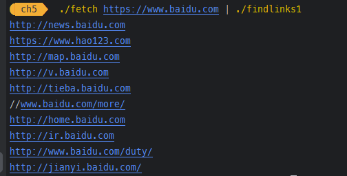
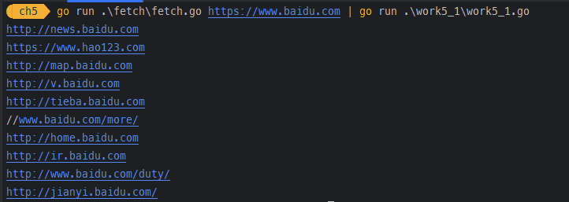
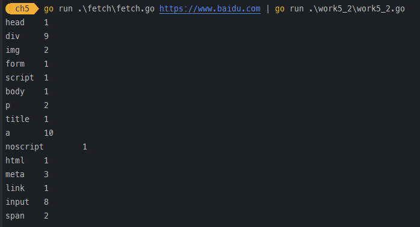
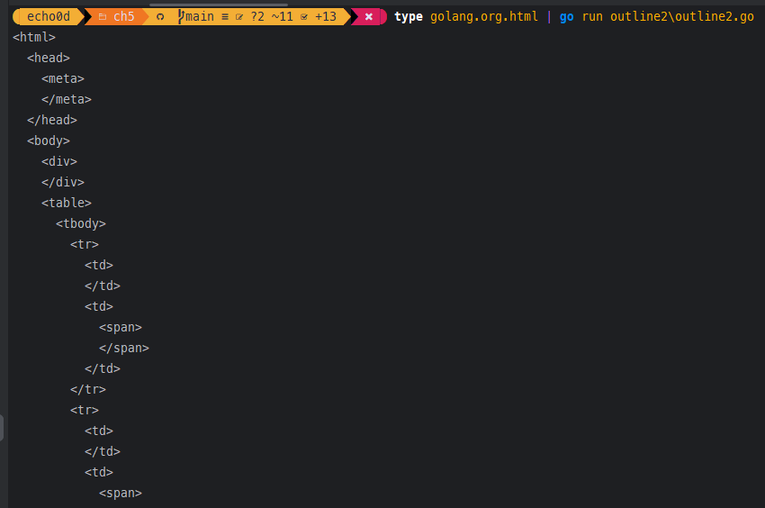

# 5. 复合数据类型

## 5.1. 函数声明

函数声明包括函数名、形式参数列表、返回值列表（可省略）以及函数体。

```
 func name(parameter-list) (result-list) {
     body
 }
```

- 形式参数列表描述了函数的参数名以及参数类型。这些参数作为局部变量，其值由参数调用者提供。
- 返回值列表描述了函数返回值的变量名以及类型。如果函数返回一个无名变量或者没有返回值，返回值列表的括号是可以省略的。

```
 func hypot(x, y float64) float64 {
     return math.Sqrt(x*x + y*y)
 }
 fmt.Println(hypot(3,4)) // "5"
```

- x和y是形参名，3和4是调用时的传入的实参，函数返回了一个float64类型的值。
- 每一次函数调用都必须**按照声明顺序**为所有参数提供实参（参数值）
- 返回值也可以像形式参数一样被命名。在这种情况下，每个返回值被声明成一个局部变量，并根据该返回值的类型，将其初始化为该类型的零值。 
- 如果一个函数在声明时，包含返回值列表，该函数必须以 return语句结尾，除非函数明显无法运行到结尾处。例如函数在结尾时调用了panic异常或函数中存在无限循环。

如果一组形参或返回值有相同的类型，我们不必为每个形参都写出参数类型。下面2个声明是等价的：

```
 func f(i, j, k int, s, t string)                 { /* ... */ }
 func f(i int, j int, k int,  s string, t string) { /* ... */ }
```

实参通过值的方式传递，因此函数的形参是实参的拷贝。对形参进行修改不会影响实参。但是，如果实参包括引用类型，如指针，slice(切片)、map、function、channel等类型，实参可能会由于函数的间接引用被修改。 你可能会偶尔遇到没有函数体的函数声明，这表示该函数不是以Go实现的。这样的声明定义了函数签名。

```
 package math
 
 func Sin(x float64) float //implemented in assembly language
```

## 5.2. 递归

函数可以是递归的，这意味着函数可以直接或间接的调用自身。 如下main函数解析HTML标准输入，通过递归函数visit获得links（链接），并打印出这些links；visit 函数是一个递归函数，它遍历 html.Node 的每个子节点，并将找到的每个链接添加到 links 切片中。它首先检查节点是否为 `<a>`，并提取其 href 属性值，将其添加到 links 切片中。然后，它递归地为当前节点的每个子节点调用自身。

```
 // Findlinks1 prints the links in an HTML document read from standard input.
 package main
 
 import (
     "fmt"
     "os"
 
     "golang.org/x/net/html"
 )
 
 func main() {
     doc, err := html.Parse(os.Stdin)
     if err != nil {
         fmt.Fprintf(os.Stderr, "findlinks1: %v\n", err)
         os.Exit(1)
     }
     for _, link := range visit(nil, doc) {
         fmt.Println(link)
     }
 }
 
 // visit appends to links each link found in n and returns the result.
 func visit(links []string, n *html.Node) []string {
     if n.Type == html.ElementNode && n.Data == "a" {
         for _, a := range n.Attr {
             if a.Key == "href" {
                 links = append(links, a.Val)
             }
         }
     }
     for c := n.FirstChild; c != nil; c = c.NextSibling {
         links = visit(links, c)
     }
     return links
 }
 
```



在函数outline中，我们通过递归的方式遍历整个HTML结点树，并输出树的结构。当outline调用自身时，被调用者接收的是stack的拷贝。被调用者对stack的元素追加操作，这个过程并不会修改调用方的stack。因此当函数返回时，调用方的stack与其调用自身之前完全一致。

```
 package main
 
 import (
     "fmt"
     "golang.org/x/net/html"
     "os"
 )
 
 func main() {
     doc, err := html.Parse(os.Stdin)
     if err != nil {
         fmt.Fprintf(os.Stderr, "outline: %v\n", err)
         os.Exit(1)
     }
     outline(nil, doc)
 }
 
 // outline 通过递归的方式遍历整个HTML结点树，并输出树的结构。
 
 func outline(stack []string, n *html.Node) {
     if n.Type == html.ElementNode {
         stack = append(stack, n.Data) // push tag
         fmt.Println(stack)
     }
     for c := n.FirstChild; c != nil; c = c.NextSibling {
         outline(stack, c)
     }
 }
 
```

 

大部分编程语言使用固定大小的函数调用栈，常见的大小从64KB到2MB不等。固定大小栈会限制递归的深度，当你用递归处理大量数据时，需要避免栈溢出；除此之外，还会导致安全性问题。与此相反，Go语言使用可变栈，栈的大小按需增加（初始时很小）。这使得我们使用递归时不必考虑溢出和安全问题。

### 练习 5.

修改findlinks代码中遍历n.FirstChild链表的部分，将循环调用visit，改成递归调用。

```
 package main
 
 import (
     "fmt"
     "os"
 
     "golang.org/x/net/html"
 )
 
 func main() {
     doc, err := html.Parse(os.Stdin)
     if err != nil {
         fmt.Fprintf(os.Stderr, "findlinks1: %v\n", err)
         os.Exit(1)
     }
     for _, link := range visit(nil, doc) {
         fmt.Println(link)
     }
 }
 
 func visit(links []string, n *html.Node) []string {
     if n.Type == html.ElementNode && n.Data == "a" {
         for _, a := range n.Attr {
             if a.Key == "href" {
                 links = append(links, a.Val)
             }
         }
     }
     // 原本的for循环单独拿出来，改成一个递归函数
     return visitRecursion(links, n.FirstChild)
 
 }
 
 // visitRecursion 递归函数visitRecursion，用于遍历所有子节点
 func visitRecursion(links []string, c *html.Node) []string {
     if c == nil {
         return links
     }
     links = visit(links, c)
     c = c.NextSibling
     return visitRecursion(links, c)
 }
 
```




### 练习 5.2

编写函数，记录在HTML树中出现的同名元素的次数。

```go
 package main
 
 import (
     "fmt"
     "golang.org/x/net/html"
     "os"
 )
 
 func main() {
     doc, err := html.Parse(os.Stdin)
     if err != nil {
         fmt.Fprintf(os.Stderr, "outline: %v\n", err)
         os.Exit(1)
     }
     counts := map[string]int{}
     count(counts, doc)
     for tag, count := range counts {
         fmt.Printf("%s\t%d\n", tag, count)
     }
 }
 
 // outline 通过递归的方式遍历整个HTML结点树，并输出树的结构。
 func count(counts map[string]int, n *html.Node) map[string]int {
     if n.Type == html.ElementNode {
         counts[n.Data]++
     }
     for c := n.FirstChild; c != nil; c = c.NextSibling {
         count(counts, c)
     }
     return counts
 }
 
```



### 练习 5.3

编写函数输出所有text结点的内容。注意不要访问`<script>`和`<style>`元素，因为这些元素对浏览者是不可见的。

```
package main

import (
	"fmt"
	"os"

	"golang.org/x/net/html"
)

func main() {
	doc, err := html.Parse(os.Stdin)
	if err != nil {
		fmt.Fprintf(os.Stderr, "findlinks1: %v\n", err)
		os.Exit(1)
	}
	getTextContent(doc)
}

func getTextContent(n *html.Node) {
	if n.Type == html.ElementNode {
		if n.Data == "script" || n.Data == "style" {
			return
		}
	}
	if n.Type == html.TextNode {
		fmt.Println(n.Data)
	}
	for c := n.FirstChild; c != nil; c = c.NextSibling {
		getTextContent(c)
	}
}
```

### 练习 5.4

扩展visit函数，使其能够处理其他类型的结点，如images、scripts和style sheets。

```
import ("golang.org/x/net/html")

var linkMap = map[string]string{
	"a":      "href", // a标签href属性
	"img":    "src",  // img标签src属性
	"script": "src",  // script标签src属性
	"link":   "href", // link标签href属性
}

func main() {
	filePath := "golang.org.html"
	file, err := os.Open(filePath)
	if err != nil {
		// 处理打开文件时的错误
		fmt.Println("无法打开文件:", err)
		return
	}
	defer file.Close()

	doc, err := html.Parse(file)
	//doc, err := html.Parse(os.Stdin)
	if err != nil {
		fmt.Fprintf(os.Stderr, "findlinks1: %v\n", err)
		os.Exit(1)
	}
	for _, link := range visit(nil, doc) {
		fmt.Println(link)
	}
}

func visit(links []string, n *html.Node) []string {
	if n.Type == html.ElementNode && linkMap[n.Data] != "" {
		for _, a := range n.Attr {
			if a.Key == linkMap[n.Data] {
				links = append(links, a.Val)
			}
		}
	}
	for c := n.FirstChild; c != nil; c = c.NextSibling {
		links = visit(links, c)
	}
	return links
}
```

## 5.3. 多返回值

下面的程序是findlinks的改进版本。因此findlinks声明了2个返回值：链接列表和错误信息。有4处return语句，每一处return都返回了一组值。前三处return，将http和html包中的错误信息传递给findlinks的调用者。第一处return直接返回错误信息，其他两处通过fmt.Errorf（§7.8）输出详细的错误信息。如果findlinks成功结束，最后的return语句将一组解析获得的连接返回给用户。

```
package main

import (
	"fmt"
	"golang.org/x/net/html"
	"net/http"
	"os"
)

func main() {
	for _, url := range os.Args[1:] {
		links, err := findLinks(url)
		if err != nil {
			fmt.Fprintf(os.Stderr, "findlinks2: %v\n", err)
			continue
		}
		for _, link := range links {
			fmt.Println(link)
		}
	}
}

// findLinks performs an HTTP GET request for url, parses the
// response as HTML, and extracts and returns the links.
func findLinks(url string) ([]string, error) {
	resp, err := http.Get(url)
	if err != nil {
		return nil, err
	}
	if resp.StatusCode != http.StatusOK {
		resp.Body.Close()
		return nil, fmt.Errorf("getting %s: %s", url, resp.Status)
	}
	doc, err := html.Parse(resp.Body)
	resp.Body.Close()
	if err != nil {
		return nil, fmt.Errorf("parsing %s as HTML: %v", url, err)
	}
	return visit(nil, doc), nil
}

func visit(links []string, n *html.Node) []string {
	if n.Type == html.ElementNode && n.Data == "a" {
		for _, a := range n.Attr {
			if a.Key == "href" {
				links = append(links, a.Val)
			}
		}
	}
	for c := n.FirstChild; c != nil; c = c.NextSibling {
		links = visit(links, c)
	}
	return links
}
```

> 在findlinks中，我们必须确保resp.Body被关闭，释放网络资源。虽然Go的垃圾回收机制会回收不被使用的内存，但是这不包括操作系统层面的资源，比如打开的文件、网络连接。因此我们必须显式的释放这些资源。

调用多返回值函数时，返回给调用者的是一组值，调用者必须显式的将这些值分配给变量:

```
links, err := findLinks(url)
```

如果某个值不被使用，可以将其分配给blank identifier:

```
links, _ := findLinks(url) // errors ignored
```

一个函数内部可以将另一个有多返回值的函数调用作为返回值(`return findLinks(url)`)：

```
func findLinksLog(url string) ([]string, error) {
    log.Printf("findLinks %s", url)
    return findLinks(url)
}
```

当你调用接受多参数的函数时，可以将一个返回多参数的函数调用作为该函数的参数。

```
log.Println(findLinks(url))
links, err := findLinks(url)
log.Println(links, err)
```

如果一个函数所有的返回值都有显式的变量名，那么该函数的return语句可以省略操作数。这称之为bare return。

```
// CountWordsAndImages does an HTTP GET request for the HTML
// document url and returns the number of words and images in it.
func CountWordsAndImages(url string) (words, images int, err error) {
    resp, err := http.Get(url)
    if err != nil {
        return
    }
    doc, err := html.Parse(resp.Body)
    resp.Body.Close()
    if err != nil {
        err = fmt.Errorf("parsing HTML: %s", err)
        return
    }
    words, images = countWordsAndImages(doc)
    return
}
func countWordsAndImages(n *html.Node) (words, images int) { /* ... */ }
```

按照返回值列表的次序，返回所有的返回值，在上面的例子中，每一个return语句等价于：

```
return words, images, err
```

### 练习 5.5

 实现countWordsAndImages。（参考练习4.9如何分词）

```
package main

import (
	"fmt"
	"golang.org/x/net/html"
	"net/http"
	"os"
	"strings"
)

func main() {
	for _, url := range os.Args[1:] {
		words, images, err := CountWordsAndImages(url)
		if err != nil {
			fmt.Fprintf(os.Stderr, "findlinks2: %v\n", err)
			continue
		}
		fmt.Println(words)
		fmt.Println(images)
	}

}

// CountWordsAndImages 函数执行一个HTTP GET请求获取HTML文档的URL，并返回其中的单词和图片数量。
func CountWordsAndImages(url string) (words, images int, err error) {
	resp, err := http.Get(url)
	if err != nil {
		return
	}
	doc, err := html.Parse(resp.Body)
	resp.Body.Close()
	if err != nil {
		err = fmt.Errorf("parsing HTML: %s", err)
		return
	}
	words, images = countWordsAndImages(doc)
	return
}

// countWordsAndImages 函数递归遍历HTML的节点，统计words和images个数
func countWordsAndImages(n *html.Node) (words, images int) {
	if n.Type == html.TextNode {
		//scanner := bufio.NewScanner(strings.NewReader(n.Data))
		//scanner.Split(bufio.ScanWords)
		//for scanner.Scan() {
		//	words++
		//}
		words += len(strings.Fields(n.Data))
	}
	if n.Type == html.ElementNode && n.Data == "img" {
		images++
	}
	for c := n.FirstChild; c != nil; c = c.NextSibling {
		ws, is := countWordsAndImages(c)
		words += ws
		images += is
	}
	return words, images
}
```


### 练习 5.6

修改 ch3/surface（3.2）中的corner函数，将返回值命名，并使用bare return。

```
// 在函数头的返回值部分写好变量名，就可以在函数体里不写变量名，直接return
func corner(i, j int) (sx, sy float64) {
	// Find Point (x, y) at corner of cell(i, j)
	x := xyrange * (float64(i)/cells - 0.5)
	y := xyrange * (float64(j)/cells - 0.5)

	// compute surface height z
	z := f(x, y)

	// project (x,y,z) isometrically onto 2-D SVG canvas (sx, sy)
	sx = width/2 + (x-y)*cos30*xyscale
	sy = height/2 + (x+y)*sin30*xyscale - z*zscale
	return
}
```

## 5.4. 错误

在Go中有一部分函数总是能成功的运行。比如strings.Contains和strconv.FormatBool函数，对各种可能的输入都做了良好的处理，使得运行时几乎不会失败； 还有一部分函数只要输入的参数满足一定条件，也能保证运行成功。比如time.Date函数，该函数将年月日等参数构造成time.Time对象，除非最后一个参数（时区）是nil。这种情况下会引发panic异常。panic是来自被调用函数的信号，表示发生了某个已知的bug。一个良好的程序永远不应该发生panic异常。

### GO的error

在Go的错误处理中，错误是软件包API和应用程序用户界面的一个重要组成部分，程序运行失败被认为是几个预期的结果之一。对于那些将运行失败看作是预期结果的函数，它们会返回一个额外的返回值（通常是最后一个）来传递错误信息。

- 如果导致失败的原因只有一个，额外的返回值可以是一个布尔值，通常被命名为ok。比如，cache.Lookup失败的唯一原因是key不存在，那么代码可以按照下面的方式组织：

```
value, ok := cache.Lookup(key)
if !ok {
    // ...cache[key] does not exist…
}
```

- 导致失败的原因不止一种，额外的返回值不再是简单的布尔类型，而是error类型。
- 内置的error是接口类型。error类型可能是nil或者non-nil。nil意味着函数运行成功，non-nil表示失败。对于non-nil的error类型，我们可以通过调用error的Error函数或者输出函数获得字符串类型的错误信息。
- 在Go中，函数运行失败时会返回错误信息，这些错误信息被认为是一种预期的值而非异常（exception），这使得Go有别于那些将函数运行失败看作是异常的语言。

### 5.4.1. 错误处理策略

错误处理的常用的五种方式：

传播错误：函数中某个子程序的失败，会变成该函数的失败。

如果findLinks对http.Get的调用失败，findLinks会直接将这个HTTP错误返回给调用者：

```
resp, err := http.Get(url)
if err != nil{
    return nil, err
}
```

当对html.Parse的调用失败时，findLinks不会直接返回html.Parse的错误，因为缺少html parser、发生错误的url。因此findLinks构造了一个新的错误信息，既包含了这两项，也包括了底层的解析出错的信息。

```
doc, err := html.Parse(resp.Body)
resp.Body.Close()
if err != nil {
    return nil, fmt.Errorf("parsing %s as HTML: %v", url,err)
}
```

`fmt.Errorf`函数使用`fmt.Sprintf`格式化错误信息并返回。我们使用该函数添加额外的前缀上下文信息到原始错误信息。（由于错误信息经常是以链式组合在一起的，所以错误信息中应避免大写和换行符。最终的错误信息可能很长，可以通过类似grep的工具处理错误信息）

重新尝试失败：如果错误的发生是偶然性的，或由不可预知的问题导致的。可以重新尝试失败的操作。

在重试时，我们需要限制重试的时间间隔或重试的次数，防止无限制的重试。

```
func WaitForServer(url string) error {
    const timeout = 1 * time.Minute
    deadline := time.Now().Add(timeout)
    for tries := 0; time.Now().Before(deadline); tries++ {
        _, err := http.Head(url)
        if err == nil {
            return nil // success
        }
        log.Printf("server not responding (%s);retrying…", err)
        time.Sleep(time.Second << uint(tries)) // exponential back-off
    }
    return fmt.Errorf("server %s failed to respond after %s", url, timeout)
}
```


输出错误信息并结束程序

需要注意的是，这种策略只应在main中执行。对库函数而言，应仅向上传播错误，除非该错误意味着程序内部包含不一致性，即遇到了bug，才能在库函数中结束程序。

```
// (In function main.)
if err := WaitForServer(url); err != nil {
    fmt.Fprintf(os.Stderr, "Site is down: %v\n", err)
    os.Exit(1)
}
```

调用log.Fatalf可以更简洁的代码达到与上文相同的效果。log中的所有函数，都默认会在错误信息之前输出时间信息。

```
if err := WaitForServer(url); err != nil {
    log.Fatalf("Site is down: %v\n", err)
}
```

我们可以设置log的前缀信息屏蔽时间信息，一般而言，前缀信息会被设置成命令名。

```
log.SetPrefix("wait: ")
log.SetFlags(0)
```

1. 只输出错误信息不中断程序

我们可以通过log包提供函数

```
if err := Ping(); err != nil {
    log.Printf("ping failed: %v; networking disabled",err)
}
```

或者标准错误流输出错误信息。

```
if err := Ping(); err != nil {
    fmt.Fprintf(os.Stderr, "ping failed: %v; networking disabled\n", err)
}
```

log包中的所有函数会为没有换行符的字符串增加换行符。

直接忽略掉错误

```
dir, err := ioutil.TempDir("", "scratch")
if err != nil {
    return fmt.Errorf("failed to create temp dir: %v",err)
}
// ...use temp dir…
os.RemoveAll(dir) // ignore errors; $TMPDIR is cleaned periodically
```

尽管`os.RemoveAll`会失败，但上面的例子并没有做错误处理。这是因为操作系统会定期的清理临时目录。

> 我们通常将处理失败的逻辑代码放在处理成功的代码之前。首先是一系列的初始检查，防止错误发生，之后是函数的实际逻辑。

### 5.4.2. 文件结尾错误（EOF）

例子：从文件中读取n个字节。如果n等于文件的长度，读取过程的任何错误都表示失败。如果n小于文件的长度，调用者会重复的读取固定大小的数据直到文件结束。这会导致调用者必须分别处理由文件结束引起的各种错误。基于这样的原因，io包保证任何由文件结束引起的读取失败都返回同一个错误——io.EOF，该错误在io包中定义：

```
package io

import "errors"

// EOF is the error returned by Read when no more input is available.
var EOF = errors.New("EOF")
```

调用者只需通过简单的比较，就可以检测出这个错误。下面的例子展示了如何从标准输入中读取字符，以及判断文件结束。（4.3的chartcount程序展示了更加复杂的代码）

```
in := bufio.NewReader(os.Stdin)
for {
    r, _, err := in.ReadRune()
    if err == io.EOF {
        break // finished reading
    }
    if err != nil {
        return fmt.Errorf("read failed:%v", err)
    }
    // ...use r…
}
```

因为文件结束这种错误不需要更多的描述，所以io.EOF有固定的错误信息——“EOF”。对于其他错误，我们可能需要在错误信息中描述错误的类型和数量，这使得我们不能像io.EOF一样采用固定的错误信息。

## 5.5. 函数值

函数像其他值一样，拥有类型，可以被赋值给其他变量，传递给函数，从函数返回。对函数值（function value）的调用类似函数调用。

```
    func square(n int) int { return n * n }
    func negative(n int) int { return -n }
    func product(m, n int) int { return m * n }

    f := square
    fmt.Println(f(3)) // "9"

    f = negative
    fmt.Println(f(3))     // "-3"
    fmt.Printf("%T\n", f) // "func(int) int"

    f = product // compile error: can't assign func(int, int) int to func(int) int
```

函数类型的零值是nil。调用值为nil的函数值会引起panic错误：

```
var f func(int) int
f(3) // 此处f的值为nil, 会引起panic错误
```

函数值可以与nil比较：

```
var f func(int) int
if f != nil {
    f(3)
}
```

但是函数值之间是不可比较的，也不能用函数值作为map的key。 函数值使得我们不仅仅可以通过数据来参数化函数，亦可通过行为。

```
    func add1(r rune) rune { return r + 1 }

    fmt.Println(strings.Map(add1, "HAL-9000")) // "IBM.:111"
    fmt.Println(strings.Map(add1, "VMS"))      // "WNT"
    fmt.Println(strings.Map(add1, "Admix"))    // "Benjy"
```

5.2节的findLinks函数使用了辅助函数visit，遍历和操作了HTML页面的所有结点。使用函数值，我们可以将遍历结点的逻辑和操作结点的逻辑分离，使得我们可以复用遍历的逻辑，从而对结点进行不同的操作。

```
 package main
 
 import (
     "fmt"
     "golang.org/x/net/html"
     "os"
 )
 
 func main() {
     doc, err := html.Parse(os.Stdin)
     if err != nil {
         fmt.Fprintf(os.Stderr, "outline: %v\n", err)
         os.Exit(1)
     }
     forEachNode(doc, startElement, endElement)
 
 }
 
 // forEachNode针对每个结点x，都会调用pre(x)和post(x)。
 // pre和post都是可选的。
 // 遍历孩子结点之前，pre被调用
 // 遍历孩子结点之后，post被调用
 func forEachNode(n *html.Node, pre, post func(n *html.Node)) {
     if pre != nil {
         pre(n)
     }
     for c := n.FirstChild; c != nil; c = c.NextSibling {
         forEachNode(c, pre, post)
     }
     if post != nil {
         post(n)
     }
 }
 
 var depth int
 
 func startElement(n *html.Node) {
     if n.Type == html.ElementNode {
         // 利用fmt.Printf控制输出的缩进。
         // 每次输出会先填充depth*2数量的空格，再输出""，最后再输出HTML标签。
         fmt.Printf("%*s<%s>\n", depth*2, "", n.Data)
         depth++
     }
 }
 func endElement(n *html.Node) {
     if n.Type == html.ElementNode {
         depth--
         fmt.Printf("%*s</%s>\n", depth*2, "", n.Data)
     }
 }
 
```

该函数接收2个函数作为参数，分别在结点的孩子被访问前和访问后调用。这样的设计给调用者更大的灵活性。



### 练习 5.7

完善startElement和endElement函数，使其成为通用的HTML输出器。要求：输出注释结点，文本结点以及每个元素的属性（`< a href=...>`）。使用简略格式输出没有孩子结点的元素（即用``代替`</img>`）。编写测试，验证程序输出的格式正确。（详见11章）

```
 package main
 
 import (
     "fmt"
     "golang.org/x/net/html"
     "net/http"
     "os"
     "regexp"
 )
 
 func main() {
     for _, url := range os.Args[1:] {
         doc, err := getDoc(url)
         if err != nil {
             fmt.Fprintf(os.Stderr, "err: %v\n", err)
             os.Exit(1)
         }
         forEachNode(doc, startElement, endElement)
     }
 }
 func getDoc(url string) (*html.Node, error) {
     resp, err := http.Get(url)
     if err != nil {
         return nil, err
     }
     doc, err := html.Parse(resp.Body)
     resp.Body.Close()
     if err != nil {
         return nil, fmt.Errorf("parsing HTML: %s", err)
     }
     return doc, nil
 }
 
 // forEachNode针对每个结点x，都会调用pre(x)和post(x)。
 // pre和post都是可选的。
 // 遍历孩子结点之前，pre被调用
 // 遍历孩子结点之后，post被调用
 func forEachNode(n *html.Node, pre, post func(n *html.Node)) {
     if pre != nil {
         pre(n)
     }
     for c := n.FirstChild; c != nil; c = c.NextSibling {
         forEachNode(c, pre, post)
     }
     if post != nil {
         post(n)
     }
 }
 
 var depth int
 
 func startElement(n *html.Node) {
     if n.Type == html.ElementNode {
         attrs := ""
         for _, a := range n.Attr {
             attrs += fmt.Sprintf("%s=\"%s\" ", a.Key, a.Val)
         }
         if n.FirstChild == nil {
             fmt.Printf("%*s<%s %s\\>\n", depth*2, "", n.Data, attrs)
         } else {
             fmt.Printf("%*s<%s %s>\n", depth*2, "", n.Data, attrs)
         }
         depth++
     }
     // html.CommentNode 注释节点
     if n.Type == html.CommentNode {
         fmt.Printf("%*s//%s\n", depth*2, "", n.Data)
     }
     // html.TextNode文本节点
     if n.Type == html.TextNode {
         // 删除字符串中空白字符
         nData := regexp.MustCompile(`[\n\s]+`).ReplaceAllString(n.Data, "")
         if nData != "" {
             fmt.Printf("%*s%s\n", depth*2, "", nData)
         }
     }
 }
 
 func endElement(n *html.Node) {
     if n.Type == html.ElementNode {
         depth--
         if n.FirstChild != nil {
             fmt.Printf("%*s</%s>\n", depth*2, "", n.Data)
         }
     }
 }
 
```

### 练习 5.8

修改pre和post函数，使其返回布尔类型的返回值。返回false时，中止forEachNoded的遍历。使用修改后的代码编写ElementByID函数，根据用户输入的id查找第一个拥有该id元素的HTML元素，查找成功后，停止遍历。

```
 package main
 
 import (
     "fmt"
     "net/http"
     "os"
 
     "golang.org/x/net/html"
 )
 
 func main() {
     url := os.Args[1]
     targetID := os.Args[2]
     if url == "" || targetID == "" {
         fmt.Fprintf(os.Stderr, "need params url and targetId")
     }
     doc, err := getDoc(url)
     if err != nil {
         fmt.Fprintf(os.Stderr, "err: %v\n", err)
         os.Exit(1)
     }
     foundNode := elementByID(doc, targetID)
     fmt.Printf("foundNode: %s%s\n", foundNode.Data, foundNode.Attr)
 }
 func getDoc(url string) (*html.Node, error) {
     resp, err := http.Get(url)
     if err != nil {
         return nil, err
     }
     doc, err := html.Parse(resp.Body)
     resp.Body.Close()
     if err != nil {
         return nil, fmt.Errorf("parsing HTML: %s", err)
     }
     return doc, nil
 }
 
 var foundNode *html.Node
 
 func elementByID(doc *html.Node, id string) *html.Node {
     forEachNode(doc, id, findID, nil)
     return foundNode
 }
 
 func forEachNode(n *html.Node, id string, pre, post func(n *html.Node, id string) bool) {
     if pre != nil {
         goOn := pre(n, id)
         if !goOn {
             return
         }
     }
     for c := n.FirstChild; c != nil; c = c.NextSibling {
         forEachNode(c, id, pre, post)
     }
     if post != nil {
         post(n, id)
     }
 }
 
 func findID(n *html.Node, id string) bool {
     if n.Type == html.ElementNode {
         for _, a := range n.Attr {
             if a.Key == "id" && a.Val == id {
                 foundNode = n
                 return false
             }
         }
     }
     return true
 }
 
```

### 练习 5.9

编写函数expand，将s中的"foo"替换为f("foo")的返回值。

```
 func expand(s string, f func(string) string) string
```

```go
func main() {
	for _, input := range os.Args[1:] {
		fmt.Println("expand: ", expand(input, allAdd1))
	}
}

func expand(s string, f func(string) string) string {
	// strings.Replace() ，下面的n表示替换前n个，n<0表示替换数量不限制
	ret := strings.Replace(s, "foo", f("foo"), -1)
	return ret
}
func add1(r rune) rune {
	return r + 1
}

func allAdd1(s string) string {
	return strings.Map(add1, s)
}

```


## 5.6. 匿名函数

函数字面量允许我们在使用函数时，再定义它。通过这种技巧，我们可以改写之前对strings.Map的调用：

```go
strings.Map(func(r rune) rune { return r + 1 }, "HAL-9000")
```


更为重要的是，通过这种方式定义的函数可以访问完整的词法环境（lexical environment），这意味着在函数中定义的内部函数可以引用该函数的变量，如下例所示：

```go
// squares返回一个匿名函数。
// 该匿名函数每次被调用时都会返回下一个数的平方。
func squares() func() int {
    var x int
    return func() int {
        x++
        return x * x
    }
}
func main() {
    f := squares()
    fmt.Println(f()) // "1"
    fmt.Println(f()) // "4"
    fmt.Println(f()) // "9"
    fmt.Println(f()) // "16"
}

```

### 练习5.10

重写topoSort函数，用map代替切片并移除对key的排序代码。验证结果的正确性（结果不唯一）。


**练习5.11：** 现在线性代数的老师把微积分设为了前置课程。完善topSort，使其能检测有向图中的环。

**练习5.12：** ch5/outline2（5.5节）的startElement和endElement共用了全局变量depth，将它们修改为匿名函数，使其共享outline中的局部变量。

**练习5.13：** 修改crawl，使其能保存发现的页面，必要时，可以创建目录来保存这些页面。只保存来自原始域名下的页面。假设初始页面在golang.org下，就不要保存vimeo.com下的页面。

**练习5.14：** 使用breadthFirst遍历其他数据结构。比如，topoSort例子中的课程依赖关系（有向图）、个人计算机的文件层次结构（树）；你所在城市的公交或地铁线路（无向图）。
