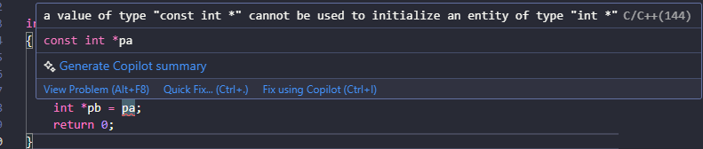
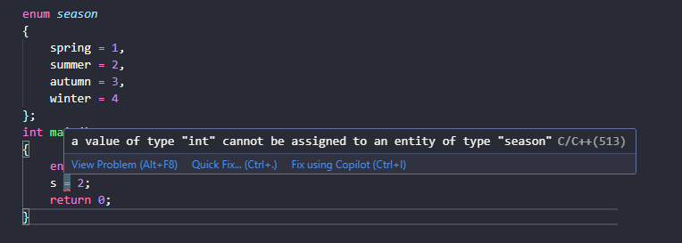
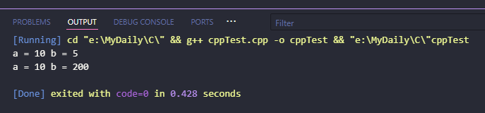
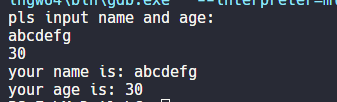
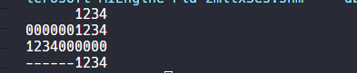
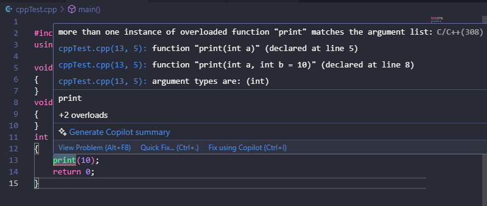
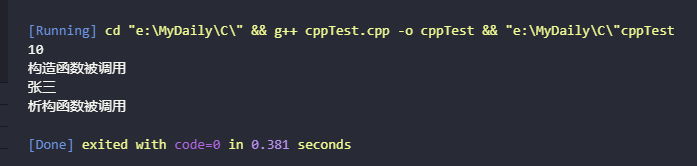
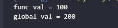

# 01. C++ 对C的扩展

## 1 类型增强

### 1.1 类型检查更严格

比如一个 const 类型的指针赋值给非const 类型的指针。c 语言中可以通的过，但是在 c++ 中则编不过去
```cpp
int main()
{
    const int a = 100;
    int b = a;
    const int *pa = &a;
    int *pb = pa;
    return 0;
}
```


### 1.2 布尔类型（bool)

C 语言的逻辑真假用 0 和非 0 来表示，C++ 中有了具体的类型
```cpp
int main()
{
    bool flag = true;
    if (flag != false)
    {
        printf("i know bool type now\n");
    }
    printf("bool size = %d\n", sizeof(bool));
    return 0;
}
```
### 1.3 枚举（enum）

C 语言中枚举类型本质就是整型，枚举变量可以用任意整型赋值，而 C++中枚举变量只能用被枚举出来的元素初始化。
```cpp
enum season
{
    spring = 1,
    summer = 2,
    autumn = 3,
    winter = 4
};
int main()
{
    enum season s = spring;
    s = 2;
    return 0;
}
```



### 1.4 表达式的值可被赋值

c 语言中表达式通常不能作为左值的，即不可被赋值，c++中某些表达式是可以赋值的。比如
```cpp
#include <iostream>

using namespace std;
int main(void)
{
    int a, b = 5;
    (a = b) = 10;
    cout << "a = " << a << " b = " << b << endl;
    (a < b ? a : b) = 200;
    cout << "a = " << a << " b = " << b << endl;
    return 0;
}
```

## 2 输入与输出(cin /cout)
### 2.1 cin && cout
cin 和 cout 是 C++的标准输入流和输出流。他们在头文件 iostream 中定义
```cpp
#include <iostream>
using namespace std;

int main()
{
    char name[30];
    int age;
    cout << "pls input name and age:" << endl;
    cin >> name;
    cin >> age;
    // cin>>name>>age;
    cout << "your name is: " << name << endl;
    cout << "your age is: " << age << endl;
    return 0;
}
```

### 2.2 格式化
c 语言中 printf 拥有强大的格式化控制。c++亦可以实现，略复杂。

**设置域宽及位数**
对于实型，`cout` 默认输出六位有效数据，`setprecision(2)` 可以设置有效位数， `setprecision(n)<<setiosflags (ios::fixed) ` 合用，可以设置小数点右边的位数
```cpp
#include <iostream>
#include <iomanip>
using namespace std;
int main()
{
    printf("%c\n%d\n%f\n", 'a', 100, 120.00);
    printf("%5c\n%5d\n%6.2f\n", 'a', 100, 120.00);
    cout << setw(5) << 'a' << endl
         << setw(5) << 100 << endl
         << setprecision(2) << setiosflags(ios::fixed) << 120.00 << endl;
    return 0;
}
```

格式说明：

- `%c`: 输出字符
- `%d`: 输出整数
- `%f`: 输出浮点数
- `\n`: 换行符
- `%5c`: 字符右对齐，总宽度5个字符
- `%5d`: 整数右对齐，总宽度5个字符
- `%6.2f`: 浮点数右对齐，总宽度6个字符，保留2位小数
- `setw(5)`: 设置输出宽度为5个字符
- `setprecision(2)`: 设置小数精度为2位
- `setiosflags(ios::fixed)`: 设置为固定小数点格式
- `endl`: 换行符

**按进制输出**
输出十进制，十六进制，八进制。默认输出十进制的数据
```cpp
	int i = 123;
	cout << i << endl;                 // 输出: 123    (默认十进制)
	cout << hex << i << endl;          // 输出: 7b     (十六进制)
	cout << oct << i << endl;          // 输出: 173    (八进制)
	cout << setbase(16) << i << endl;  // 输出: 7b     (十六进制)
```

**设置填充符**
可以设置域宽的同时，设置左右对齐及填充字符。
```cpp
#include <iostream>
#include <iomanip> // for std::setw, std::setfill, std::setiosflags

using namespace std;

int main()
{
    cout << setw(10) << 1234 << endl;
    cout << setw(10) << setfill('0') << 1234 << endl;
    cout << setw(10) << setfill('0') << setiosflags(ios::left) << 1234 << endl;
    cout << setw(10) << setfill('-') << setiosflags(ios::right) << 1234 << endl;
    return 0;
}
```


## 3 函数重载(function overload)

### 3.1 重载规则

1. 函数名相同
2. 参数个数不同，参数的类型不同，参数顺序不同，均可构成重载
3. 返回值类型不同则不可以构成重载。

```cpp
void func(int a); //ok
void func(char a); //ok
void func(char a,int b); //ok
void func(int a, char b); //ok
char func(int a); //与第一个函数有冲突
```
有的函数虽然有返回值类型，但不与参数表达式运算，而作一条单独的语句

### 3.2 匹配原则

1. 严格匹配，找到则调用。 
2. 通过隐式转换寻求一个匹配，找到则调用
```cpp
#include <iostream>
using namespace std;
void print(double a)
{
    cout << a << endl;
}
void print(int a)
{
    cout << a << endl;
}
int main()
{
    print(1);     // print(int)
    print(1.1);   // print(double)
    print('a');   // print(int)
    print(1.11f); // print(double)
    return 0;
}
```


## 4 操作符重载(operator overload

前面用到的<<本身在 c 语言中是位操作中的左移运算符。现在又用用流插入运算符，这种一个字符多种用处的现像叫作重载。在 c 语中本身就用重载的现像，比如 & 既表示取地址，又表示位操作中的与。`*` 既表示解引用，又表示乘法运算符。只不过 c 语言并没有开放重载机制。 

C++提供了运算符重载机制。可以为自定义数据类型重载运算符。实现构造数据类型也 可以像基本数据类型一样的运算特性
```cpp
#include <iostream>
using namespace std;

struct COMP
{
    float real;
    float image;
};
COMP operator+(COMP one, COMP another)
{
    one.real += another.real;
    one.image += another.image;
    return one;
}
int main()
{
    COMP c1 = {1, 2};
    COMP c2 = {3, 4};
    COMP sum = operator+(c1, c2); // c1+c2;
    cout << sum.real << " " << sum.image << endl;
    return 0;
}
```
示例中重载了一个全局的操作符+号用于实现将两个自定义结构体类型相加。本质是函数 的调用。 当然这个 `COMP operator+(COMP one, COMP another)`，也可以定义为 `COMP add(COMP one, COMP another)`，但这样的话就只能 C`OMP sum = add(c1,c2)`，而不能实现 `COMP sum = c1 +c2` 了。 后序我们在学习完成类以后，重点讲解重载。

## 5 默认参数(default parameters)

通常情况下，函数在调用时，形参从实参那里取得值。对于多次调用用一函数同一实参时，C++给出了更简单的处理办法。给形参以默认值，这样就不用从实参那里取值了

### 5.1 单个参数

```cpp
#include <iostream>
#include <ctime>
using namespace std;
void weatherForcast(char * w="sunny")
{
	time_t t = time(0);
	char tmp[64];
	strftime( tmp, sizeof(tmp), "%Y/%m/%d %X %A ",localtime(&t) );
	cout<<tmp<< "today is weahter "<<w<<endl;
}
int main()
{
	//sunny windy cloudy foggy rainy
	weatherForcast();
	weatherForcast("rainny");
	weatherForcast();
	return 0;
}
```

### 5.2 多个参数

```cpp
float volume(float length, float weight = 4,float high = 5)
{
	return length*weight*high;
}
int main()
{
	float v = volume(10);
	float v1 = volume(10,20);
	float v2 = volume(10,20,30);
	cout<<v<<endl;
	cout<<v1<<endl;
	cout<<v2<<endl;
	return 0;
}
```

### 5.3 规则

1. 默认的顺序，是从右向左，不能跳跃。
2. 函数声明和定义一体时，默认认参数在定义(声明)处。声明在前，定义在后，默认参数在声明处。 
3. 一个函数，不能既作重载，又作默认参数的函数。当你少写一个参数时，系统无法确认是重载还是默认参数
```cpp
void print(int a)
{
}
void print(int a, int b = 10)
{
}
int main()
{
    print(10);
    return 0;
}
```

```shell
 error: call of overloaded 'print(int)' is ambiguous
     print(10);
             ^
E:\MyDaily\C\cppTest.cpp:5:6: note: candidate: 'void print(int)'
 void print(int a)
      ^~~~~
E:\MyDaily\C\cppTest.cpp:8:6: note: candidate: 'void print(int, int)'
 void print(int a, int b = 10)
      ^~~~~

Build finished with error(s).
```

## 6 引用(Reference)

```cpp
#include <iostream>
using namespace std;

void swapWithReference(int& a, int& b) {
    int temp = a;
    a = b;
    b = temp;
}

int main() {
    int x = 10;
    int y = 20;
    
    // 创建引用
    int& ref = x;    // ref 现在是 x 的别名
    
    cout << "Before: x = " << x << ", y = " << y << endl;
    swapWithReference(x, y);
    cout << "After: x = " << x << ", y = " << y << endl;
    
    return 0;
}

```

### 6.1 主要特点

1. **必须初始化**
    - 声明引用时必须立即初始化
    - 不能像指针那样先声明后赋值
2. **不能改变引用**
    - 一旦引用被初始化，就不能再引用其他变量
    - 引用始终指向初始化时的对象
3. **不占用额外内存**
    - 引用只是一个别名，不会分配新的内存空间

### 6.2 常见用途

1. **函数参数**
    - 避免值传递的拷贝开销
    - 允许函数修改参数的值
2. **作为函数返回值**
    - 返回可修改的对象
    - 避免返回值的拷贝
3. **在范围 for 循环中使用**
```cpp
vector<int> nums {1, 2, 3};
for (int& num : nums) {  // 使用引用可以修改元素
    num *= 2;
}
```

### 6.3 与指针的比较

1. **安全性**
    - 引用不能为空
    - 不需要解引用操作符
    - 不能进行指针运算
2. **使用方式**
    - 引用使用更直观，像普通变量一样
    - 指针需要使用 `*` 和 `&` 操作符
3. **灵活性**
    - 指针可以重新指向其他对象
    - 引用一旦绑定就不能改变

## 7 new/delete Operator

c 语言中提供了 malloc 和 free 两个系统函数，完成对堆内存的申请和释放。而 c++则提供了两关键字 new 和 delete

```cpp
#include <iostream>
using namespace std;

class Person {
public:
    Person(string n) : name(n) {
        cout << "构造函数被调用" << endl;
    }
    ~Person() {
        cout << "析构函数被调用" << endl;
    }
    string name;
};

int main() {
    // 1. 基本类型的动态内存分配
    int* p1 = new int(10);
    cout << *p1 << endl;
    delete p1;

    // 2. 数组的动态内存分配
    int* arr = new int[5];
    for(int i = 0; i < 5; i++) {
        arr[i] = i;
    }
    delete[] arr;

    // 3. 类对象的动态内存分配
    Person* person = new Person("张三");
    cout << person->name << endl;
    delete person;

    return 0;
}
```


### 7.1 new 和 delete 的特点

1. **自动计算所需空间**
    - `new` 会根据类型自动计算需要分配的内存大小
    - 不需要像 `malloc` 那样手动计算字节数
2. **自动调用构造和析构函数**
    - `new` 创建对象时会自动调用构造函数
    - `delete` 释放对象时会自动调用析构函数
3. **类型安全**
    - `new` 返回对应类型的指针，不需要类型转换
    - 而 `malloc` 返回 `void*`，需要手动转换类型

### 7.2 数组形式
```cpp
// 分配数组
int* arr = new int[10];

// 释放数组（注意使用 delete[]）
delete[] arr;
```

### 7.3 注意事项

1. **内存泄漏** 
    - 使用 `new` 分配的内存必须用 `delete` 释放
    - 数组形式必须用 `delete[]` 释放
2. **异常处理**
    - `new` 分配失败时会抛出 `bad_alloc` 异常
    - 可以使用 `nothrow` 版本避免异常：
```cpp
int* p = new(nothrow) int;
if(p == nullptr) {
    // 处理分配失败的情况
}
```
3. **智能指针**
- 现代 C++ 推荐使用智能指针管理动态内存
- 如 `unique_ptr`、`shared_ptr` 等
```cpp
#include <memory>
auto p = make_unique<int>(42);
// 不需要手动 delete
```

## 8 内联函数(inline function)


内联函数是 C++ 中提供的一个关键特性，用于优化程序性能。通过在函数定义前加上 `inline` 关键字，可以建议编译器将函数调用处用函数体替换。

### 8.1 基本语法

````cpp
#include <iostream>
using namespace std;

// 方法1：在函数声明时使用 inline
inline int add(int a, int b) {
    return a + b;
}

class Calculator {
public:
    // 方法2：类内定义的成员函数默认为内联函数
    int multiply(int a, int b) {
        return a * b;
    }
    
    // 方法3：类外定义的成员函数使用 inline
    int subtract(int a, int b);
};

inline int Calculator::subtract(int a, int b) {
    return a - b;
}
````

### 8.2 特点和使用场景

适用场景
- 函数体积小
- 频繁调用的函数
- 不含复杂控制流程（如循环、switch 等）
- 不是递归函数

优点
- 减少函数调用开销
- 提高程序执行效率
- 可能减少栈的使用

缺点
	- 可能增加代码体积
	- 不适合大型函数
	- 过度使用可能导致程序膨胀

### 8.3 实际使用示例

````cpp
#include <iostream>
using namespace std;

class Rectangle {
private:
    int width;
    int height;

public:
    Rectangle(int w, int h) : width(w), height(h) {}
    
    // 简单的 getter/setter 适合做内联函数
    inline int getWidth() const { return width; }
    inline int getHeight() const { return height; }
    
    // 简单计算也适合内联
    inline int area() const { return width * height; }
};

int main() {
    Rectangle rect(5, 3);
    cout << "Area: " << rect.area() << endl;  // 编译器可能内联此调用
    return 0;
}
````

### 8.4 注意事项

1. **内联是建议性的**
   - 编译器可能会忽略 inline 关键字
   - 也可能会自动内联未标记的函数

2. **调试影响**
   - 内联函数可能增加调试难度
   - 断点可能无法在内联函数中设置

3. **编译器优化**
   ```cpp
   // 以下函数即使不标记 inline，编译器也可能自动内联
   int getMax(int a, int b) {
       return a > b ? a : b;
   }
   ```

4. **不适合内联的情况**
   ```cpp
   // 不适合内联的函数示例
   inline void complexFunction() {
       for(int i = 0; i < 1000; i++) {
           // 大量计算
       }
       // 复杂的控制流程
       switch(condition) {
           case 1: // ...
           case 2: // ...
       }
   }
   ```

* 建议
	1. 优先在头文件中定义内联函数
	2. 只将简单、小巧的函数声明为内联
	3. 让编译器自动决定是否内联
	4. 使用现代编译器的优化功能

## 9 类型强转(type cast)

C 风格的转换的格式很简单（TYPE EXPRESSION)，但是 C 风格的类型转换有不少的缺点，有的时候用 C 风格的转换是不合适的，因为它可以在任意类型之间转换，比如你可以把一个指向 const 对象的指针转换成指向非 const 对象的指针，把一个指向基类对象的指针转换成指向一个派生类对象的指针，这两种转换之间的差别是巨大的，但是传统的 c 语言风格的类型转换没有区分这些。还有一个缺点就，C 风格的转换不容易查找，他由一个括号加上一个标识符组成，而这样的东西在 C++ 程序里一大堆。所以 C++ 为了克服这些缺点，引进了以下4新的类型转换操作符。

### 9.1 常见的隐式转换情况

1. 数值类型转换
```cpp
int x = 5;
double d = x;    // int 隐式转换为 double
float f = 3.14;  // double 隐式转换为 float
```

2. 数组到指针的转换
```cpp
int arr[5];
int* ptr = arr;  // 数组名自动转换为指向首元素的指针
```

3. 派生类到基类的转换
```cpp
class Base {};
class Derived : public Base {};
Derived d;
Base b = d;      // 派生类对象隐式转换为基类对象
```

4. 类型提升
```cpp
char ch = 'a';
int i = ch;      // char 提升为 int
short s = 42;
int n = s;       // short 提升为 int
```

例如：
````cpp
int a = 10;
int b = 3;
cout << static_cast<float>(a)/b << endl;
````
这里如果不使用`static_cast`，`b`会被隐式转换为`float`类型，因为`a`已经被显式转换为`float`。运算符两边的操作数会自动转换为相同的类型。

**注意事项**

1. 隐式转换可能导致数据精度丢失
2. 某些隐式转换可能产生警告
3. 为了代码清晰度，重要的类型转换建议使用显式转换
4. 在可能存在数据丢失的场景下，编译器通常会发出警告

rhuaeuigey:  C 风格的类型转换有什么优缺点

GitHub Copilot: # C风格类型转换的优缺点

### 9.2 C风格转换语法
```cpp
(type_name)expression
```

**优点**
1. 语法简单直观
2. 向后兼容C语言代码
3. 代码更简洁

**缺点**

1. 不安全
- 可以在任意类型之间转换，即使是不相关的类型
- 编译器不会进行类型安全检查
````cpp
int* p = (int*)0x12345678;  // 危险：可以把任意地址转为指针
````

2. **难以识别和搜索**
- 在代码中难以找到所有的类型转换
- 使用括号语法容易与其他表达式混淆

3. **缺乏语义信息**
- 无法区分转换的具体意图
- 不能表达是要进行什么样的转换


````cpp
// C风格
char *p = (char*)malloc(100);

// C++风格 (更推荐)
char *p = static_cast<char*>(malloc(100));
````

### 9.3 static_cast
最常用的转换方式，适用于比较"自然"和低风险的转换：
```cpp
// 基本类型转换
float f = static_cast<float>(10); // 整数转浮点
int i = static_cast<int>(3.14);   // 浮点转整数

// 指针转换
void* ptr = malloc(100);
char* cptr = static_cast<char*>(ptr); // void* 转具体类型指针
```

### 9.4 dynamic_cast
- 主要用于处理多态类之间的转换
- 只能用于含有虚函数的类
- 具有运行时类型检查
````cpp
class Base { virtual void dummy() {} };
class Derived : public Base { };

Base* b = new Derived();
Derived* d = dynamic_cast<Derived*>(b); // 安全的向下转型
````

### 9.5 const_cast
- 用于移除或添加const属性，目标类类型只能是指针或引用
````cpp
const char* const_str = "hello";
char* modifiable = const_cast<char*>(const_str); // 移除const
````

### 9.6 reinterpret_cast
- 最危险的转换方式
- 允许任意指针类型之间的转换
````cpp
int* p = new int(65);
char* ch = reinterpret_cast<char*>(p); // 危险的转换
````

在当前的代码中：
````cpp
cout << static_cast<float>(a)/b << endl;
````
这行代码使用 `static_cast` 将整数 `a` 转换为 `float` 类型，以确保除法运算得到浮点结果而不是整数结果。这是一个典型的安全类型转换用法。

### 9.7 建议
1. 在C++代码中优先使用C++风格的类型转换
2. 使用 `static_cast`、`dynamic_cast`、`const_cast` 和 `reinterpret_cast` 来明确转换意图
3. 避免使用C风格转换，除非是在维护旧代码
4. 类型转换越明确，代码越容易维护和调试
5. 优先使用 `static_cast`
6. 只在处理多态类时使用 `dynamic_cast`
7. 尽量避免使用 `const_cast`
8. 除非特殊情况，否则不要使用 `reinterpret_cast`

## 10 命名空间(namespace scope）

命名空间为了大型项目开发，而引入的一种避免命名冲突的一种机制。比如说，在一个大型项目中，要用到多家软件开发商提供的类库。在事先没有约定的情况下，两套类库可能在存在同名的函数或是全局变量而产生冲突。

### 10.1 默认NameSpace（Global &Function）

Global scope 是一个程序中最大的 scope。也是引起命名冲突的根源。C 语言没有从语言层面提供这种机制来解决。也算是 C 语言的硬伤了。Global scope 是无名的命名空间

```cpp
// c 语言中如何访问被局部变量覆盖的全局变量
int val = 200;
int main()
{
    int *p = &val;
    int val = 100;
    printf("func val = %d\n", val);
    printf("global val = %d\n", *p);
    return 0;
}
```


```cpp
#include <iostream>
#include <string.h>
using namespace std;
int val = 200;
void func()
{
return ;
}
int main()
{
int val = 100;
cout<<"func val = "<<val<<endl;
cout<<"global val = "<<::val<<endl;
::func(); 
}
```

两种形式的输出是一样的



`::` 是 C++ 中的作用域解析运算符（Scope Resolution Operator），主要有以下几个作用：

1. **访问全局变量**
   - 当局部变量和全局变量同名时，使用 `::` 可以明确访问全局变量
   - 在代码中，`::val` 就是用来访问全局的 `val` 变量（值为200）

2. **调用全局函数**
   - 可以用来调用全局作用域中的函数
   - 在代码中，`::func()` 调用的是全局作用域中定义的 `func` 函数

3. **访问类的静态成员**
   - 可以通过 `ClassName::staticMember` 访问类的静态成员

这里是一个完整的示例来展示 `::` 的不同用法：

```cpp
#include <iostream>
using namespace std;

int value = 100;  // 全局变量

class MyClass {
public:
    static int value;  // 静态成员
    void print() {
        int value = 300;  // 局部变量
        cout << "局部变量: " << value << endl;
        cout << "全局变量: " << ::value << endl;
        cout << "类的静态变量: " << MyClass::value << endl;
    }
};

int MyClass::value = 200;  // 初始化静态成员
```

### 10.2 语法规则

下面是 C++ 中 namespace（命名空间）的主要语法规则：
#### 10.2.1 基本声明语法

```cpp
namespace identifier {
    // 命名空间内的声明
}
```

命名空间中可以声明以下内容：
1. 变量声明
- 全局变量
- 静态变量
- 常量

````cpp
namespace MySpace {
    int globalVar = 10;
    static int staticVar = 20;
    const double PI = 3.14159;
}
````

2. 函数声明和定义
- 普通函数
- 内联函数
- 函数模板

````cpp
namespace MySpace {
    void normalFunc() { }
    inline void inlineFunc() { }
    template<typename T>
    T templateFunc(T a) { return a; }
}
````

3. 类相关声明
- 类定义
- 类模板
- 结构体
- 枚举

````cpp
namespace MySpace {
    class MyClass { };
    
    template<typename T>
    class TemplateClass { };
    
    struct MyStruct { };
    
    enum Color { RED, GREEN, BLUE };
}
````

4. 类型定义
- Typedef
- Using 声明
- 类型别名

````cpp
namespace MySpace {
    typedef int Integer;
    using String = std::string;
    
    // C++11 类型别名
    template<typename T>
    using Vec = std::vector<T>;
}
````

5. 嵌套命名空间

````cpp
namespace Outer {
    namespace Inner {
        int value = 42;
    }
}
````

6. 其他命名空间元素
- 命名空间别名
- Using 声明
- Using 指令

````cpp
namespace MySpace {
    namespace InnerSpace = Outer::Inner;  // 命名空间别名
    using std::string;                    // using 声明
    using namespace std;                  // using 指令
}
````

注意：命名空间几乎可以包含任何声明，除了以下情况：
- 不能在命名空间中定义 main 函数
- 不能包含使用局部变量的代码块
- 不能包含默认参数的函数声明（如果该函数已在其他地方声明）

#### 10.2.2 使用命名空间

1. **使用命名空间的方式**
- 使用 `using` 指令：
```cpp
using namespace std;  // 使用整个命名空间
using std::cout;     // 只使用特定成员
```

2. **嵌套命名空间**
```cpp
namespace outer {
    namespace inner {
        // 声明
    }
}
// C++17 新语法
namespace outer::inner {
    // 声明
}
```

3. **命名空间别名**
```cpp
namespace very_long_namespace_name {
    void func() {}
}
namespace short_name = very_long_namespace_name;
```

4. **匿名命名空间**
```cpp
namespace {
    // 仅在当前文件可见
    int value = 42;
}
```

5. **实际使用示例**：
````cpp
// Example of namespace usage
namespace Math {
    double PI = 3.14159;
    double square(double x) {
        return x * x;
    }
}

int main() {
    // 使用作用域解析运算符
    double result = Math::square(Math::PI);
    
    // 或使用 using 声明
    using Math::square;
    double result2 = square(5.0);
    
    return 0;
}
````

注意事项：
- 命名空间可以跨越多个文件
- 同一个命名空间可以在多处定义
- 避免在头文件中使用 `using namespace`
- 建议在全局作用域避免使用 `using namespace std`

## 11 系统 string 类

除了使用字符数组来处理字符串以外，c++引入了字符串类型。可以定义字符串变量。

C++ 中的 string 类型是 `std::string` 类，定义在 `<string>` 头文件中。以下是主要特性和用法：

### 11.1 基本声明和初始化

````cpp
#include <string>
using namespace std;

string str1;                  // 空字符串
string str2 = "Hello";       // 使用字符串字面量初始化
string str3("World");        // 构造函数初始化
string str4(str3);           // 拷贝构造
string str5(5, 'a');         // 重复字符："aaaaa"
````

### 11.2 常用操作

字符串连接
````cpp
string str1 = "Hello";
string str2 = "World";
string result = str1 + " " + str2;  // "Hello World"
str1 += " World";                   // 追加字符串
````

字符串访问
````cpp
string str = "Hello";
char first = str[0];        // 使用下标访问
char last = str.at(4);      // 使用at()方法（带边界检查）
````

常用方法
````cpp
string str = "Hello World";

// 长度
size_t len = str.length();    // 或 str.size()

// 子串
string sub = str.substr(0, 5);  // "Hello"

// 查找
size_t pos = str.find("World"); // 返回位置或string::npos

// 插入和删除
str.insert(5, " Dear");      // "Hello Dear World"
str.erase(5, 5);            // 删除从位置5开始的5个字符

// 比较
bool isEqual = (str1 == str2);
int comp = str1.compare(str2);
````

### 11.3 字符串转换

数字转字符串
````cpp
string str1 = to_string(42);      // 整数转字符串
string str2 = to_string(3.14);    // 浮点数转字符串
````

字符串转数字
````cpp
string str = "42";
int num = stoi(str);             // 字符串转整数
double d = stod("3.14");         // 字符串转double
````

### 11.4 注意事项

- String 是动态分配内存的，不需要担心缓冲区溢出
- 与 C 风格字符串相比更安全、更方便
- 支持比较运算符 (`==`, `!=`, `<`, `>` 等)
- 可以与 C 风格字符串互相转换：
  - `c_str()` 方法获取 C 风格字符串
  - 可以直接用 C 风格字符串初始化 string

