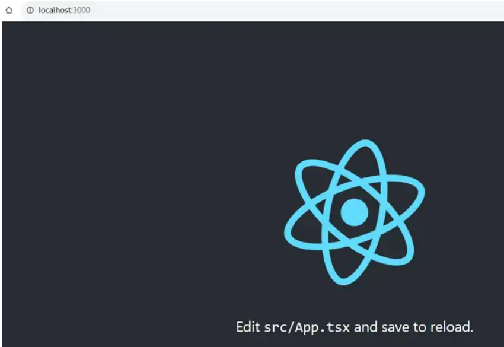
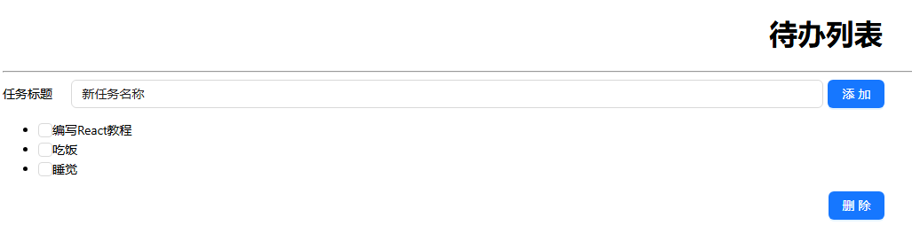
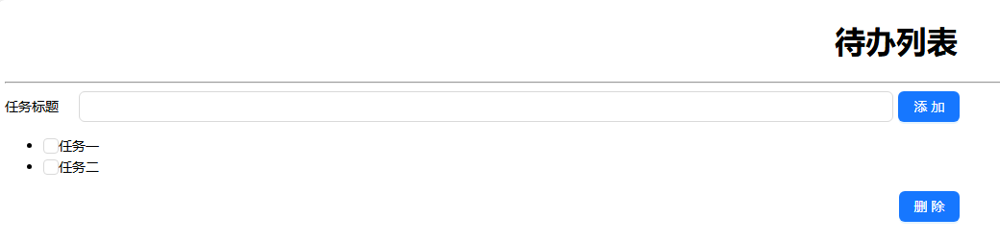
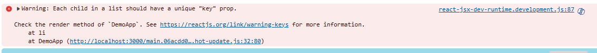
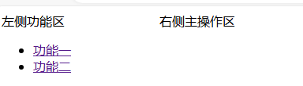
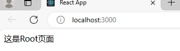
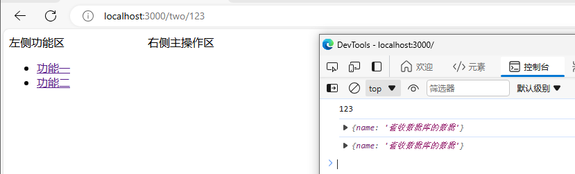
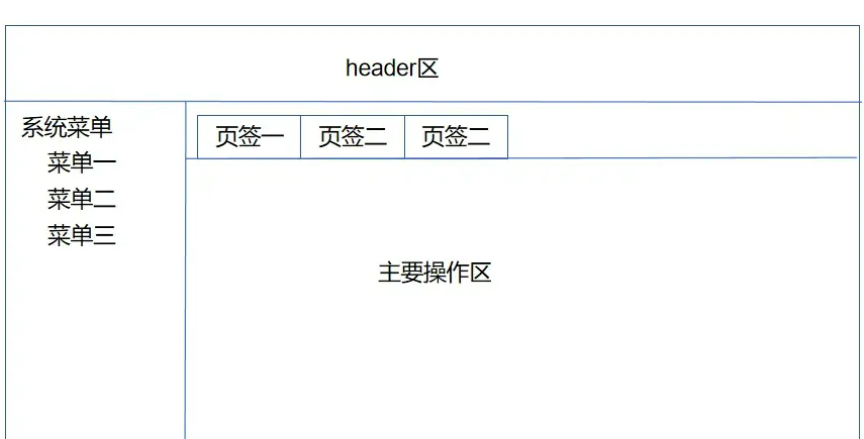
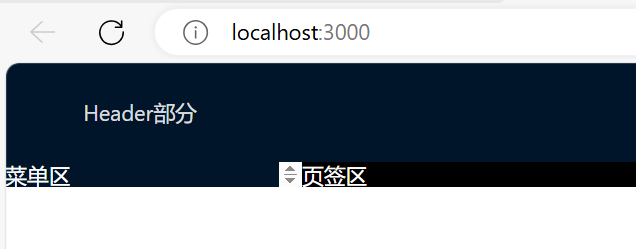
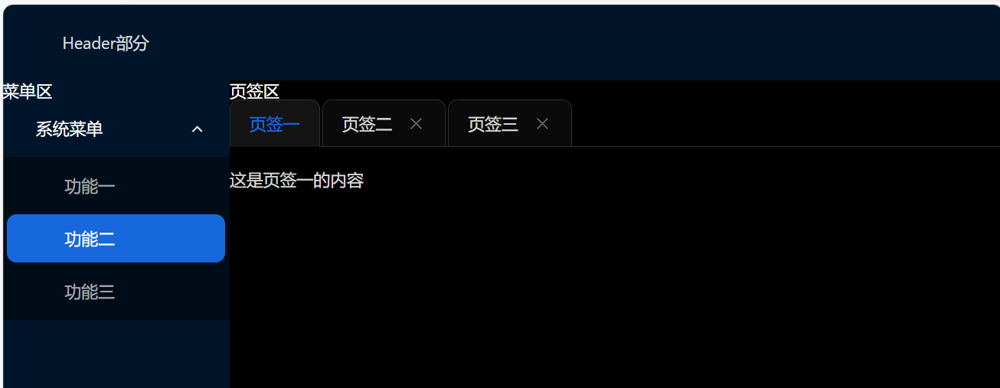

# React Typescript antd

> [https://zhuanlan.zhihu.com/p/659137798](https://zhuanlan.zhihu.com/p/659137798) 教程共9节，从环境搭建讲到多页签

## 环境搭建

### 安装nodejs

### 安装React脚手架工具

（管理员身份运行）

```shell
npm i create-react-app -g
```

### 创建项目

（同样管理员身份，项目名全部小写）

```shell
create-react-app reactdemo --template typescript
cd reactdemo
npm i antd --save # 为刚刚创建的前端工程增加antd UI支持
```

### 启动前端验证

```shell
npm run start
```

启动前端工程后，会自动打开默认浏览器访问http://localhost:3000，如果浏览器页面出现以下界面，说明安装环境搭建成功：


### 工程目录结构简单说明

node_modules目录：和其他的npm工程一样，主要保存工程所依赖的包，包括react等，这个目录下的资源一般我们直接使用即可。
public目录：工程静态资源，比较重要的是index.html，用于渲染React前端组件，也是前端工程的入口页面。这个目录下的资源一般不需要改动，除非有特别的需求。
src目录：前端工程的主要目录，我们编写的前端组件主要也是位于这些目录下。
之所以你能看React的默认页面，其实就是`public\index.html`提供了一个id为root的div挂载点，通过`src\index.tsx`文件挂载了`src\app.tsx`文件。

## Hello world

### 修改端口号

打开src目录下的package.json文件，找到`"start": "react-scripts start"`，修改为`"start": "set PORT=8080 && react-scripts start"`，端口号修改为8080。

### 创建新的index.tsx

创建项目时候默认生成了，可以直接全部删掉，或者将原本的index.tsx备份一下，修改为

```tsx
import React from 'react';
import ReactDOM from 'react-dom/client';

const root = ReactDOM.createRoot(document.getElementById('root') as HTMLElement);

root.render(
    <React.StrictMode>
        <h1>Hello world</h1>
    </React.StrictMode>
);
```

修改完成后，打开VSCode的终端，执行npm run start命令，就会看到一个Hello World

## todo list

将开发一个具备添加和删除的待办列表功能，主要学习React的state和触发事件的代码编写知识。

### 功能描述

该功能的基本界面包括一个输入框、一个添加按钮、一个删除按钮和一个显示任务列表的控件。在输入框中输入任务名称，点击添加按钮后将刚刚输入的任务加入到列表中；勾选已完成的任务，点击删除按钮删除选中的任务。

### 界面设计

可以用ppt画出一个草图，设计这个todo list的UI，草图如下：


### 创建静态UI

根据草图，使用antd的栅格系统将页面划分成对应的区域，并在相应位置存放页面元素，修改后的DemoApp.tsx文件内容如下：

```typescript
import React from 'react';
import { Input, Button, Row, Col, Checkbox } from 'antd';

function DemoApp() {
    return (
        <React.Fragment>
            <h1 style={{"textAlign": "center"}}>待办列表</h1>
            <hr></hr>
            <Row align='middle' gutter={5}>
                <Col span={1}>任务标题</Col>
                <Col span={11}><Input></Input></Col>
                <Col span={12}><Button type='primary'>添加</Button></Col>
            </Row>
            <Row>
                <Col span={24}>
                    <ul>
                        <li><Checkbox></Checkbox>任务一</li>
                        <li><Checkbox></Checkbox>任务二</li>
                    </ul>
                </Col>
            </Row>
            <Row gutter={5}>
                <Col span={12}></Col>
                <Col span={12}>
                    <Button type='primary'>删除</Button>
                </Col>
            </Row>
        </React.Fragment>
    );
}

export default DemoApp;
```



此时，在第二行以解构赋值的形式导入了antd的基础组件，在函数式组件DemoApp函数的返回值中根据设计，返回对应的页面元素。（相关源码细节比如align、gutter等属性的作用，可参考antd相关文档。）
TSX使用大括号语法来嵌入值，在大括号中可以书写的是任意合法的typescript变量或合法的typescript表达式。
在TSX的页面标签style元素中直接内嵌css表达式时，需要使用 `{{css表达式}}`的形式，注意这里css的属性是去掉css属性中的`-`，且将`-`后面的第一个字符变为大写（驼峰式)，例如：css属性`text-align`需要写成`textAlign`，css属性`background-color`需要写成`backgroundColor`。

### 组件状态

React组件状态就是state，是一个组件所包含的状态信息。所谓“状态”，就是该组件任意时刻都存放的各种数据。 当组件更新state时，会触发组件的重新渲染，可以认为发生了局部刷新。
todo list有两个state：一个是输入框对应的新增任务名称，另外一个是保存已添加的任务列表。使用 `React.useState`函数，定义组件状态，在函数DemoApp中，return语句前增加state的定义代码：

```typescript
const [dataInfo, setDataInfo] = React.useState({
    taskName: '新任务名称',
    taskList: ["编写React教程", "吃饭", "睡觉"]
});
```

React在函数组件中初始化state对象：调用`React.useState`函数定义了一个数组，第一个元素是定义了名称为`dataInfo`的`state`对象，第二个元素是修改`state`数据的函数，后续当修改`state`值时需要调用这个函数，从而触发页面元素重新渲染的动作。
然后再将`taskName`和输入框绑定，并在页面上显示已有的任务列表，修改后`DemoApp.tsx`文件内容如下：

```typescript
import React from "react";
import { Input, Button, Row, Col, Checkbox } from "antd";

function DemoApp() {
  const [dataInfo, setDataInfo] = React.useState({
    taskName: "新任务名称",
    taskList: ["编写React教程", "吃饭", "睡觉"],
  });

  return (
    <React.Fragment>
      <h1 style={{ textAlign: "center" }}>待办列表</h1>
      <hr></hr>
      <Row align="middle" gutter={5}>
        <Col span={1}>任务标题</Col>
        <Col span={11}>
        {/** value属性与state对象中的taskName绑定 */}
          <Input value={dataInfo.taskName}></Input>
        </Col>
        <Col span={12}>
          <Button type="primary">添加</Button>
        </Col>
      </Row>
      <Row>
        <Col span={24}>
          <ul>
            {
              dataInfo.taskList.map((item,index) => 
                <li key={index}><Checkbox></Checkbox>{item}</li>)
            }
          </ul>
        </Col>
      </Row>
      <Row gutter={5}>
        <Col span={12}></Col>
        <Col span={12}>
          <Button type="primary">删除</Button>
        </Col>
      </Row>
    </React.Fragment>
  );
}

export default DemoApp;

```

可以看到输入框中显示了state中taskName属性的值，任务列表区也显示了taskList数组中的数据。
这里因为使用循环输出了数据的值，所以为每项`<li>`标签增加了key属性，否则在浏览器的开发者工具中会出现元素缺少key属性的警告。



### 为Input绑定onChange事件

此时输入框还无法输出文字，因为值一直是原本的`taskname`，要产生修改`state`的效果，需要为`Input`绑定`onChange`事件。也就是说：当`Input`中的值发生改变时会触发`onChange`，在`onChange`事件的处理函数中，我们需要同步修改`state`中的`taskName`属性的值。修改后的DemoApp.tsx内容如下：

```typescript
import React from "react";
import { Input, Button, Row, Col, Checkbox } from "antd";

function DemoApp() {
  const [dataInfo, setDataInfo] = React.useState({
    taskName: "新任务名称",
    taskList: ["编写React教程", "吃饭", "睡觉"],
  });

  function taskNameChange(newTaskname: string) {
    let newStateInfo = { ...dataInfo };
    newStateInfo.taskName = newTaskname;
    setDataInfo(newStateInfo);
    
  }

  return (
    <React.Fragment>
      <h1 style={{ textAlign: "center" }}>待办列表</h1>
      <hr></hr>
      <Row align="middle" gutter={5}>
        <Col span={1}>任务标题</Col>
        <Col span={11}>
        {/** value属性与state对象中的taskName绑定 */}
        {/** 增加onChange事件处理 */}
          <Input value={dataInfo.taskName} onChange={(e) => taskNameChange(e.target.value)}></Input>
        </Col>
        <Col span={12}>
          <Button type="primary">添加</Button>
        </Col>
      </Row>
      <Row>
        <Col span={24}>
          <ul>
            {
              dataInfo.taskList.map((item,index) => 
                <li key={index}><Checkbox></Checkbox>{item}</li>)
            }
          </ul>
        </Col>
      </Row>
      <Row gutter={5}>
        <Col span={12}></Col>
        <Col span={12}>
          <Button type="primary">删除</Button>
        </Col>
      </Row>
    </React.Fragment>
  );
}

export default DemoApp;

```

在`Input`标签的`onChange`属性的值时一个Lambda表达式，传递参数为e，通过`e.target.value`将修改后的输入框的值作为参数传递个函数`taskNameChanged`函数（React中触发事件的名称，需要写成onXxx形式，这个事件名称的首字母必须大写。而普通的html元素的事件则全是小写）。
在`taskNameChanged`函数中，采用解构赋值的形式创建了一个新的对象，然后调用`setDataInfo`函数更新原来的`state`，当`state`中的`taskName`值变更后，因为`Input`的`value`元素绑定了这个`state`中的`taskName`属性，在`state`更新后，页面Dom元素局部更新，因此更新了`Input`中的值。
此时只能在输入框内写入，点击添加按钮还没反应，多以后面需要为按钮添加点击事件的处理逻辑。

### 为添加按钮绑定事件

点击添加按钮后要在任务列表区显示新的任务列表。修改后的DemoApp.tsx文件内容如下：

```typescript
import React from "react";
import { Input, Button, Row, Col, Checkbox } from "antd";

function DemoApp() {
  const [dataInfo, setDataInfo] = React.useState({
    taskName: "新任务名称",
    taskList: ["编写React教程", "吃饭", "睡觉"],
  });

  function taskNameChange(newTaskname: string) {
    let newStateInfo = { ...dataInfo };
    newStateInfo.taskName = newTaskname;
    setDataInfo(newStateInfo);
  }

  function addNewTaskToList() {
    let newStateInfo = { ...dataInfo };
    newStateInfo.taskList.push(newStateInfo.taskName);
    setDataInfo(newStateInfo);
  }

  return (
    <React.Fragment>
      <h1 style={{ textAlign: "center" }}>待办列表</h1>
      <hr></hr>
      <Row align="middle" gutter={5}>
        <Col span={1}>任务标题</Col>
        <Col span={11}>
          {/** value属性与state对象中的taskName绑定 */}
          {/** 增加onChange事件处理 */}
          <Input
            value={dataInfo.taskName}
            onChange={(e) => taskNameChange(e.target.value)}
          ></Input>
        </Col>
        <Col span={12}>
          {/** 增加onClick事件处理 */}
          <Button type="primary" onClick={addNewTaskToList}>
            添加
          </Button>
        </Col>
      </Row>
      <Row>
        <Col span={24}>
          <ul>
            {dataInfo.taskList.map((item, index) => (
              <li key={index}>
                <Checkbox></Checkbox>
                {item}
              </li>
            ))}
          </ul>
        </Col>
      </Row>
      <Row gutter={5}>
        <Col span={12}></Col>
        <Col span={12}>
          <Button type="primary">删除</Button>
        </Col>
      </Row>
    </React.Fragment>
  );
}

export default DemoApp;

```

addNewTaskToList函数的基本逻辑时：解构赋值创建新的state对象，然后将taskName通过解构赋值的方式加入到state的taskList的数组中。这里添加Array对象等还可以采用Array对象的push函数。

截至到目前，我们已经完成了任务添加的功能，只是还有一些的瑕疵：
1、理论上，这个页面首次挂载的时候不应该有任务的列表，但是如果我直接修改定义state的taskList属性为空，如下代码所示：

```typescript
const [dataInfo, setDataInfo] = React.useState({
  taskName: '新任务名称',
  taskList: []
});
```

则后续的添加代码编译不通过，会提示不能把string类型的数据赋值给never类型的数据。
2、点击添加后，未能清空数控中的内容，每次都要手工清除，比较麻烦。
3、点击添加按钮时，怎么知道用户当前选中了哪些任务呢？

### 改进后的todo list

1. 定义state时指定state中各属性的数据类型

相对于javascript来说，typescript是一种强类型的语言，因此在数据赋值等过程中，需要对相关数据类型进行校验，因此我们在定义state时，可以使用泛型的方式指定state对象的各属性值，修改state定义代码如下所示：

```typescript
const [dataInfo, setDataInfo] = React.useState<{
  taskName: string,
  taskList: {
    taskName: string,
    checkedFlag: boolean
  }[]
}>({
  taskName: '',
  taskList: []
});
```

以上代码可以解释为`React.useState<数据类型定义>(初始化对象的定义)`。其中数据类型定义和初始化对象的定义都采用字面量的形式进行定义，都是“键-值”对的形式。类型定义对象中的值是类属性的数据类型，而初始化对象的值是类属性对应的数据值。
这里`taskList`由原来的`string[]`类型变更成了`类[]`，增加了`checkedFlag`属性，目的是和任务列表中的`Checkbox`的`checked`属性对应，用来标识该项任务列表是否被中。由于列表数据类型发生了变化，因此循环显示任务列表的TSX代码也要做对应修改：

```typescript
          <ul>
            {/** 将原来的静态内容修改为根据taskList内容输出列表 */}
            {dataInfo.taskList.map((item) => (
              <li key={item.taskName}>
                <Checkbox></Checkbox>
                {item.taskName}
              </li>
            ))}
          </ul>
```

同理，添加任务列表的逻辑也需要调整：

```typescript
function addNewTaskToList() {
  let newStateInfo = { ...dataInfo };
  newStateInfo.taskList.push({taskName: newStateInfo.taskName, checkedFlag: false});
  setDataInfo(newStateInfo);
}
```

现在添加列表的不是一个string，而是要给对象了。

2. 添加任务后，清空输入框中的输入内容

其实就是在`addNewTaskToList`函数的`setDataInfo`调用前，增加了清空`taskName`的属性值的代码。

```typescript
  function addNewTaskToList() {
    let newStateInfo = { ...dataInfo };
    newStateInfo.taskList.push({taskName: newStateInfo.taskName, checkedFlag: false});
    // 添加任务后，清空输入框中的输入内容
    newStateInfo.taskName = '';
    setDataInfo(newStateInfo);
  }
```

3. 添加Checkbox的onChange事件处理逻辑

因为Checkbox的`checked`属性与任务列表中的`checkedFlag`属性绑定了，如果不添加`onChange`事件会出现和Input不绑定`onChange`事件的结果一样：无论你怎么点击Checkbox都不会处于选中状态。增加的Checkbox `onChange`事件处理逻辑如下：

```typescript
import { CheckboxChangeEvent } from 'antd/es/checkbox';

function checkedOrNotchecked(e: CheckboxChangeEvent) {
  let newStateInfo = {...dataInfo};
  newStateInfo.taskList.map(item => {
      if (item.taskName === e.target.value) {
          return item.checkedFlag = e.target.checked;
      } else {
          return false;
      }
  });
  setDataInfo(newStateInfo);
}
```

逻辑的基本处理思路就是：遍历taskList数组，将对应的任务项的checkFlag值变更为当前Checkbox的状态。记得最后一定要更新state，否则不会触发Dom元素的重新渲染动作。

4. 添加删除按钮的点击事件处理逻辑

因为任务列表不再是一个string，因此我们很容易通过遍历任务列表知道哪些待办任务被选中，从而删除选中的待办任务。删除函数处理逻辑如下：

```typescript
/** 删除选中的待办任务 */
const deleteCheckedTaskName = () => {
  let newStateInfo = {...dataInfo};
  newStateInfo.taskList = newStateInfo.taskList.filter(item => !item.checkedFlag);
  setDataInfo(newStateInfo);
};
```

这里采用了定义一个Lambda表达式（也叫箭头函数）变量的形式定义了一个函数，和采用关键字function定义一个函数没有本质上的区别。删除的基本逻辑就是：变量taskList，过滤那些被选中的项。记得最后一定要更新state，否则不会触发Dom元素的重新渲染动作。
完整代码

```typescript
import React from "react";
import { Input, Button, Row, Col, Checkbox } from "antd";
import { CheckboxChangeEvent } from "antd/es/checkbox";

function DemoApp() {
  
  const [dataInfo, setDataInfo] = React.useState<{
    taskName: string;
    taskList: {
      taskName: string;
      checkedFlag: boolean;
    }[];
  }>({
    taskName: "",
    taskList: [],
  });

  function taskNameChange(newTaskname: string) {
    let newStateInfo = { ...dataInfo };
    newStateInfo.taskName = newTaskname;
    setDataInfo(newStateInfo);
  }

  function addNewTaskToList() {
    let newStateInfo = { ...dataInfo };
    newStateInfo.taskList.push({
      taskName: newStateInfo.taskName,
      checkedFlag: false,
    });
    // 添加任务后，清空输入框中的输入内容
    newStateInfo.taskName = "";
    setDataInfo(newStateInfo);
  }

  /** Checkbox onChange处理逻辑 */
  function checkedOrNotchecked(e: CheckboxChangeEvent) {
    let newStateInfo = { ...dataInfo };
    newStateInfo.taskList.map((item) => {
      if (item.taskName === e.target.value) {
        return (item.checkedFlag = e.target.checked);
      } else {
        return false;
      }
    });
    setDataInfo(newStateInfo);
  }

  /** 删除选中的待办任务 */
  const deleteCheckedTaskName = () => {
    let newStateInfo = { ...dataInfo };
    newStateInfo.taskList = newStateInfo.taskList.filter(
      (item) => !item.checkedFlag
    );
    setDataInfo(newStateInfo);
  };

  return (
    <React.Fragment>
      <h1 style={{ textAlign: "center" }}>待办列表</h1>
      <hr></hr>
      <Row align="middle" gutter={5}>
        <Col span={1}>任务标题</Col>
        <Col span={11}>
          {/** value属性与state对象中的taskName绑定 */}
          {/** 增加onChange事件处理 */}
          <Input
            value={dataInfo.taskName}
            onChange={(e) => taskNameChange(e.target.value)}
          ></Input>
        </Col>
        <Col span={12}>
          {/** 增加onClick事件处理 */}
          <Button type="primary" onClick={addNewTaskToList}>
            添加
          </Button>
        </Col>
      </Row>
      <Row>
        <Col span={24}>
          <ul>
            {/** 将原来的静态内容修改为根据taskList内容输出列表 */}
            {dataInfo.taskList.map((item) => (
              <li key={item.taskName}>
                {/** 绑定onChange事件，否则无法选中复选框；绑定value值的目的是知道选中那条任务列表 */}
                {/* <Checkbox></Checkbox> */}
                <Checkbox
                  checked={item.checkedFlag}
                  onChange={checkedOrNotchecked}
                  value={item.taskName}
                ></Checkbox>
                {item.taskName}
              </li>
            ))}
          </ul>
        </Col>
      </Row>
      <Row gutter={5}>
        <Col span={12}></Col>
        <Col span={12}>
          <Button type="primary" onClick={deleteCheckedTaskName}>删除</Button>
        </Col>
      </Row>
    </React.Fragment>
  );
}

export default DemoApp;

```

## 代码拆分

对于React的代码拆分，可以从两个方法来考虑：一是将组件拆解成父子组件，二是将组件的行为代码和TSX代码进行分离。

### 将组件拆分为父子组件

我们将显示组件的列表拆成另外一个TaskList.tsx组件。在src\demo目录中新建TaskList.tsx文件，编辑文件内容如下：

```typescript
import React from 'react';
import { Checkbox } from 'antd';

//定义接收父组件传递过来的state中的业务数据类型
type ParamsType = {
    taskDataInfo: {
        taskName: string,
        taskList: {
            taskName: string,
            checkedFlag: boolean
        }[]
    }
};

//函数式组件中的参数，父组件传递过来的业务数据
function TaskList(props: ParamsType) {
    return (
        <React.Fragment>
            {
                // 遍历父组件state中的taskList数据，生成<li>标签
                props.taskDataInfo.taskList.map(oneItem => {
                    return (
                        <li key={oneItem.taskName}>
                            <Checkbox checked={oneItem.checkedFlag} value={oneItem.taskName}>
                                {oneItem.taskName}
                            </Checkbox>
                            
                        </li>
                    )
                })
            }
        </React.Fragment>
    );
}

export default TaskList;
```

TaskList.tsx首先利用关键值type定义了一个数据类型，这个type相当于C语言中的结构体，就是定义了数据父组件传递给子组件的数据的数据类型。修改DemoApp.tsx组件的代码，使用刚刚创建的子组件显示添加后的待办任务列表：

```typescript
//引入刚刚创建的子组件列表，以便在后面使用<TaskList></TaskList>组件
import TaskList from './TaskList';
.....

function DemoApp() {
......
      <Row>
        <Col span={24}>
          <ul>
            {/** 使用子组件显示待办任务列表 */}
            <TaskList taskDataInfo={dataInfo}></TaskList>
          </ul>
        </Col>
      </Row>
```

DemoApp.tsx组件的代码重点是添加了`import TaskList from './TaskList'`和后面使用组件`<TaskList taskDataInfo={dataInfo}></TaskList>`，这两行代码。这里标签属性`taskDataInfo`和`TaskList.tsx`文件中中type定义中字面量的key值的大小写保持一致，值就是向子组件传递的state中的数据。
完成代码修改后，输入任务列表，点击添加按钮，可以正常添加待办列表，但是点击Checkbox，不能选中需要删除的待办任务项，这是怎么回事呢？这是因为没有为Checkbox绑定`onChange`事件处理函数，这个函数在父组件已经有定义了，我们只要在子组件中直接调用就可以了。修改TaskList.tsx文件代码如下：

```typescript
import React from 'react';
import { Checkbox } from 'antd';
//引入Checkbox onChange事件的参数类型
import { CheckboxChangeEvent } from 'antd/es/checkbox';

type ParamsType = {
    //......
    //增加定义接收函数类型的参数，
    checkboxChange: (event: CheckboxChangeEvent) => void
};

function TaskList(props: ParamsType) {
    return (
        <React.Fragment>
            {
                props.taskDataInfo.taskList.map(oneItem => {
                    return (
                        <li key={oneItem.taskName}>
                            {/** onChange={props.checkboxChange}就是绑定事件处理函数的代码 */}
                            <Checkbox checked={oneItem.checkedFlag} onChange={props.checkboxChange} value={oneItem.taskName}>
                                {oneItem.taskName}
                            </Checkbox>
                            
                        </li>
                    )
                })
            }
        </React.Fragment>
    );
}

export default TaskList;
```

修改父组件，可以通过TaskList标签，传递函数给子组件以便子组件Checkbox状态改变时修改state中对应项的值：

```typescript
<TaskList taskDataInfo={dataInfo} checkboxChange={checkedOrNotchecked}></TaskList>
```

属性checkboxChange的值就是一个函数（注意这里时函数本身，而不是函数调用，函数调用需要一对小括号），这个函数会作为参数被传递给子组件。
完成这些修改后，回到浏览器页面进行验证，发现点击Checkbox后，待办项被选中或取消选中，功能又正常了。
我们将待办任务列表迁移到子组件TaskList.tsx中，但父组件的代码还是显得有点多。下面我们尝试把部分代码迁移到一个独立的.ts文件中，让父组件只保留必要的代码。

### 迁移行为代码到独立的文件中

在src\demo目录新建一个DemoFuncs.ts文件，用于保存行为代码。
1、在DemoFuncs.ts文件中新建state数据结构

```typescript
//任务列表项数据结构
export type TaskListItem = {
  taskName: string,
  checkedFlag: boolean
};
//state中的业务数据的数据结构
export type DataInfoType = {
  taskName: string,
  taskList: TaskListItem[]
};
```

修改DemoApp.tsx文件，引入DemoFuncs.ts并定义state数据结构：

```typescript
//引入DemoFuncs.ts文件
import { DataInfoType } from './DemoFuncs';

function DemoApp() {
  //以泛型方式定义state的数据，名初始化state中的业务数据对象
  const [dataInfo, setDataInfo] = React.useState<DataInfoType>({
    taskName: '',
    taskList: []
  });
}
```

迁移后，再次回到浏览器打开页面，测试相关功能是否正常运行。
2、移动函数taskNameChanged到DemoFuncs.ts文件中并修改：

```typescript
/**
 * 输入框onChange事件处理函数
 * @param newTaskname 修改后的值
 * @param dataInfo state中的业务数据
 * @param setDataInfo 赋值修改值
 */
export function taskNameChanged(newTaskname: string, dataInfo: DataInfoType, setDataInfo: (value: DataInfoType) => void) {
  let newStateInfo = {...dataInfo};
  newStateInfo.taskName = newTaskname;
  setDataInfo(newStateInfo);
}
```

迁移到新的文件中的函数，部分函数定义在DemoApp.tsx中，因为函数中涉及到的参数不是在DemoFuncs.ts文件中声明的，因此需要以参数的形式定义新的事件处理函数。这里`newTaskname`就是输入框中的输入值，`dataInfo`就是state中的业务数据，`setDataInfo`为定义在父组件中修改state业务数据的函数。
定义在DemoFuncs.ts中的`taskNameChanged`函数type等需要在前面添加`export`关键字，这样才能在别的文件中使用import语句导入，导入之后才能使用：

```
import { DataInfoType,taskNameChanged } from './DemoFuncs';
```

修改DemoApp.tsx中Input的`onChange`触发事件的代码，调用新的函数并传递相关业务数据：

```typescript
<Input value={dataInfo.taskName} onChange={e => taskNameChanged(e.target.value, dataInfo, setDataInfo)}></Input>
```

这里onChange的值修改成一个Lambda表达式（也叫箭头函数），以完成新事件处理函数的绑定。

### 修改后

```typescript
/**
 * Checkbox onChange事件绑定函数
 * @param e CheckboxOnChange事件对象
 * @param dataInfo 
 * @param setDataInfo 
 */
export function checkedOrNotchecked(e: CheckboxChangeEvent, dataInfo: DataInfoType, setDataInfo: (value: DataInfoType) => void) {
  let newStateInfo = { ...dataInfo };
  newStateInfo.taskList.map((item) => {
    if (item.taskName === e.target.value) {
      return (item.checkedFlag = e.target.checked);
    } else {
      return false;
    }
  });
  setDataInfo(newStateInfo);
}

/**
 * 删除按钮处理函数
 * @param dataInfo state数据对象
 * @param setDataInfo state值修改函数
 */
export function deleteCheckedTaskName(dataInfo: DataInfoType, setDataInfo: (value: DataInfoType) => void) {
  let newStateInfo = { ...dataInfo };
  newStateInfo.taskList = newStateInfo.taskList.filter(
    (item) => !item.checkedFlag
  );
  setDataInfo(newStateInfo);
};
```

DemoApp.tsx

```typescript
    <Row>
        <Col span={24}>
          <ul>
            {/** 使用子组件显示待办任务列表 */}
            <TaskList taskDataInfo={dataInfo} checkboxChange={(e) => checkedOrNotchecked(e, dataInfo, setDataInfo)}></TaskList>
          </ul>
        </Col>
      </Row>
      <Row gutter={5}>
        <Col span={12}></Col>
        <Col span={12}>
          <Button type="primary" onClick={() => deleteCheckedTaskName(dataInfo,setDataInfo)}>删除</Button>
        </Col>
      </Row>
```

## React路由

所谓路由，直观来看就是浏览器页面切换，就是通过浏览器url的不同，让浏览器展现不同页面。



### 为项目添加路由组件依赖

以管理员权限打开cmd，依次执行以下命令：

```shell
npm i react-router-dom -S
npm i @types/react-router-dom -S
```

### 修改应用入口文件

还是从hello world开始：

```typescript
import React from 'react';
import ReactDOM from 'react-dom/client';

ReactDOM.createRoot(document.getElementById("root") as HTMLElement).render(
  <React.StrictMode>
  <div>React路由练习</div>
  </React.StrictMode>
);
```

### 创建/（根）路由组件

创建src\pages\RootPage.tsx文件作为根路由对应的组件，根路由组件主要用于显示应用首页：

```typescript
import React from 'react';

function RootPage() {
  return (
    <React.Fragment>
    <div>这是Root页面</div>
    </React.Fragment>
  );
}

export default RootPage;
```

### 创建路由定义文件

路由定义文件主要解决path和页面组件之间的对应关系，创建src\routers\RoutesDef.tsx作为路由定义文件：

```typescript
import { createBrowserRouter } from 'react-router-dom';
import RootPage from '../pages/RootPage';//导入刚刚创建的组件

const routes = createBrowserRouter([
  {
    path: '/',//路由path
    element: <RootPage /> //path根对应的组件，又import语句生成
      }
]);

export default routes;
```

createBrowserRouter函数是创建路由定义的函数，参数就是所有的路由对象，path是路由的url，element是url对应的组件。

### 修改index.tsx文件，使用创建的路由

```typescript
import React from 'react';
import ReactDOM from 'react-dom/client';
import { RouterProvider } from 'react-router-dom';//导入路由定义文件
import routes from './routers/RoutesDef';

ReactDOM.createRoot(document.getElementById("root") as HTMLElement).render(
  <React.StrictMode>
  <RouterProvider router={routes}></RouterProvider>{/** 使用路由定义数据 */}
  </React.StrictMode>
);
```

完成以上修改后，在工程根目录下使用命令npm run start启动服务，可以在浏览器中看到相关页面如下：



如果浏览器首页显示该页面，说明/路由创建成功。建议初学者在开发过程中随时查看结果以保证我们的每一步修改都不会影响各程序的正常运行。

### 修改/路由对应组件为左右两个区域

将/对应的页面组件修改为左右布局：

```typescript
import React from "react";

function RootPage() {
  return (
    <React.Fragment>
      {/* <div>这是Root页面</div> */}
      {/** 采用原生样式，将div向左浮动，将页面分割为左右布局 */}
      <div style={{ float: "left", width: "200px", height: "600px" }}>
        左侧功能区
        <ul>
          <li>
            <a href={"#"}>功能一</a>
          </li>
          <li>
            <a href={"#"}>功能二</a>
          </li>
        </ul>
      </div>
      <div style={{ height: "600px" }}>右侧主操作区</div>
    </React.Fragment>
  );
}

export default RootPage;
```

### 创建功能一和功能二对应的页面组件

创建功能一页面组件src\pages\PageOne.tsx：

```typescript
import React from 'react';

function PageOne() {
    return (
        <React.Fragment>
            <h2 style={{textAlign: 'center'}}>页面组件一</h2>
        </React.Fragment>
    );
}

export default PageOne;
```

src\pages\PageTwo.tsx：

```typescript
import React from 'react';

function PageTow() {
    return (
        <React.Fragment>
            <h1 style={{textAlign: 'center', color: 'red'}}>页面组件二</h1>
        </React.Fragment>
    );
}

export default PageTow;
```

### 修改路由定义文件

新建的两个组件作为/路由的子路由来定义

```typescript
import { createBrowserRouter } from 'react-router-dom';
import RootPage from '../pages/RootPage';
import PageOne from '../pages/PageOne';
import PageTow from '../pages/PageTwo';

const routes = createBrowserRouter([
  {
    path: '/',
    element: <RootPage />,
    children: [{  //新建的两个页面被定义为/路由的子路由
      path: '/one',
      element: <PageOne />
        } , {
      path: '/two',
      element: <PageTow />
        }]
  }
]);

export default routes;
```

### 修改/路由组件内容

一是修改`<a>`的`href`属性值，与路由定义中过的`path`属性值对应；二是在右侧`div`中增加`<Outlet />`组件作为路由组件的页面渲染出口：

```typescript
import React from "react";
import { Outlet } from "react-router-dom";

function RootPage() {
  return (
    <React.Fragment>
      {/* <div>这是Root页面</div> */}
      {/** 采用原生样式，将div向左浮动，将页面分割为左右布局 */}
      <div style={{ float: "left", width: "200px", height: "600px" }}>
        左侧功能区
        <ul>
          <li>
            <a href={"/one"}>功能一</a>
          </li>
          {/** 修改href的值为路由定义的path */}
          <li>
            <a href={"/two"}>功能二</a>
          </li>
          {/** 修改href的值为路由定义的path */}
        </ul>
      </div>
      <div style={{ height: "600px" }}>
        右侧主操作区
        <Outlet /> {/** 添加子组件的渲染出口 */}
      </div>
    </React.Fragment>
  );
}

export default RootPage;

```

完成这些修改后，再次回到浏览器，点击左侧链接，对应的组件内容将显示在右侧的区域。细心的读者可能会留意到，当点击功能一或在功能二链接后，浏览器工具栏的刷新按钮会瞬间出现”旋转“的动画，说明点击<a>的时候，浏览器发起了一次服务器GET请求，属于服务器端路由。

### 修改为客户端路由

使用React路由模块提供的<Link>组件，将页面路由修改为客户端路由：

```typescript
import React from 'react';
import { Link } from 'react-router-dom';
import { Outlet } from 'react-router-dom';

function RootPage() {
  return (
    <React.Fragment>
    <div style={{float: 'left', width: '200px', height: '600px'}}>
      左侧功能区
    <ul>
    <li><Link to={'/one'}>功能一</Link></li>{/** 将<a>标签修改为<Link>组件，把属性href修改为to */}
    <li><Link to={'/two'}>功能二</Link></li>
  </ul>
  </div>
  <div style={{height: '600px'}}>
    右侧主操作区
  <Outlet />
  </div>
  </React.Fragment>
  );
}

export default RootPage;
```

再次回到浏览器验证点击链接后，是否还会向服务器发起网络请求。

### 通过路由url向组件传递参数

1. 在路由目标页面定义数据加载器

修改src\pages\PageTwo.tsx组件，定义数据加载器：

```typescript
import React from 'react';
import { useLoaderData } from 'react-router-dom';
//新增数据加载函数，函数根据url传递过来的参数，加载返回数据
export async function loader(urlBizData: any) {
  console.log(urlBizData.params.bizDataName);
  return {name: '查收数据库的数据'};//返回的示例数据，实际项目请根据场景进行修改
}

function PageTow() {
  //获取的就是加载完成的数据
  const bizDataInfo = useLoaderData();
  console.log(bizDataInfo); //打印的就是loader返回的数据
  return (
    <React.Fragment>
    <h1 style={{textAlign: 'center', color: 'red'}}>页面组件二</h1>
  </React.Fragment>
);
}

export default PageTow;
```

2. 修改路由定义文件

修改路由定义文件，定义url模式和使用数据加载器，修改src\routers\RoutesDef.tsx文件内容如下：

```typescript
import { createBrowserRouter } from 'react-router-dom';
import RootPage from '../pages/RootPage';
import PageOne from '../pages/PageOne';
import PageTwo, {loader as pageLoader} from '../pages/PageTwo';//导入数据加载器

const routes = createBrowserRouter([
  {
    path: '/',
    element: <RootPage />,
    children: [{
      path: '/one',
      element: <PageOne />
        } ,  {
      path: '/two/:bizDataName',//冒号 ( : ) 具有特殊含义，将其转换为“动态段”，由<Link>组件定义变量bizDataName的值
      element: <PageTwo />,
      loader: pageLoader,//定义数据加载器
    }]
  }
]);

export default routes;
```

3、修改<Link>组件的业务数据
修改src\pages\RootPage.tsx文件内容如下：

```typescript
import React from 'react';
import { Link } from 'react-router-dom';
import { Outlet } from 'react-router-dom';

function RootPage() {
  return (
    <React.Fragment>
    <div style={{float: 'left', width: '200px', height: '600px'}}>
      左侧功能区
    <ul>
    <li><Link to={'/one'}>功能一</Link></li>
    {/** 修改to属性的值，123就是点击链接是传递的业务数据的值 */}
    <li><Link to={'/two/123'}>功能二</Link></li>
    </ul>
    </div>
    <div style={{height: '600px'}}>
右侧主操作区
  <Outlet />
  </div>
  </React.Fragment>
  );
}

export default RootPage;
```



以上就是Ract的路由相关内容。在实际的开发中，页面样式不应该如此简陋，后续我们将结合antd讲解如何开发一套相对完整的前端应用框架组件。

## 应用基本框架组件

对于一些事务性的后台管理系统，我们经常需要类似一个多页签页面的UI界面，如下图所示：



分析上图，根据主键分布，可以把页面组件划分为Layout、menu和tabs三个组件。antd已经提供了对应的组件，只是需要我们一步步组装成我们想要的系统主界面。
为了让and的框架组件高度占据怎么屏幕，需要在index.tsx文件中引入antd的reset组件：

```typescript
import 'antd/dist/reset.css';
```

该CSS会对HTML元素样式进行重置，比如设置margin、padding为0、html、body元素高度为100等等。

### 构建Layout组件

创建src\layout\AppLayout.tsx文件

```typescript
import { Layout, ConfigProvider, theme } from "antd";
const { Header, Sider, Content } = Layout;

function AppLayout() {
  return (
    <ConfigProvider theme={{ algorithm: theme.darkAlgorithm }}>{/** 使用antd的暗黑模式 */}
      <Layout>
    <Header>Header部分</Header>
    <Layout>
    <Sider width={190} style={{overflow: "auto"}}>
<span style={{color: "white"}}>菜单区</span>
  </Sider>
  <Content>
  <span style={{color: "white"}}>页签区</span>
  </Content>
  </Layout>
  </Layout>
  </ConfigProvider>
);
};

export default AppLayout;
```

修改应用入口文件index.tsx文件内容如下：

```typescript
import React from 'react';
import ReactDOM from 'react-dom/client';
import 'antd/dist/reset.css';
import AppLayout from './layout/AppLayout';

const root = ReactDOM.createRoot(
  document.getElementById('root') as HTMLElement
);
root.render(
  <React.StrictMode>
    <AppLayout />
  </React.StrictMode>
);

```

回到浏览器查看结果，发现Layout控件并没有像期望的那样占满整个屏幕，如下图所示：



创建src\layout\AppLayout.css文件，并添加CSS代码如下：

```css
#root, main, .ant-layout {
  height: 100%;
}
```

这里之所有多个选择器的样式高度需要设置为100%是因为子元素高度是百分比，而这个百分比是相对于父元素的，所以需要把Layout组件的父元素的高度也要设置为100%。
修改src\layout\AppLayout.tsx文件，导入刚刚定义的AppLayout.css文件：

```typescript
import { Layout, ConfigProvider, theme } from "antd";
import './AppLayout.css';//添加import css代码

const { Header, Sider, Content } = Layout;
```

再次回到浏览器页面可以看到Layout组件占满了剩余的屏幕空间。

### 构建菜单组件

创建src\layout\AppMenu.tsx文件，文件内容如下：

```typescript
import React from 'react';
//import { AppstoreOutlined, MailOutlined, SettingOutlined } from '@ant-design/icons';
import type { MenuProps } from 'antd';//引入菜单项的数据类型
import { Menu } from 'antd';

type MenuItem = Required<MenuProps>['items'][number];
function getItem(label: React.ReactNode, key: React.Key, icon?: React.ReactNode, children?: MenuItem[], type?: 'group'): MenuItem {
    return {key, icon, children, label, type} as MenuItem;
}
const items: MenuProps['items'] = [
    getItem('系统菜单', 'systemMenu', null, [
        getItem('功能一', 'systemMenu_menu1'),
        getItem('功能二', 'systemMenu_menu2'),
        getItem('功能三', 'systemMenu_menu3')
    ])
];

function AppMenu() {
    const onClick: MenuProps['onClick'] = (e) => {
        console.log('click ', e);
    };
    return (
        <Menu onClick={onClick} defaultSelectedKeys={['systemMenu_menu1']} defaultOpenKeys={['systemMenu']} mode="inline" items={items} theme='dark' />
    );
}

export default AppMenu;
```

修改src\layout\AppLayout.tsx文件，引入AppMenu组件：

```typescript
import AppMenu from "./AppMenu";//引入菜单组件

                    <Sider width={190} style={{overflow: "auto"}}>
                        <span style={{color: "white"}}>菜单区</span>
                        <AppMenu />{/** 在左侧边栏应用菜单组件 */}
                    </Sider>
```

### 创建多页签组件

创建src\layout\AppTabs.tsx文件，编辑文件内容如下：

```typescript
import React, { useRef, useState } from 'react';
import { Tabs } from 'antd';

type TargetKey = React.MouseEvent | React.KeyboardEvent | string;

const initialItems = [
    { label: '页签一', children: '这是页签一的内容', key: '1', closable: false },
    { label: '页签二', children: '页签只能是文本内容吗？', key: '2' },
    { label: '页签三', children: '还需要改进啊', key: '3' },
];

function AppTabs() {
    const [activeKey, setActiveKey] = useState(initialItems[0].key);
    const [items, setItems] = useState(initialItems);
    const newTabIndex = useRef(0);

    const onChange = (newActiveKey: string) => {
        setActiveKey(newActiveKey);
    };

    function add() {
        const newActiveKey = `newTab${newTabIndex.current++}`;
        const newPanes = [...items];
        newPanes.push({ label: 'New Tab', children: 'Content of new Tab', key: newActiveKey });
        setItems(newPanes);
        setActiveKey(newActiveKey);
    };

    function remove(targetKey: TargetKey) {
        let newActiveKey = activeKey;
        let lastIndex = -1;
        items.forEach((item, i) => {
            if (item.key === targetKey) {
                lastIndex = i - 1;
            }
        });
        const newPanes = items.filter((item) => item.key !== targetKey);
        if (newPanes.length && newActiveKey === targetKey) {
            if (lastIndex >= 0) {
                newActiveKey = newPanes[lastIndex].key;
            } else {
                newActiveKey = newPanes[0].key;
            }
        }
        setItems(newPanes);
        setActiveKey(newActiveKey);
    };

    function onEdit(targetKey: React.MouseEvent | React.KeyboardEvent | string, action: 'add' | 'remove') {
        if (action === 'add') {
            add();
        } else {
            remove(targetKey);
        }
    };

    return (
        <Tabs
            type="editable-card"
            onChange={onChange}
            activeKey={activeKey}
            onEdit={onEdit}
            items={items}
            hideAdd={true}
        />
    );
};

export default AppTabs;
```

然后修改src\layout\AppLayout.tsx文件，引入AppTabs组件，并在<Content>标签中使用这个组件

```typescript
import AppTabs from "./AppTabs";

                    <Content>
                        <span style={{color: "white"}}>页签区</span>
                        <AppTabs />{/** 在右侧内容区应用页签组件 */}
                    </Content>
```



## 添加菜单点击功能

