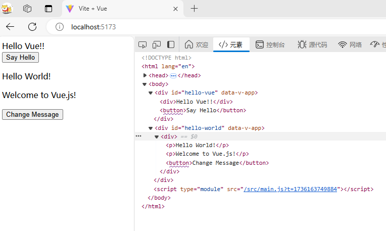
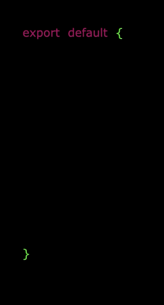

# Vue3
> 官方文档：
> [简介 | Vue.js](https://cn.vuejs.org/guide/introduction.html)

# 1. 简介&环境配置

特点和优势
- **响应式数据绑定**：Vue.js 提供强大的响应式数据绑定系统，确保数据的变化能够自动反映到视图层，减少了开发者手动操作 DOM 的需要。
- **组件化**：Vue.js 提倡将应用分解为小的、可复用的组件，增强了代码的组织性、可维护性和重用性。
- **灵活性和渐进性**：Vue.js 是一个渐进式框架，可以按需引入其特性（如 Vue Router 和 Vuex），适应不同规模的项目。
- .... 后面不想抄了

使用之间要安装nodejs、npm

## 创建项目
- `npm create` ：用于执行项目模板的命令，它会创建一个新的项目，并从给定的模板中初始化。
- `vite@latest` ：vite 是创建 Vue 3 项目的工具，`@latest` 是指定使用最新版的 Vite，确保你创建的项目是基于最新版本的 Vite。如果没有 `@latest`，`npm` 会尝试使用当前安装的版本。
- `<project-name>`：新创建项目的文件夹名称。命令会创建一个文件夹，并将模板代码放入其中。例如，运行 `npm create vite@latest my-vue-app --template vue` 会在当前目录下创建一个名为 `my-vue-app` 的文件夹，并将 Vue 项目的模板文件放入其中。
- `--template vue`：`--template vue` 指定了要使用的模板类型。Vite 支持多种模板，`vue` 是专门为 Vue 3 提供的模板。还有其他模板，如 `vanilla`、`react`、`svelte` 等。

## npm create

```shell
# 最新稳定版
$ npm init vue@latest
```
这一指令将会安装并执行 create-vue，它是 Vue 官方的项目脚手架工具。
```shell
$ npm init vue@latest
Need to install the following packages:
  create-vue@3.6.1
Ok to proceed? (y) y

Vue.js - The Progressive JavaScript Framework

# 这里需要进行一些配置，项目名输入 vue3-test，其他默认回车即可
-> Project name: … vue3-test
-> Add TypeScript? … No / Yes
-> Add JSX Support? … No / Yes
-> Add Vue Router for Single Page Application development? … No / Yes
-> Add Pinia for state management? … No / Yes
-> Add Vitest for Unit Testing? … No / Yes
-> Add an End-to-End Testing Solution? › No
-> Add ESLint for code quality? … No / Yes

Scaffolding project in vue3-test...

Done. Now run:

  cd runoob-vue3-test
  npm install
  npm run dev

```

## vite
`vite`创建vue项目时：
```shell
npm create vite@latest scan-pro -- --template vue
Need to install the following packages:
Need to install the following packages:
  create-vite@6.1.1
  # 这里按照提示选择javascript或typescript
√ Select a variant: » JavaScript

Scaffolding project in E:\scan-pro...

Done. Now run:

  cd scan-pro
  npm install
  npm run dev
```
## vue ui
> 下面是抄的菜鸟教程

除了使用 vue create 命令创建项目，我们还可以使用可视化创建工具来创建项目。

运行命令：
```shell
$ vue ui
->  Starting GUI...
->  Ready on http://localhost:8000
...

```

执行以上命令，会在浏览器弹出一个项目管理的界面：


我们可以点击**创建**选项来创建一个项目，选择底部"在此创建项目"，页面上方也可以选择路径：


然后输入我们的项目名称，选择包管理工具为 npm，然后点击下一步：


配置选择默认即可:


接下来就等待完成安装，安装完成管理界面如下：


## 目录结构
**命令行工具 vue-cli（runoob-vue3-test）：**


**Vite（runoob-vue3-test2）**


典型的 Vue 项目结构：
```
my-vue-app/
├── node_modules/
├── public/
│   ├── favicon.ico
│   └── index.html
├── src/
│   ├── assets/
│   │   └── logo.png
│   ├── components/
│   │   └── HelloWorld.vue
│   ├── views/
│   │   └── Home.vue
│   ├── App.vue
│   ├── main.js
│   └── router/
│       └── index.js
├── .gitignore
├── babel.config.js
├── package.json
├── README.md
├── vue.config.js
└── yarn.lock or package-lock.json

```


# 2. 基础语法
这里直接参考官方文档吧
> [简介 | Vue.js](https://cn.vuejs.org/guide/introduction.html)

## 响应式原理
Vue的响应式系统是其核心特性之一，它使得数据变更能够自动更新到UI上。在Vue3中，这个系统基于JavaScript的 `Proxy` 对象重写，提供了更好的性能和更多的功能。


### ref 和 reactive

Vue 3提供了两个主要的函数来创建响应式数据：`ref` 和 `reactive`。

`ref` 函数创建一个响应式引用。在模板中，你可以直接使用响应式引用的值，而在JavaScript代码中，你需要通过 `.value` 属性来访问或修改它的值。

```javascript
import { ref } from 'vue'

const count = ref(0)
console.log(count.value) // 0
count.value++ // 1
```

`reactive` 函数创建一个响应式对象。你可以直接访问和修改它的属性。

```javascript
import { reactive } from 'vue'

const state = reactive({ count: 0 })
console.log(state.count) // 0
state.count++ // 1
```

### 实现机制区别

`ref` 和 `reactive` 的主要区别在于，`ref` 是为了让基本类型（如数字和字符串）可以变为响应式，而 `reactive` 是为了让对象变为响应式。

`ref` 创建的响应式数据需要通过 `.value` 属性进行访问和修改，而 `reactive` 创建的响应式对象可以直接访问和修改其属性。因此，`ref` 更适合于处理基本类型，而 `reactive` 更适合于处理对象。


# Vue3 专属
Vue3 中的应用是通过使用 createApp 函数来创建的，语法格式如下：
```js
const app = Vue.createApp({ /* 根组件选项 */ })
```

传递给 createApp 的选项用于配置根组件。

应用实例必须在调用了 .mount() 方法后才会渲染出来，.mount()方法接收一个"容器"参数，可以是一个实际的 DOM 元素或是一个 CSS 选择器字符串：
```js
app.mount('#app')
```

<div id="app"></div>
一个简单的实例：
```js
Vue.createApp(HelloVueApp).mount('#hello-vue')
```

createApp 的参数是根组件（HelloVueApp），在挂载应用时，该组件是渲染的起点。

一个应用需要被挂载到一个 DOM 元素中，以上代码使用 `mount('#hello-vue')` 将 Vue 应用 HelloVueApp 挂载到 `<div id="hello-vue"></div>` 中。


## Vite + Vue3 实例

- `Vite` 项目中，`index.html` 是项目的入口文件，在项目最外层。
- 加载`index.html`后，`Vite` 解析 `<script type="module" src="xxx">` 指向的`JavaScript`。
- `Vue3`**中是通过 **`createApp` 函数创建一个应用实例。

现在有这样一个 HelloVueApp.vue 文件

```vue
<script setup>

import { ref } from 'vue';
const message = ref('Hello Vue!!');
function sayHello() {
  alert(message.value);
}
</script>

  
<template>
  <div>{{ message }}</div>
  <button @click="sayHello">Say Hello</button>
</template>
```

结构就是两个标签 `<template>` 和 `</script>`

或者换种Vue2的写法，例如这个 HelloWorld.vue
```vue
<template>
  <div>
    <p>{{ message }}</p>
    <p>{{ anotherMessage }}</p>
    <button @click="changeMessage">Change Message</button>
  </div>
</template>

<script>
export default {

  data() {
    return {
      message: 'Hello World!',
      anotherMessage: 'Welcome to Vue.js!'
    }
  },

  methods: {
    changeMessage() {
      this.message = 'Message Changed!';
    }
  }
}

</script>
```

ps 改成 Vue3的写法是这样的
```vue
<template>
  <div>
    <p>{{ message }}</p>
    <p>{{ anotherMessage }}</p>
    <button @click="changeMessage">Change Message</button>
  </div>
</template>

<script>
import { ref } from 'vue';

export default {
  setup() {
    const message = ref('Hello World!');
    const anotherMessage = ref('Welcome to Vue.js!');
    const changeMessage = () => {
      message.value = 'Message Changed!';
    };

    return {
      message,
      anotherMessage,
      changeMessage
    };
  }
}

</script>
```

在某个 js 文件中，这样写，将 Vue 应用实例挂载到 DOM 元素上
```js
// main.js
import { createApp } from 'vue'
import HelloVueApp from './HelloVueApp.vue'
import HelloWorldApp from './components/HelloWorld.vue'

createApp(HelloVueApp).mount('#hello-vue');
createApp(HelloWorldApp).mount('#hello-world');
```

然后再html中引入这个js即可渲染到具体的DOM
```html
<!doctype html>
<html lang="en">
  <head>
    <meta charset="UTF-8" />
    <link rel="icon" type="image/svg+xml" href="/vite.svg" />
    <meta name="viewport" content="width=device-width, initial-scale=1.0" />
    <title>Vite + Vue</title>
  </head>

  <body>
    <div id="hello-vue"></div>
    <div id="hello-world"></div>
  </body>

  <script type="module" src="/src/main.js"></script>

</html>
```

效果如下



## OptionsAPI 与 CompositionAPI
`Vue3`向下兼容`Vue2`语法，且`Vue3`中的模板中可以没有根标签。

- `Vue2`的`API`设计是`Options`（配置）风格的。
- `Vue3`的`API`设计是`Composition`（组合）风格的。

### Options API 的弊端

`Options`类型的 `API`，数据、方法、计算属性等，是分散在：`data`、`methods`、`computed`中的，若想新增或者修改一个需求，就需要分别修改：`data`、`methods`、`computed`，不便于维护和复用。




### Composition API 的优势
它会根据逻辑功能来进行组织，把同一个功能的不同代码都放在一起，或者把它们单独拿出来放在一个函数中，所以 **`Composition API`** 又被称为基于**函数组合的API**：可以用函数的方式，更加优雅的组织代码，让相关功能的代码更加有序的组织在一起。


### setup 函数

**setup 函数**是 Vue3 中新增的函数，它是我们在编写组件时，使用 `Composition API` 的入口。  
同时它也是 Vue3 中新增的一个生命周期函数，会在 `beforeCreate` 之前调用。因为**此时组件的 `data` 和 `methods` 还没有初始化，因此在 setup 中是不能使用 `this` 的**。所以 Vue 为了避免我们错误的使用，它直接将 setup 函数中的 `this` 修改成了`undefined`。并且，我们只能同步使用setup函数，不能用async将其设为异步。

setup 函数接收两个参数 `props`和 `context`， 语法为：`setup(props,context){}`

* ***props**

`props` 里面包含**父组件传递给子组件的所有数据**。在子组件中使用 `props` 进行接收。

**`props` 是响应式的**， 当传入新的 `props` 时，会及时被更新。  
由于是响应式的， 所以不可以使用 ES6 解构，解构会消除它的响应式。

**父组件：**

<template>
    <!-- 父组件向子组件传递数据 -->
    <Sub :name="name" :age="age" />
</template>
```vue
<script>
import { ref } from 'vue'
import Sub from './Sub.vue'
export default {
    setup () {
        const name = ref('张三');
        const age = ref(20)

        return { name, age }
    },
    components: { Sub },
}
</script>
```


**子组件（Sub.vue）:**
```vue
<script>
export default {
    props: {
        name: String,
        age: Number
    },
    mounted () {
        // vue2.x 的写法
        console.log(this.name); // 张三
        console.log(this.age); // 20
    },
    setup (props) {
        // vue3.x 的写法
        console.log(props.name); // 张三
        console.log(props.age); // 20
        
        // let { name ,age } = props;  // 不能直接解构
        let { name, age } = toRefs(props);
        console.log(name.value, age.value); // 张三 20
    }
}
</script>

<template>
    <div>{{name}}{{age}}</div>
</template>
```

* ***context**

`context` 里面包含 `attrs`, `slots`, `emit` 等数据方法：
- `attrs`：获取组件上的属性
- `slots`：获取 slot 插槽的节点
- `emit` ：emit 方法（**子组件向父组件传递数据**）

**父组件：**
<template>
    <Sub subData="some other data" @subClick='subClick'>parent</Sub>
</template>

```vue
<script>
import Sub from './ContextSub.vue'
export default {
    setup () {

        function subClick (e) {
            console.log(e); // 接收子组件传递过来的数据
        }

        return { subClick }
    },
    components: { ContextSub },
}
</script>

<template>
    <ContextSub subData="some other data" @subClick='subClick'>parent</ContextSub>
</template>
```

**子组件（Sub.vue）:**

```vue
<script>
export default {
    mounted () {
        // vue2.x 获取组件上的属性
        console.log(this.$attrs.subData);  // 'some other data'
        
        // vue2.x 获取slot插槽的节点
        console.log(this.$slots);

    },
    methods: {
        // vue2.x emit方法(子组件向父组件传递数据)
        handleClick () {
            this.$emit('subClick', 'vue2.x - this is subData')
        },
    },
    setup (props, context) {
        let { attrs, slots, emit } = context;

        // vue3.x 获取组件上的属性
        console.log(attrs.subData);  // 'some other data'

        // vue3.x 获取slot插槽的节点
        console.log(slots.default());

        // vue3.x emit方法(子组件向父组件传递数据)
        function handleClick () {
            emit('subClick', 'vue3.x - this is subData');
        }

        return { handleClick }
    }
}
</script>

<template>
    <!-- 父组件向子组件传递数据 -->
    <div @click="handleClick">Child</div>
</template>
```
<template>
    <!-- 父组件向子组件传递数据 -->
    <div @click="handleClick">Child</div>
</template>

解释一下
```vue
<ContextSub subData="some other data" @subClick='subClick'>parent</ContextSub>
```
- `subData="some other data"` 是**属性**（prop）。它将字符串 `"some other data"` 作为 `subData` 属性传递给 `<ContextSub>` 子组件。
- `@subClick='subClick'` 是**事件监听器**。它监听子组件 `<ContextSub>` 触发的 `subClick` 事件，并在事件被触发时调用父组件中的 `subClick` 方法。

在 Vue 3 中，属性和事件监听器的区别如下：

- **属性**：直接写在元素标签上，属性名后面跟着等号和值，用于向子组件传递数据。属性的值可以是静态的（如上例所示），也可以是动态绑定的（使用 `v-bind:` 或简写为 `:`）。

- **事件监听器**：以 `@` 符号开始，后面跟着事件名和等号，然后是事件处理函数。这是 Vue 中的事件绑定语法，用于监听子组件触发的自定义事件或原生 DOM 事件。

在 Vue 2.x 中，事件监听器使用 `v-on:` 或简写为 `@`，与 Vue 3 相同。但是，Vue 2.x 使用 `this.$emit` 来触发事件，而 Vue 3 中可以直接使用 `emit` 函数。


### 生命周期
**setup 函数**是 Vue3 中新增的一个生命周期函数

- setup 函数会在 `beforeCreate` 之前调用，因为**此时组件的 `data` 和 `methods` 还没有初始化，因此在 setup 中是不能使用 `this` 的**。
- 所以 Vue 为了避免我们错误的使用，它直接将 setup 函数中的 **`this` 修改成了`undefined`**。
- setup函数，**只能是同步的不能是异步**的

| Vue2.x （Option API） | Vue3.x （Composition API） |
| ------------------- | ------------------------ |
| **beforeCreate**    | **setup**                |
| **created**         | **setup**                |
| **beforeMount**     | **onBeforeMount**        |
| **mounted**         | **onMounted**            |
| **beforeUpdate**    | **onBeforeUpdate**       |
| **updated**         | **onUpdated**            |
| **beforeDestroy**   | **onBeforeUnmount**      |
| **destroyed**       | **onUnmounted**          |
| **activated**       | **onActivated**          |
| **deactivated**     | **onDeactivated**        |
| **errorCaptured**   | **onErrorCaptured**      |
| **- -**             | **onRenderTracked**      |
| **- -**             | **onRenderTriggered**    |

**初始化加载顺序：**

`setup` => `beforeCreate` => `created` => `onBeforeMount` => `onMounted`

```vue
<script>
import { onBeforeMount, onMounted, onBeforeUpdate, onUpdated, onBeforeUnmount, onUnmounted, onRenderTracked, onRenderTriggered } from 'vue'
export default {
    setup () {
        console.log('setup');
        
        // 生命周期钩子(没有beforeCreate和created)
        onBeforeMount(() => { console.log('onBeforeMount'); })
        onMounted(() => { console.log('onMounted'); })
        onBeforeUpdate(() => { console.log('onBeforeUpdate'); })
        onUpdated(() => { console.log('onUpdated'); })
        onBeforeUnmount(() => { console.log('onBeforeUnmount'); })
        onUnmounted(() => { console.log('onUnmounted'); })

        // 新增的debug钩子  生产环境中会被忽略
        onRenderTracked(() => { console.log('onRenderTracked'); }) // 每次渲染后重新收集响应式依赖，在onMounted前触发，页面更新后也会触发
        onRenderTriggered(() => { console.log('onRenderTriggered'); }) // 每次触发页面重新渲染时的自动执行，在onBeforeUpdate之前触发
    },
    beforeCreate () {
        console.log('beforeCreate');
    },
    created () {
        console.log('created');
    }
}
</script>
```

### 返回值
`setup` 函数中返回一个对象，可以在模板中直接访问该对象中的属性和方法。

<template>
    <div @click="handleClick">{{name1}} - {{name2}}</div>
</template>
```vue
<script>
import { ref, provide } from 'vue'
export default {
    setup () {
        const name1 = ref('张三');
        
        return {
            name1,
            name2: 'zhangsan',
            handleClick () {
                console.log(name1.value); // 张三
                console.log(this.name2); // zhangsan
            }
        }
    }
}
</script>

```

### ref 与 reactive
创建一个**响应式数据**

- **ref：任意类型（建议基本类型）数据的响应式引用**（设置、获取值时需要加`.value`）。  
    ref 的本质是拷贝，修改数据是不会影响到原始数据。
- **reactive：只能是复杂类型数据的响应式引用**

<template>
    <ul>
        <li>ref 基本类型：{{name1}}</li>
        <li>ref 复杂类型：{{name2.name}}</li>
        <li>reactive 复杂类型：{{name3.name}}</li>
    </ul>
</template>
```vue
<script>
import { ref, reactive } from 'vue'
export default {
    setup () {
        let nameStr = '张三';
        let name1 = ref(nameStr); // ref为基本数据类型添加响应式状态
        setTimeout(() => {
            name1.value = 'zhangsan';

            console.log(name1.value); // 'zhangsan'
            console.log(nameStr); // '张三'  =>  不会影响到原始数据
        }, 1000)


        let nameObj2 = { name: '张三' };
        let name2 = ref(nameObj2); // ref为复杂数据类型添加响应式状态（不建议）
        setTimeout(() => {
            // 设置值需要加.value
            name2.value.name = 'zhangsan';

            console.log(name2.value.name); // 'zhangsan'  =>  获取值需要加.value
            console.log(nameObj2); // {name: "zhangsan"}  =>  会影响到原始数据
        }, 2000)


        let nameObj3 = { name: '张三' };
        const name3 = reactive(nameObj3);// reactive只能为复杂数据类型添加响应式状态
        setTimeout(() => {
            name3.name = 'zhangsan';

            console.log(name3.name); // 'zhangsan'
            console.log(nameObj3); // {name: "zhangsan"}  =>  会影响到原始数据
        }, 3000)


        return { name1, name2, name3 }
    }
}
</script>
```

### toRef 与 toRefs
在 Vue 3 中，`toRef` 和 `toRefs` 都是用于将响应式对象的属性转换为响应式引用的工具，但它们有不同的用途和使用场景。

`toRef` 用于将响应式对象的单个属性转换为一个响应式引用。它可以让你在不解构对象的情况下，单独引用对象的某个属性。

```vue
<script>
import { reactive, toRef } from 'vue';
const state = reactive({
  count: 0,
  message: 'Hello'
});
const countRef = toRef(state, 'count');
// 现在 countRef 是一个响应式引用，修改它会影响原始对象
countRef.value = 1;
console.log(state.count); // 输出: 1
</script>
```


`toRefs` 用于将响应式对象的所有属性转换为响应式引用。它返回一个包含所有属性引用的新对象。

```vue
<script>
import { reactive, toRefs } from 'vue';
const state = reactive({
  count: 0,
  message: 'Hello'
});
const stateRefs = toRefs(state);
// 现在 stateRefs 是一个包含所有属性引用的新对象
stateRefs.count.value = 1;
console.log(state.count); // 输出: 1
stateRefs.message.value = 'Hi';
console.log(state.message); // 输出: 'Hi'
</script>
```

### readonly 只读属性

**表示响应式对象不可修改**
<template>
    <ul>
        <li>{{nameObj.name}}</li>
    </ul>
</template>
```vue
<script>
import { reactive, readonly } from 'vue'
export default {
    setup () {
        let nameObj = reactive({ name: '张三' });
        let readonlyObj = readonly(nameObj); // 对nameObj响应式对象设置成只读,不可修改

        setTimeout(() => {
            readonlyObj.name = 'zhangsan'; // 无法设置属性  =>  Set operation on key "name" failed: target is readonly. Proxy {name: "张三"}
        }, 1000)

        return { nameObj }
    }
}
</script>
```
### method方法
声明method方法的语法如下：
```vue
<script setup>
import { reactive } from 'vue'
export default {
    setup () {
        const state = reactive({ name: '张三' });
        
        // 声明method方法
        const changeName = () => {
            state.name = 'zhangsan';
        }  
        
        return { state , changeName }
    }
}
</script>
```

<template>
  <!-- 调用方法 -->
  <button @click='changeName'>按钮</button>  
</template>
## computed 计算属性
```vue
<script>
import { ref, computed } from 'vue'
export default {
    setup () {
        const num = ref(0);
        const add = () => {
            num.value++
        }
        // 计算属性
        const addCount = computed(() => {
            return num.value * 2;
        })
        return { add, addCount }
    }
}
</script>
```
<template>
    <div>
        <button @click="add">+</button>
        <p>{{addCount}}</p>
    </div>
</template>

### watch 与 watchEffect 监听属性
在Vue 3中，`watch` 和 `watchEffect` 是用于监听响应式数据变化的两个API。

`watch` 用于监听一个或多个响应式数据源的变化，并在变化时执行回调函数。它类似于Vue 2中的`watch`选项。

**用法：**

```js
import { ref, watch } from 'vue';
const count = ref(0);
watch(count, (newValue, oldValue) => {
  console.log(`count changed from ${oldValue} to ${newValue}`);

});
```

**特点：**

- 可以监听单个或多个响应式数据源。
- 回调函数接收新值和旧值作为参数。
- 可以配置选项，如`immediate`（立即执行回调）和`deep`（深度监听）。

`watchEffect` 是一个更高效的监听方式，它会自动追踪在其回调函数中访问的所有响应式数据，并在这些数据变化时重新运行回调函数。

**用法：**
```js
import { ref, watchEffect } from 'vue';
const count = ref(0);
watchEffect(() => {
  console.log(`count is now ${count.value}`);
});
```

**特点：**
- 不需要显式指定要监听的响应式数据。
- 回调函数会在组件挂载时立即执行一次。
- 更适合简单的响应式数据依赖场景。

区别

- `watch` 需要显式指定要监听的响应式数据，可以更精细地控制回调函数的执行。
- `watchEffect` 自动追踪回调函数中访问的所有响应式数据，更适合简单的场景，但可能会导致不必要的重新计算。

## 获取DOM节点
在Vue 3中，可以使用 `ref` 和 `onMounted` 钩子来获取DOM节点。以下是一个示例，展示了如何在组件中获取DOM节点。
```vue
<template>
  <div ref="myDiv">Hello, Vue 3!</div>
</template>

<script>
import { ref, onMounted } from 'vue';

export default {
  setup() {
    const myDiv = ref(null);
    onMounted(() => {
      console.log('DOM element:', myDiv.value);
      // 现在可以访问 myDiv.value 来操作 DOM 节点
    });
    return {
      myDiv
    };
  }
};

</script>
```
<template>

  <div ref="myDiv">Hello, Vue 3!</div>

</template>

在这个示例中：

1. 使用 `ref` 创建一个引用 `myDiv`。
2. 在模板中使用 `ref` 属性绑定到一个DOM元素。
3. 在 `onMounted` 钩子中访问 `myDiv.value`，这时DOM节点已经挂载，可以进行操作。

## provide 与 inject
在Vue 3中，`provide` 和 `inject` 是用于在组件树中共享数据的API。它们允许祖先组件提供数据，并让后代组件注入这些数据，而不需要通过props逐层传递。

`provide` 用于在祖先组件中提供数据。它通常在 `setup` 函数中使用。
```js
import { provide } from 'vue';

export default {
  setup() {
    const message = 'Hello from provide!';
    provide('message', message);
  }
};
```


`inject` 用于在后代组件中注入祖先组件提供的数据。它也在 `setup` 函数中使用。
```js
import { inject } from 'vue';

export default {
  setup() {
    const message = inject('message');
    console.log(message); // 输出: Hello from provide!
  }
};

```

以下是一个完整的示例，展示了如何在祖先组件中提供数据，并在后代组件中注入这些数据。
**祖先组件：**
```vue
<template>
  <div>
    <ChildComponent />
  </div>
</template>

<script>
import { provide } from 'vue';
import ChildComponent from './ChildComponent.vue';

export default {
  components: {
    ChildComponent
  },
  setup() {
    const message = 'Hello from provide!';
    provide('message', message);
  }
};
</script>
```
<template>

  <div>

    <ChildComponent />

  </div>

</template>

**后代组件：**
```vue
<template>
  <div>{{ message }}</div>
</template>

<script>
import { inject } from 'vue';

export default {
  setup() {
    const message = inject('message');
    return {
      message
    };
  }
};
</script>
```

## Teleport

在Vue 3中，`Teleport` 是一个新的内置组件，用于将其子组件渲染到指定的DOM节点，而不是其父组件的DOM树中。这对于模态框、弹出菜单等需要在特定位置渲染的组件非常有用。
`Teleport` 组件使用 `to` 属性指定目标容器的选择器。

```vue
<template>
  <div>
    <h1>Parent Component</h1>
    <teleport to="#teleport-target">
      <div class="modal">
        <h2>Teleported Content</h2>
        <p>This content is teleported to a different DOM node.</p>
      </div>
    </teleport>
  </div>
</template>

<script>
export default {
  name: 'TeleportExample'
};
</script>

<style>
.modal {
  background: white;
  border: 1px solid black;
  padding: 20px;
  position: fixed;
  top: 50%;
  left: 50%;
  transform: translate(-50%, -50%);
}
</style>
```

**目标容器：**
```vue
<!DOCTYPE html>
<html lang="en">
<head>
  <meta charset="UTF-8">
  <meta name="viewport" content="width=device-width, initial-scale=1.0">
  <title>Vue Teleport Example</title>
</head>
<body>
  <div id="app"></div>
  <div id="teleport-target"></div>
  <script src="/path/to/your/bundle.js"></script>
</body>
</html>
```

- `Teleport` 组件的内容将被渲染到 `#teleport-target` 容器中，而不是 `Parent Component` 的DOM树中。
- 这对于需要在特定位置渲染的组件（如模态框、通知等）非常有用。

总结：
- `Teleport` 允许将组件渲染到指定的DOM节点。
- 使用 `to` 属性指定目标容器的选择器。
- 适用于模态框、弹出菜单等需要在特定位置渲染的组件。

## vue指令
> 指令主要包括渲染指令（v-if v-show v-html v-for v-text ）、属性指令（v-bind）、事件指令(v-on)、表单指令（v-model）。

以下是渲染指令demo 

```javascript
<template>
  <div>
    <button @click="handleClick">Click me</button>
    <div v-if="show">
      <p v-text="message"></p>
      <div v-html="html"></div>
      <ul v-for="item in list" :key="item.id">
        <li>{{ item.name }}</li>
      </ul>
    </div>
  </div>
</template>
 
<script setup>
import { ref } from 'vue'
 
const show = ref(false)
const message = ref('Hello, Vue 3!')
const html = ref('<p>This is an HTML paragraph.</p>')
const list = ref([
  { id: 1, name: 'Item 1' },
  { id: 2, name: 'Item 2' },
  { id: 3, name: 'Item 3' }
])
 
const handleClick = () => {
  show.value = !show.value
}
</script>
```

 以下是属性指令