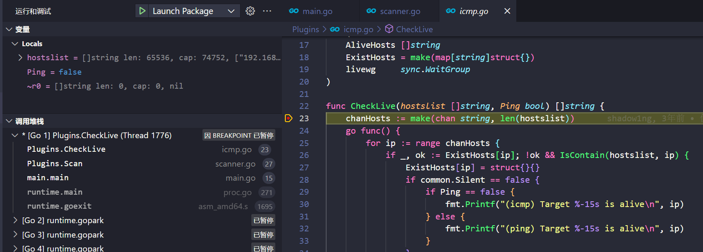
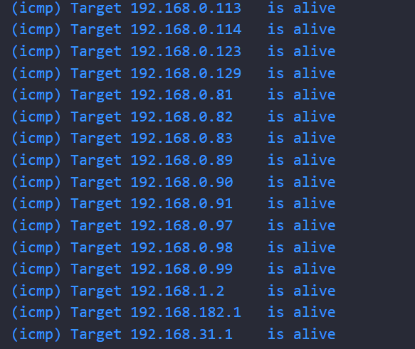
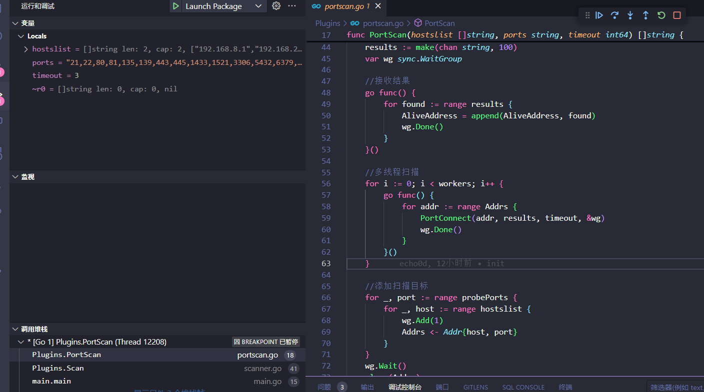
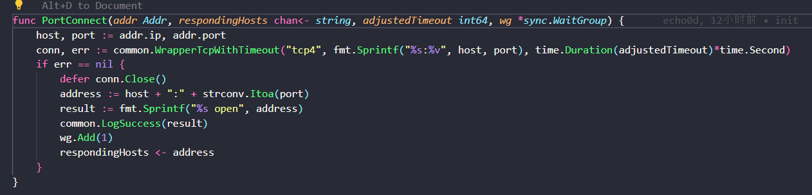
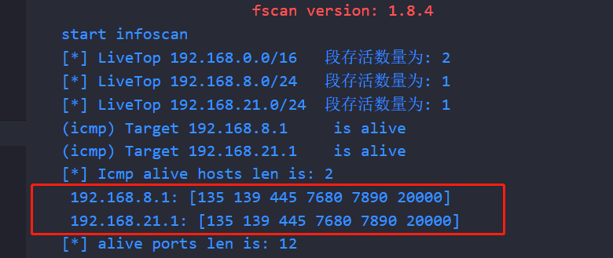

# 2. Go练习-fscan

## 2.1. 优化存活主机探测结果输出

Plugins目录下的icmp.go文件中CheckLive函数对应着探测存活主机功能，堆栈：

```
Plugins.CheckLive (c:\Users\18846\Desktop\fscan\Plugins\icmp.go:23)
Plugins.Scan (c:\Users\18846\Desktop\fscan\Plugins\scanner.go:27)
main.main (c:\Users\18846\Desktop\fscan\main.go:15)
```



整体逻辑：`checkLive`函数中创建`chanHosts`通道，用channel接收多线程探测存活主机的结果。

修改：多线程里`chanHosts`中的IP不再实时输出，原本的打印逻辑注释掉，只保留扫描结果`AliveHosts`

```go
chanHosts := make(chan string, len(hostslist))
	go func() {
		for ip := range chanHosts {
			if _, ok := ExistHosts[ip]; !ok && IsContain(hostslist, ip) {
				ExistHosts[ip] = struct{}{}
				// if common.Silent == false {
				// 	if Ping == false {
				// 		fmt.Printf("(icmp) Target %-15s is alive\n", ip)
				// 	} else {
				// 		fmt.Printf("(ping) Target %-15s is alive\n", ip)
				// 	}
				// }
				AliveHosts = append(AliveHosts, ip)
			}
			livewg.Done()
		}
	}()
```

在`AliveHosts`返回之前对其进行排序并输出

```go
	// Sort the AliveHosts slice
	sort.Strings(AliveHosts)
	// Print sorted AliveHosts
	if Ping == false {
		for _, ip := range AliveHosts {
			fmt.Printf("(icmp) Target %-15s is alive\n", ip)
		}
	} else {
		for _, ip := range AliveHosts {
			fmt.Printf("(ping) Target %-15s is alive\n", ip)
		}
	}
	return AliveHosts
```

缺点：要等到全部存活探测结束才有输出

优点：有排序，不会太乱

但是，结果跑出来发现排序不对



修改一下排序的逻辑，不直接用`sort.Strings`了,使用`net`包中的`ParseIP`函数，解析一下IP再排序

```go
	// sort.Strings(AliveHosts)
	sort.Slice(AliveHosts, func(i, j int) bool {
		return bytes.Compare(net.ParseIP(AliveHosts[i]).To4(), net.ParseIP(AliveHosts[j]).To4()) < 0
	})
```

这回应该没啥问题了，就是不知道效率被影响的程度，毕竟多解析了一遍IP，等用的时候再说吧

## 2.2. 优化端口探测结果输出

fscan 端口扫描函数调用堆栈

```
Plugins.PortScan (portscan.go:48) github.com/shadow1ng/fscan/Plugins
Plugins.Scan (scanner.go:40) github.com/shadow1ng/fscan/Plugins
main.main (main.go:15) main
runtime.main (proc.go:250) runtime
```



原本的探测结果在`PortConnect()`函数。一边扫描一边就输出，这样太乱了。但是也有对应的接收结果的 `results` channel, 那直接删除掉原本的输出，处理 `AliveAddress` 结果即可 修改代码如下



在`PortConnect()`函数中`AliveAddress` 返回之前，处理一遍结果。

```go
func PortScan(hostslist []string, ports string, timeout int64) []string {
    //
	// 中间省略
    // 
	wg.Wait()
	close(Addrs)
	close(results)
	MapIPToPorts(AliveAddress)
	return AliveAddress
}

func MapIPToPorts(ipPortList []string) {
	ipToPorts := make(map[string][]int)
	// 遍历列表，解析IP和端口，并将端口添加到对应IP的列表中
	for _, ipPort := range ipPortList {
		parts := strings.Split(ipPort, ":")
		ip := parts[0]
		port, _ := strconv.Atoi(parts[1])
		ipToPorts[ip] = append(ipToPorts[ip], port)
	}

	for ip, ports := range ipToPorts {
		sort.Ints(ports)
		result := fmt.Sprintf(" %s: %v", ip, ports)
		common.LogSuccess(result)
	}
}
```

结果大概这样



