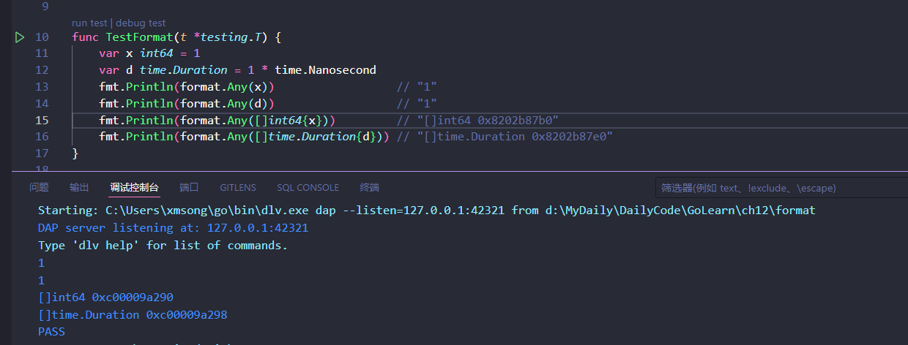
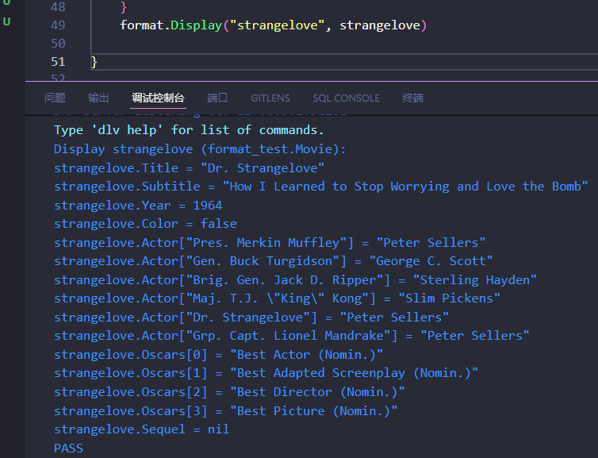
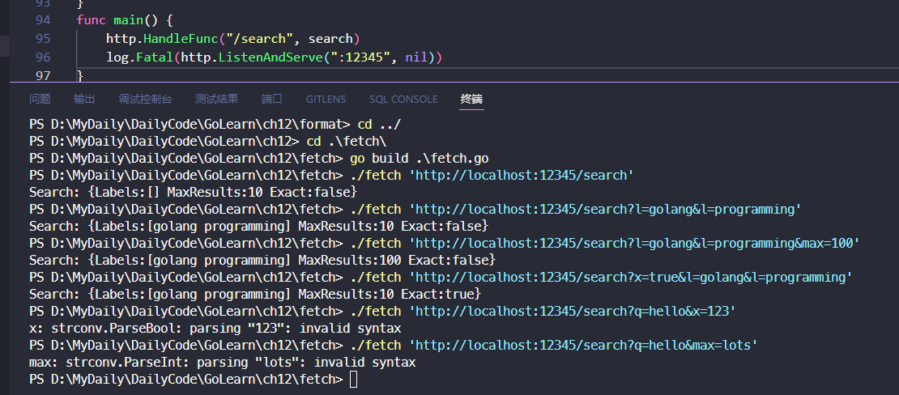
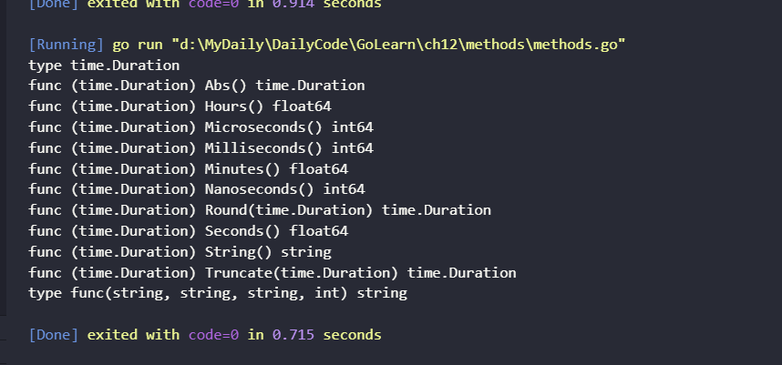

# 12. 反射

## 12.1. 为何需要反射?

在 Go 语言中，反射（reflection）是一种强大的机制，允许程序在运行时检查类型信息、操作变量、调用方法等。Go 的反射包 `reflect` 提供了一组功能，让程序能够动态地检查和操作变量、结构体、接口等信息。

以下是一些常见情况下使用反射的例子和原因：

1. **通用编程**：反射允许编写通用代码，能够在运行时处理**不同类型的数据结构，而不需要提前知道其类型。**
2. **序列化和反序列化**：通过反射，可以动态地将结构体转换为 JSON、XML 等格式，或者将这些格式转换回结构体。
3. **动态调用方法**：反射允许程序在运行时调用结构体的方法，而不需要提前知道这些方法的名称。
4. **类型检查和类型断言**：反射可以用于检查变量的类型，并进行类型断言，特别在处理接口时非常有用。
5. **代码生成**：某些情况下，反射可以用于生成代码，例如在 ORM（对象关系映射）库中动态创建数据库查询语句。

一个格式化的函数，我们首先用switch类型分支来测试输入参数是否实现了String方法，如果是的话就调用该方法。然后继续增加类型测试分支，检查这个值的动态类型是否是string、int、bool等基础类型，并在每种情况下执行相应的格式化操作。

```go
func Sprint(x interface{}) string {
    type stringer interface {
        String() string
    }
    switch x := x.(type) {
    case stringer:
        return x.String()
    case string:
        return x
    case int:
        return strconv.Itoa(x)
    // ...similar cases for int16, uint32, and so on...
    case bool:
        if x {
            return "true"
        }
        return "false"
    default:
        // array, chan, func, map, pointer, slice, struct
        return "???"
    }
}

```

但是我们如何处理其它类似`[]float64`、`map[string][]string`等类型呢？我们当然可以添加更多的测试分支，但是这些组合类型的数目基本是无穷的。还有如何处理类似`url.Values`这样的具名类型呢？即使类型分支可以识别出底层的基础类型是`map[string][]string`，但是它并不匹配`url.Values`类型，因为它们是两种不同的类型，而且`switch`类型分支也不可能包含每个类似`url.Values`的类型，这会导致对这些库的依赖。

没有办法来检查未知类型的表示方式，我们被卡住了。这就是我们需要反射的原因。


## 12.2. `reflect.Type` 和 `reflect.Value`

反射是由 reflect 包提供的。它定义了两个重要的类型，Type 和 Value。

### `reflect.Type` 

一个 Type 表示一个Go类型。它是一个接口，有许多方法来区分类型以及检查它们的组成部分，例如一个结构体的成员或一个函数的参数等。唯一能反映 `reflect.Type` 实现的是接口的类型描述信息（§7.5），也正是这个实体标识了接口值的动态类型。

回忆一下`interface{} `类型，就是**空接口**，它是一个不包含任何方法的接口。空接口可以表示任意类型，因为它不限制其实现类型。空接口在 Go 中被广泛应用，因为它提供了一种在不知道具体类型的情况下存储值的方法。

以下是一些空接口的特点和用途：

1. **表示任意类型**：空接口可以接受任何类型的值，因为它不包含任何方法，所以任何类型都满足空接口的要求。
2. **类型断言**：使用类型断言可以将空接口中的值转换为具体类型。这使得在运行时能够处理不同类型的数据。
3. **通用容器**：空接口可以用作通用的容器，用于存储不同类型的值，类似于 C# 或 Java 中的 `Object` 类型。

示例代码：

```go
package main

import (
    "fmt"
)

func main() {
    var any interface{} // 定义一个空接口

    any = 42 // 可以存储任何类型的值
    fmt.Println(any) // 输出: 42

    any = "Hello, Go!"
    fmt.Println(any) // 输出: Hello, Go!
}
```

函数`reflect.TypeOf` 接受任意的 `interface{} `类型，并以` reflect.Type `形式返回其动态类型：

```Go
t := reflect.TypeOf(3)  // a reflect.Type
fmt.Println(t.String()) // "int"
fmt.Println(t)          // "int"
```

其中`TypeOf(3) `调用将值 3 传给 `interface{}` 参数。回到 7.5节 的将一个具体的值转为接口类型会有一个隐式的接口转换操作，它会创建一个包含两个信息的接口值：操作数的动态类型（这里是 int）和它的动态的值（这里是 3）。

因为 `reflect.TypeOf` 返回的是一个动态类型的接口值，它总是返回具体的类型。因此，下面的代码将打印 `"*os.File" `而不是 `"io.Writer"`。稍后，我们将看到能够表达接口类型的` reflect.Type`。

```Go
var w io.Writer = os.Stdout
fmt.Println(reflect.TypeOf(w)) // "*os.File"
```

要注意的是 `reflect.Type` 接口是满足 `fmt.Stringer` 接口的。因为打印一个接口的动态类型对于调试和日志是有帮助的，` fmt.Printf` 提供了一个缩写 %T 参数，内部使用` reflect.TypeOf `来输出：

```Go
fmt.Printf("%T\n", 3) // "int"
```

### `reflect.Value`

`reflect` 包中另一个重要的类型是 Value。一个 `reflect.Value` 可以装载任意类型的值。函数` reflect.ValueOf` 接受任意的 `interface{}` 类型，并返回一个装载着其动态值的 `reflect.Value`。和 `reflect.TypeOf` 类似，`reflect.ValueOf` 返回的结果也是具体的类型，但是 `reflect.Value` 也可以持有一个接口值。

```Go
v := reflect.ValueOf(3) // a reflect.Value
fmt.Println(v)          // "3"
fmt.Printf("%v\n", v)   // "3"
fmt.Println(v.String()) // NOTE: "<int Value>"
```

和 `reflect.Type` 类似，`reflect.Value` 也满足 `fmt.Stringer` 接口，但是除非` Value` 持有的是字符串，否则 `String` 方法只返回其类型。而使用 `fmt` 包的` %v` 标志参数会对` reflect.Values` 特殊处理。

对 Value 调用 Type 方法将返回具体类型所对应的 `reflect.Type`：

```Go
t := v.Type()           // a reflect.Type
fmt.Println(t.String()) // "int"
```

`reflect.ValueOf` 的逆操作是 `reflect.Value.Interface` 方法。它返回一个 `interface{}` 类型，装载着与 `reflect.Value` 相同的具体值：

```Go
v := reflect.ValueOf(3) // a reflect.Value
x := v.Interface()      // an interface{}
i := x.(int)            // an int
fmt.Printf("%d\n", i)   // "3"
```

`reflect.Value` 和 `interface{}` 都能装载任意的值。所不同的是，一个空的接口隐藏了值内部的表示方式和所有方法，因此只有我们知道具体的动态类型才能使用类型断言来访问内部的值（就像上面那样），内部值我们没法访问。相比之下，一个 Value 则有很多方法来检查其内容，无论它的具体类型是什么。

### Kind 方法

让我们再次尝试实现格式化函数 `format.Any`。我们使用 `reflect.Value` 的 `Kind` 方法来替代之前的类型 `switch`。虽然还是有无穷多的类型，但是它们的 kinds 类型却是有限的：Bool、String 和 所有数字类型的基础类型；Array 和 Struct 对应的聚合类型；Chan、Func、Ptr、Slice 和 Map 对应的引用类型；interface 类型；还有表示空值的 Invalid 类型。（空的 `reflect.Value` 的 `kind` 即为 Invalid。）

```Go
package format

import (
    "reflect"
    "strconv"
)

// Any formats any value as a string.
func Any(value interface{}) string {
    return formatAtom(reflect.ValueOf(value))
}

// formatAtom formats a value without inspecting its internal structure.
func formatAtom(v reflect.Value) string {
    switch v.Kind() {
    case reflect.Invalid:
        return "invalid"
    case reflect.Int, reflect.Int8, reflect.Int16,
        reflect.Int32, reflect.Int64:
        return strconv.FormatInt(v.Int(), 10)
    case reflect.Uint, reflect.Uint8, reflect.Uint16,
        reflect.Uint32, reflect.Uint64, reflect.Uintptr:
        return strconv.FormatUint(v.Uint(), 10)
    // ...floating-point and complex cases omitted for brevity...
    case reflect.Bool:
        return strconv.FormatBool(v.Bool())
    case reflect.String:
        return strconv.Quote(v.String())
    case reflect.Chan, reflect.Func, reflect.Ptr, reflect.Slice, reflect.Map:
        return v.Type().String() + " 0x" +
            strconv.FormatUint(uint64(v.Pointer()), 16)
    default: // reflect.Array, reflect.Struct, reflect.Interface
        return v.Type().String() + " value"
    }
}
```

到目前为止，我们的函数将每个值视作一个不可分割没有内部结构的物品，因此它叫 `formatAtom`。对于聚合类型（结构体和数组）和接口，只是打印值的类型，对于引用类型（channels、functions、pointers、slices 和 maps），打印类型和十六进制的引用地址。虽然还不够理想，但是依然是一个重大的进步，并且 Kind 只关心底层表示，`format.Any` 也支持具名类型。例如：

```Go
var x int64 = 1
var d time.Duration = 1 * time.Nanosecond
fmt.Println(format.Any(x))                  // "1"
fmt.Println(format.Any(d))                  // "1"
fmt.Println(format.Any([]int64{x}))         // "[]int64 0x8202b87b0"
fmt.Println(format.Any([]time.Duration{d})) // "[]time.Duration 0x8202b87e0"
```



## 12.3. Display，一个递归的值打印器

接下来，让我们看看如何改善聚合数据类型的显示。构建一个用于调试用的Display函数：给定任意一个复杂类型 x，打印这个值对应的完整结构，同时标记每个元素的发现路径。

应该尽量避免在一个包的API中暴露涉及反射的接口。我们将定义一个未导出的display函数用于递归处理工作，导出的是Display函数，它只是display函数简单的包装以接受`interface{}`类型的参数：

```Go
func Display(name string, x interface{}) {
    fmt.Printf("Display %s (%T):\n", name, x)
    display(name, reflect.ValueOf(x))
}
```

在display函数中，我们使用了前面定义的打印基础类型——基本类型、函数和chan等——元素值的`formatAtom`函数，但是我们会使用`reflect.Value`的方法来递归显示复杂类型的每一个成员。在递归下降过程中，path字符串，从最开始传入的起始值（这里是“e”），将逐步增长来表示是如何达到当前值（例如“`e.args[0].value`”）的。

```go
package format

import (
	"fmt"
	"reflect"
)

func Display(name string, x interface{}) {
	fmt.Printf("Display %s (%T):\n", name, x)
	display(name, reflect.ValueOf(x))
}

func display(path string, v reflect.Value) {
	switch v.Kind() {
	case reflect.Invalid:
		fmt.Printf("%s = invalid\n", path)
	case reflect.Slice, reflect.Array:
		for i := 0; i < v.Len(); i++ {
			display(fmt.Sprintf("%s[%d]", path, i), v.Index(i))
		}
	case reflect.Struct:
		for i := 0; i < v.NumField(); i++ {
			fieldPath := fmt.Sprintf("%s.%s", path, v.Type().Field(i).Name)
			display(fieldPath, v.Field(i))
		}
	case reflect.Map:
		for _, key := range v.MapKeys() {
			display(fmt.Sprintf("%s[%s]", path,
				formatAtom(key)), v.MapIndex(key))
		}
	case reflect.Ptr:
		if v.IsNil() {
			fmt.Printf("%s = nil\n", path)
		} else {
			display(fmt.Sprintf("(*%s)", path), v.Elem())
		}
	case reflect.Interface:
		if v.IsNil() {
			fmt.Printf("%s = nil\n", path)
		} else {
			fmt.Printf("%s.type = %s\n", path, v.Elem().Type())
			display(path+".value", v.Elem())
		}
	default: // basic types, channels, funcs
		fmt.Printf("%s = %s\n", path, formatAtom(v))
	}
}

```

让我们针对不同类型分别讨论。

**Slice和数组：** 两种的处理逻辑是一样的。Len方法返回slice或数组值中的元素个数，`Index(i)`获得索引i对应的元素，返回的也是一个`reflect.Value`；如果索引i超出范围的话将导致panic异常，这与数组或slice类型内建的`len(a`)和`a[i]`操作类似。display针对序列中的每个元素递归调用自身处理，我们通过在递归处理时向path附加`[i]`来表示访问路径。

虽然`reflect.Value`类型带有很多方法，但是只有少数的方法能对任意值都安全调用。例如，Index方法只能对Slice、数组或字符串类型的值调用，如果对其它类型调用则会导致panic异常。

**结构体：** `NumField`方法报告结构体中成员的数量，`Field(i)`以`reflect.Value`类型返回第i个成员的值。成员列表也包括通过匿名字段提升上来的成员。为了在`path`添加`“.f”`来表示成员路径，我们必须获得结构体对应的`reflect.Type`类型信息，然后访问结构体第i个成员的名字。

**Maps:** `MapKeys`方法返回一个`reflect.Value`类型的slice，每一个元素对应`map`的一个`key`。和往常一样，遍历map时顺序是随机的。`MapIndex(key)`返回`map`中`key`对应的`value`。我们向`path`添加`[key]`来表示访问路径。（我们这里有一个未完成的工作。其实`map`的`key`的类型并不局限于`formatAtom`能完美处理的类型；数组、结构体和接口都可以作为`map`的`key`。针对这种类型，完善`key`的显示信息是练习12.1的任务。）

**指针：**` Elem`方法返回指针指向的变量，依然是`reflect.Value`类型。即使指针是`nil`，这个操作也是安全的，在这种情况下指针是`Invalid`类型，但是我们可以用`IsNil`方法来显式地测试一个空指针，这样我们可以打印更合适的信息。我们在path前面添加`*`，并用括弧包含以避免歧义。

**接口：** 再一次，我们使用`IsNil`方法来测试接口是否是nil，如果不是，我们可以调用`v.Elem()`来获取接口对应的动态值，并且打印对应的类型和值。

现在我们的Display函数总算完工了，让我们看看它的表现吧。下面的Movie类型是在4.5节的电影类型上演变来的：

```Go
type Movie struct {
    Title, Subtitle string
    Year            int
    Color           bool
    Actor           map[string]string
    Oscars          []string
    Sequel          *string
}
```

让我们声明一个该类型的变量，然后看看Display函数如何显示它：

```Go
strangelove := Movie{
    Title:    "Dr. Strangelove",
    Subtitle: "How I Learned to Stop Worrying and Love the Bomb",
    Year:     1964,
    Color:    false,
    Actor: map[string]string{
        "Dr. Strangelove":            "Peter Sellers",
        "Grp. Capt. Lionel Mandrake": "Peter Sellers",
        "Pres. Merkin Muffley":       "Peter Sellers",
        "Gen. Buck Turgidson":        "George C. Scott",
        "Brig. Gen. Jack D. Ripper":  "Sterling Hayden",
        `Maj. T.J. "King" Kong`:      "Slim Pickens",
    },

    Oscars: []string{
        "Best Actor (Nomin.)",
        "Best Adapted Screenplay (Nomin.)",
        "Best Director (Nomin.)",
        "Best Picture (Nomin.)",
    },
}
```



观察下面两个例子的区别：

```Go
var i interface{} = 3

Display("i", i)
// Output:
// Display i (int):
// i = 3

Display("&i", &i)
// Output:
// Display &i (*interface {}):
// (*&i).type = int
// (*&i).value = 3
```

在第一个例子中，`Display`函数调用`reflect.ValueOf(i)`，它返回一个`Int`类型的值。正如我们在12.2节中提到的，`reflect.ValueOf`总是返回一个具体类型的 `Value`，因为它是从一个接口值提取的内容。

在第二个例子中，`Display`函数调用的是`reflect.ValueOf(&i)`，它返回一个指向i的指针，对应`Ptr`类型。在`switch`的`Ptr`分支中，对这个值调用 `Elem` 方法，返回一个`Value`来表示变量` i `本身，对应`Interface`类型。像这样一个间接获得的`Value`，可能代表任意类型的值，包括接口类型。`display`函数递归调用自身，这次它分别打印了这个接口的动态类型和值。

**练习 12.1：** 扩展Display函数，使它可以显示包含以结构体或数组作为`map`的`key`类型的值。

```go
case reflect.Map:
		for _, key := range v.MapKeys() {
			// XXX: 咱也不道对不对
			if key.Kind() == reflect.Struct {
				for i := 0; i < v.NumField(); i++ {
					fieldPath := fmt.Sprintf("%s.%s", path, v.Type().Field(i).Name)
					display(fieldPath, v.Field(i))
				}
			} else {
				display(fmt.Sprintf("%s[%s]", path, formatAtom(key)), v.MapIndex(key))
			}
		}
```

**练习 12.2：** 增强display函数的稳健性，通过记录边界的步数来确保在超出一定限制后放弃递归。（在13.3节，我们会看到另一种探测数据结构是否存在环的技术。）

## 12.4. 示例: 编码为S表达式

这节先不看了，似乎没啥意思

## 12.5. 通过reflect.Value修改值

回想一下，Go语言中类似`x`、`x.f[1]`和`*p`形式的表达式都可以表示变量，但是其它如`x + 1`和`f(2)`则不是变量。一个变量就是一个可寻址的内存空间，里面存储了一个值，并且存储的值可以通过内存地址来更新。

对于`reflect.Values`也有类似的区别。有一些`reflect.Values`是可取地址的；其它一些则不可以。考虑以下的声明语句：

```Go
x := 2                   // value   type    variable?
a := reflect.ValueOf(2)  // 2       int     no
b := reflect.ValueOf(x)  // 2       int     no
c := reflect.ValueOf(&x) // &x      *int    no
d := c.Elem()            // 2       int     yes (x)
```

其中`a`对应的变量不可取地址。因为a中的值仅仅是整数2的拷贝副本。`b`中的值也同样不可取地址。`c`中的值还是不可取地址，它只是一个指针`&x`的拷贝。实际上，所有通过`reflect.ValueOf(x)`返回的`reflect.Value`都是不可取地址的。但是对于`d`，它是`c`的解引用方式生成的，指向另一个变量，因此是可取地址的。我们可以通过调用`reflect.ValueOf(&x).Elem()`，来获取任意变量`x`对应的可取地址的`Value`。

我们可以通过调用`reflect.Value`的`CanAddr`方法来判断其是否可以被取地址：

```Go
fmt.Println(a.CanAddr()) // "false"
fmt.Println(b.CanAddr()) // "false"
fmt.Println(c.CanAddr()) // "false"
fmt.Println(d.CanAddr()) // "true"
```

每当我们通过指针间接地获取的`reflect.Value`都是可取地址的，即使开始的是一个不可取地址的`Value`。在反射机制中，所有关于是否支持取地址的规则都是类似的。以此类推，`reflect.ValueOf(e).Index(i)`对应的值也是可取地址的，即使原始的`reflect.ValueOf(e)`不支持也没有关系。

要从变量对应的可取地址的`reflect.Value`来访问变量需要三个步骤。第一步是调用`Addr()`方法，它返回一个`Value`，里面保存了指向变量的指针。然后是在`Value`上调用`Interface()`方法，也就是返回一个`interface{}`，里面包含指向变量的指针。最后，如果我们知道变量的类型，我们可以使用类型的断言机制将得到的`interface{}`类型的接口强制转为普通的类型指针。这样我们就可以通过这个普通指针来更新变量了：

```Go
x := 2
d := reflect.ValueOf(&x).Elem()   // d refers to the variable x
px := d.Addr().Interface().(*int) // px := &x
*px = 3                           // x = 3
fmt.Println(x)                    // "3"
```

或者，不使用指针，而是通过调用可取地址的`reflect.Value`的`reflect.Value.Set`方法来更新对应的值：

```Go
d.Set(reflect.ValueOf(4))
fmt.Println(x) // "4"
```

`Set`方法将在运行时执行和编译时进行类似的可赋值性约束的检查。以上代码，变量和值都是int类型，但是如果变量是int64类型，那么程序将抛出一个panic异常，所以关键问题是要确保改类型的变量可以接受对应的值：

```Go
d.Set(reflect.ValueOf(int64(5))) // panic: int64 is not assignable to int
```

同样，对一个不可取地址的`reflect.Value`调用Set方法也会导致panic异常：

```Go
x := 2
b := reflect.ValueOf(x)
b.Set(reflect.ValueOf(3)) // panic: Set using unaddressable value
```

这里有很多用于基本数据类型的Set方法：`SetInt`、`SetUint`、`SetString`和`SetFloat`等。

```Go
d := reflect.ValueOf(&x).Elem()
d.SetInt(3)
fmt.Println(x) // "3"
```

从某种程度上说，这些Set方法总是尽可能地完成任务。以`SetInt`为例，只要变量是某种类型的有符号整数就可以工作，即使是一些命名的类型、甚至只要底层数据类型是有符号整数就可以，而且如果对于变量类型值太大的话会被自动截断。但需要谨慎的是：对于一个引用`interface{}`类型的`reflect.Value`调用`SetInt`会导致panic异常，即使那个`interface{}`变量对于整数类型也不行。

```Go
x := 1
rx := reflect.ValueOf(&x).Elem()
rx.SetInt(2)                     // OK, x = 2
rx.Set(reflect.ValueOf(3))       // OK, x = 3
rx.SetString("hello")            // panic: string is not assignable to int
rx.Set(reflect.ValueOf("hello")) // panic: string is not assignable to int

var y interface{}
ry := reflect.ValueOf(&y).Elem()
ry.SetInt(2)                     // panic: SetInt called on interface Value
ry.Set(reflect.ValueOf(3))       // OK, y = int(3)
ry.SetString("hello")            // panic: SetString called on interface Value
ry.Set(reflect.ValueOf("hello")) // OK, y = "hello"
```

当我们用`Display`显示`os.Stdout`结构时，我们发现反射可以越过Go语言的导出规则的限制读取结构体中未导出的成员，比如在类Unix系统上`os.File`结构体中的`fd int`成员。然而，利用反射机制并不能修改这些未导出的成员：

```Go
stdout := reflect.ValueOf(os.Stdout).Elem() // *os.Stdout, an os.File var
fmt.Println(stdout.Type())                  // "os.File"
fd := stdout.FieldByName("fd")
fmt.Println(fd.Int()) // "1"
fd.SetInt(2)          // panic: unexported field
```

一个可取地址的`reflect.Value`会记录一个结构体成员是否是未导出成员，如果是的话则拒绝修改操作。因此，`CanAddr`方法并不能正确反映一个变量是否是可以被修改的。

相关的方法`CanSet`是用于检查对应的`reflect.Value`是否是可取地址并可被修改的：

```Go
fmt.Println(fd.CanAddr(), fd.CanSet()) // "true false"
```

> 可取地址不一定能被修改，能被修改一定可取地址


## 12.7. 获取结构体字段标签

对于一个web服务，大部分HTTP处理函数要做的第一件事情就是展开请求中的参数到本地变量中。我们定义了一个工具函数，叫`params.Unpack`，通过使用结构体成员标签机制来让HTTP处理函数解析请求参数更方便。

下面的search函数是一个HTTP请求处理函数。它定义了一个匿名结构体类型的变量，用结构体的每个成员表示HTTP请求的参数。其中结构体成员标签指明了对于请求参数的名字，为了减少URL的长度这些参数名通常都是神秘的缩略词。Unpack将请求参数填充到合适的结构体成员中，这样我们可以方便地通过合适的类型类来访问这些参数。

```Go
// search implements the /search URL endpoint.
func search(resp http.ResponseWriter, req *http.Request) {
    var data struct {
        Labels     []string `http:"l"`
        MaxResults int      `http:"max"`
        Exact      bool     `http:"x"`
    }
    data.MaxResults = 10 // set default
    if err := params.Unpack(req, &data); err != nil {
        http.Error(resp, err.Error(), http.StatusBadRequest) // 400
        return
    }

    // ...rest of handler...
    fmt.Fprintf(resp, "Search: %+v\n", data)
}
```

下面的Unpack函数主要完成三件事情。第一，它调用`req.ParseForm()`来解析HTTP请求。然后，`req.Form`将包含所有的请求参数，不管HTTP客户端使用的是GET还是POST请求方法。

下一步，Unpack函数将构建每个结构体成员有效参数名字到成员变量的映射。如果结构体成员有成员标签的话，有效参数名字可能和实际的成员名字不相同。`reflect.Type`的`Field`方法将返回一个`reflect.StructField`，里面含有每个成员的名字、类型和可选的成员标签等信息。其中成员标签信息对应`reflect.StructTag`类型的字符串，并且提供了Get方法用于解析和根据特定key提取的子串，例如这里的http:"..."形式的子串。

```go
// Unpack populates the fields of the struct pointed to by ptr
// from the HTTP request parameters in req.
func Unpack(req *http.Request, ptr interface{}) error {
    if err := req.ParseForm(); err != nil {
        return err
    }

    // Build map of fields keyed by effective name.
    fields := make(map[string]reflect.Value)
    v := reflect.ValueOf(ptr).Elem() // the struct variable
    for i := 0; i < v.NumField(); i++ {
        fieldInfo := v.Type().Field(i) // a reflect.StructField
        tag := fieldInfo.Tag           // a reflect.StructTag
        name := tag.Get("http")
        if name == "" {
            name = strings.ToLower(fieldInfo.Name)
        }
        fields[name] = v.Field(i)
    }

    // Update struct field for each parameter in the request.
    for name, values := range req.Form {
        f := fields[name]
        if !f.IsValid() {
            continue // ignore unrecognized HTTP parameters
        }
        for _, value := range values {
            if f.Kind() == reflect.Slice {
                elem := reflect.New(f.Type().Elem()).Elem()
                if err := populate(elem, value); err != nil {
                    return fmt.Errorf("%s: %v", name, err)
                }
                f.Set(reflect.Append(f, elem))
            } else {
                if err := populate(f, value); err != nil {
                    return fmt.Errorf("%s: %v", name, err)
                }
            }
        }
    }
    return nil
}

```

最后，Unpack遍历HTTP请求的name/valu参数键值对，更新相应的结构体成员。。如果同一个名字的参数可能出现多次，并且对应的结构体成员是一个slice，那么就将所有的参数添加到slice中。对应的成员值将被覆盖，只有最后一次出现的参数值才是起作用的。

populate函数用请求的字符串类型参数值来填充单一的成员v（或者是slice类型成员中的单一的元素）。

```go
func populate(v reflect.Value, value string) error {
    switch v.Kind() {
    case reflect.String:
        v.SetString(value)

    case reflect.Int:
        i, err := strconv.ParseInt(value, 10, 64)
        if err != nil {
            return err
        }
        v.SetInt(i)

    case reflect.Bool:
        b, err := strconv.ParseBool(value)
        if err != nil {
            return err
        }
        v.SetBool(b)

    default:
        return fmt.Errorf("unsupported kind %s", v.Type())
    }
    return nil
}

```



## 12.8. 显示一个类型的方法集

```Go
// Print prints the method set of the value x.
func Print(x interface{}) {
    v := reflect.ValueOf(x)
    t := v.Type()
    fmt.Printf("type %s\n", t)

    for i := 0; i < v.NumMethod(); i++ {
        methType := v.Method(i).Type()
        fmt.Printf("func (%s) %s%s\n", t, t.Method(i).Name,
            strings.TrimPrefix(methType.String(), "func"))
    }
}
```

`reflect.Type`和`reflect.Value`都提供了一个Method方法。每次`t.Method(i)`调用将一个`reflect.Method`的实例，对应一个用于描述一个方法的名称和类型的结构体。每次`v.Method(i)`方法调用都返回一个`reflect.Value`以表示对应的值（§6.4），也就是一个方法是绑到它的接收者的。使用`reflect.Value.Call`方法（我们这里没有演示），将可以调用一个`Func`类型的Value，但是这个例子中只用到了它的类型。

这是属于`time.Duration`和`*strings.Replacer`两个类型的方法：

```Go
methods.Print(time.Hour)
// Output:
// type time.Duration
// func (time.Duration) Hours() float64
// func (time.Duration) Minutes() float64
// func (time.Duration) Nanoseconds() int64
// func (time.Duration) Seconds() float64
// func (time.Duration) String() string

methods.Print(new(strings.Replacer))
// Output:
// type *strings.Replacer
// func (*strings.Replacer) Replace(string) string
// func (*strings.Replacer) WriteString(io.Writer, string) (int, error)
```



