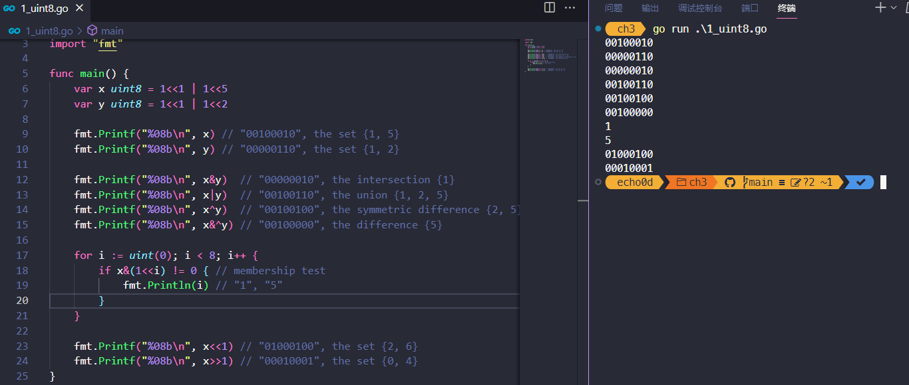

# 03. GO语言-基础数据类型

Go语言将数据类型分为四类：基础类型、复合类型、引用类型和接口类型。

* 本章介绍基础类型，包括：数字、字符串和布尔型。
* 复合数据类型——数组（§4.1）和结构体（§4.2）——是通过组合简单类型，来表达更加复杂的数据结构。
* 引用类型包括指针（§2.3.2）、切片（§4.2)）、字典（§4.3）、函数（§5）、通道（§8）
* 将在第7章介绍接口类型

虽然数据种类很多，但它们都是对程序中一个变量或状态的间接引用。这意味着对任一引用类型数据的修改都会影响所有该引用的拷贝。

Go语言的数值类型包括几种不同大小的整数、浮点数和复数。每种数值类型都决定了对应的大小范围和是否支持正负符号。

## 3.1. 整型

### 不同的整型&值域

Go语言同时提供了有符号和无符号类型的整数运算。

* int8、int16、int32和int64四种截然不同大小的有符号整数类型，分别对应8、16、32、64bit大小的有符号整数，与此对应的是uint8、uint16、uint32和uint64四种无符号整数类型。
* 两种一般对应特定CPU平台机器字大小的有符号和无符号整数int和uint；其中int是应用最广泛的数值类型。不同的编译器即使在相同的硬件平台上可能产生不同的大小。
* Unicode字符rune类型是和int32等价的类型，通常用于表示一个Unicode码点。这两个名称可以互换使用。
* byte也是uint8类型的等价类型，byte类型一般用于强调数值是一个原始的数据而不是一个小的整数。
* 无符号的整数类型uintptr，没有指定具体的bit大小但是足以容纳指针。uintptr类型只有在底层编程时才需要，特别是Go语言和C语言函数库或操作系统接口相交互的地方。

不管它们的具体大小，int、uint和uintptr是不同类型的兄弟类型。其中int和int32也是不同的类型，即使int的大小也是32bit，在需要将int当作int32类型的地方需要一个显式的类型转换操作，反之亦然。

**值域**

其中有符号整数采用2的补码形式表示，也就是最高bit位用来表示符号位，一个n-bit的有符号数的值域是从-2n-1到2n-1-1。无符号整数的所有bit位都用于表示非负数，值域是0到2n-1。例如，int8类型整数的值域是从-128到127，而uint8类型整数的值域是从0到255。

### 二元运算符

下面是Go语言中关于算术运算、逻辑运算和比较运算的二元运算符，它们按照优先级递减的顺序排列：

```
*      /      %      <<       >>     &       &^
+      -      |      ^
==     !=     <      <=       >      >=
&&
||
```

二元运算符有五种优先级。在同一个优先级，使用左优先结合规则，但是使用括号可以明确优先顺序，使用括号也可以用于提升优先级，例如 `mask & (1 << 28)`。对于上表中前两行的运算符，例如+运算符还有一个与赋值相结合的对应运算符+=，可以用于简化赋值语句。

#### 算数运算符

* 算术运算符 `+`、`-`、`*`和 `/`可以适用于整数、浮点数和复数，但是取模运算符%仅用于整数间的运算。
* 对于不同编程语言，%取模运算的行为可能并不相同。在Go语言中，%取模运算符的符号和被取模数的符号总是一致的，因此 `-5%3`和 `-5%-3`结果都是-2。
* 除法运算符 `/`的行为则依赖于操作数是否全为整数，比如 `5.0/4.0`的结果是1.25，但是5/4的结果是1，因为整数除法会向着0方向截断余数。

**结果溢出**

一个算术运算的结果，不管是有符号或者是无符号的，如果需要更多的bit位才能正确表示的话，就说明计算结果是溢出了。超出的高位的bit位部分将被丢弃。如果原始的数值是有符号类型，而且最左边的bit位是1的话，那么最终结果可能是负的，例如int8的例子：

```Go
var u uint8 = 255
fmt.Println(u, u+1, u*u) // "255 0 1"

var i int8 = 127
fmt.Println(i, i+1, i*i) // "127 -128 1"
```

#### 比较运算符

两个相同的整数类型可以使用下面的二元比较运算符进行比较；比较表达式的结果是布尔类型。

```
==    等于
!=    不等于
<     小于
<=    小于等于
>     大于
>=    大于等于
```

事实上，布尔型、数字类型和字符串等基本类型都是可比较的，也就是说两个相同类型的值可以用==和!=进行比较。此外，整数、浮点数和字符串可以根据比较结果排序。许多其它类型的值可能是不可比较的，因此也就可能是不可排序的。对于我们遇到的每种类型，我们需要保证规则的一致性。

### 其他运算符

#### 一元的加减法运算符

这里是一元的加法和减法运算符：

```
+      一元加法（无效果）
-      负数
```

对于整数，+x是0+x的简写，-x则是0-x的简写；对于浮点数和复数，+x就是x，-x则是x 的负数。

#### bit位操作运算符

Go语言还提供了以下的bit位操作运算符，前面4个操作运算符并不区分是有符号还是无符号数：

```
&      位运算 AND
|      位运算 OR
^      位运算 XOR
&^     位清空 AND(a, NOT(b))
<<     左移
>>     右移
```

位操作运算符 `^`作为二元运算符时是按位异或（XOR），当用作一元运算符时表示按位取反；也就是说，它返回一个每个bit位都取反的数。

位操作运算符 `&^`用于按位置零（AND NOT）：如果对应y中bit位为1的话，表达式 `z = x &^ y`结果z的对应的bit位为0，否则z对应的bit位等于x相应的bit位的值。

### 无符号&有符号

下面的代码演示了如何使用位操作解释uint8类型值的8个独立的bit位。

使用Printf函数的%b参数打印二进制格式的数字；其中%08b中08表示打印至少8个字符宽度，不足的前缀部分用0填充。

```go
var x uint8 = 1<<1 | 1<<5
var y uint8 = 1<<1 | 1<<2

fmt.Printf("%08b\n", x) // "00100010", the set {1, 5}
fmt.Printf("%08b\n", y) // "00000110", the set {1, 2}

fmt.Printf("%08b\n", x&y)  // "00000010", the intersection {1}
fmt.Printf("%08b\n", x|y)  // "00100110", the union {1, 2, 5}
fmt.Printf("%08b\n", x^y)  // "00100100", the symmetric difference {2, 5}
fmt.Printf("%08b\n", x&^y) // "00100000", the difference {5}

for i := uint(0); i < 8; i++ {
    if x&(1<<i) != 0 { // membership test
        fmt.Println(i) // "1", "5"
    }
}

fmt.Printf("%08b\n", x<<1) // "01000100", the set {2, 6}
fmt.Printf("%08b\n", x>>1) // "00010001", the set {0, 4}

```



在x<<n和x>>n移位运算中，n必须是无符号数，x均可。例如上面用i := int(-1)就编不过

```go
for i := int(-1); i < 8; i++ {
		// NOTE: 此处i是无符号整型，才能实现1<<i，例如上面用i := int(-1)就编不过
		if x&(1<<i) != 0 { // membership test
			fmt.Println(i) // "1", "5"
		}
	}
```

算术上，一个x<<n左移运算等价于乘以$2^n$，一个x>>n右移运算等价于除以$2^n$。

左移运算用零填充右边空缺的bit位，无符号数的右移运算也是用0填充左边空缺的bit位，但是有符号数的右移运算会用符号位的值填充左边空缺的bit位。因为这个原因，最好用无符号运算，这样你可以将整数完全当作一个bit位模式处理。

尽管Go语言提供了无符号数的运算，但即使数值本身不可能出现负数，我们还是倾向于使用有符号的int类型，就像数组的长度那样，虽然使用uint无符号类型似乎是一个更合理的选择。事实上，内置的len函数返回一个有符号的int，我们可以像下面例子那样处理逆序循环。

```go
	medals := []string{"gold", "silver", "bronze"}
	// NOTE: 此处len(medals)返回的有符号int类型，要不然i--总>=0，就死循环了
	for i := len(medals) - 1; i >= 0; i-- {
		fmt.Println(medals[i]) // "bronze", "silver", "gold"
	}
```

在三次迭代之后，也就是i == 0时，i--语句将不会产生-1，而是变成一个uint类型的最大值（可能是$2^64-1$），然后medals[i]表达式运行时将发生panic异常（§5.9），也就是试图访问一个slice范围以外的元素。

> 无符号数往往只有在位运算或其它特殊的运算场景才会使用，就像bit集合、分析二进制文件格式或者是哈希和加密操作等。它们通常并不用于仅仅是表达非负数量的场合。

### 数值类型转换

需要一个显式的转换将一个值从一种类型转化为另一种类型，并且算术和逻辑运算的二元操作中必须是相同的类型。类似下面代码的常见的错误：

```Go
var apples int32 = 1
var oranges int16 = 2
var compote int = apples + oranges // compile error
```

当尝试编译这三个语句时，将产生一个错误信息：

```
invalid operation: apples + oranges (mismatched types int32 and int16)
```

这种类型不匹配的问题可以有几种不同的方法修复，最常见方法是将它们都显式转型为一个常见类型：

```Go
var compote = int(apples) + int(oranges)
```

如2.5节所述，对于每种类型T，如果转换允许的话，类型转换操作T(x)将x转换为T类型。许多整数之间的相互转换并不会改变数值；它们只是告诉编译器如何解释这个值。但是对于将一个大尺寸的整数类型转为一个小尺寸的整数类型，或者是将一个浮点数转为整数，可能会改变数值或丢失精度：

```Go
f := 3.141 // a float64
i := int(f)
fmt.Println(f, i) // "3.141 3"
f = 1.99
fmt.Println(int(f)) // "1"
```

浮点数到整数的转换将丢失任何小数部分，然后向数轴零方向截断。你应该避免对可能会超出目标类型表示范围的数值做类型转换，因为截断的行为可能依赖于具体的实现：

```Go
f := 1e100  // a float64
i := int(f) // 结果依赖于具体实现
```


* 任何大小的整数字面值都可以用以0开始的八进制格式书写，例如0666，八进制数据通常用于POSIX操作系统上的文件访问权限标志；
* 或用以0x或0X开头的十六进制格式书写，例如0xdeadbeef，（大小写都可），十六进制数字则更强调数字值的bit位模式。

### 格式化输出整型

当使用fmt包打印一个数值时，我们可以用 `%d`、`%o`或 `%x`参数控制输出的进制格式

```Go
o := 0666
fmt.Printf("%d %[1]o %#[1]o\n", o) // "438 666 0666"
x := int64(0xdeadbeef)
fmt.Printf("%d %[1]x %#[1]x %#[1]X\n", x)
// Output:
// 3735928559 deadbeef 0xdeadbeef 0XDEADBEEF
```

意义：

1. %d 是格式化占位符，表示按照十进制格式输出一个整数。
2. %[1]o 是格式化占位符的扩展用法，[1] 表示引用第一个参数，o 表示按照八进制格式输出一个整数。
3. %#[1]o 是格式化占位符的扩展用法，# 表示输出格式带有前缀，[1] 表示引用第一个参数，o 表示按照八进制格式输出一个整数。
4. %[1]x类似%[1]o，x表示十六进制
5. %#[1]x带前缀，十六进制，前缀为0x
6. %#[1]X带前缀，十六进制，前缀为0X

字符也可以转成整型，也就是转成他的Unicode，字符使用 `%c`参数打印，或者是用 `%q`参数打印带单引号的字符：

```go
ascii := 'a'
unicode := '国'
newline := '\n'
fmt.Printf("%d %[1]c %[1]q\n", ascii)   // "97 a 'a'"
fmt.Printf("%d %[1]c %[1]q\n", unicode) // "22269 国 '国'"
fmt.Printf("%d %[1]q\n", newline)       // "10 '\n'"
```


## 3.2. 浮点数

### 浮点数精度

Go提供两种精度的浮点数，float32和float64。浮点数的范围极限可以在math包中找到。常量math.MaxFloat32表示float32能表示的最大数值，大约是 3.4e38；对应的math.MaxFloat64常量大约是1.8e308。它们分别能表示的最小值近似为1.4e-45和4.9e-324。一个float32类型的浮点数可以提供大约6个十进制数的精度，而float64则可以提供约15个十进制数的精度；

通常应该优先使用float64类型，因为float32类型的累计计算误差很容易扩散，float32的有效bit位只有23个，其它的bit位用于指数和符号；当整数大于23bit能表达的范围时，float32的表示将出现误差：

```go
var f float32 = 16777216 // 1 << 24
fmt.Println(f == f+1)    // "true"!
```

浮点数的字面值可以直接写小数部分，像这样：

```go
const e = 2.71828 // (approximately)
```

小数点前面或后面的数字都可能被省略（例如.707或1.）。很小或很大的数最好用科学计数法书写，通过e或E来指定指数部分：

```go
const Avogadro = 6.02214129e23  // 阿伏伽德罗常数
const Planck   = 6.62606957e-34 // 普朗克常数\
```

用Printf函数的%g参数打印浮点数，将采用更紧凑的表示形式打印，并提供足够的精度，但是对应表格的数据，使用%e（带指数）或%f的形式打印可能更合适。所有的这三个打印形式都可以指定打印的宽度和控制打印精度。

```go
for x := 0; x < 8; x++ {
	fmt.Printf("x = %d e^x = %8.3f\n", x, math.Exp(float64(x)))
}
```

上面代码打印e的幂，打印精度是小数点后三个小数精度和8个字符宽度：


<<<<<<< HEAD
### 浮点数特殊值

=======
>>>>>>> 96567323cfc2043fbd664cc254d198a3cc1f5994
math包中除了提供大量常用的数学函数外，还提供了IEEE754浮点数标准中定义的特殊值的创建和测试：正无穷大和负无穷大，分别用于表示太大溢出的数字和除零的结果；还有NaN非数，一般用于表示无效的除法操作结果0/0或Sqrt(-1).

```go
var z float64
fmt.Println(z, -z, 1/z, -1/z, z/z) // "0 -0 +Inf -Inf NaN"
```


函数`math.IsNaN`用于测试一个数是否是非数NaN，`math.NaN`则返回非数对应的值。虽然可以用`math.NaN`来表示一个非法的结果，但是测试一个结果是否是非数NaN则是充满风险的，因为NaN和任何数都是不相等的（译注：在浮点数中，NaN、正无穷大和负无穷大都不是唯一的，每个都有非常多种的bit模式表示）：

```go
nan := math.NaN()
fmt.Println(nan == nan, nan < nan, nan > nan) // "false false false"
```


如果一个函数返回的浮点数结果可能失败，最好的做法是用单独的标志报告失败，像这样：

```go
func compute() (value float64, ok bool) {
    // ...
    if failed {
        return 0, false
    }
    return result, true
}
```

接下来的程序演示了通过浮点计算生成的图形。它是带有两个参数的z = f(x, y)函数的三维形式，使用了可缩放矢量图形（SVG）格式输出，SVG是一个用于矢量线绘制的XML标准。图3.1显示了sin(r)/r函数的输出图形，其中r是`sqrt(x*x+y*y)`。


```go
// Surface computes an SVG rendering of a 3-D surface function.
package main

import (
    "fmt"
    "math"
)

const (
    width, height = 600, 320            // canvas size in pixels
    cells         = 100                 // number of grid cells
    xyrange       = 30.0                // axis ranges (-xyrange..+xyrange)
    xyscale       = width / 2 / xyrange // pixels per x or y unit
    zscale        = height * 0.4        // pixels per z unit
    angle         = math.Pi / 6         // angle of x, y axes (=30°)
)

var sin30, cos30 = math.Sin(angle), math.Cos(angle) // sin(30°), cos(30°)

func main() {
    fmt.Printf("<svg xmlns='http://www.w3.org/2000/svg' "+
        "style='stroke: grey; fill: white; stroke-width: 0.7' "+
        "width='%d' height='%d'>", width, height)
    for i := 0; i < cells; i++ {
        for j := 0; j < cells; j++ {
            ax, ay := corner(i+1, j)
            bx, by := corner(i, j)
            cx, cy := corner(i, j+1)
            dx, dy := corner(i+1, j+1)
            fmt.Printf("<polygon points='%g,%g %g,%g %g,%g %g,%g'/>\n",
                ax, ay, bx, by, cx, cy, dx, dy)
        }
    }
    fmt.Println("</svg>")
}

func corner(i, j int) (float64, float64) {
    // Find point (x,y) at corner of cell (i,j).
    x := xyrange * (float64(i)/cells - 0.5)
    y := xyrange * (float64(j)/cells - 0.5)

    // Compute surface height z.
    z := f(x, y)

    // Project (x,y,z) isometrically onto 2-D SVG canvas (sx,sy).
    sx := width/2 + (x-y)*cos30*xyscale
    sy := height/2 + (x+y)*sin30*xyscale - z*zscale
    return sx, sy
}

func f(x, y float64) float64 {
    r := math.Hypot(x, y) // distance from (0,0)
    return math.Sin(r) / r
}

```

### 练习 3.1

如果f函数返回的是无限制的float64值，那么SVG文件可能输出无效的多边形元素（虽然许多SVG渲染器会妥善处理这类问题）。修改程序跳过无效的多边形。

在for循环里处理一下corner函数的返回值：

```go
	for i := 0; i < cells; i++ {
		for j := 0; j < cells; j++ {
			ax, ay := corner(i+1, j)
			bx, by := corner(i, j)
			cx, cy := corner(i, j+1)
			dx, dy := corner(i+1, j+1)
			// NOTE: 跳过无效的多边形
			if math.IsNaN(ax) || math.IsNaN(ay) || math.IsNaN(bx) || math.IsNaN(by) || math.IsNaN(cx) || math.IsNaN(cy) || math.IsNaN(dx) || math.IsNaN(dy) {
				continue
			}

			fmt.Printf("<polygon points='%g,%g %g,%g %g,%g %g,%g'/>\n",
				ax, ay, bx, by, cx, cy, dx, dy)

		}
```


### 练习 3.2

试验math包中其他函数的渲染图形。你是否能输出一个egg box、moguls或a saddle图案?

把原本的f(x)改成别的函数

```go
func f(x, y float64) float64 {
	r := math.Hypot(x, y) // distance from (0,0)
	return math.Sin(r) / r
}

func eggbox(x, y float64) float64 { //鸡蛋盒
	r := 0.2 * (math.Cos(x) + math.Cos(y))
	return r
}

func saddle(x, y float64) float64 { //马鞍
	a := 25.0 * 25.0
	b := 17.0 * 17.0
	r := math.Pow(x, 2) / a * math.Pow(y, 2) / b
	return r
}
```

### 练习 3.3

根据高度给每个多边形上色，那样峰值部将是红色（#ff0000），谷部将是蓝色（#0000ff）。

感觉不难 但我不会

### 练习 3.4

参考1.7节Lissajous例子的函数，构造一个web服务器，用于计算函数曲面然后返回SVG数据给客户端。允许客户端通过HTTP请求参数设置高度、宽度和颜色等参数。

服务器必须设置Content-Type头部：（因为服务器使用标准的PNG图像格式，可以根据前面的512个字节自动输出对应的头部。

```go
w.Header().Set("Content-Type", "image/svg+xml")
```

打印异常的时候还得把"Content-Type"转成text，要不然：


```go
package main

import (
	"fmt"
	"log"
	"math"
	"net/http"
	"strconv"
)

const (
	cells   = 100         // number of grid cells
	xyrange = 30.0        // axis ranges (-xyrange .....+xyrange)
	angle   = math.Pi / 6 // angle of x,y axes (=30˚)
)

var sin30, cos30 = math.Sin(angle), math.Cos(angle)

func main() {
	http.HandleFunc("/", handler)
	err := http.ListenAndServe("localhost:8888", nil)
	log.Fatal(err)
}

func handler(w http.ResponseWriter, r *http.Request) {
	// NOTE: 不加Content-Type，浏览器显示的是svg文件内容，而不是解析显示为图片
	w.Header().Set("Content-Type", "image/svg+xml")
	width := r.FormValue("width")
	widthInt, err := strconv.ParseInt(width, 10, 64)
	if err != nil {
		// 这里打印异常，要把Content-Type转成text，要不然
		// This page contains the following errors: error on line 1 at column 75: EntityRef: expecting ';'
		w.Header().Set("Content-Type", "text/html; charset=utf-8")
		fmt.Fprintf(w, "<html><body>请按要求填写参数'width'!!!例如: http://localhost:8888/?width=2160&height=1280&color=red</body></html>")
		return
	}
	height := r.FormValue("height")
	heightInt, err := strconv.ParseInt(height, 10, 64)
	if err != nil {
		w.Header().Set("Content-Type", "text/html; charset=utf-8")
		fmt.Fprintf(w, "<html><body>请按要求填写参数'height'!!!例如: http://localhost:8888/?width=2160&height=1280&color=red</body></html>")
		return
	}
	color := r.FormValue("color")
	surface(w, widthInt, heightInt, color)
}

func surface(out http.ResponseWriter, width int64, height int64, color string) {
	// NOTE: Header.Set(.... image/svg+xml)填这也行
	// out.Header().Set("Content-Type", "image/svg+xml")
	fmt.Fprintf(out, "<svg xmlns='http://www.w3.org/2000/svg'"+
		" style='stroke: %s;fill:white;stroke-width:0.7'"+
		" width='%d' height='%d'>", color, width, height)
	for i := 0; i < cells; i++ {
		for j := 0; j < cells; j++ {
			ax, ay := corner(i+1, j, width, height)
			bx, by := corner(i, j, width, height)
			cx, cy := corner(i, j+1, width, height)
			dx, dy := corner(i+1, j+1, width, height)

			if math.IsNaN(ax) || math.IsNaN(ay) || math.IsNaN(bx) || math.IsNaN(by) || math.IsNaN(cx) || math.IsNaN(cy) || math.IsNaN(dx) || math.IsNaN(dy) {
				// 跳过无效的多边形
				continue
			}

			fmt.Fprintf(out, "<polygon points='%g,%g %g,%g %g,%g %g,%g'/>\n",
				ax, ay, bx, by, cx, cy, dx, dy)
		}
	}
	fmt.Fprintln(out, "</svg>")
}

func corner(i, j int, width int64, height int64) (float64, float64) {
	// Find Point (x, y) at corner of cell(i, j)
	x := xyrange * (float64(i)/cells - 0.5)
	y := xyrange * (float64(j)/cells - 0.5)

	zscale := float64(height) * 0.4         // pixels per z unit
	xyscale := float64(width) / 2 / xyrange // pixels per x or y unit

	// compute surface height z
	z := f(x, y)

	// project (x,y,z) isometrically onto 2-D SVG canvas (sx, sy)
	sx := float64(width/2) + (x-y)*cos30*xyscale
	sy := float64(height/2) + (x+y)*sin30*xyscale - z*zscale
	return sx, sy
}

func f(x, y float64) float64 {
	r := math.Hypot(x, y) // distance from (0,0)
	return math.Sin(r) / r
}

```


## 3.3. 复数

### 复数表达式

Go语言提供了两种精度的复数类型：complex64和complex128，分别对应float32和float64两种浮点数精度。内置的complex函数用于构建复数，内建的real和imag函数分别返回复数的实部和虚部：

```go
var x complex128 = complex(1, 2) // 1+2i
var y complex128 = complex(3, 4) // 3+4i
fmt.Println(x*y)                 // "(-5+10i)"
fmt.Println(real(x*y))           // "-5"
fmt.Println(imag(x*y))           // "10"
```

如果一个浮点数面值或一个十进制整数面值后面跟着一个i，例如3.141592i或2i，它将构成一个复数的虚部，复数的实部是0：

```go
fmt.Println(1i * 1i) // "(-1+0i)", i^2 = -1
```


在常量算术规则下，一个复数常量可以加到另一个普通数值常量（整数或浮点数、实部或虚部），我们可以用自然的方式书写复数，就像1+2i或与之等价的写法2i+1。上面x和y的声明语句还可以简化：

```go
x := 1 + 2i
y := 3 + 4i
```

复数也可以用==和!=进行相等比较。只有两个复数的实部和虚部都相等的时候它们才是相等的（译注：浮点数的相等比较是危险的，需要特别小心处理精度问题）。

### math/cmplx包

math/cmplx包提供了复数处理的许多函数，例如求复数的平方根函数和求幂函数。

```go
fmt.Println(cmplx.Sqrt(-1)) // "(0+1i)"
```

下面的程序使用complex128复数算法来生成一个Mandelbrot图像。

```go
// Mandelbrot emits a PNG image of the Mandelbrot fractal.
package main

import (
	"image"
	"image/color"
	"image/png"
	"math/cmplx"
	"os"
)

func main() {
	const (
		xmin, ymin, xmax, ymax = -2, -2, +2, +2
		width, height          = 1024, 1024
	)

	img := image.NewRGBA(image.Rect(0, 0, width, height))
	for py := 0; py < height; py++ {
		y := float64(py)/height*(ymax-ymin) + ymin
		for px := 0; px < width; px++ {
			x := float64(px)/width*(xmax-xmin) + xmin
			z := complex(x, y)
			// Image point (px, py) represents complex value z.
			img.Set(px, py, mandelbrot(z))
		}
	}
	png.Encode(os.Stdout, img)
	// NOTE: ignoring errors
}

func mandelbrot(z complex128) color.Color {
	const iterations = 200
	const contrast = 15

	var v complex128
	for n := uint8(0); n < iterations; n++ {
		v = v*v + z
		if cmplx.Abs(v) > 2 {
			// NOTE: Gray结构体里面是uint8，所以255-contrast*n范围是[0,255]，也就是图像的灰度范围
			return color.Gray{255 - contrast*n}
		}
	}
	return color.Black
}

```
用于遍历1024*1024图像每个点的两个嵌套的循环对应-2到+2区间的复数平面。程序反复测试每个点对应复数值平方值加一个增量值对应的点是否超出半径为2的圆。如果超过了，通过根据预设置的逃逸迭代次数对应的灰度颜色来代替。如果不是，那么该点属于Mandelbrot集合，使用黑色颜色标记。最终程序将生成的PNG格式分形图像输出到标准输出。


> [!NOTE]
>
> 此处要用cmd执行go run mandelbrot.go > out.png ，要不然powershell会出问题：
>
> 

### 练习 3.5

实现一个彩色的Mandelbrot图像，使用image.NewRGBA创建图像，使用color.RGBA或color.YCbCr生成颜色。

添加一个选择颜色的函数，替换原来的灰度，颜色参考https://stackoverflow.com/questions/16500656/which-color-gradient-is-used-to-color-mandelbrot-in-wikipedia

```go
func mandelbrot(z complex128) color.Color {
	const iterations = 200
	// const contrast = 15

	var v complex128
	for n := uint8(0); n < iterations; n++ {
		v = v*v + z
		if cmplx.Abs(v) > 2 {
			// return color.Gray{255 - contrast*n}
			// NOTE: 原本return灰度的地方，改成返回一个颜色
			return getColor(n)
		}
	}
	return color.Black
}

func getColor(n uint8) color.Color {
	paletted := [16]color.Color{
		// NOTE: type RGBA struct {R, G, B, A uint8}
		color.RGBA{66, 30, 15, 255},    // brown 3
		color.RGBA{25, 7, 26, 255},     // dark violett
		color.RGBA{9, 1, 47, 255},      //darkest blue
		color.RGBA{4, 4, 73, 255},      //blue 5
		color.RGBA{0, 7, 100, 255},     //blue 4
		color.RGBA{12, 44, 138, 255},   //blue 3
		color.RGBA{24, 82, 177, 255},   //blue 2
		color.RGBA{57, 125, 209, 255},  //blue 1
		color.RGBA{134, 181, 229, 255}, // blue 0
		color.RGBA{211, 236, 248, 255}, // lightest blue
		color.RGBA{241, 233, 191, 255}, // lightest yellow
		color.RGBA{248, 201, 95, 255},  // light yellow
		color.RGBA{255, 170, 0, 255},   // dirty yellow
		color.RGBA{204, 128, 0, 255},   // brown 0
		color.RGBA{153, 87, 0, 255},    // brown 1
		color.RGBA{106, 52, 3, 255},    // brown 2
	}
	return paletted[n%16]

}
```

### 练习 3.6

升采样技术可以降低每个像素对计算颜色值和平均值的影响。简单的方法是将每个像素分成四个子像素，实现它。

原本使用坐标x,y直接算个颜色出来，现在是取坐标x,y四周的四个点，算出颜色的平均值（将r、g、b、a四个的值求平均）

```go
package main

import (
	"image"
	"image/color"
	"image/png"
	"math/cmplx"
	"os"
)

// go command:
// go run ./src/chapter3/work3_6/work3_6.go > ./src/chapter3/work3_6/out.png
func main() {
	const (
		xmin, ymin, xmax, ymax = -2, -2, +2, +2
		width, height          = 1024, 1024
		epsX                   = (xmax - xmin) / width
		epsY                   = (ymax - ymin) / height
	)
	// 升采样的间隔
	offX := []float64{-epsX, epsX}
	offY := []float64{-epsY, epsY}

	img := image.NewRGBA(image.Rect(0, 0, width, height)) // create a 1024 * 1024 canvas
	for py := 0; py < height; py++ {
		y := float64(py)/height*(ymax-ymin) + ymin
		for px := 0; px < width; px++ {
			x := float64(px)/width*(xmax-xmin) + xmin
			// NOTE: 原本使用坐标x,y直接算个颜色出来，现在是取坐标x,y四周的四个点，算出颜色的平均值。
			subPixels := []color.Color{}
			for i := 0; i < 2; i++ {
				for j := 0; j < 2; j++ {
					z := complex(x+offX[i], y+offY[j])
					subPixels = append(subPixels, mandelbrot(z))
				}
			}
			img.Set(px, py, avg(subPixels)) // loop every pixels set a specific color
		}
	}
	png.Encode(os.Stdout, img)
}

func mandelbrot(z complex128) color.Color {
	const iterations = 200
	// const contrast = 15
	var v complex128
	for n := uint8(0); n < iterations; n++ {
		v = v*v + z
		if cmplx.Abs(v) > 2 {
			// return color.Gray{255 - contrast*n} // gray version use this
			return getColor(n)
		}
	}
	return color.Black
}

// 根据维基百科的图片，定义了16个颜色
func getColor(n uint8) color.Color {
	paletted := [16]color.Color{
		color.RGBA{66, 30, 15, 255},    // # brown 3
		color.RGBA{25, 7, 26, 255},     // # dark violett
		color.RGBA{9, 1, 47, 255},      //# darkest blue
		color.RGBA{4, 4, 73, 255},      //# blue 5
		color.RGBA{0, 7, 100, 255},     //# blue 4
		color.RGBA{12, 44, 138, 255},   //# blue 3
		color.RGBA{24, 82, 177, 255},   //# blue 2
		color.RGBA{57, 125, 209, 255},  //# blue 1
		color.RGBA{134, 181, 229, 255}, // # blue 0
		color.RGBA{211, 236, 248, 255}, // # lightest blue
		color.RGBA{241, 233, 191, 255}, // # lightest yellow
		color.RGBA{248, 201, 95, 255},  // # light yellow
		color.RGBA{255, 170, 0, 255},   // # dirty yellow
		color.RGBA{204, 128, 0, 255},   // # brown 0
		color.RGBA{153, 87, 0, 255},    // # brown 1
		color.RGBA{106, 52, 3, 255},    // # brown 2
	}
	return paletted[n%16]
}

// NOTE: 计算颜色平均值，将r、g、b、a四个的值求平均
func avg(colors []color.Color) color.Color {
	var r, g, b, a uint16
	n := len(colors)
	// 这里的uint32(n)=4，其实就是像素值相加除以4，也就是算平均
	for _, c := range colors {
		tr, tg, tb, ta := c.RGBA()
		r += uint16(tr / uint32(n))
		g += uint16(tg / uint32(n))
		b += uint16(tb / uint32(n))
		a += uint16(ta / uint32(n))
	}
	// NOTE: type RGBA64 struct {R, G, B, A uint16}
	return color.RGBA64{r, g, b, a}
}

```

### 练习 3.7

另一个生成分形图像的方式是使用牛顿法来求解一个复数方程，例如$z^4-1=0$。每个起点到四个根的迭代次数对应阴影的灰度。方程根对应的点用颜色表示。

```go
package main

import (
	"image"
	"image/color"
	"image/png"
	"math"
	"math/cmplx"
	"os"
)

type fn func(complex128) complex128

var colorPool = []color.RGBA{
	{170, 57, 57, 255},
	{170, 108, 57, 255},
	{34, 102, 102, 255},
	{45, 136, 45, 255},
}

var chosenColors = map[complex128]color.RGBA{}

func main() {
	const (
		xmin, ymin, xmax, ymax = -2, -2, +2, +2
		width, height          = 1024, 1024
	)
	img := image.NewRGBA(image.Rect(0, 0, width, height)) // create a 1024 * 1024 canvas
	for py := 0; py < height; py++ {
		y := float64(py)/height*(ymax-ymin) + ymin
		for px := 0; px < width; px++ {
			x := float64(px)/width*(xmax-xmin) + xmin
			z := complex(x, y)
			img.Set(px, py, z4(z)) // loop every pixels set a specific color
		}
	}
	png.Encode(os.Stdout, img)
}

// NOTE: 牛顿迭代法https://blog.csdn.net/weixin_42943114/article/details/121905957
func z4(z complex128) color.Color {
	// f(z) = z^4 -1
	f := func(z complex128) complex128 {
		return z*z*z*z - 1
	}
	// f(z)/f'(z) = (z^4 -1)/(4z^3)
	fPrime := func(z complex128) complex128 {
		return (z - 1/(z*z*z)) / 4
	}
	return newton(z, f, fPrime)
}

func newton(z complex128, f fn, fPrime fn) color.Color {
	const iterations = 37
	// const contrast = 7
	for i := uint8(0); i < iterations; i++ {
		//  牛顿迭代法：f(z+1) = f(z) - f(z)/f'(z)
		z -= fPrime(z)
		if cmplx.Abs(f(z)) < 1e-6 {
			root := complex(round(real(z), 4), round(imag(z), 4))
			c, ok := chosenColors[root]
			if !ok {
				if len(colorPool) == 0 {
					panic("no colors left")
				}
				c = colorPool[0]
				colorPool = colorPool[1:]
				chosenColors[root] = c
			}
			// NOTE: 下面如果处理图像会稍有变化，，见out_1.png
			// NOTE: color.RGBToYCbCr将RGB三元组转换为Y’CbCr三元组
			y, cb, cr := color.RGBToYCbCr(c.R, c.G, c.B)
			// NOTE: 求y= y - y*ln(i)/ln(iterations) 亮度调整，每个起点到四个根的迭代次数对应阴影的灰度。
			scale := math.Log(float64(i)) / math.Log(iterations)
			y -= uint8(float64(y) * scale)
			return color.YCbCr{y, cb, cr}
		}
	}
	return color.Black
}

// TODO: round函数 添加一个小的偏移量，然后保留digits位小数？
func round(f float64, digits int) float64 {
	if math.Abs(f) < 0.5 {
		return 0
	}
	pow := math.Pow10(digits)
	// NOTE: math.Trunc取整 math.Copysign返回值±0.5，符号取决于f
	return math.Trunc(f*pow+math.Copysign(0.5, f)) / pow
}

```

### 练习 3.8

通过提高精度来生成更多级别的分形。使用四种不同精度类型的数字实现相同的分形：complex64、complex128、big.Float和big.Rat。（后面两种类型在math/big包声明。Float是有指定限精度的浮点数；Rat是无限精度的有理数。）它们间的性能和内存使用对比如何？当渲染图可见时缩放的级别是多少？

```go
func mandelbrot128(z complex128) color.Color {
	const iterations = 200
	var v complex128
	for n := uint8(0); n < iterations; n++ {
		v = v*v + z
		if cmplx.Abs(v) > 2 {
			return getColor(n)
		}
	}
	return color.Black
}

func mandelbrot64(z complex128) color.Color {
	const iterations = 200
	var v complex64
	for n := uint8(0); n < iterations; n++ {
		v = v*v + complex64(z)
		if cmplx.Abs(complex128(v)) > 2 {
			return getColor(n)
		}
	}
	return color.Black
}

func mandelbrotBigFloat(z complex128) color.Color {
	const iterations = 200
	zR := (&big.Float{}).SetFloat64(real(z))
	zI := (&big.Float{}).SetFloat64(imag(z))
	var vR, vI = &big.Float{}, &big.Float{}
	for i := uint8(0); i < iterations; i++ {
		vR2, vI2 := &big.Float{}, &big.Float{}
		vR2.Mul(vR, vR).Sub(vR2, (&big.Float{}).Mul(vI, vI)).Add(vR2, zR)
		vI2.Mul(vR, vI).Mul(vI2, big.NewFloat(2)).Add(vI2, zI)
		vR, vI = vR2, vI2
		squareSum := &big.Float{}
		squareSum.Mul(vR, vR).Add(squareSum, (&big.Float{}).Mul(vI, vI))
		if squareSum.Cmp(big.NewFloat(4)) == 1 {
			return getColor(i)
		}
	}
	return color.Black
}

func mandelbrotRat(z complex128) color.Color {
	const iterations = 200
	zR := (&big.Rat{}).SetFloat64(real(z))
	zI := (&big.Rat{}).SetFloat64(imag(z))
	var vR, vI = &big.Rat{}, &big.Rat{}
	for i := uint8(0); i < iterations; i++ {
		// (r+i)^2 = r^2 + 2ri + i^2
		vR2, vI2 := &big.Rat{}, &big.Rat{}
		vR2.Mul(vR, vR).Sub(vR2, (&big.Rat{}).Mul(vI, vI)).Add(vR2, zR)
		vI2.Mul(vR, vI).Mul(vI2, big.NewRat(2, 1)).Add(vI2, zI)
		vR, vI = vR2, vI2
		squareSum := &big.Rat{}
		squareSum.Mul(vR, vR).Add(squareSum, (&big.Rat{}).Mul(vI, vI))
		if squareSum.Cmp(big.NewRat(4, 1)) == 1 {
			return getColor(i)
		}
	}
	return color.Black
}

```

### 练习 3.9

编写一个web服务器，用于给客户端生成分形的图像。运行客户端通过HTTP参数指定x、y和zoom参数。

```go
package main

import (
	"fmt"
	"image"
	"image/color"
	"image/png"
	"log"
	"math/cmplx"
	"net/http"
	"strconv"
)

func main() {
	http.HandleFunc("/", handler)
	log.Fatal(http.ListenAndServe(":8888", nil))
}

func handler(w http.ResponseWriter, r *http.Request) {
	const (
		width, height = 1024, 1024
	)

	params := map[string]float64{
		"xmin": -2,
		"xmax": 2,
		"ymin": -2,
		"ymax": 2,
		"zoom": 1,
	}
	for name := range params {
		s := r.FormValue(name)
		if s == "" {
			continue
		}
		f, err := strconv.ParseFloat(s, 64)
		if err != nil {
			http.Error(w, fmt.Sprintf("query param %s: %s", name, err), http.StatusBadRequest)
			return
		}
		params[name] = f
	}
	if params["xmax"] <= params["xmin"] || params["ymax"] <= params["ymin"] {
		http.Error(w, fmt.Sprintf("min coordinate greater than max"), http.StatusBadRequest)
		return
	}
	xmin := params["xmin"]
	xmax := params["xmax"]
	ymin := params["ymin"]
	ymax := params["ymax"]
	zoom := params["zoom"]

	lenX := xmax - xmin
	midX := xmin + lenX/2
	xmin = midX - lenX/2/zoom
	xmax = midX + lenX/2/zoom
	lenY := ymax - ymin
	midY := ymin + lenY/2
	ymin = midY - lenY/2/zoom
	ymax = midY + lenY/2/zoom

	img := image.NewRGBA(image.Rect(0, 0, width, height))
	for py := 0; py < height; py++ {
		y := float64(py)/height*(ymax-ymin) + ymin
		for px := 0; px < width; px++ {
			x := float64(px)/width*(xmax-xmin) + xmin
			z := complex(x, y)
			img.Set(px, py, mandelbrot(z))
		}
	}
	err := png.Encode(w, img)
	if err != nil {
		http.Error(w, err.Error(), http.StatusInternalServerError)
	}
}

func mandelbrot(z complex128) color.Color {
	const iterations = 200
	var v complex128
	for n := uint8(0); n < iterations; n++ {
		v = v*v + z
		if cmplx.Abs(v) > 2 {
			return getColor(n)
		}
	}
	return color.Black
}

func getColor(n uint8) color.Color {
	paletted := [16]color.Color{
		color.RGBA{66, 30, 15, 255},    // # brown 3
		color.RGBA{25, 7, 26, 255},     // # dark violett
		color.RGBA{9, 1, 47, 255},      //# darkest blue
		color.RGBA{4, 4, 73, 255},      //# blue 5
		color.RGBA{0, 7, 100, 255},     //# blue 4
		color.RGBA{12, 44, 138, 255},   //# blue 3
		color.RGBA{24, 82, 177, 255},   //# blue 2
		color.RGBA{57, 125, 209, 255},  //# blue 1
		color.RGBA{134, 181, 229, 255}, // # blue 0
		color.RGBA{211, 236, 248, 255}, // # lightest blue
		color.RGBA{241, 233, 191, 255}, // # lightest yellow
		color.RGBA{248, 201, 95, 255},  // # light yellow
		color.RGBA{255, 170, 0, 255},   // # dirty yellow
		color.RGBA{204, 128, 0, 255},   // # brown 0
		color.RGBA{153, 87, 0, 255},    // # brown 1
		color.RGBA{106, 52, 3, 255},    // # brown 2
	}
	return paletted[n%16]
}

```

## 3.4. 布尔型

布尔类型的值：true和false。if和for语句的条件部分都是布尔类型的值，==和<等比较操作也会产生布尔型的值。一元操作符!对应逻辑非操作，`!true`的值为`false`。

布尔值可以和`&&`（AND）和`||`（OR）操作符结合，并且有短路行为：如果运算符左边值已经可以确定整个布尔表达式的值，那么运算符右边的值将不再被求值，下面的表达式总是安全的：

```go
s != "" && s[0] == 'x'
```

因为`&&`的优先级比`||`高

下面形式的布尔表达式是不需要加小括弧的：

```go
if 'a' <= c && c <= 'z' ||
    'A' <= c && c <= 'Z' ||
    '0' <= c && c <= '9' {
    // ...ASCII letter or digit...
}
```


布尔值并不会隐式转换为数字值0或1，反之亦然。必须使用一个显式的if语句辅助转换：

```go
i := 0
if b {
    i = 1
}
```

如果需要经常做类似的转换，包装成一个函数会更方便：

```go
// btoi returns 1 if b is true and 0 if false.
func btoi(b bool) int {
    if b {
        return 1
    }
    return 0
}
```

数字到布尔型的逆转换则非常简单，不过为了保持对称，我们也可以包装一个函数：

```go
// itob reports whether i is non-zero.
func itob(i int) bool { return i != 0 }
```

## 3.5. 字符串

一个字符串是一个不可改变的字节序列。字符串可以包含任意的数据，包括byte值0，但是通常是用来包含人类可读的文本。文本字符串通常被解释为采用UTF8编码的Unicode码点（rune）序列。

内置的**len函数**可以返回一个字符串中的字节数目（不是rune字符数目），索引操作s[i]返回第i个字节的字节值，i必须满足0 ≤ i< len(s)条件约束。

```go
s := "hello, world"
fmt.Println(len(s))     // "12"
fmt.Println(s[0], s[7]) // "104 119" ('h' and 'w')
```

如果试图访问超出字符串索引范围的字节将会导致panic异常：

```Go
c := s[len(s)] // panic: index out of range
```

第i个字节并不一定是字符串的第i个字符，因为对于非ASCII字符的UTF8编码会要两个或多个字节。我们先简单说下字符的工作方式。

**子字符串**操作s[i:j]基于原始的s字符串的第i个字节开始到第j个字节（并不包含j本身）生成一个新字符串。生成的新字符串将包含j-i个字节。

```Go
fmt.Println(s[0:5]) // "hello"
```

同样，如果索引超出字符串范围或者j小于i的话将导致panic异常。


不管i还是j都可能被忽略，当它们被忽略时将采用0作为开始位置，采用len(s)作为结束的位置。

```Go
fmt.Println(s[:5]) // "hello"
fmt.Println(s[7:]) // "world"
fmt.Println(s[:])  // "hello, world"
```

**+操作符**将两个字符串连接构造一个新字符串：

```Go
fmt.Println("goodbye" + s[5:]) // "goodbye, world"
```

字符串可以用==和<进行**比较**；比较通过逐个字节比较完成的，因此比较的结果是字符串自然编码的顺序。

**字符串的值是不可变的**：一个字符串包含的字节序列永远不会被改变，当然我们也可以给一个字符串变量分配一个新字符串值。可以像下面这样将一个字符串追加到另一个字符串：

```Go
s := "left foot"
t := s
s += ", right foot"
```

这并不会导致原始的字符串值被改变，但是变量s将因为+=语句持有一个新的字符串值，但是t依然是包含原先的字符串值。

```Go
fmt.Println(s) // "left foot, right foot"
fmt.Println(t) // "left foot"
```

因为字符串是不可修改的，因此尝试修改字符串内部数据的操作也是被禁止的：

```Go
s[0] = 'L' // compile error: cannot assign to s[0]
```


不变性意味着如果两个字符串共享相同的底层数据的话也是安全的，这使得复制任何长度的字符串代价是低廉的。同样，一个字符串s和对应的子字符串切片s[7:]的操作也可以安全地共享相同的内存，因此字符串切片操作代价也是低廉的。在这两种情况下都没有必要分配新的内存。 图3.4演示了一个字符串和两个子串共享相同的底层数据。


### 3.5.1. 字符串面值

字符串值也可以用字符串面值方式编写，只要将一系列字节序列包含在双引号内即可：

```
"Hello, world"
```

因为Go语言源文件总是用UTF8编码，并且Go语言的文本字符串也以UTF8编码的方式处理，因此我们可以将Unicode码点也写到字符串面值中。

在一个双引号包含的字符串面值中，可以用以反斜杠`\`开头的转义序列插入任意的数据。下面的换行、回车和制表符等是常见的ASCII控制代码的转义方式：

```
\a      响铃
\b      退格
\f      换页
\n      换行
\r      回车
\t      制表符
\v      垂直制表符
\'      单引号（只用在 '\'' 形式的rune符号面值中）
\"      双引号（只用在 "..." 形式的字符串面值中）
\\      反斜杠
```

可以通过十六进制或八进制转义在字符串面值中包含任意的字节。

* 一个十六进制的转义形式是`\xhh`，其中两个h表示十六进制数字（大写或小写都可以）。
* 一个八进制转义形式是`\ooo`，包含三个八进制的o数字（0到7），但是不能超过`\377`（译注：对应一个字节的范围，十进制为255）。
* 每一个单一的字节表达一个特定的值。

**原生字符串**

* 一个原生的字符串面值形式是`...`，使用反引号代替双引号。
* 在原生的字符串面值中，没有转义操作；全部的内容都是字面的意思，包含退格和换行，因此一个程序中的原生字符串面值可能跨越多行
* （译注：在原生字符串面值内部是无法直接写反引号字符的，可以用八进制或十六进制转义或+"`"连接字符串常量完成）。
* 唯一的特殊处理是会删除回车以保证在所有平台上的值都是一样的，包括那些把回车也放入文本文件的系统（译注：Windows系统会把回车和换行一起放入文本文件中）。

原生字符串面值用于编写正则表达式会很方便，因为正则表达式往往会包含很多反斜杠。原生字符串面值同时被广泛应用于HTML模板、JSON面值、命令行提示信息以及那些需要扩展到多行的场景。

```Go
const GoUsage = `Go is a tool for managing Go source code.

Usage:
    go command [arguments]
...`
```


### 3.5.2. Unicode

Unicode（ http://unicode.org ），它收集了这个世界上所有的符号系统，包括重音符号和其它变音符号，制表符和回车符，还有很多神秘的符号，每个符号都分配一个唯一的Unicode码点，在第八版本的Unicode标准里收集了超过120,000个字符，涵盖超过100多种语言。

Unicode码点对应Go语言中的rune整数类型。通用的**表示一个Unicode码点的数据类型是int32**，也就是Go语言中rune对应的类型；它的同义词rune符文正是这个意思。

* 我们可以将一个符文序列表示为一个int32序列，这种编码方式叫UTF-32或UCS-4，这种方式比较简单统一，但是它会浪费很多存储空间

* 但是，大多数计算机可读的文本是ASCII字符，本来每个ASCII字符只需要8bit或1字节就能表示。而且即使是常用的字符也远少于65,536个，也就是说用16bit编码方式就能表达常用字符。

### 3.5.3. UTF-8

UTF8是一个将Unicode码点编码为字节序列的变长编码。UTF8编码是由Go语言之父Ken Thompson和Rob Pike共同发明的，现在已经是Unicode的标准。

- UTF8编码使用1到4个字节来表示每个Unicode码点，ASCII部分字符只使用1个字节，常用字符部分使用2或3个字节表示。
- 每个符号编码后第一个字节的高端bit位用于表示编码总共有多少个字节。如果第一个字节的高端bit为0，则表示对应7bit的ASCII字符，ASCII字符每个字符依然是一个字节，和传统的ASCII编码兼容。
- 如果第一个字节的高端bit是110，则说明需要2个字节；后续的每个高端bit都以10开头。更大的Unicode码点也是采用类似的策略处理。

```
0xxxxxxx                             runes 0-127    (ASCII)
110xxxxx 10xxxxxx                    128-2047       (values <128 unused)
1110xxxx 10xxxxxx 10xxxxxx           2048-65535     (values <2048 unused)
11110xxx 10xxxxxx 10xxxxxx 10xxxxxx  65536-0x10ffff (other values unused)
```

变长的编码无法直接通过索引来访问第n个字符，但是UTF8编码获得了很多额外的优点。

* 首先UTF8编码比较紧凑，完全兼容ASCII码，并且可以自动同步：它可以通过向前回朔最多3个字节就能确定当前字符编码的开始字节的位置。
* 它也是一个前缀编码，所以当从左向右解码时不会有任何歧义也并不需要向前查看（译注：像GBK之类的编码，如果不知道起点位置则可能会出现歧义）。
* 没有任何字符的编码是其它字符编码的子串，或是其它编码序列的字串，因此搜索一个字符时只要搜索它的字节编码序列即可，不用担心前后的上下文会对搜索结果产生干扰。
* 同时UTF8编码的顺序和Unicode码点的顺序一致，因此可以直接排序UTF8编码序列。
* 因为没有嵌入的NUL(0)字节，可以很好地兼容那些使用NUL作为字符串结尾的编程语言。

Go语言的源文件采用UTF8编码，并且Go语言处理UTF8编码的文本也很出色。

* unicode包提供了诸多处理rune字符相关功能的函数（比如区分字母和数字，或者是字母的大写和小写转换等）
* unicode/utf8包则提供了用于rune字符序列的UTF8编码和解码的功能。

有很多Unicode字符很难直接从键盘输入，并且还有很多字符有着相似的结构；有一些甚至是不可见的字符。**Go语言字符串面值中的Unicode转义字符让我们可以通过Unicode码点输入特殊的字符。**有两种形式：

* `\uhhhh`对应16bit的码点值，`\Uhhhhhhhh`对应32bit的码点值，其中h是一个十六进制数字；
* 一般很少需要使用32bit的形式。每一个对应码点的UTF8编码。例如：下面的字母串面值都表示相同的值：

```
"世界"
"\xe4\xb8\x96\xe7\x95\x8c"
"\u4e16\u754c"
"\U00004e16\U0000754c"
```

上面三个转义序列都为第一个字符串提供替代写法，但是它们的值都是相同的。


Unicode转义也可以使用在rune字符中。下面三个字符是等价的：

```
'世' '\u4e16' '\U00004e16'
```


对于小于256的码点值可以写在一个十六进制转义字节中，例如`\x41`对应字符'A'，但是对于更大的码点则必须使用`\u`或`\U`转义形式。因此，`\xe4\xb8\x96`并不是一个合法的rune字符，虽然这三个字节对应一个有效的UTF8编码的码点。


我们可以不用解码直接测试一个字符串是否是另一个字符串的前缀：

```Go
func HasPrefix(s, prefix string) bool {
    return len(s) >= len(prefix) && s[:len(prefix)] == prefix
}
```

或者是后缀测试：

```Go
func HasSuffix(s, suffix string) bool {
    return len(s) >= len(suffix) && s[len(s)-len(suffix):] == suffix
}
```

或者是包含子串测试：

```Go
func Contains(s, substr string) bool {
    for i := 0; i < len(s); i++ {
        if HasPrefix(s[i:], substr) {
            return true
        }
    }
    return false
}
```

对于UTF8编码后文本的处理和原始的字节处理逻辑是一样的。但是对应很多其它编码则并不是这样的。（上面的函数都来自strings字符串处理包，真实的代码包含了一个用哈希技术优化的Contains 实现。）


另一方面，如果我们真的关心每个Unicode字符，我们可以使用其它处理方式。考虑前面的第一个例子中的字符串，它混合了中西两种字符。图3.5展示了它的内存表示形式。字符串包含13个字节，以UTF8形式编码，但是只对应9个Unicode字符：

```Go
import "unicode/utf8"

s := "Hello, 世界"
fmt.Println(len(s))                    // "13"
fmt.Println(utf8.RuneCountInString(s)) // "9"
```

为了处理这些真实的字符，我们需要一个UTF8解码器。unicode/utf8包提供了该功能，我们可以这样使用：

```Go
for i := 0; i < len(s); {
    r, size := utf8.DecodeRuneInString(s[i:])
    fmt.Printf("%d\t%c\n", i, r)
    i += size
}
```

每一次调用`DecodeRuneInString`函数都返回一个`r`和长度，`r`对应字符本身，长度对应`r`采用UTF8编码后的编码字节数目。长度可以用于更新第i个字符在字符串中的字节索引位置。

Go语言的range循环在处理字符串的时候，会自动隐式解码UTF8字符串。(需要注意的是对于非ASCII，索引更新的步长将超过1个字节。)


```go
func unicode() {
	s := "Hello, 世界"
	fmt.Println(len(s)) // "13"
	// 方法1 直接调utf8.RuneCountInString()
	fmt.Println(utf8.RuneCountInString(s)) // "9"
	// 方法2 range循环在处理字符串的时候，会自动隐式解码UTF8字符串
	n := 0

	for i, r := range s {
		fmt.Printf("%d\t%q\t%d\n", i, r, r)
		n++
	}
	println("number of runes:", n)
	// 方法3 遍历 调用utf8.DecodeRuneInString(s[i:])
	m := 0
	for i := 0; i < len(s); {
		r, size := utf8.DecodeRuneInString(s[i:])
		fmt.Printf("%d\t%q\t%d\n", i, r, r)
		i += size
		m++
	}
	println("number of runes:", m)
}
```

每一个UTF8字符解码，不管是显式地调用`utf8.DecodeRuneInString`解码或是在`range`循环中隐式地解码，如果遇到一个错误的UTF8编码输入，将生成一个特别的Unicode字符`\uFFFD`，在印刷中这个符号通常是一个黑色六角或钻石形状，里面包含一个白色的问号"?"。

UTF8字符串作为交换格式是非常方便的，但是在程序内部采用rune序列可能更方便，因为rune大小一致，支持数组索引和方便切割。

将[]rune类型转换应用到UTF8编码的字符串，将返回字符串编码的Unicode码点序列：

```Go
// "program" in Japanese katakana
s := "プログラム"
fmt.Printf("% x\n", s) // "e3 83 97 e3 83 ad e3 82 b0 e3 83 a9 e3 83 a0"
r := []rune(s)
fmt.Printf("%x\n", r)  // "[30d7 30ed 30b0 30e9 30e0]"
```

（在第一个Printf中的`% x`参数用于在每个十六进制数字前插入一个空格。）

如果是将一个[]rune类型的Unicode字符slice或数组转为string，则对它们进行UTF8编码：

```Go
fmt.Println(string(r)) // "プログラム"
```

将一个整数转型为字符串意思是生成以只包含对应Unicode码点字符的UTF8字符串：

```Go
fmt.Println(string(65))     // "A", not "65"
fmt.Println(string(0x4eac)) // "京"
```

如果对应码点的字符是无效的，则用`\uFFFD`无效字符作为替换：

```Go
fmt.Println(string(1234567)) // "?"
```


### 3.5.4. 字符串和Byte切片

标准库中有四个包对字符串处理尤为重要：bytes、strings、strconv和unicode包。

* strings包提供了许多如字符串的查询、替换、比较、截断、拆分和合并等功能。例如ToUpper和ToLower，将原始字符串的每个字符都做相应的转换，然后返回新的字符串。

* bytes包也提供了很多类似功能的函数，但是针对和字符串有着相同结构的[]byte类型。因为字符串是只读的，因此逐步构建字符串会导致很多分配和复制。在这种情况下，使用bytes.Buffer类型将会更有效，稍后我们将展示。

* strconv包提供了布尔型、整型数、浮点数和对应字符串的相互转换，还提供了双引号转义相关的转换。

* unicode包提供了IsDigit、IsLetter、IsUpper和IsLower等类似功能，它们用于给字符分类。每个函数有一个单一的rune类型的参数，然后返回一个布尔值。而像ToUpper和ToLower之类的转换函数将用于rune字符的大小写转换。所有的这些函数都是遵循Unicode标准定义的字母、数字等分类规范。

下面例子的basename函数灵感源于Unix shell的同名工具。在我们实现的版本中，basename(s)将看起来像是系统路径的前缀删除，同时将看似文件类型的后缀名部分删除：

```Go
// basename removes directory components and a .suffix.
// e.g., a => a, a.go => a, a/b/c.go => c, a/b.c.go => b.c
package main

import (
	"fmt"
	"strings"
)

func main() {
	fmt.Println(basename1("a"))
	fmt.Println(basename1("a.go"))
	fmt.Println(basename1("a/b/c.go"))
	fmt.Println(basename2("a"))
	fmt.Println(basename2("a.go"))
	fmt.Println(basename2("a/b/c.go"))
}

// NOTE: 第一个版本并没有使用任何库，全部手工硬编码实现
func basename1(s string) string {
	// Discard last '/' and everything before.
	for i := len(s) - 1; i >= 0; i-- {
		if s[i] == '/' {
			s = s[i+1:]
			break
		}
	}
	// Preserve everything before last '.'.
	for i := len(s) - 1; i >= 0; i-- {
		if s[i] == '.' {
			s = s[:i]
			break
		}
	}
	return s
}

// NOTE: 这个简化版本使用了strings.LastIndex库函数
func basename2(s string) string {
	slash := strings.LastIndex(s, "/") // -1 if "/" not found
	s = s[slash+1:]
	if dot := strings.LastIndex(s, "."); dot >= 0 {
		s = s[:dot]
	}
	return s
}

```

**例2**

将一个表示整数值的字符串，每隔三个字符插入一个逗号分隔符，例如“12345”处理后成为“12,345”。这个版本只适用于整数类型；支持浮点数类型的留作练习。

```Go
package main

import "fmt"

func main() {
	s := "1234567890"
	fmt.Println(comma(s))
}

// comma inserts commas in a non-negative decimal integer string.
func comma(s string) string {
	n := len(s)
	if n <= 3 {
		return s
	}
	return comma(s[:n-3]) + "," + s[n-3:]
}

```

#### byte切片

一个字符串是包含只读字节的数组，一旦创建，是不可变的。一个字节slice的元素则可以自由地修改。字符串和字节slice之间可以相互转换：

```Go
s := "abc"
b := []byte(s)
s2 := string(b)
```

从概念上讲，一个[]byte(s)转换是分配了一个新的字节数组用于保存字符串数据的拷贝，然后引用这个底层的字节数组。将一个字节slice转换到字符串的string(b)操作则是构造一个字符串拷贝，以确保s2字符串是只读的。

为了避免转换中不必要的内存分配，bytes包和strings同时提供了许多实用函数。下面是strings包中的六个函数：

```Go
func Contains(s, substr string) bool
func Count(s, sep string) int
func Fields(s string) []string
func HasPrefix(s, prefix string) bool
func Index(s, sep string) int
func Join(a []string, sep string) string
```

bytes包中也对应的六个函数：

```Go
func Contains(b, subslice []byte) bool
func Count(s, sep []byte) int
func Fields(s []byte) [][]byte
func HasPrefix(s, prefix []byte) bool
func Index(s, sep []byte) int
func Join(s [][]byte, sep []byte) []byte
```

它们之间唯一的区别是字符串类型参数被替换成了字节slice类型的参数。

bytes包还提供了**Buffer类型**用于字节slice的缓存。一个Buffer开始是空的，但是随着string、byte或[]byte等类型数据的写入可以**动态增长**，**一个bytes.Buffer变量并不需要初始化，因为零值也是有效的：**

```Go
// intsToString is like fmt.Sprint(values) but adds commas.
func intsToString(values []int) string {
    var buf bytes.Buffer
    buf.WriteByte('[')
    for i, v := range values {
        if i > 0 {
            buf.WriteString(", ")
        }
        fmt.Fprintf(&buf, "%d", v)
    }
    buf.WriteByte(']')
    return buf.String()
}

func main() {
    fmt.Println(intsToString([]int{1, 2, 3})) // "[1, 2, 3]"
}
```

当向`bytes.Buffer`添加任意字符的UTF8编码时，最好使用`bytes.Buffer`的`WriteRune`方法，但是`WriteByte`方法对于写入类似`'['`和`']'`等ASCII字符则会更加有效。

### 练习 3.10

 编写一个非递归版本的comma函数，使用bytes.Buffer代替字符串链接操作。

```go
package main

import (
	"bytes"
	"fmt"
	"unicode/utf8"
)

func main() {
	s := "asd..zqwoirn1世界11099"
	fmt.Println(comma(s))
}

// comma inserts commas in a non-negative decimal integer string.
func comma(s string) string {
	var buf bytes.Buffer
	// NOTE: 这里直接写len不行 碰到中文就不对了
	runeCnt := utf8.RuneCountInString(s)
	sep := runeCnt % 3
	// NOTE: 需要定义一个cnt，然后进循环里++，要直接用range s 的index结果不对,因为每次遇到中文index加2
	cnt := 0
	for _, r := range s {
		// r is rune
		println(cnt, string(r))
		if cnt%3 == sep && cnt != 0 { // 逗号的位置为 sep + 3n
			buf.WriteString(",")
		}
		buf.WriteRune(r)
		cnt++
	}
	return buf.String()
}

```


### 练习 3.11

完善comma函数，以支持浮点数处理和一个可选的正负号的处理。

```go
package main

import (
	"bytes"
	"fmt"
	"strings"
	"unicode/utf8"
)

func main() {
	testString := "-152215.23223456"
	fmt.Println(add(testString))
}

func add(s string) string {
	// 处理符号
	symbol := s[0]
	s = s[1:]
	// 处理浮点数
	dotIndex := strings.LastIndex(s, ".")
	decimals := s[dotIndex:] // 小数部分
	println(decimals)
	s = s[:dotIndex]
	println(s)
	// 整数部分buffer
	var buf1 bytes.Buffer
	buf1.WriteByte(symbol)
	a := comma(buf1, s)
	println(a)
	// 小数部分buffer
	var buf2 bytes.Buffer
	b := comma(buf2, decimals)
	println(b)
	return (a + b)
}

func comma(buf bytes.Buffer, s string) string {
	runeCnt := utf8.RuneCountInString(s)
	sep := runeCnt % 3
	cnt := 0
	for _, r := range s {
		// r is rune
		if cnt%3 == sep && cnt != 0 { // 每个逗号的位置为 sep + 3n
			buf.WriteString(",")
		}
		buf.WriteRune(r)
		cnt++
	}
	return buf.String()
}

```


### 练习 3.12

编写一个函数，判断两个字符串是否是相互打乱的，也就是说它们有着相同的字符，但是对应不同的顺序。

这里有一个函数`reflect.DeepEqual(m1, m2)`

```go
package main

import (
	"fmt"
	"reflect"
)

func main() {
	fmt.Println(containCharsEqual("hahaqwe", "ahewqah"))
}

func containCharsEqual(s1, s2 string) bool {
	if len(s1) != len(s2) {
		return false
	}
	// NOTE: 统计字符出现次数，放到两个map里
	m1 := make(map[rune]int)
	m2 := make(map[rune]int)
	for _, r := range s1 {
		m1[r]++
	}
	for _, r := range s2 {
		m2[r]++
	}
	// NOTE: 新函数 判断是否深度相等
	return reflect.DeepEqual(m1, m2)
}

```

