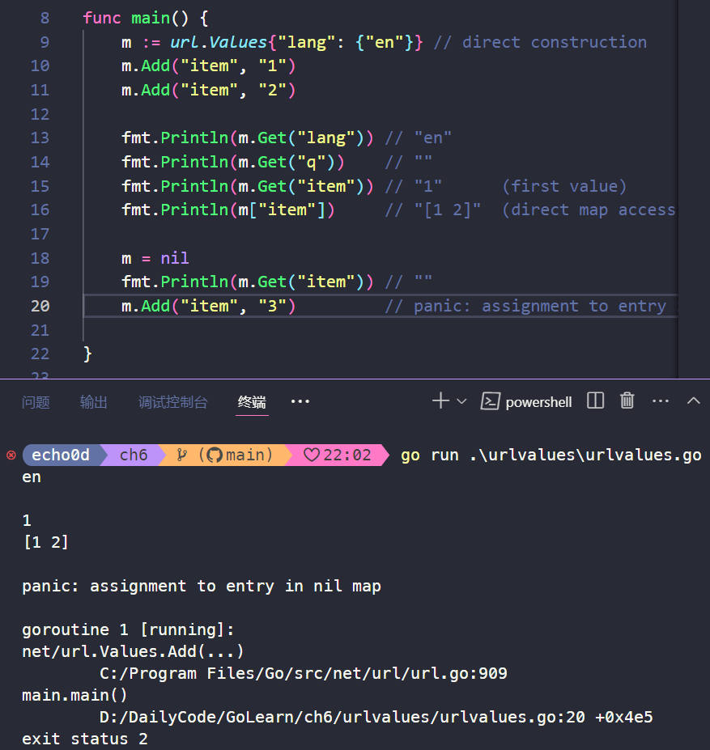

# 06. 方法

## 6.1. 方法声明

方法是与特定类型关联的函数

方法有一个参数，称为接收者（receiver），它位于方法名称之前，并指定了方法作用的类型。接收者可以是任何类型，包括非结构体类型。

方法使用点符号将方法与实例进行关联。方法可以访问和修改其接收者类型的数据，这使得方法能够实现面向对象的特性，例如封装和封装的数据。


```go
package geometry

import "math"

type Point struct{ X, Y float64 }

// traditional function
func Distance(p, q Point) float64 {
    return math.Hypot(q.X-p.X, q.Y-p.Y)
}

// same thing, but as a method of the Point type
func (p Point) Distance(q Point) float64 {
    return math.Hypot(q.X-p.X, q.Y-p.Y)
}

```

在Go语言中，并不会像其它语言那样用this或者self作为接收器，可以任意的选择接收器的名字。命名方式可以使用其类型的第一个字母，比如这里使用了Point的首字母p。

调用方式举例：

```go
p := Point{1, 2}
q := Point{4, 6}
fmt.Println(Distance(p, q)) // "5", function call
fmt.Println(p.Distance(q))  // "5", method call
```

可以看到，上面的两个函数调用都是`Distance`，但是却没有发生冲突。第一个`Distance`的调用实际上用的是包级别的函数`geometry.Distance`，而第二个则是使用刚刚声明的Point，调用的是Point类型下声明的`Point.Distance`方法。

这种`p.Distance`的表达式叫做选择器，因为他会选择合适的对应p这个对象的`Distance`方法来执行。选择器也会被用来选择一个struct类型的字段，比如`p.X`。由于方法和字段都是在同一命名空间，所以如果我们在这里声明一个`X`方法的话，编译器会报错，因为在调用`p.X`时会有歧义。

```go
// A Path is a journey connecting the points with straight lines.
type Path []Point

// Distance returns the distance traveled along the path.
func (path Path) Distance() float64 {
	sum := 0.0
	for i := range path {
		if i > 0 {
			sum += path[i-1].Distance(path[i])
		}
	}
	return sum
}

func main(){
    perim := Path{
		{1, 1},
		{5, 1},
		{5, 4},
		{1, 1},
	}
	fmt.Println(perim.Distance()) // "12"
}
```


在上面两个对Distance名字的方法的调用中，编译器会根据方法的名字以及接收器来决定具体调用的是哪一个函数。第一个例子中path[i-1]数组中的类型是Point，因此Point.Distance这个方法被调用；在第二个例子中perim的类型是Path，因此Distance调用的是Path.Distance。

方法比之函数的一些好处：方法名可以简短。当我们在包外调用的时候这种好处就会被放大，因为我们可以使用这个短名字，而可以省略掉包的名字，下面是例子：

```Go
import "ch6/geometry"

perim := geometry.Path{{1, 1}, {5, 1}, {5, 4}, {1, 1}}
fmt.Println(geometry.PathDistance(perim)) // "12", standalone function
fmt.Println(perim.Distance())             // "
```

## 6.2. 基于指针对象的方法

当调用一个函数时，会对其每一个参数值进行拷贝，如果一个函数需要更新一个变量，或者函数的其中一个参数实在太大我们希望能够避免进行这种默认的拷贝，就需要用到指针了。

```go
func (p *Point) ScaleBy(factor float64) {
    p.X *= factor
    p.Y *= factor
}

```

想要调用指针类型方法`(*Point).ScaleBy`，只要提供一个Point类型的指针即可，像下面这样。

```go
r := &Point{1, 2}
r.ScaleBy(2)
fmt.Println(*r) // "{2, 4}"
```

或者这样：

```go
p := Point{1, 2}
pptr := &p
pptr.ScaleBy(2)
fmt.Println(p) // "{2, 4}"
```

或者这样:

```go
p := Point{1, 2}
(&p).ScaleBy(2)
fmt.Println(p) // "{2, 4}"
```

不过后面两种方法有些笨拙。幸运的是，go语言本身在这种地方会帮到我们。如果接收器p是一个Point类型的变量，并且其方法需要一个Point指针作为接收器，我们可以用下面这种简短的写法：

```go
p.ScaleBy(2)
```

编译器会隐式地帮我们用&p去调用ScaleBy这个方法。这种简写方法只适用于“变量”，包括struct里的字段比如p.X，以及array和slice内的元素比如perim[0]。我们不能通过一个无法取到地址的接收器来调用指针方法，比如临时变量的内存地址就无法获取得到：

```go
Point{1, 2}.ScaleBy(2) // compile error: can't take address of Point literal
```

**译注：** 作者这里说的比较绕，其实有两点：

1. 不管你的method的receiver是指针类型还是非指针类型，都是可以通过指针/非指针类型进行调用的，编译器会帮你做类型转换。
2. 在声明一个method的receiver该是指针还是非指针类型时，你需要考虑两方面的因素，第一方面是这个对象本身是不是特别大，如果声明为非指针变量时，调用会产生一次拷贝；第二方面是如果你用指针类型作为receiver，那么你一定要注意，这种指针类型指向的始终是一块内存地址，就算你对其进行了拷贝。

### 6.2.1. nil也是合法的接收器类型

就像一些函数允许nil指针作为参数一样，方法理论上也可以用nil指针作为其接收器，尤其当nil对于对象来说是合法的零值时，比如map或者slice。

```go
m := url.Values{"lang": {"en"}} // direct construction
m.Add("item", "1")
m.Add("item", "2")

fmt.Println(m.Get("lang")) // "en"
fmt.Println(m.Get("q"))    // ""
fmt.Println(m.Get("item")) // "1"      (first value)
fmt.Println(m["item"])     // "[1 2]"  (direct map access)

m = nil
fmt.Println(m.Get("item")) // ""
m.Add("item", "3")         // panic: assignment to entry in nil map

```




对Get的最后一次调用中，nil接收器的行为即是一个空map的行为。我们可以等价地将这个操作写成`Value(nil).Get("item")`，但是如果你直接写`nil.Get("item")`的话是无法通过编译的，因为nil的字面量编译器无法判断其准确类型。所以相比之下，最后的那行`m.Add`的调用就会产生一个panic，因为他尝试更新一个空map。

### **评论区总结：**

> 1. 按值传递，调用函数时会复制该对象与传递函数形参，在函数内部修改该对象需要通过return来返回（否则将只相当于函数内部的临时变量）
> 2. 按指针传递，调用函数时将传递对象指针，然后传递函数形参，在函数内部的修改就是对指针指向的内存的修改。

## 6.3. 通过嵌入结构体来扩展类型

### 嵌入结构体

```go
type Point struct{ X, Y float64 }

type ColoredPoint struct {
	Point
	Color color.RGBA
}

func main() {
	var cp ColoredPoint
	cp.X = 1
	fmt.Println(cp.Point.X) // "1"
	cp.Point.Y = 2
	fmt.Println(cp.Y) // "2"
}

```

struct内嵌可以使我们在定义ColoredPoint时得到一种句法上的简写形式，并使其包含Point类型所具有的一切字段，然后再定义一些自己的。调用的时候可以直接认为通过嵌入的字段就是ColoredPoint自身的字段，而完全不需要在调用时指出Point。

### 嵌入结构体类型当作接收器

对于Point中的方法我们也有类似的用法，我们可以把ColoredPoint类型当作接收器来调用Point里的方法，即使ColoredPoint里没有声明这些方法：

```go
func (p Point) Distance(q Point) float64 {
	return math.Hypot(q.X-p.X, q.Y-p.Y)
}

func (p *Point) ScaleBy(factor float64) {
	p.X *= factor
	p.Y *= factor
}
func main() {
	red := color.RGBA{255, 0, 0, 255}
	blue := color.RGBA{0, 0, 255, 255}
	var p = ColoredPoint{Point{1, 1}, red}
	var q = ColoredPoint{Point{5, 4}, blue}
	// NOTE: 可以把ColoredPoint类型当作接收器来调用Point里的方法，即使ColoredPoint里没有声明这些方法
	fmt.Println(p.Distance(q.Point)) // "5"
	p.ScaleBy(2)
	q.ScaleBy(2)
	fmt.Println(p.Distance(q.Point)) // "10"
}
```

Point类的方法也被引入了ColoredPoint。用这种方式，内嵌可以使我们定义字段特别多的复杂类型，我们可以将字段先按小类型分组，然后定义小类型的方法，之后再把它们组合起来。

一个ColoredPoint并不是一个Point，但他"has a"Point，并且它有从Point类里引入的Distance和ScaleBy方法。如果你喜欢从实现的角度来考虑问题，内嵌字段会指导编译器去生成额外的包装方法来委托已经声明好的方法，和下面的形式是等价的：

```go
func (p ColoredPoint) Distance(q Point) float64 {
    return p.Point.Distance(q)
}

func (p *ColoredPoint) ScaleBy(factor float64) {
    p.Point.ScaleBy(factor)
}
```

当Point.Distance被第一个包装方法调用时，它的接收器值是p.Point，而不是p。

### 在type中内嵌的匿名字段可以是某type的指针

在类型中内嵌的匿名字段也可能是一个命名类型的指针，这种情况下字段和方法会被间接地引入到当前的类型中

```go
type ColoredPoint struct {
    *Point
    Color color.RGBA
}

p := ColoredPoint{&Point{1, 1}, red}
q := ColoredPoint{&Point{5, 4}, blue}
fmt.Println(p.Distance(*q.Point)) // "5"
q.Point = p.Point                 // p and q now share the same Point
p.ScaleBy(2)
fmt.Println(*p.Point, *q.Point) // "{2 2} {2 2}"

```

### 一个struct类型可以有多个匿名字段

一个struct类型也可能会有多个匿名字段。我们将ColoredPoint定义为下面这样：

```go
type ColoredPoint struct {
    Point
    color.RGBA
}
```

然后这种类型的值便会拥有Point和RGBA类型的所有方法，以及直接定义在ColoredPoint中的方法。


## 6.4. 方法值和方法表达式

如下，distanceFromP叫方法值，本质是一个函数，`var distanceFromP func(q Point) float64 = p. Distance`

```go
	p := Point{1, 2}
	q := Point{4, 6}
	distanceFromP := p.Distance        // method value
	fmt.Println(distanceFromP(q))      // "5"
	var origin Point                   // {0, 0}
	fmt.Println(distanceFromP(origin)) // "2.23606797749979", sqrt(5)
```

这样写会更简短点。

如下distance是一个方法表达式，distance是一个方法表达式，`var distance func(Point, Point) float64 = Point. Distance`。写作`type.func`或者`(*type).func`，会返回一个函数“值”，这种函数会将其第一个参数用作接收器，

```go
p := Point{1, 2}
q := Point{4, 6}

distance := Point.Distance   // method expression
fmt.Println(distance(p, q))  // "5" //这里两个参数，第一个p是原本的接收器，后面的是原来方法的输入值
fmt.Printf("%T\n", distance) // "func(Point, Point) float64"
```


## 6.5. 示例：Bit数组

后面太难看进去了，以后再说