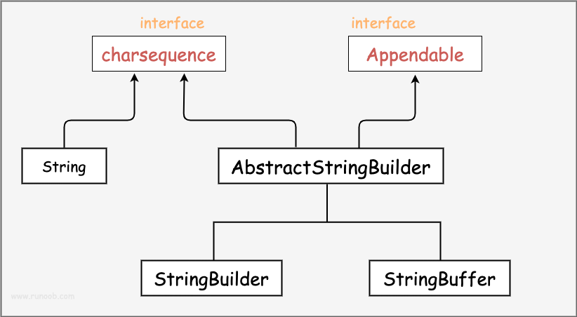

# 1-Java学习-基础笔记

> [Java 教程 | 菜鸟教程 (runoob.com)](https://www.runoob.com/java/java-tutorial.html)

## 基本概念

一个 Java 程序可以认为是一系列对象的集合，而这些对象通过调用彼此的方法来协同工作。Java 作为一种面向对象的编程语言，支持以下基本概念：

1、**类（Class）**：

- 定义对象的蓝图，包括属性和方法。
- 示例：`public class Car { ... }`

**2、对象（Object）**：

- 类的实例，具有状态和行为。
- 示例：`Car myCar = new Car();`

**3、继承（Inheritance）**：

- 一个类可以继承另一个类的属性和方法。
- 示例：`public class Dog extends Animal { ... }`

**4、封装（Encapsulation）**：

- 将对象的状态（字段）私有化，通过公共方法访问。

- 示例：

  ```
  private String name; 
  public String getName() { return name; }
  ```

**5、多态（Polymorphism）**：

- 对象可以表现为多种形态，主要通过方法重载和方法重写实现。
- 示例：
  - 方法重载：`public int add(int a, int b) { ... }` 和 `public double add(double a, double b) { ... }`
  - 方法重写：`@Override public void makeSound() { System.out.println("Meow"); }`

**6、抽象（Abstraction）**：

- 使用抽象类和接口来定义必须实现的方法，不提供具体实现。
- 示例：
  - 抽象类：`public abstract class Shape { abstract void draw(); }`
  - 接口：`public interface Animal { void eat(); }`

**7、接口（Interface）**：

- 定义类必须实现的方法，支持多重继承。
- 示例：`public interface Drivable { void drive(); }`

**8、方法（Method）**：

- 定义类的行为，包含在类中的函数。
- 示例：`public void displayInfo() { System.out.println("Info"); }`

**9、方法重载（Method Overloading）**：

- 同一个类中可以有多个同名的方法，但参数不同。

- 示例：

  ```
  public class MathUtils {
      public int add(int a, int b) {
          return a + b;
      }
  
      public double add(double a, double b) {
          return a + b;
      }
  }
  ```

------

下面看一个简单的 Java 程序，它将输出字符串 *Hello World*

```go
public class HelloWorld {
    /* 第一个Java程序
     * 它将输出字符串 Hello World
     */
    public static void main(String[] args) {
        System.out.println("Hello World"); // 输出 Hello World
    }
}
```


下面将逐步介绍如何保存、编译以及运行这个程序：

- 打开代码编辑器，把上面的代码添加进去；
- 把文件名保存为：`HelloWorld.java`；
- 打开 cmd 命令窗口，进入目标文件所在的位置，假设是 `C:\`
- 在命令行窗口输入` javac HelloWorld.java` 按下回车键编译代码。如果代码没有错误，cmd 命令提示符会进入下一行（假设环境变量都设置好了）。
- 再键输入`java HelloWorld`按下回车键就可以运行程序了

你将会在窗口看到 Hello World

```
$ javac HelloWorld.java
$ java HelloWorld 
Hello World
```

## 注释

单行注释以双斜杠 `//` 开始

```java
// 这是一个单行注释
int x = 10; // 初始化一个变量x为10
```

多行注释以 `/*`开始，以`*/`结束：

```java
/*
这是一个多行注释
可以用来注释多行代码
*/
int y = 20; // 初始化一个变量y为20
```

文档注释以 `/**` 开始，以 `*/` 结束，通常出现在类、方法、字段等的声明前面，用于生成代码文档，这种注释可以被工具提取并生成 API 文档，如 JavaDoc。

```java
/**
 * 这是一个文档注释示例
 * 它通常包含有关类、方法或字段的详细信息
 */
public class MyClass {
    // 类的成员和方法
}
```

文档注释的格式通常包含一些特定的标签，如 `@param`用于描述方法参数，`@return` 用于描述返回值，`@throws` 用于描述可能抛出的异常等等，这些标签有助于生成清晰的API文档，以便其他开发者能够更好地理解和使用你的代码。

## 对象和类

### Java中的对象

拿一条狗来举例，它的状态有：名字、品种、颜色，行为有：叫、摇尾巴和跑。

对比现实对象和软件对象，它们之间十分相似。

软件对象也有状态和行为。软件对象的状态就是属性，行为通过方法体现。

在软件开发中，方法操作对象内部状态的改变，对象的相互调用也是通过方法来完成。

### Java 中的类

类可以看成是创建 Java 对象的模板。


通过上图创建一个简单的类来理解下 Java 中类的定义：

```java
public class Dog {
    String breed;
    int size;
    String colour;
    int age;
 
    void eat() {
    }
 
    void run() {
    }
 
    void sleep(){
    }
 
    void name(){
    }
}
```

一个类可以包含以下类型变量：

- **局部变量**：在方法、构造方法或者语句块中定义的变量被称为局部变量。变量声明和初始化都是在方法中，方法结束后，变量就会自动销毁。
- **成员变量**：成员变量是定义在类中，方法体之外的变量。这种变量在创建对象的时候实例化。成员变量可以被类中方法、构造方法和特定类的语句块访问。
- **类变量**：类变量也声明在类中，方法体之外，但必须声明为 static 类型。

一个类可以拥有多个方法，在上面的例子中：`eat()`、`run()`、`sleep()` 和 `name()` 都是 `Dog`类的方法。

### 构造方法

每个类都有构造方法。如果没有显式地为类定义构造方法，Java 编译器将会为该类提供一个默认构造方法。

在创建一个对象的时候，至少要调用一个构造方法。构造方法的名称必须与类同名，一个类可以有多个构造方法。

下面是一个构造方法示例：

```java
public class Puppy{
    public Puppy(){
    }
 
    public Puppy(String name){
        // 这个构造器仅有一个参数：name
    }
}
```

### 创建对象

对象是根据类创建的。在Java中，使用关键字 new 来创建一个新的对象。创建对象需要以下三步：

- **声明**：声明一个对象，包括对象名称和对象类型。
- **实例化**：使用关键字 new 来创建一个对象。
- **初始化**：使用 new 创建对象时，会调用构造方法初始化对象。

下面是一个创建对象的例子：

```java
public class Puppy{
   public Puppy(String name){
      //这个构造器仅有一个参数：name
      System.out.println("小狗的名字是 : " + name ); 
   }
   public static void main(String[] args){
      // 下面的语句将创建一个Puppy对象
      Puppy myPuppy = new Puppy( "tommy" );
   }
}
```

编译并运行上面的程序，会打印出下面的结果：

```
小狗的名字是 : tommy
```

### 访问实例变量和方法

通过已创建的对象来访问成员变量和成员方法，如下所示：

```java
/* 实例化对象 */
Object referenceVariable = new Constructor();
/* 访问类中的变量 */
referenceVariable.variableName;
/* 访问类中的方法 */
referenceVariable.methodName();
```

使用 Object 类型声明变量只能在编译时访问 Object 类中的方法和属性，但在运行时，你可以通过强制类型转换将其转换为特定类型，以便访问特定类型的方法和属性。

下面的例子展示如何访问实例变量和调用成员方法：

```java
public class Puppy {
    private int age;
    private String name;
 
    // 构造器
    public Puppy(String name) {
        this.name = name;
        System.out.println("小狗的名字是 : " + name);
    }
 
    // 设置 age 的值
    public void setAge(int age) {
        this.age = age;
    }
 
    // 获取 age 的值
    public int getAge() {
        return age;
    }
 
    // 获取 name 的值
    public String getName() {
        return name;
    }
 
    // 主方法
    public static void main(String[] args) {
        // 创建对象
        Puppy myPuppy = new Puppy("Tommy");
 
        // 通过方法来设定 age
        myPuppy.setAge(2);
 
        // 调用另一个方法获取 age
        int age = myPuppy.getAge();
        System.out.println("小狗的年龄为 : " + age);
 
        // 也可以直接访问成员变量（通过 getter 方法）
        System.out.println("变量值 : " + myPuppy.getAge());
    }
}
```

编译并运行上面的程序，产生如下结果：

```
小狗的名字是 : tommy
小狗的年龄为 : 2
变量值 : 2
```

### 源文件声明规则

在本节的最后部分，我们将学习源文件的声明规则。当在一个源文件中定义多个类，并且还有import语句和package语句时，要特别注意这些规则。

- 一个源文件中只能有一个 public 类
- 一个源文件可以有多个非 public 类
- 源文件的名称应该和 public 类的类名保持一致。例如：源文件中 `public` 类的类名是 `Employee`，那么源文件应该命名为`Employee.java`。
- 如果一个类定义在某个包中，那么 `package` 语句应该在源文件的首行。
- 如果源文件包含 `import` 语句，那么应该放在 `package` 语句和类定义之间。如果没有 `package` 语句，那么 `import` 语句应该在源文件中最前面。
- `import` 语句和 `package` 语句对源文件中定义的所有类都有效。在同一源文件中，不能给不同的类不同的包声明。

类有若干种访问级别，并且类也分不同的类型：抽象类和 final 类等。除了上面提到的几种类型，Java 还有一些特殊的类，如：[内部类](https://www.runoob.com/java/java-inner-class.html)、[匿名类](https://www.runoob.com/java/java-anonymous-class.html)。

### Java 包

包主要用来对类和接口进行分类。当开发 Java 程序时，可能编写成百上千的类，因此很有必要对类和接口进行分类。

### import 语句

在 Java 中，如果给出一个完整的限定名，包括包名、类名，那么 Java 编译器就可以很容易地定位到源代码或者类。import 语句就是用来提供一个合理的路径，使得编译器可以找到某个类。

例如，下面的命令行将会命令编译器载入 `java_installation/java/io` 路径下的所有类

```
import java.io.*;
```

## 基本数据类型

### 内置数据类型

Java语言提供了八种基本类型。六种数字类型（四个整数型，两个浮点型），一种字符类型，还有一种布尔型。

实际上，JAVA中还存在另外一种基本类型 void，它也有对应的包装类 java.lang.Void，不过我们无法直接对它们进行操作。

下表列出了 Java 各个类型的默认值：

| **数据类型**               | **默认值** |
| :--------------------- | :------ |
| byte                   | 0       |
| short                  | 0       |
| int                    | 0       |
| long                   | 0L      |
| float                  | 0.0f    |
| double                 | 0.0d    |
| char                   | 'u0000' |
| String (or any object) | null    |
| boolean                | false   |

### 引用类型

- 在Java中，引用类型的变量非常类似于C/C++的指针。引用类型指向一个对象，指向对象的变量是引用变量。这些变量在声明时被指定为一个特定的类型，比如 Employee、Puppy 等。变量一旦声明后，类型就不能被改变了。
- 对象、数组都是引用数据类型。
- 所有引用类型的默认值都是null。
- 一个引用变量可以用来引用任何与之兼容的类型。
- 例子：Site site = new Site("Runoob")。

## Java 常量

常量在程序运行时是不能被修改的。

在 Java 中使用 final 关键字来修饰常量，声明方式和变量类似：

```
final double PI = 3.1415927;
```

虽然常量名也可以用小写，但为了便于识别，通常使用大写字母表示常量。

字面量可以赋给任何内置类型的变量。例如：

```
byte a = 68;
char a = 'A'
```

byte、int、long、和short都可以用十进制、16进制以及8进制的方式来表示。

当使用字面量的时候，前缀 **0** 表示 8 进制，而前缀 **0x** 代表 16 进制, 例如：

```
int decimal = 100;
int octal = 0144;
int hexa =  0x64;
```

和其他语言一样，Java的字符串常量也是包含在两个引号之间的字符序列。下面是字符串型字面量的例子：

```
"Hello World"
"two\nlines"
"\"This is in quotes\""
```

字符串常量和字符变量都可以包含任何 Unicode 字符。例如：

```
char a = '\u0001';
String a = "\u0001";
```

Java语言支持一些特殊的转义字符序列。

| 符号     | 字符含义                 |
| :------- | :----------------------- |
| `\n`     | 换行 (0x0a)              |
| `\r`     | 回车 (0x0d)              |
| `\f`     | 换页符(0x0c)             |
| `\b`     | 退格 (0x08)              |
| `\0`     | 空字符 (0x0)             |
| `\s`     | 空格 (0x20)              |
| `\t`     | 制表符                   |
| `\"`     | 双引号                   |
| `\'`     | 单引号                   |
| `\\`     | 反斜杠                   |
| `\ddd`   | 八进制字符 (ddd)         |
| `\uxxxx` | 16进制Unicode字符 (xxxx) |

------

## 自动类型转换

**整型、实型（常量）、字符型数据可以混合运算。运算中，不同类型的数据先转化为同一类型，然后进行运算。**

转换从低级到高级。

```
低  ------------------------------------>  高

byte,short,char—> int —> long—> float —> double 
```

数据类型转换必须满足如下规则：

- 1. 不能对boolean类型进行类型转换。

- 2. 不能把对象类型转换成不相关类的对象。

- 3. 在把容量大的类型转换为容量小的类型时必须使用强制类型转换。

- 4. 转换过程中可能导致溢出或损失精度，例如：

  ```
  int i =128;   
  byte b = (byte)i;
  ```

  因为 byte 类型是 8 位，最大值为127，所以当 int 强制转换为 byte 类型时，值 128 时候就会导致溢出。

- 5. 浮点数到整数的转换是通过舍弃小数得到，而不是四舍五入，例如：

  ```
  (int)23.7 == 23;        
  (int)-45.89f == -45
  ```

### 自动类型转换

必须满足转换前的数据类型的位数要低于转换后的数据类型，例如: short数据类型的位数为16位，就可以自动转换位数为32的int类型，同样float数据类型的位数为32，可以自动转换为64位的double类型。

```java
public class ZiDongLeiZhuan{
        public static void main(String[] args){
            char c1='a';//定义一个char类型
            int i1 = c1;//char自动类型转换为int
            System.out.println("char自动类型转换为int后的值等于"+i1);
            char c2 = 'A';//定义一个char类型
            int i2 = c2+1;//char 类型和 int 类型计算
            System.out.println("char类型和int计算后的值等于"+i2);
        }
}
```

运行结果为:

```
char自动类型转换为int后的值等于97
char类型和int计算后的值等于66
```

**解析：**c1 的值为字符 **a** ,查 ASCII 码表可知对应的 int 类型值为 97， A 对应值为 65，所以 **i2=65+1=66**。

### 强制类型转换

- 1. 条件是转换的数据类型必须是兼容的。

- 2. 格式：(type)value type是要强制类型转换后的数据类型 实例：

  ```java
  public class ForceTransform {
      public static void main(String[] args){
          int i1 = 123;
          byte b = (byte)i1;//强制类型转换为byte
          System.out.println("int强制类型转换为byte后的值等于"+b);
      }
  }
  ```

  运行结果：

  ```
  int强制类型转换为byte后的值等于123
  ```

### 隐含强制类型转换

- 整数的默认类型是 int。
- 小数默认是 double 类型浮点型，在定义 float 类型时必须在数字后面跟上 F 或者 f。

## 变量类型

在 Java 语言中，所有的变量在使用前必须声明。

声明变量的基本格式如下：

```java
type identifier [ = value][, identifier [= value] ...] ;
```

**格式说明：**

- type -- 数据类型。
- identifier -- 是变量名，可以使用逗号 **,** 隔开来声明多个同类型变量。

以下列出了一些变量的声明实例。注意有些包含了初始化过程。

```java
int a, b, c;         // 声明三个int型整数：a、 b、c
int d = 3, e = 4, f = 5; // 声明三个整数并赋予初值
byte z = 22;         // 声明并初始化 z
String s = "runoob";  // 声明并初始化字符串 s
double pi = 3.14159; // 声明了双精度浮点型变量 pi
char x = 'x';        // 声明变量 x 的值是字符 'x'。
```

Java 语言支持的变量类型有：

- **局部变量（Local Variables）：**局部变量是在方法、构造函数或块内部声明的变量，它们在声明的方法、构造函数或块执行结束后被销毁，局部变量在声明时需要初始化，否则会导致编译错误。

  ```java
  public void exampleMethod() {
      int localVar = 10; // 局部变量
      // ...
  }
  ```

- **实例变量（Instance Variables）：**实例变量是在类中声明，但在方法、构造函数或块之外，它们属于类的实例，每个类的实例都有自己的副本，如果不明确初始化，实例变量会被赋予默认值（数值类型为0，boolean类型为false，对象引用类型为null）。

  ```java
  public class ExampleClass {
      int instanceVar; // 实例变量
  }
  ```

- **静态变量或类变量（Class Variables）：**类变量是在类中用 static 关键字声明的变量，它们属于类而不是实例，所有该类的实例共享同一个类变量的值，类变量在类加载时被初始化，而且只初始化一次。

  ```java
  public class ExampleClass {
      static int classVar; // 类变量
  }
  ```

- **参数变量（Parameters）：**参数是方法或构造函数声明中的变量，用于接收调用该方法或构造函数时传递的值，参数变量的作用域只限于方法内部。

  ```java
  public void exampleMethod(int parameterVar) {
      // 参数变量
      // ...
  }
  ```

**常量和静态变量的区别**

常量也是与类相关的，但它是用 final 关键字修饰的变量，一旦被赋值就不能再修改。与静态变量不同的是，常量在编译时就已经确定了它的值，而静态变量的值可以在运行时改变。另外，常量通常用于存储一些固定的值，如数学常数、配置信息等，而静态变量通常用于存储可变的数据，如计数器、全局状态等。

总之，静态变量是与类相关的变量，具有唯一性和共享性，可以用于存储整个程序都需要使用的数据，但需要注意初始化时机和与常量的区别。

## 变量命名规则

**局部变量**

- 使用驼峰命名法。
- 应该以小写字母开头。
- 变量名应该是描述性的，能够清晰地表示其用途。

```
int myLocalVariable;
```

**实例变量（成员变量）**

- 使用驼峰命名法。
- 应该以小写字母开头。
- 变量名应该是描述性的，能够清晰地表示其用途。

```
private int myInstanceVariable;
```

**静态变量（类变量）**

- 使用驼峰命名法，应该以小写字母开头。
- 通常也可以使用大写蛇形命名法，全大写字母，单词之间用下划线分隔。
- 变量名应该是描述性的，能够清晰地表示其用途。

```
// 使用驼峰命名法
public static int myStaticVariable;

// 使用大写蛇形命名法
public static final int MAX_SIZE = 100;
```

**常量**

- 使用全大写字母，单词之间用下划线分隔。
- 常量通常使用 `final` 修饰。

```
public static final double PI = 3.14;
```

**参数**

- 使用驼峰命名法。
- 应该以小写字母开头。
- 参数名应该是描述性的，能够清晰地表示其用途。

```
public void myMethod(int myParameter) {
    // 方法体
}
```

**类名**

- 使用驼峰命名法。
- 应该以大写字母开头。
- 类名应该是描述性的，能够清晰地表示其用途。

```
public class MyClass {
    // 类的成员和方法
}
```

## Java 运算符

### 算术运算符

算术运算符用在数学表达式中，它们的作用和在数学中的作用一样。下表列出了所有的算术运算符。

表格中的实例假设整数变量A的值为10，变量B的值为20：

| 操作符 | 描述                              | 例子                               |
| :----- | :-------------------------------- | :--------------------------------- |
| +      | 加法 - 相加运算符两侧的值         | A + B 等于 30                      |
| -      | 减法 - 左操作数减去右操作数       | A – B 等于 -10                     |
| *      | 乘法 - 相乘操作符两侧的值         | A * B等于200                       |
| /      | 除法 - 左操作数除以右操作数       | B / A等于2                         |
| ％     | 取余 - 左操作数除以右操作数的余数 | B%A等于0                           |
| ++     | 自增: 操作数的值增加1             | B++ 或 ++B 等于 21（区别详见下文） |
| --     | 自减: 操作数的值减少1             | B-- 或 --B 等于 19（区别详见下文） |

### 关系运算符

下表为Java支持的关系运算符

表格中的实例整数变量A的值为10，变量B的值为20：

| 运算符 | 描述                                                         | 例子             |
| :----- | :----------------------------------------------------------- | :--------------- |
| ==     | 检查如果两个操作数的值是否相等，如果相等则条件为真。         | （A == B）为假。 |
| !=     | 检查如果两个操作数的值是否相等，如果值不相等则条件为真。     | (A != B) 为真。  |
| >      | 检查左操作数的值是否大于右操作数的值，如果是那么条件为真。   | （A> B）为假。   |
| <      | 检查左操作数的值是否小于右操作数的值，如果是那么条件为真。   | （A <B）为真。   |
| >=     | 检查左操作数的值是否大于或等于右操作数的值，如果是那么条件为真。 | （A> = B）为假。 |
| <=     | 检查左操作数的值是否小于或等于右操作数的值，如果是那么条件为真。 | （A <= B）为真。 |

### 位运算符

Java定义了位运算符，应用于整数类型(int)，长整型(long)，短整型(short)，字符型(char)，和字节型(byte)等类型。

位运算符作用在所有的位上，并且按位运算。假设a = 60，b = 13;它们的二进制格式表示将如下：

```
A = 0011 1100
B = 0000 1101
-----------------
A&B = 0000 1100
A | B = 0011 1101
A ^ B = 0011 0001
~A= 1100 0011
```

下表列出了位运算符的基本运算，假设整数变量 A 的值为 60 和变量 B 的值为 13：

| 操作符 | 描述                                                         | 例子                           |
| :----- | :----------------------------------------------------------- | :----------------------------- |
| ＆     | 如果相对应位都是1，则结果为1，否则为0                        | （A＆B），得到12，即0000 1100  |
| \|     | 如果相对应位都是 0，则结果为 0，否则为 1                     | （A \| B）得到61，即 0011 1101 |
| ^      | 如果相对应位值相同，则结果为0，否则为1                       | （A ^ B）得到49，即 0011 0001  |
| 〜     | 按位取反运算符翻转操作数的每一位，即0变成1，1变成0。         | （〜A）得到-61，即1100 0011    |
| <<     | 按位左移运算符。左操作数按位左移右操作数指定的位数。         | A << 2得到240，即 1111 0000    |
| >>     | 按位右移运算符。左操作数按位右移右操作数指定的位数。         | A >> 2得到15即 1111            |
| >>>    | 按位右移补零操作符。左操作数的值按右操作数指定的位数右移，移动得到的空位以零填充。 | A>>>2得到15即0000 1111         |

### 逻辑运算符

下表列出了逻辑运算符的基本运算，假设布尔变量A为真，变量B为假

| 操作符 | 描述                                                         | 例子                |
| :----- | :----------------------------------------------------------- | :------------------ |
| &&     | 称为逻辑与运算符。当且仅当两个操作数都为真，条件才为真。     | （A && B）为假。    |
| \| \|  | 称为逻辑或操作符。如果任何两个操作数任何一个为真，条件为真。 | （A \| \| B）为真。 |
| ！     | 称为逻辑非运算符。用来反转操作数的逻辑状态。如果条件为true，则逻辑非运算符将得到false。 | ！（A && B）为真。  |

### 赋值运算符

下面是Java语言支持的赋值运算符：

| 操作符  | 描述                                                         | 例子                                     |
| :------ | :----------------------------------------------------------- | :--------------------------------------- |
| =       | 简单的赋值运算符，将右操作数的值赋给左侧操作数               | C = A + B将把A + B得到的值赋给C          |
| + =     | 加和赋值操作符，它把左操作数和右操作数相加赋值给左操作数     | C + = A等价于C = C + A                   |
| - =     | 减和赋值操作符，它把左操作数和右操作数相减赋值给左操作数     | C - = A等价于C = C - A                   |
| * =     | 乘和赋值操作符，它把左操作数和右操作数相乘赋值给左操作数     | C * = A等价于C = C * A                   |
| / =     | 除和赋值操作符，它把左操作数和右操作数相除赋值给左操作数     | C / = A，C 与 A 同类型时等价于 C = C / A |
| （％）= | 取模和赋值操作符，它把左操作数和右操作数取模后赋值给左操作数 | C％= A等价于C = C％A                     |
| << =    | 左移位赋值运算符                                             | C << = 2等价于C = C << 2                 |
| >> =    | 右移位赋值运算符                                             | C >> = 2等价于C = C >> 2                 |
| ＆=     | 按位与赋值运算符                                             | C＆= 2等价于C = C＆2                     |
| ^ =     | 按位异或赋值操作符                                           | C ^ = 2等价于C = C ^ 2                   |
| \| =    | 按位或赋值操作符                                             | C \| = 2等价于C = C \| 2                 |

### 条件运算符（?:）

条件运算符也被称为三元运算符。该运算符有3个操作数，并且需要判断布尔表达式的值。该运算符的主要是决定哪个值应该赋值给变量。

```
variable x = (expression) ? value if true : value if false
```

### instanceof 运算符

该运算符用于操作对象实例，检查该对象是否是一个特定类型（类类型或接口类型）。

instanceof运算符使用格式如下：

```
( Object reference variable ) instanceof  (class/interface type)
```

如果运算符左侧变量所指的对象，是操作符右侧类或接口(class/interface)的一个对象，那么结果为真。

下面是一个例子：

```
String name = "James";
boolean result = name instanceof String; // 由于 name 是 String 类型，所以返回真
```

如果被比较的对象兼容于右侧类型，该运算符仍然返回 true。

## 循环结构

### while 循环

while是最基本的循环，它的结构为：

```java
while( 布尔表达式 ) {
  //循环内容
}
```

只要布尔表达式为 true，循环就会一直执行下去。

### do…while 循环

对于 while 语句而言，如果不满足条件，则不能进入循环。但有时候我们需要即使不满足条件，也至少执行一次。

do…while 循环和 while 循环相似，不同的是，do…while 循环至少会执行一次。

```java
do {
       //代码语句
}while(布尔表达式);
```

**注意：**布尔表达式在循环体的后面，所以语句块在检测布尔表达式之前已经执行了。 如果布尔表达式的值为 true，则语句块一直执行，直到布尔表达式的值为 false。

### for循环

虽然所有循环结构都可以用 while 或者 do...while表示，但 Java 提供了另一种语句 —— for 循环，使一些循环结构变得更加简单。

for循环执行的次数是在执行前就确定的。语法格式如下：

```java
for(初始化; 布尔表达式; 更新) {
    //代码语句
}
```

关于 for 循环有以下几点说明：

- 最先执行初始化步骤。可以声明一种类型，但可初始化一个或多个循环控制变量，也可以是空语句。
- 然后，检测布尔表达式的值。如果为 true，循环体被执行。如果为false，循环终止，开始执行循环体后面的语句。
- 执行一次循环后，更新循环控制变量。
- 再次检测布尔表达式。循环执行上面的过程。

### 增强 for 循环

语法格式如下:

```java
for(声明语句 : 表达式)
{
   //代码句子
}
```

**声明语句：**声明新的局部变量，该变量的类型必须和数组元素的类型匹配。其作用域限定在循环语句块，其值与此时数组元素的值相等。

**表达式：**表达式是要访问的数组名，或者是返回值为数组的方法。

### break 关键字

break 主要用在循环语句或者 switch 语句中，用来跳出整个语句块。

break 跳出最里层的循环，并且继续执行该循环下面的语句。

break 的用法很简单，就是循环结构中的一条语句：

```
break;
```

### continue 关键字

continue 适用于任何循环控制结构中。作用是让程序立刻跳转到下一次循环的迭代。

在 for 循环中，continue 语句使程序立即跳转到更新语句。

在 while 或者 do…while 循环中，程序立即跳转到布尔表达式的判断语句。

continue 就是循环体中一条简单的语句：

```
continue;
```

## 条件语句

### if...else语句

```java
if(布尔表达式)
{
   //如果布尔表达式为true将执行的语句
}
```

或者

```java
public class Test {
 
   public static void main(String args[]){
      int x = 30;
 
      if( x < 20 ){
         System.out.print("这是 if 语句");
      }else{
         System.out.print("这是 else 语句");
      }
   }
}
```

### if...else if...else 语句

if 语句后面可以跟 else if…else 语句，这种语句可以检测到多种可能的情况。

使用 if，else if，else 语句的时候，需要注意下面几点：

- if 语句至多有 1 个 else 语句，else 语句在所有的 else if 语句之后。
- if 语句可以有若干个 else if 语句，它们必须在 else 语句之前。
- 一旦其中一个 else if 语句检测为 true，其他的 else if 以及 else 语句都将跳过执行。

```java
if(布尔表达式 1){
   //如果布尔表达式 1的值为true执行代码
}else if(布尔表达式 2){
   //如果布尔表达式 2的值为true执行代码
}else if(布尔表达式 3){
   //如果布尔表达式 3的值为true执行代码
}else {
   //如果以上布尔表达式都不为true执行代码
}
```


## switch case 语句

**switch case 执行时，一定会先进行匹配，匹配成功返回当前 case 的值，再根据是否有 break，判断是否继续输出，或是跳出判断。**

```java
switch(expression){
    case value :
       //语句
       break; //可选
    case value :
       //语句
       break; //可选
    //你可以有任意数量的case语句
    default : //可选
       //语句
}
```


## Number & Math 类

一般地，当需要使用数字的时候，我们通常使用内置数据类型，如：**byte、int、long、double** 等。然而，在实际开发过程中，我们经常会遇到需要使用对象，而不是内置数据类型的情形。为了解决这个问题，Java 语言为每一个内置数据类型提供了对应的包装类。所有的包装类**（Integer、Long、Byte、Double、Float、Short）**都是抽象类 Number 的子类。

| 包装类    | 基本数据类型 |
| :-------- | :----------- |
| Boolean   | boolean      |
| Byte      | byte         |
| Short     | short        |
| Integer   | int          |
| Long      | long         |
| Character | char         |
| Float     | float        |
| Double    | double       |


这种由编译器特别支持的包装称为装箱，所以当内置数据类型被当作对象使用的时候，编译器会把内置类型装箱为包装类。相似的，编译器也可以把一个对象拆箱为内置类型。Number 类属于 java.lang 包。

Java 的 Math 包含了用于执行基本数学运算的属性和方法，如初等指数、对数、平方根和三角函数。Math 的方法都被定义为 static 形式，通过 Math 类可以在主函数中直接调用。

```java
public class Test {  
    public static void main (String []args)  
    {  
        System.out.println("90 度的正弦值：" + Math.sin(Math.PI/2));  
        System.out.println("0度的余弦值：" + Math.cos(0));  
        System.out.println("60度的正切值：" + Math.tan(Math.PI/3));  
        System.out.println("1的反正切值： " + Math.atan(1));  
        System.out.println("π/2的角度值：" + Math.toDegrees(Math.PI/2));  
        System.out.println(Math.PI);  
    }  
}
```

下面的表中列出的是 Number & Math 类常用的一些方法：

| 序号 | 方法与描述                                                   |
| :--- | :----------------------------------------------------------- |
| 1    | `xxxValue()`将 Number 对象转换为xxx数据类型的值并返回。      |
| 2    | `compareTo()`将number对象与参数比较。                        |
| 3    | `equals()`判断number对象是否与参数相等。                     |
| 4    | `valueOf()` 返回一个 Number 对象指定的内置数据类型           |
| 5    | `toString()` 以字符串形式返回值。                            |
| 6    | `parseInt()`将字符串解析为int类型。                          |
| 7    | `abs()` 返回参数的绝对值。                                   |
| 8    | `ceil()` 返回大于等于( >= )给定参数的的最小整数，类型为双精度浮点型。 |
| 9    | `floor()` 返回小于等于（<=）给定参数的最大整数 。            |
| 10   | `rint()` 返回与参数最接近的整数。返回类型为double。          |
| 11   | `round()` 它表示**四舍五入**，算法为 **Math.floor(x+0.5)**，即将原来的数字加上 0.5 后再向下取整，所以，Math.round(11.5) 的结果为12，Math.round(-11.5) 的结果为-11。 |
| 12   | `min()` 返回两个参数中的最小值。                             |
| 13   | `max()` 返回两个参数中的最大值。                             |
| 14   | `exp()` 返回自然数底数e的参数次方。                          |
| 15   | `log()` 返回参数的自然数底数的对数值。                       |
| 16   | `pow()` 返回第一个参数的第二个参数次方。                     |
| 17   | `sqrt()` 求参数的算术平方根。                                |
| 18   | `sin()` 求指定double类型参数的正弦值。                       |
| 19   | `cos()` 求指定double类型参数的余弦值。                       |
| 20   | `tan()` 求指定double类型参数的正切值。                       |
| 21   | `asin()`求指定double类型参数的反正弦值。                     |
| 22   | `acos()` 求指定double类型参数的反余弦值。                    |
| 23   | `atan()` 求指定double类型参数的反正切值。                    |
| 24   | `atan2()` 将笛卡尔坐标转换为极坐标，并返回极坐标的角度值。   |
| 25   | `toDegrees()` 将参数转化为角度。                             |
| 26   | `toRadians()` 将角度转换为弧度。                             |
| 27   | `random()` 返回一个随机数。                                  |

## Character 类

Character 类用于对单个字符进行操作。

Character 类在对象中包装一个基本类型 **char** 的值

```java
char ch = 'a';
 
// Unicode 字符表示形式
char uniChar = '\u039A'; 
 
// 字符数组
char[] charArray ={ 'a', 'b', 'c', 'd', 'e' };
```

Java语言为内置数据类型char提供了包装类Character类。

Character类提供了一系列方法来操纵字符。你可以使用Character的构造方法创建一个Character类对象，例如：

```java
Character ch = new Character('a');
```

在某些情况下，Java编译器会自动创建一个Character对象。例如，将一个char类型的参数传递给需要一个Character类型参数的方法时，那么编译器会自动地将char类型参数转换为Character对象。 这种特征称为装箱，反过来称为拆箱。

```java
// 原始字符 'a' 装箱到 Character 对象 ch 中
Character ch = 'a';
 
// 原始字符 'x' 用 test 方法装箱
// 返回拆箱的值到 'c'
char c = test('x');
```

### 转义序列

前面有反斜杠（\）的字符代表转义字符，它对编译器来说是有特殊含义的。

下面列表展示了Java的转义序列：

| 转义序列 | 描述                     |
| :------- | :----------------------- |
| \t       | 在文中该处插入一个tab键  |
| \b       | 在文中该处插入一个后退键 |
| \n       | 在文中该处换行           |
| \r       | 在文中该处插入回车       |
| \f       | 在文中该处插入换页符     |
| \'       | 在文中该处插入单引号     |
| \"       | 在文中该处插入双引号     |
| \\       | 在文中该处插入反斜杠     |

当打印语句遇到一个转义序列时，编译器可以正确地对其进行解释。以下实例转义双引号并输出：

```java
public class Test {
 
   public static void main(String[] args) {
      System.out.println("访问\"菜鸟教程!\"");
   }
}
```

### Character 方法

| 方法与描述       |                                         |
| :--------------- | --------------------------------------- |
| `isLetter()`     | 是否是一个字母                          |
| `isDigit()`      | 是否是一个数字字符                      |
| `isWhitespace()` | 是否是一个空白字符                      |
| `isUpperCase()`  | 是否是大写字母                          |
| `isLowerCase() ` | 是否是小写字母                          |
| `toUpperCase()`  | 指定字母的大写形式                      |
| `toLowerCase()`  | 指定字母的小写形式                      |
| `toString()`     | 返回字符的字符串形式，字符串的长度仅为1 |

## String 类

Java 提供了 String 类来创建和操作字符串。

### 创建字符串

```java
// 在代码中遇到字符串常量时，这里的值是 "Runoob"，编译器会使用该值创建一个 String 对象。
String str = "Runoob";

// 或者使用构造函数创建字符串
String str2=new String("Runoob");
```

String 创建的字符串存储在公共池中，而 new 创建的字符串对象在堆上：

```java
String s1 = "Runoob";              // String 直接创建
String s2 = "Runoob";              // String 直接创建
String s3 = s1;                    // 相同引用
String s4 = new String("Runoob");   // String 对象创建
String s5 = new String("Runoob");   // String 对象创建
```


String 类有 11 种构造方法，这些方法提供不同的参数来初始化字符串，比如提供一个字符数组参数:

```java
public class StringDemo{
   public static void main(String args[]){
      char[] helloArray = { 'r', 'u', 'n', 'o', 'o', 'b'};
      String helloString = new String(helloArray);  
      System.out.println( helloString );
   }
}
```

> **注意:**String 类是不可改变的，所以你一旦创建了 String 对象，那它的值就无法改变了
>
> 如果需要对字符串做很多修改，那么应该选择使用`StringBuffer` & `StringBuilder` 类

### 字符串长度

用于获取有关对象的信息的方法称为访问器方法。String 类的一个访问器方法是 `length()` 方法，它返回字符串对象包含的字符数。

```java
		String site = "www.runoob.com";
        int len = site.length();
```

### 连接字符串

```java
// 使用concat() 方法
string1.concat(string2);
// 使用加号
string1 + string2
```

### 创建格式化字符串

我们知道输出格式化数字可以使用 `printf()` 和 `format()` 方法。`String` 类使用静态方法 `format()` 返回一个`String` 对象而不是 `PrintStream` 对象。

`String` 类的静态方法 `format()` 能用来创建可复用的格式化字符串，而不仅仅是用于一次打印输出。

```java
System.out.printf("浮点型变量的值为 " +
                  "%f, 整型变量的值为 " +
                  " %d, 字符串变量的值为 " +
                  "is %s", floatVar, intVar, stringVar);
```

或者

```java
String fs;
fs = String.format("浮点型变量的值为 " +
                   "%f, 整型变量的值为 " +
                   " %d, 字符串变量的值为 " +
                   " %s", floatVar, intVar, stringVar);
```

### String 方法

[String (Java SE 11 & JDK 11 ) (runoob.com)](https://www.runoob.com/manual/jdk11api/java.base/java/lang/String.html)

## StringBuffer 和 StringBuilder 类

当对字符串进行修改的时候，需要使用 StringBuffer 和 StringBuilder 类。

和 String 类不同的是，StringBuffer 和 StringBuilder 类的对象能够被多次的修改，并且不产生新的未使用对象。



* 在使用 StringBuffer 类时，每次都会对 StringBuffer 对象本身进行操作，而不是生成新的对象，所以如果需要对字符串进行修改推荐使用 StringBuffer。
* StringBuilder 类在 Java 5 中被提出，它和 StringBuffer 之间的最大不同在于 StringBuilder 的方法不是线程安全的（不能同步访问）。
* 由于 StringBuilder 相较于 StringBuffer 有速度优势，所以多数情况下建议使用 StringBuilder 类。

```java
public class RunoobTest{
    public static void main(String args[]){
        StringBuilder sb = new StringBuilder(10);
        sb.append("Runoob..");
        System.out.println(sb);  
        sb.append("!");
        System.out.println(sb); 
        sb.insert(8, "Java");
        System.out.println(sb); 
        sb.delete(5,8);
        System.out.println(sb);  
    }
}
```

以上实例编译运行结果如下：

```
Runoob..
Runoob..!
Runoob..Java!
RunooJava!
```


更多内容：

- StringBuffer 类：https://www.runoob.com/manual/jdk11api/java.base/java/lang/StringBuffer.html
- StringBuilder 类：https://www.runoob.com/manual/jdk11api/java.base/java/lang/StringBuilder.html

## 数组

### 声明数组变量

```java
dataType[] arrayRefVar;   // 首选的方法
 
或
 
dataType arrayRefVar[];  // 效果相同，但不是首选方法，这样是C语言的风格
```

### 创建数组

Java语言使用new操作符来创建数组，语法如下：

```
arrayRefVar = new dataType[arraySize];
```

上面的语法语句做了两件事：

- 一、使用 `dataType[arraySize]` 创建了一个数组。
- 二、把新创建的数组的引用赋值给变量 `arrayRefVar`。

数组变量的声明，和创建数组可以用一条语句完成，如下所示：

```
dataType[] arrayRefVar = new dataType[arraySize];
```

另外，你还可以使用如下的方式创建数组。

```
dataType[] arrayRefVar = {value0, value1, ..., valuek};
```

数组的元素是通过索引访问的。数组索引从 0 开始，所以索引值从 0 到 arrayRefVar.length-1。

### 处理数组

数组的元素类型和数组的大小都是确定的，所以当处理数组元素时候，我们通常使用基本循环或者 For-Each 循环。

```java
for(type element: array)
{
    System.out.println(element);
}
```

### 数组作为函数的参数

```java
public static void printArray(int[] array) {
  for (int i = 0; i < array.length; i++) {
    System.out.print(array[i] + " ");
  }
}
```

### 数组作为函数的返回值

```java
public static int[] reverse(int[] list) {
  int[] result = new int[list.length];
 
  for (int i = 0, j = result.length - 1; i < list.length; i++, j--) {
    result[j] = list[i];
  }
  return result;
}
```

### 多维数组

多维数组可以看成是数组的数组，比如二维数组就是一个特殊的一维数组，其每一个元素都是一个一维数组，例如：

```java
String[][] str = new String[3][4];
```

**多维数组的动态初始化（以二维数组为例）**

```java
// 直接为每一维分配空间，
type[][] typeName = new type[typeLength1][typeLength2];
int[][] a = new int[2][3]; //二维数组 a 可以看成一个两行三列的数组。

// 从最高维开始，分别为每一维分配空间
String[][] s = new String[2][];
s[0] = new String[2];
s[1] = new String[3];
s[0][0] = new String("Good");
s[0][1] = new String("Luck");
s[1][0] = new String("to");
s[1][1] = new String("you");
s[1][2] = new String("!");
```

### Arrays 类

`java.util.Arrays` 类能方便地操作数组，它提供的所有方法都是静态的。

具有以下功能：

- 给数组赋值：通过 fill 方法。
- 对数组排序：通过 sort 方法,按升序。
- 比较数组：通过 equals 方法比较数组中元素值是否相等。
- 查找数组元素：通过 binarySearch 方法能对排序好的数组进行二分查找法操作。

## 日期时间

java.util 包提供了 Date 类来封装当前的日期和时间。 Date 类提供两个构造函数来实例化 Date 对象。

第一个构造函数使用当前日期和时间来初始化对象。

```java
Date( )
```

第二个构造函数接收一个参数，该参数是从 1970 年 1 月 1 日起的毫秒数。

```java
Date(long millisec)
```

Date 对象创建以后，可以调用下面的方法。

|                                 | 方法和描述                                                   |
| :------------------------------ | :----------------------------------------------------------- |
| **boolean after(Date date)**    | 若当调用此方法的Date对象在指定日期之后返回true,否则返回false。 |
| **boolean before(Date date)**   | 若当调用此方法的Date对象在指定日期之前返回true,否则返回false。 |
| **Object clone( )**             | 返回此对象的副本。                                           |
| **int compareTo(Date date)**    | 比较当调用此方法的Date对象和指定日期。两者相等时候返回0。调用对象在指定日期之前则返回负数。调用对象在指定日期之后则返回正数。 |
| **int compareTo(Object obj)**   | 若obj是Date类型则操作等同于compareTo(Date) 。否则它抛出ClassCastException。 |
| **boolean equals(Object date)** | 当调用此方法的Date对象和指定日期相等时候返回true,否则返回false。 |
| **long getTime( )**             | 返回自 1970 年 1 月 1 日 00:00:00 GMT 以来此 Date 对象表示的毫秒数。 |
| **int hashCode( )**             | 返回此对象的哈希码值。                                       |
| **void setTime(long time)**     | 用自1970年1月1日00:00:00 GMT以后time毫秒数设置时间和日期。   |
| **String toString( )**          | 把此 Date 对象转换为以下形式的 String： dow mon dd hh:mm:ss zzz yyyy 其中： dow 是一周中的某一天 (Sun, Mon, Tue, Wed, Thu, Fri, Sat)。 |

### 获取当前日期时间

使用 Date 对象的 toString() 方法来打印当前日期和时间，

```java
import java.util.Date;
  
public class DateDemo {
   public static void main(String[] args) {
       // 初始化 Date 对象
       Date date = new Date();
        
       // 使用 toString() 函数显示日期时间
       System.out.println(date.toString());
   }
}
```

### 日期比较

Java使用以下三种方法来比较两个日期：

- 使用 getTime() 方法获取两个日期（自1970年1月1日经历的毫秒数值），然后比较这两个值。
- 使用方法 before()，after() 和 equals()。例如，一个月的12号比18号早，则 new Date(99, 2, 12).before(new Date (99, 2, 18)) 返回true。
- 使用 compareTo() 方法，它是由 Comparable 接口定义的，Date 类实现了这个接口。

### 使用 SimpleDateFormat 格式化日期

SimpleDateFormat 是一个以语言环境敏感的方式来格式化和分析日期的类。SimpleDateFormat 允许你选择任何用户自定义日期时间格式来运行。例如：

```java
import  java.util.*;
import java.text.*;
 
public class DateDemo {
   public static void main(String[] args) {
 
      Date dNow = new Date( );
      SimpleDateFormat ft = new SimpleDateFormat ("yyyy-MM-dd hh:mm:ss");
 
      System.out.println("当前时间为: " + ft.format(dNow));
   }
}
```

### 使用printf格式化日期

printf 方法可以很轻松地格式化时间和日期。使用两个字母格式，它以 **%t** 开头并且以下面表格中的一个字母结尾。

- %tY：输出四位数的年份，例如：2023
- %ty：输出两位数的年份，例如：23
- %tm：输出两位数的月份，例如：02
- %tB：输出月份的全名，例如：February
- %tb：输出月份的缩写，例如：Feb
- ......

```java
Date date = new Date();
System.out.printf("%tY-%tm-%td %tH:%tM:%tS %tZ", date, date, date, date, date, date, date);
```

### 解析字符串为时间

SimpleDateFormat 类有一些附加的方法，特别是parse()，它试图按照给定的SimpleDateFormat 对象的格式化存储来解析字符串。

```java
import java.util.*;
import java.text.*;
  
public class DateDemo {
 
   public static void main(String[] args) {
      SimpleDateFormat ft = new SimpleDateFormat ("yyyy-MM-dd"); 
 
      String input = args.length == 0 ? "1818-11-11" : args[0]; 
 
      System.out.print(input + " Parses as "); 
 
      Date t; 
 
      try { 
          t = ft.parse(input); 
          System.out.println(t); 
      } catch (ParseException e) { 
          System.out.println("Unparseable using " + ft); 
      }
   }
}
```

### Java 休眠(sleep)

```java
import java.util.*;
  
public class SleepDemo {
   public static void main(String[] args) {
      try { 
         System.out.println(new Date( ) + "\n"); 
         Thread.sleep(1000*3);   // 休眠3秒
         System.out.println(new Date( ) + "\n"); 
      } catch (Exception e) { 
          System.out.println("Got an exception!"); 
      }
   }
}
```

## 正则表达式

`java.util.regex` 包是 Java 标准库中用于支持正则表达式操作的包。它包含了 Pattern 和 Matcher 类，

`java.util.regex` 包主要包括以下三个类：

- Pattern 类：

  pattern 对象是一个正则表达式的编译表示。Pattern 类没有公共构造方法。要创建一个 Pattern 对象，你必须首先调用其公共静态编译方法，它返回一个 Pattern 对象。该方法接受一个正则表达式作为它的第一个参数。

- Matcher 类：

  Matcher 对象是对输入字符串进行解释和匹配操作的引擎。与Pattern 类一样，Matcher 也没有公共构造方法。你需要调用 Pattern 对象的 matcher 方法来获得一个 Matcher 对象。

- PatternSyntaxException：

  PatternSyntaxException 是一个非强制异常类，它表示一个正则表达式模式中的语法错误。

```java
import java.util.regex.*;
 
class RegexExample1{
   public static void main(String[] args){
      String content = "I am noob " +
        "from runoob.com.";
 
      String pattern = ".*runoob.*";
 
      boolean isMatch = Pattern.matches(pattern, content);
      System.out.println("字符串中是否包含了 'runoob' 子字符串? " + isMatch);
   }
}
```

## 方法

Java方法是语句的集合，它们在一起执行一个功能。

- 方法是解决一类问题的步骤的有序组合
- 方法包含于类或对象中
- 方法在程序中被创建，在其他地方被引用

### 方法的优点

- 1. 使程序变得更简短而清晰。
- 2. 有利于程序维护。
- 3. 可以提高程序开发的效率。
- 4. 提高了代码的重用性。

### 方法的命名规则

- 1.方法的名字的第一个单词应以小写字母作为开头，后面的单词则用大写字母开头写，不使用连接符。例如：`addPerson`。
- 2.下划线可能出现在 JUnit 测试方法名称中用以分隔名称的逻辑组件。一个典型的模式是：`test<MethodUnderTest>_<state>`，例如 `testPop_emptyStack`。

### 方法的定义

一般情况下，定义一个方法包含以下语法：

```java
修饰符 返回值类型 方法名(参数类型 参数名){
    ...
    方法体
    ...
    return 返回值;
}
```

方法包含一个方法头和一个方法体。下面是一个方法的所有部分：

- **修饰符：**修饰符，这是可选的，告诉编译器如何调用该方法。定义了该方法的访问类型。

```java
public void publicMethod() {
    // 公共方法可以被任何类访问
}

protected void protectedMethod() {
    // 受保护方法可以被同一包内的类或者子类访问
}

void defaultMethod() {
    // 默认方法可以被同一包内的类访问
}

private void privateMethod() {
    // 私有方法只能被同一个类中的其他方法访问
}
```


- **返回值类型 ：**方法可能会返回值。returnValueType 是方法返回值的数据类型。有些方法执行所需的操作，但没有返回值。在这种情况下，returnValueType 是关键字**void**。
- **方法名：**是方法的实际名称。方法名和参数表共同构成方法签名。
- **参数类型：**参数像是一个占位符。当方法被调用时，传递值给参数。这个值被称为实参或变量。参数列表是指方法的参数类型、顺序和参数的个数。参数是可选的，方法可以不包含任何参数。
- **方法体：**方法体包含具体的语句，定义该方法的功能。


如：

```java
public static int age(int birthday){...}
```

参数可以有多个：

```java
static float interest(float principal, int year){...}
```

**注意：** 在一些其它语言中方法指过程和函数。一个返回非void类型返回值的方法称为函数；一个返回void类型返回值的方法叫做过程。

### 方法调用

Java 支持两种调用方法的方式，根据方法是否返回值来选择。当程序调用一个方法时，程序的控制权交给了被调用的方法。当被调用方法的返回语句执行或者到达方法体闭括号时候交还控制权给程序。

当方法返回一个值的时候，方法调用通常被当做一个值。例如：

```java
int larger = max(30, 40);
```

如果方法返回值是void，方法调用一定是一条语句。例如，方法println返回void。下面的调用是个语句：

```java
System.out.println("欢迎访问菜鸟教程！");
```

### 方法的重载

```java
 /** 返回两个整数变量较大的值 */
   public static int max(int num1, int num2) {
      int result;
      if (num1 > num2)
         result = num1;
      else
         result = num2;
 
      return result; 
   }
```

上面使用的max方法仅仅适用于int型数据。但如果你想得到两个浮点类型数据的最大值呢？

解决方法是创建另一个有相同名字但参数不同的方法，如下面代码所示：

```java
public static double max(double num1, double num2) {
  if (num1 > num2)
    return num1;
  else
    return num2;
}
```

如果你调用max方法时传递的是int型参数，则 int型参数的max方法就会被调用；如果传递的是double型参数，则double类型的max方法体会被调用，这叫做方法重载；就是说一个类的两个方法拥有相同的名字，但是有不同的参数列表。Java编译器根据方法签名判断哪个方法应该被调用。

方法重载可以让程序更清晰易读。执行密切相关任务的方法应该使用相同的名字。重载的方法必须拥有不同的参数列表。你不能仅仅依据修饰符或者返回类型的不同来重载方法。

### 变量作用域

变量的范围是程序中该变量可以被引用的部分。方法内定义的变量被称为局部变量。局部变量的作用范围从声明开始，直到包含它的块结束。局部变量必须声明才可以使用。

方法的参数范围涵盖整个方法。参数实际上是一个局部变量。for循环的初始化部分声明的变量，其作用范围在整个循环。但循环体内声明的变量其适用范围是从它声明到循环体结束。它包含如下所示的变量声明：


你可以在一个方法里，不同的非嵌套块中多次声明一个具有相同的名称局部变量，但你不能在嵌套块内两次声明局部变量。

### 命令行参数的使用

命令行参数是在执行程序时候紧跟在程序名字后面的信息。

```java
public class CommandLine {
   public static void main(String[] args){ 
      for(int i=0; i<args.length; i++){
         System.out.println("args[" + i + "]: " + args[i]);
      }
   }
}
```

结果

```bash
$ javac CommandLine.java 
$ java CommandLine this is a command line 200 -100
args[0]: this
args[1]: is
args[2]: a
args[3]: command
args[4]: line
args[5]: 200
args[6]: -100

```

### 构造方法

当一个对象被创建时候，构造方法用来初始化该对象。构造方法和它所在类的名字相同，但构造方法没有返回值。通常会使用构造方法给一个类的实例变量赋初值，或者执行其它必要的步骤来创建一个完整的对象。

不管你是否自定义构造方法，所有的类都有构造方法，因为 Java 自动提供了一个默认构造方法，默认构造方法的访问修饰符和类的访问修饰符相同(类为 public，构造函数也为 public；类改为 protected，构造函数也改为 protected)。一旦你定义了自己的构造方法，默认构造方法就会失效。

```java
// 一个简单的构造函数
class MyClass {
  int x;
 
  // 以下是构造函数
  MyClass(int i ) {
    x = i;
  }
}
```

可以像下面这样调用构造方法来初始化一个对象：

```java
public class ConsDemo {
  public static void main(String[] args) {
    MyClass t1 = new MyClass( 10 );
    MyClass t2 = new MyClass( 20 );
    System.out.println(t1.x + " " + t2.x);
  }
}
```

### 可变参数

JDK 1.5 开始，Java支持传递同类型的可变参数给一个方法。

方法的可变参数的声明如下所示：

```java
typeName... parameterName
```

在方法声明中，在指定参数类型后加一个省略号(...) 。

**一个方法中只能指定一个可变参数，它必须是方法的最后一个参数。任何普通的参数必须在它之前声明。**

```java
public class VarargsDemo {
    public static void main(String[] args) {
        // 调用可变参数的方法
        printMax(34, 3, 3, 2, 56.5);
        printMax(new double[]{1, 2, 3});
    }
 
    public static void printMax( double... numbers) {
        if (numbers.length == 0) {
            System.out.println("No argument passed");
            return;
        }
 
        double result = numbers[0];
 
        for (int i = 1; i <  numbers.length; i++){
            if (numbers[i] >  result) {
                result = numbers[i];
            }
        }
        System.out.println("The max value is " + result);
    }
}
```

### finalize() 方法

Java 允许定义这样的方法，它在对象被垃圾收集器析构(回收)之前调用，这个方法叫做 finalize( )，它用来清除回收对象。例如，你可以使用 finalize() 来确保一个对象打开的文件被关闭了。

在 finalize() 方法里，你必须指定在对象销毁时候要执行的操作。

```java
protected void finalize()
{
   // 在这里终结代码
}
```

关键字 protected 是一个限定符，它确保 finalize() 方法不会被该类以外的代码调用。

当然，Java 的内存回收可以由 JVM 来自动完成。如果你手动使用，则可以使用上面的方法。

```java
public class FinalizationDemo {  
  public static void main(String[] args) {  
    Cake c1 = new Cake(1);  
    Cake c2 = new Cake(2);  
    Cake c3 = new Cake(3);  
      
    c2 = c3 = null;  
    System.gc(); //调用Java垃圾收集器
  }  
}  
 
class Cake extends Object {  
  private int id;  
  public Cake(int id) {  
    this.id = id;  
    System.out.println("Cake Object " + id + "is created");  
  }  
    
  protected void finalize() throws java.lang.Throwable {  
    super.finalize();  
    System.out.println("Cake Object " + id + "is disposed");  
  }  
}
```

## 流(Stream)、文件(File)和IO

Java.io 包几乎包含了所有操作输入、输出需要的类。所有这些流类代表了输入源和输出目标。Java.io 包中的流支持很多种格式，比如：基本类型、对象、本地化字符集等等。

一个流可以理解为一个数据的序列。输入流表示从一个源读取数据，输出流表示向一个目标写数据。

### 读取控制台输入

Java 的控制台输入由 System.in 完成。为了获得一个绑定到控制台的字符流，你可以把 System.in 包装在一个 BufferedReader 对象中来创建一个字符流。

下面是创建 BufferedReader 的基本语法：

```java
BufferedReader br = new BufferedReader(new 
                      InputStreamReader(System.in));
```

BufferedReader 对象创建后，我们便可以使用 read() 方法从控制台读取一个字符，或者用 readLine() 方法读取一个字符串。它的语法如下：

```java
int read( ) throws IOException
```

每次调用 read() 方法，它从输入流读取一个字符并把该字符作为整数值返回。 当流结束的时候返回 -1。该方法抛出 IOException。

下面的程序示范了用 read() 方法从控制台不断读取字符直到用户输入 **q**。

```java
//使用 BufferedReader 在控制台读取字符
 
import java.io.*;
 
public class BRRead {
    public static void main(String[] args) throws IOException {
        char c;
        // 使用 System.in 创建 BufferedReader
        BufferedReader br = new BufferedReader(new InputStreamReader(System.in));
        System.out.println("输入字符, 按下 'q' 键退出。");
        // 读取字符
        do {
            c = (char) br.read();
            System.out.println(c);
        } while (c != 'q');
    }
}
```

从标准输入读取一个字符串需要使用 BufferedReader 的 readLine() 方法。它的一般格式是：

```java
String readLine( ) throws IOException
```

下面的程序读取和显示字符行直到你输入了单词"end"。

```java
//使用 BufferedReader 在控制台读取字符
import java.io.*;
 
public class BRReadLines {
    public static void main(String[] args) throws IOException {
        // 使用 System.in 创建 BufferedReader
        BufferedReader br = new BufferedReader(new InputStreamReader(System.in));
        String str;
        System.out.println("Enter lines of text.");
        System.out.println("Enter 'end' to quit.");
        do {
            str = br.readLine();
            System.out.println(str);
        } while (!str.equals("end"));
    }
}
```

也可以使用 Java Scanner类来获取控制台的输入。

```java
import java.util.Scanner;

public class ConsoleInputExample {
    public static void main(String[] args) {
        // 创建一个Scanner对象，用于接收控制台输入
        Scanner scanner = new Scanner(System.in);

        // 提示用户输入信息
        System.out.print("请输入您的名字：");

        // 读取用户输入的字符串
        String name = scanner.nextLine();

        // 提示用户输入年龄
        System.out.print("请输入您的年龄：");

        // 读取用户输入的整数
        int age = scanner.nextInt();

        // 显示用户输入的信息
        System.out.println("您的名字是：" + name);
        System.out.println("您的年龄是：" + age);

        // 关闭Scanner对象
        scanner.close();
    }
}
```

### 控制台输出

在此前已经介绍过，控制台的输出由 print( ) 和 println() 完成。这些方法都由类 PrintStream 定义，System.out 是该类对象的一个引用。

PrintStream 继承了 OutputStream类，并且实现了方法 write()。这样，write() 也可以用来往控制台写操作。

```java
import java.io.*;
 
//演示 System.out.write().
public class WriteDemo {
    public static void main(String[] args) {
        int b;
        b = 'A';
        System.out.write(b);
        System.out.write('\n');
    }
}
```

### 读写文件

如前所述，一个流被定义为一个数据序列。输入流用于从源读取数据，输出流用于向目标写数据。

下图是一个描述输入流和输出流的类层次图。

[](https://www.runoob.com/wp-content/uploads/2013/12/iostream2xx.png)

下面将要讨论的两个重要的流是 **FileInputStream** 和 **FileOutputStream**。

### FileInputStream

该流用于从文件读取数据，它的对象可以用关键字 new 来创建。

有多种构造方法可用来创建对象。

可以使用字符串类型的文件名来创建一个输入流对象来读取文件：

```java
InputStream f = new FileInputStream("C:/java/hello");
```

也可以使用一个文件对象来创建一个输入流对象来读取文件。我们首先得使用 File() 方法来创建一个文件对象：

```java
File f = new File("C:/java/hello");
InputStream in = new FileInputStream(f);
```

创建了InputStream对象，就可以使用下面的方法来读取流或者进行其他的流操作。

|                                                  | **描述**                                                     |
| :----------------------------------------------- | :----------------------------------------------------------- |
| `public void close() throws IOException{}`       | 关闭此文件输入流并释放与此流有关的所有系统资源。抛出IOException异常。 |
| `protected void finalize()throws IOException {}` | 这个方法清除与该文件的连接。确保在不再引用文件输入流时调用其 close 方法。抛出IOException异常。 |
| `public int read(int r)throws IOException{}`     | 这个方法从 InputStream 对象读取指定字节的数据。返回为整数值。返回下一字节数据，如果已经到结尾则返回-1。 |
| `public int read(byte[] r) throws IOException{}` | 这个方法从输入流读取r.length长度的字节。返回读取的字节数。如果是文件结尾则返回-1。 |
| `public int available() throws IOException{}`    | 返回下一次对此输入流调用的方法可以不受阻塞地从此输入流读取的字节数。返回一个整数值。 |

### FileOutputStream

该类用来创建一个文件并向文件中写数据。

如果该流在打开文件进行输出前，目标文件不存在，那么该流会创建该文件。

有两个构造方法可以用来创建 FileOutputStream 对象。

使用字符串类型的文件名来创建一个输出流对象：

```java
OutputStream f = new FileOutputStream("C:/java/hello")
```

也可以使用一个文件对象来创建一个输出流来写文件。我们首先得使用File()方法来创建一个文件对象：

```java
File f = new File("C:/java/hello");
OutputStream fOut = new FileOutputStream(f);
```

创建OutputStream 对象完成后，就可以使用下面的方法来写入流或者进行其他的流操作。

|                                                  | **方法及描述**                                               |
| :----------------------------------------------- | :----------------------------------------------------------- |
| `public void close() throws IOException{}`       | 关闭此文件输入流并释放与此流有关的所有系统资源。抛出IOException异常。 |
| `protected void finalize()throws IOException {}` | 这个方法清除与该文件的连接。确保在不再引用文件输入流时调用其 close 方法。抛出IOException异常。 |
| `public void write(int w)throws IOException{}`   | 这个方法把指定的字节写到输出流中。                           |
| `public void write(byte[] w)`                    | 把指定数组中w.length长度的字节写到OutputStream中。           |

### 文件和I/O

还有一些关于文件和I/O的类，我们也需要知道：

- File Class(类)
- FileReader Class(类)
- FileWriter Class(类)

### Java中的目录

File类中有两个方法可以用来创建文件夹：

- **mkdir( )**方法创建一个文件夹，成功则返回true，失败则返回false。失败表明File对象指定的路径已经存在，或者由于整个路径还不存在，该文件夹不能被创建。
- **mkdirs()**方法创建一个文件夹和它的所有父文件夹。

下面的例子创建 "/tmp/user/java/bin"文件夹：

```java
import java.io.File;
 
public class CreateDir {
    public static void main(String[] args) {
        String dirname = "/tmp/user/java/bin";
        File d = new File(dirname);
        // 现在创建目录
        d.mkdirs();
    }
}
```

目录其实就是一个 File 对象，它包含其他文件和文件夹。如果创建一个 File 对象并且它是一个目录，那么调用 isDirectory() 方法会返回 true。可以通过调用该对象上的 list() 方法，来提取它包含的文件和文件夹的列表。

下面展示的例子说明如何使用 list() 方法来检查一个文件夹中包含的内容：

```java
import java.io.File;
 
public class DirList {
    public static void main(String args[]) {
        String dirname = "/tmp";
        File f1 = new File(dirname);
        if (f1.isDirectory()) {
            System.out.println("目录 " + dirname);
            String s[] = f1.list();
            for (int i = 0; i < s.length; i++) {
                File f = new File(dirname + "/" + s[i]);
                if (f.isDirectory()) {
                    System.out.println(s[i] + " 是一个目录");
                } else {
                    System.out.println(s[i] + " 是一个文件");
                }
            }
        } else {
            System.out.println(dirname + " 不是一个目录");
        }
    }
}
```

删除文件可以使用 **java.io.File.delete()** 方法。需要注意的是当删除某一目录时，必须保证该目录下没有其他文件才能正确删除，否则将删除失败。

```java
import java.io.File;
 
public class DeleteFileDemo {
    public static void main(String[] args) {
        // 这里修改为自己的测试目录
        File folder = new File("/tmp/java/");
        deleteFolder(folder);
    }
 
    // 删除文件及目录
    public static void deleteFolder(File folder) {
        File[] files = folder.listFiles();
        if (files != null) {
            for (File f : files) {
                if (f.isDirectory()) {
                    deleteFolder(f);
                } else {
                    f.delete();
                }
            }
        }
        folder.delete();
    }
}
```

## Scanner 类

可以通过 Scanner 类来获取用户的输入。

```java
Scanner s = new Scanner(System.in);
```

接下来我们演示一个最简单的数据输入，并通过 Scanner 类的 next() 与 nextLine() 方法获取输入的字符串，在读取前我们一般需要 使用 hasNext 与 hasNextLine 判断是否还有输入的数据：

```java
import java.util.Scanner; 
 
public class ScannerDemo {
    public static void main(String[] args) {
        Scanner scan = new Scanner(System.in);
        // 从键盘接收数据
 
        // next方式接收字符串
        System.out.println("next方式接收：");
        // 判断是否还有输入
        if (scan.hasNext()) {
            String str1 = scan.next();
            System.out.println("输入的数据为：" + str1);
        }
        scan.close();
    }
}
```

执行以上程序输出结果为：

```
$ javac ScannerDemo.java
$ java ScannerDemo
next方式接收：
runoob com
输入的数据为：runoob
```

可以看到 com 字符串并未输出，接下来我们看 nextLine。

```java
import java.util.Scanner;
 
public class ScannerDemo {
    public static void main(String[] args) {
        Scanner scan = new Scanner(System.in);
        // 从键盘接收数据
 
        // nextLine方式接收字符串
        System.out.println("nextLine方式接收：");
        // 判断是否还有输入
        if (scan.hasNextLine()) {
            String str2 = scan.nextLine();
            System.out.println("输入的数据为：" + str2);
        }
        scan.close();
    }
}
```

执行以上程序输出结果为：

```
$ javac ScannerDemo.java
$ java ScannerDemo
nextLine方式接收：
runoob com
输入的数据为：runoob com
```


next():

- 1、一定要读取到有效字符后才可以结束输入。
- 2、对输入有效字符之前遇到的空白，next() 方法会自动将其去掉。
- 3、只有输入有效字符后才将其后面输入的空白作为分隔符或者结束符。
- next() 不能得到带有空格的字符串。

nextLine()：

- 1、以Enter为结束符,也就是说 nextLine()方法返回的是输入回车之前的所有字符。
- 2、可以获得空白。

如果要输入 int 或 float 类型的数据，在 Scanner 类中也有支持，但是在输入之前最好先使用 hasNextXxx() 方法进行验证，再使用 nextXxx() 来读取

## 异常处理

要理解 Java 异常处理是如何工作的，你需要掌握以下三种类型的异常：

- **检查性异常：**最具代表的检查性异常是用户错误或问题引起的异常，这些异常在编译时强制要求程序员处理。例如要打开一个不存在文件时，一个异常就发生了，这些异常在编译时不能被简单地忽略。

  这类异常通常使用 **try-catch** 块来捕获并处理异常，或者在方法声明中使用 **throws** 子句声明方法可能抛出的异常。

  ```
  try {
      // 可能会抛出异常的代码
  } catch (IOException e) {
      // 处理异常的代码
  }
  ```

  或者：

  ```
  public void readFile() throws IOException {
      // 可能会抛出IOException的代码
  }
  ```

- **运行时异常：** 这些异常在编译时不强制要求处理，通常是由程序中的错误引起的，例如 NullPointerException、ArrayIndexOutOfBoundsException 等，这类异常可以选择处理，但并非强制要求。

  ```
  try {
      // 可能会抛出异常的代码
  } catch (NullPointerException e) {
      // 处理异常的代码
  }
  ```

- **错误：** 错误不是异常，而是脱离程序员控制的问题，错误在代码中通常被忽略。例如，当栈溢出时，一个错误就发生了，它们在编译也检查不到的。

Java 提供了以下关键字和类来支持异常处理：

- **try**：用于包裹可能会抛出异常的代码块。
- **catch**：用于捕获异常并处理异常的代码块。
- **finally**：用于包含无论是否发生异常都需要执行的代码块。
- **throw**：用于手动抛出异常。
- **throws**：用于在方法声明中指定方法可能抛出的异常。
- **Exception**类：是所有异常类的父类，它提供了一些方法来获取异常信息，如 **getMessage()、printStackTrace()** 等。

### Exception 类的层次

所有的异常类是从 java.lang.Exception 类继承的子类。

Exception 类是 Throwable 类的子类。除了Exception类外，Throwable还有一个子类Error 。

Java 程序通常不捕获错误。错误一般发生在严重故障时，它们在Java程序处理的范畴之外。

Error 用来指示运行时环境发生的错误。

例如，JVM 内存溢出。一般地，程序不会从错误中恢复。

异常类有两个主要的子类：IOException 类和 RuntimeException 类。


在 Java 内置类中(接下来会说明)，有大部分常用检查性和非检查性异常。

### 多重捕获块

一个 try 代码块后面跟随多个 catch 代码块的情况就叫多重捕获。

多重捕获块的语法如下所示：

```java
try{
   // 程序代码
}catch(异常类型1 异常的变量名1){
  // 程序代码
}catch(异常类型2 异常的变量名2){
  // 程序代码
}catch(异常类型3 异常的变量名3){
  // 程序代码
}
```

### throws/throw 关键字

在Java中， **throw** 和 **throws** 关键字是用于处理异常的。**throw** 关键字用于在代码中抛出异常，而 **throws** 关键字用于在方法声明中指定可能会抛出的异常类型。

**throw** 关键字用于在当前方法中抛出一个异常。通常情况下，当代码执行到某个条件下无法继续正常执行时，可以使用 **throw** 关键字抛出异常，以告知调用者当前代码的执行状态。

例如，下面的代码中，在方法中判断 num 是否小于 0，如果是，则抛出一个 IllegalArgumentException 异常。

```java
public void checkNumber(int num) {
  if (num < 0) {
    throw new IllegalArgumentException("Number must be positive");
  }
}
```

**throws** 关键字用于在方法声明中指定该方法可能抛出的异常。当方法内部抛出指定类型的异常时，该异常会被传递给调用该方法的代码，并在该代码中处理异常。

例如，下面的代码中，当 readFile 方法内部发生 IOException 异常时，会将该异常传递给调用该方法的代码。在调用该方法的代码中，必须捕获或声明处理 IOException 异常。

```java
public void readFile(String filePath) throws IOException {
  BufferedReader reader = new BufferedReader(new FileReader(filePath));
  String line = reader.readLine();
  while (line != null) {
    System.out.println(line);
    line = reader.readLine();
  }
  reader.close();
}
```

一个方法可以声明抛出多个异常，多个异常之间用逗号隔开。

例如，下面的方法声明抛出 RemoteException 和 InsufficientFundsException：

```java
import java.io.*;
public class className
{
   public void withdraw(double amount) throws RemoteException,
                              InsufficientFundsException
   {
       // Method implementation
   }
   //Remainder of class definition
}
```

### finally关键字

finally 关键字用来创建在 try 代码块后面执行的代码块。无论是否发生异常，finally 代码块中的代码总会被执行。在 finally 代码块中，可以运行清理类型等收尾善后性质的语句。finally 代码块出现在 catch 代码块最后，语法如下：

```java
try{
  // 程序代码
}catch(异常类型1 异常的变量名1){
  // 程序代码
}catch(异常类型2 异常的变量名2){
  // 程序代码
}finally{
  // 程序代码
}
```

注意下面事项：

- catch 不能独立于 try 存在。
- 在 try/catch 后面添加 finally 块并非强制性要求的。
- try 代码后不能既没 catch 块也没 finally 块。
- try, catch, finally 块之间不能添加任何代码。

### try-with-resources

JDK7 之后，Java 新增的 **try-with-resource** 语法结构，旨在自动管理资源，确保资源在使用后能够及时关闭，避免资源泄露 。

try-with-resources 是一种异常处理机制，它能够自动关闭在 try 块中声明的资源，无需显式地在 finally 块中关闭。

在 try-with-resources 语句中，你只需要在 try 关键字后面声明资源，然后跟随一个代码块。无论代码块中的操作是否成功，资源都会在 try 代码块执行完毕后自动关闭。。

```
try (resource declaration) {
  // 使用的资源
} catch (ExceptionType e1) {
  // 异常块
}
```

以上的语法中 try 用于声明和实例化资源，catch 用于处理关闭资源时可能引发的所有异常。

**注意：**try-with-resources 语句关闭所有实现 AutoCloseable 接口的资源。

再看下不使用 **try-with-resources** 而改成 **finally** 来关闭资源，整体代码量多了很多，而且更复杂繁琐了：

```java
import java.io.*;

class RunoobTest {
    public static void main(String[] args) {
        BufferedReader br = null;
        String line;

        try {
            System.out.println("Entering try block");
            br = new BufferedReader(new FileReader("test.txt"));
            while ((line = br.readLine()) != null) {
            System.out.println("Line =>"+line);
            }
        } catch (IOException e) {
            System.out.println("IOException in try block =>" + e.getMessage());
        } finally {
            System.out.println("Entering finally block");
            try {
                if (br != null) {
                    br.close();
                }
            } catch (IOException e) {
                System.out.println("IOException in finally block =>"+e.getMessage());
            }
        }
    }
}
```

### 声明自定义异常

在 Java 中你可以自定义异常。编写自己的异常类时需要记住下面的几点。

- 所有异常都必须是 Throwable 的子类。
- 如果希望写一个检查性异常类，则需要继承 Exception 类。
- 如果你想写一个运行时异常类，那么需要继承 RuntimeException 类。

可以像下面这样定义自己的异常类：

```java
class MyException extends Exception{
}
```

只继承Exception 类来创建的异常类是检查性异常类。下面的 InsufficientFundsException 类是用户定义的异常类，它继承自 Exception。一个异常类和其它任何类一样，包含有变量和方法。

### 通用异常

在Java中定义了两种类型的异常和错误。

- **JVM(Java虚拟机)** **异常：**由 JVM 抛出的异常或错误。例如：NullPointerException 类，ArrayIndexOutOfBoundsException 类，ClassCastException 类。
- **程序级异常：**由程序或者API程序抛出的异常。例如 IllegalArgumentException 类，IllegalStateException 类。