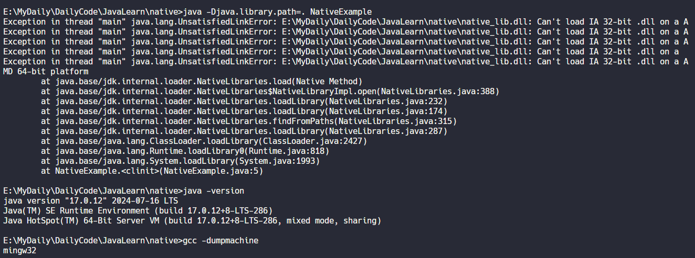

# 8-Java学习-Native关键字

在Java中，native关键字用于声明一个方法是由本地代码（通常是C或C++）实现的。这意味着该方法的具体实现不是用Java编写的，而是由底层的本地代码提供。

## native关键字的作用

- 与本地代码进行交互：通过native方法，Java程序可以与本地代码进行交互，调用本地库中的函数，实现更高效的操作，或者访问底层系统资源。
- 提高性能：使用本地代码实现某些功能通常比纯Java代码更高效。通过native方法，可以利用底层系统资源和优化的算法，提高程序的性能。

## native关键字的使用方法

要声明一个native方法，只需在Java方法的声明中加上native关键字，并且不需要提供方法的实现。例如：
```java
public native void nativeMethod();
```

在这个例子中，`nativeMethod()`是一个native方法，它的具体实现将在本地代码中提供。

为了使用native方法，必须在Java程序中加载本地库，并确保本地库中包含了所需的函数。本地库可以使用Java的JNI（Java Native Interface）来编写，并在程序运行时通过 `System.loadLibrary()` 方法加载。下面是一个简单的示例：
- **编写 Java 类 (NativeExample.java)**

```java
public class NativeExample {

    static {
        System.loadLibrary("native_lib");
    }
    
    public native void sayHello();

    public static void main(String[] args) {
        new NativeExample().sayHello();
        System.out.println("Hello from Java!");
    }
}
```

- **编译 Java 类并生成头文件**

使用以下命令编译 Java 类并生成 JNI 头文件：(`NativeExample.h`)
```sh
javac -h . NativeExample.java
```
这将在当前目录生成 `NativeExample.h` 头文件。

- **编译 C 代码为共享库**

在 Windows 上
```sh
gcc -shared -o native_lib.dll -I"%JAVA_HOME%\include" -I"%JAVA_HOME%\include\win32" native_lib.c
```

在 Linux 上

```sh
gcc -shared -o libnative_lib.so -I"$JAVA_HOME/include" -I"$JAVA_HOME/include/linux" native_lib.c
```

- **运行 Java 程序**（确保共享库在 Java 的库路径上，然后运行 Java 程序。）

在 Windows 上:
```sh
java -Djava.library.path=. NativeExample
```

在 Linux 或 macOS 上
```sh
java -Djava.library.path=. NativeExample
```

报错如下：
```sh
Exception in thread "main" java.lang.UnsatisfiedLinkError: E:\MyDaily\DailyCode\JavaLearn\native\native_lib.dll: Can't load IA 32-bit .dll on a AMD 64-bit platform
        at java.base/jdk.internal.loader.NativeLibraries.load(Native Method)
        at java.base/jdk.internal.loader.NativeLibraries$NativeLibraryImpl.open(NativeLibraries.java:388)
        at java.base/jdk.internal.loader.NativeLibraries.loadLibrary(NativeLibraries.java:232)
        at java.base/jdk.internal.loader.NativeLibraries.loadLibrary(NativeLibraries.java:174)
        at java.base/jdk.internal.loader.NativeLibraries.findFromPaths(NativeLibraries.java:315)
        at java.base/jdk.internal.loader.NativeLibraries.loadLibrary(NativeLibraries.java:287)
        at java.base/java.lang.ClassLoader.loadLibrary(ClassLoader.java:2427)
        at java.base/java.lang.Runtime.loadLibrary0(Runtime.java:818)
        at java.base/java.lang.System.loadLibrary(System.java:1993)
        at NativeExample.<clinit>(NativeExample.java:5)
```


Java 版本和 gcc 的版本
```sh
>java -version
java version "17.0.12" 2024-07-16 LTS
Java(TM) SE Runtime Environment (build 17.0.12+8-LTS-286)
Java HotSpot(TM) 64-Bit Server VM (build 17.0.12+8-LTS-286, mixed mode, sharing)

>gcc -dumpmachine
mingw32
```

试图解决
```sh
> gcc -m64  -shared -o native_lib.dll -I"%JAVA_HOME%\include" -I"%JAVA_HOME%\include\win32" native_lib.c 

native_lib.c:1:0: sorry, unimplemented: 64-bit mode not compiled in
 #include <jni.h>
```
想把编译器改成 64 位，但是报错说 `<jni.h>` 不支持 64 位

#TODO : 可能需要一个 32 位的 Java 环境，有空试一下
