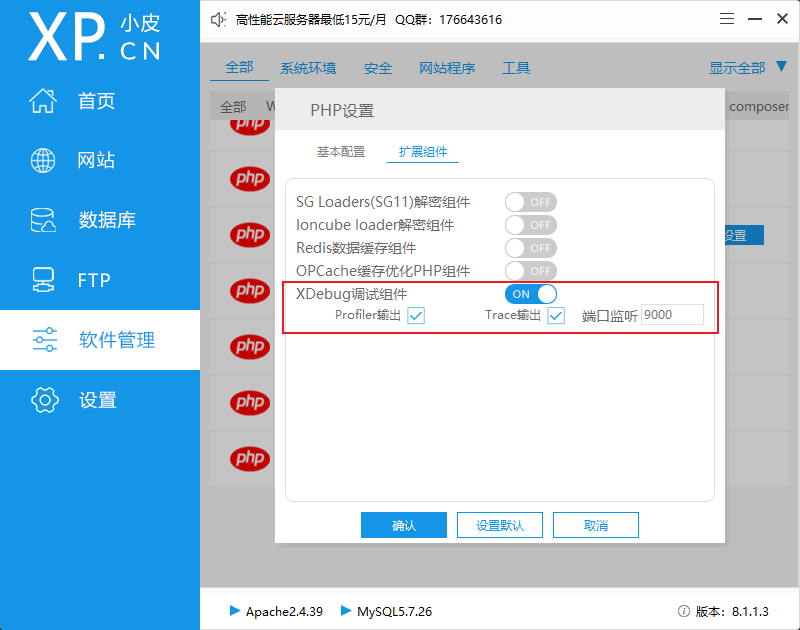

# PHP

## phpstudy + VSCode 环境配置

* 用phpstudy安装php、apache/nginx，还可能用到mysql

* phpstudy -- 软件管理 -- 选择安装的PHP设置 -- 打开调试组件

  （记住这里的端口9000，也可以修改）



* 在php.ini中添加配置

  ```apl
  [Xdebug]
  zend_extension=D:/phpstudy_pro/Extensions/php/php7.3.4nts/ext/php_xdebug.dll
  xdebug.collect_params=1
  xdebug.collect_return=1
  xdebug.auto_trace=On
  xdebug.trace_output_dir=D:/phpstudy_pro/Extensions/php_log/php7.3.4nts.xdebug.trace
  xdebug.profiler_enable=On
  xdebug.profiler_output_dir=D:/phpstudy_pro/Extensions/php_log/php7.3.4nts.xdebug.profiler
  xdebug.remote_enable=On 	 #修改为On
  xdebug.remote_autostart = On #添加
  xdebug.remote_host=localhost
  xdebug.remote_port=9000      #修改成对应端口
  xdebug.remote_handler=dbgp
  ```

* vscode安装``PHP Extension Pack`插件，里面包括`PHP Debug`和`PHP IntelliSense`


* 修改vscode设置，填写php和xdebug的地址

```json
  "php.executablePath": "D:/install/phpstudy_pro/Extensions/php/php7.4.3nts/php.exe",
  "php.debug.executablePath": "D:/install/phpstudy_pro/Extensions/php/php7.3.4nts/ext/php_xdebug.dll",
```

* 对vscode的调试页面进行配置


```json
{
    "version": "0.2.0",
    "configurations": [
        {
            "name": "Listen for Xdebug",
            "type": "php",
            "request": "launch",
            "port": 9000
        },
        {
            "name": "Launch currently open script",
            "type": "php",
            "request": "launch",
            "program": "${file}",
            "cwd": "${fileDirname}",
            "port": 9000,
            "runtimeArgs": [
                "-dxdebug.start_with_request=yes"
            ],
            "env": {
                "XDEBUG_MODE": "debug,develop",
                "XDEBUG_CONFIG": "client_port=${port}"
            }
        }
    ]
}
```

* 打断点开始调试