# 日常技巧

## 其他


### 如何让windows的cmd拥有linux的命令

安装git，然后把git的如下路径添加到Path环境变量

```
******\Git\usr\bin
```

### Git批量修改提交人信息

```
git filter-branch --env-filter 'export GIT_AUTHOR_EMAIL=yourname@163.com' --
git filter-branch --env-filter 'export GIT_COMMITTER_EMAIL=yourname@163.com' --
git filter-branch -f --env-filter 'export GIT_COMMITTER_NAME=yourname' --
git filter-branch -f --env-filter 'export GIT_AUTHOR_NAME=yourname' --
git push -f origin main
```

### Powershell修改profile

- 所有用户，所有主机 - $PSHOME\Profile.ps1
- 所有用户，当前主机 - $PSHOME\Microsoft.PowerShell_profile.ps1
- 当前用户，所有主机 - $HOME\Documents\WindowsPowerShell\Profile.ps1
- 当前用户，当前主机 - $HOME\Documents\WindowsPowerShell\Microsoft.PowerShell_profile.ps1

例如

```
notepad $PSHOME\Microsoft.PowerShell_profile.ps1
```

### CMD和Powershell显示执行命令时间

Powershell：将如下代码添加到profile文件

```
function prompt {
    # 显示当前时间
    $currentTime = Get-Date -Format "yyyy-MM-dd HH:mm:ss"
    Write-Host "Time: $currentTime" -NoNewline -ForegroundColor Green

    # PowerShell默认提示符
    " PS $($executionContext.SessionState.Path.CurrentLocation)$('>' * ($nestedPromptLevel + 1)) "
}
```

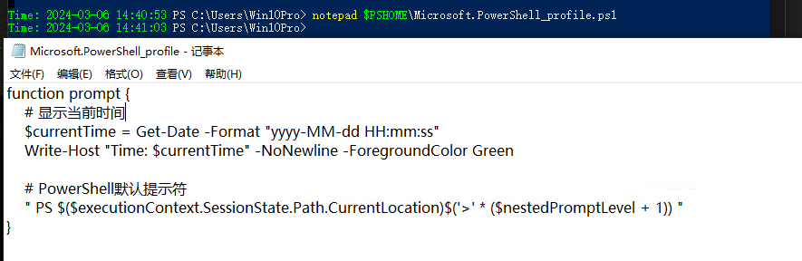
CMD：新建一个系统变量 PROMPT 值填入 
`$T$S$P$G`并保存，然后重启 CMD

### 某应用添加到右键

以Typora为例，右键某文件夹，以Typora打开：

```
Windows Registry Editor Version 5.00

[HKEY_CLASSES_ROOT\Directory\shell\Typora]
@="Open in Typora"
"Icon"="D:\\install\\Typora\\resources\\assets\\app.ico"

[HKEY_CLASSES_ROOT\Directory\shell\Typora\command]
@="\"D:\\install\\Typora\\Typora.exe\" \"%1\""
```

右键文件夹里的空白处，以Typora打开：

```
Windows Registry Editor Version 5.00

[HKEY_CLASSES_ROOT\Directory\Background\shell\Typora]
@="Open in Typora"
"Icon"="\"D:\\install\\Typora\\resources\\assets\\app.ico\""

[HKEY_CLASSES_ROOT\Directory\Background\shell\Typora\command]
@="\"D:\\install\\Typora\\Typora.exe\" \"%V\""
```

### 使用xrdp连接ubuntu桌面优化&黑屏解决

如果不做任何配置，启动之后的桌面是非常别扭的，因为是Gnome的原始桌面，没有左侧的任务栏，窗口也没有最小化按钮，等等一些列问题。解决方案也很简单：

```shell
vim ~/.xsessionrc
# 添加：
export GNOME_SHELL_SESSION_MODE=ubuntu
export XDG_CURRENT_DESKTOP=ubuntu:GNOME
export XDG_CONFIG_DIRS=/etc/xdg/xdg-ubuntu:/etc/xdg
# 重启xrdp
sudo systemctl restart xrdp.service
```

一定要在上面步骤执行完后再改下面的，否则还是黑屏，否则需要reboot主机。
**当你的本机没有注销的话，远程桌面就会黑屏**，最佳解决策略就是退出本地登录，也就是注销登录。或者

```shell
sudo vim /etc/xrdp/startwm.sh
# 添加配置
unset DBUS_SESSION_BUS_ADDRESS
unset XDG_RUNTIME_DIR
# 重启xrdp
sudo systemctl restart xrdp.service
```

### xrdp卡顿解决

```shell
vim /etc/sysctl.conf
# 添加
net.core.rmem_max = 12582912
net.core.wmem_max = 8388608
# 执行
sudo sysctl -p
# 重启 xrdp 服务生效
sudo systemctl restart xrdp
```

### ubuntu下wireshark添加root权限

wireshark要监控eth0，但是必须要root权限才行。但是，直接用root运行程序是相当危险，也是非常不方便的。解决方法如下：

1. 添加wireshark用户组
   `sudo groupadd wireshark `
2. 将dumpcap更改为wireshark用户组
   `sudo chgrp wireshark /usr/bin/dumpcap `
3. 让wireshark用户组有root权限使用dumpcap
   `sudo chmod 4755 /usr/bin/dumpcap `
4. 将需要使用的用户名加入wireshark用户组，我的用户名是craftor
   `sudo gpasswd -a craftor wireshark `

参考：[ubuntu下wireshark添加root权限_wireshark 加入到root组里面-CSDN博客](https://blog.csdn.net/liweigao01/article/details/94488191)


## WSL相关

### WSL制作快照和回滚

```shell
# 查看已安装的系统
wsl -l -v
# 做快照
wsl --export Ubuntu-18.04 d:\wsl-ubuntu18.04.tar

# 注销当前系统
wsl --unregister Ubuntu-18.04
# 回滚
wsl --import Ubuntu-18.04 d:\wsl d:\wsl-ubuntu18.04.tar --version 2
# 设置默认登陆用户为安装时用户名
ubuntu1804 config --default-user USERNAME
# 如果是ubuntu20.04，命令ubuntu1804改为ubuntu2004即可；USERNAME是登录用户名称，如Raymond
        
```

### WSL启动目录修改

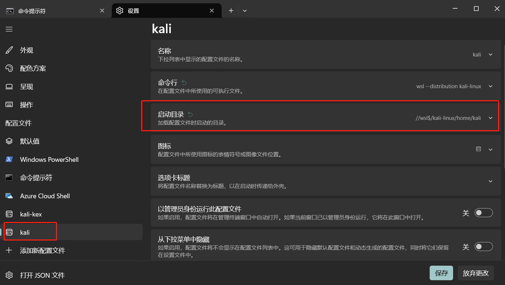
路径是

```bash
//wsl$/加wsl里虚拟机的路径
```

类似这样
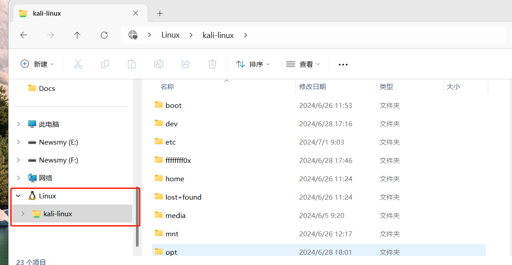

### WSL2 kali 安装报错

我是从MS Store 安装的，下载后点击打开，弹出cmd窗口
报错信息：

```powershell
Installing, this may take a few minutes... 
WslRegisterDistribution failed with error: 0x80004005 
Error: 0x80004005 ???????

Press any key to continue...

```

解决方法：

1. **将 LxssManager 服务修改为自动启动**

从服务中修改会提示“拒绝访问”，所以从注册表改：
win + R -> regedit -> \HKEY_LOCAL_MACHINE\SYSTEM\CurrentControlSet\Services\LxssManager -> 右键 Start 项 -> 将值修改为 2
默认为 3

2. **更新wsl**

管理员启动 powershell

```powershell
wsl --update
```

成功安装，再次点击打开即可正常

### WSL2安装后kali里没工具

WSL2默认的kali基本没什么工具，所以这里手动安装，工具集约7G

```shell
#更新源
sudo apt update
# 安装 
sudo apt-get install kali-linux-all
# 注意：新版本中kali-linux-all更名为kali-linux-everything
sudo apt-get install kali-linux-everything
```

### WSL安装kali后安装docker报错

安装docker

```bash
apt-get install docker.io
```

使用systemctl命令报错：

```shell
xxxx@xxxxx:~$ systemctl start docker
System has not been booted with systemd as init system (PID 1). Can't operate.
Failed to connect to bus: Host is down
```

可能是因为这个Ubuntu系统并没有使用systemd，可能使用的是SysV init（sysvinit）初始化系统。
通过如下命令查看：CMD 列，显示 init，可以确定使用的是SysV init初始化系统。

```
ps -p 1
```

SysV init：如果您的系统使用 SysVinit 作为 init 系统，您可以使用 service 命令来管理和检查服务状态。例如，要检查 Docker 服务状态，可以运行：

```bash
sudo service docker status
```

还是想要使用systemd，在WSL中启用systemd

```bash
# 更新WSL到最新版
wsl --update
# 查看版本
wsl --version
```

然后在Ubuntu实例中，打开或者添加/etc/wsl.conf文件(没有就新建)

```bash
[boot]
systemd=true
```

重新启动wsl即可。

### WSL2使用主机的clash代理

[https://eastmonster.github.io/2022/10/05/clash-config-in-wsl/](https://eastmonster.github.io/2022/10/05/clash-config-in-wsl/)

1. 在 Clash 客户端内的操作
   打开客户端的允许局域网连接 (Allow LAN) 开关，如图 1 所示。
   记录下客户端内的端口 (Port)，如这里是 16514. 一般默认端口为 7890.
   [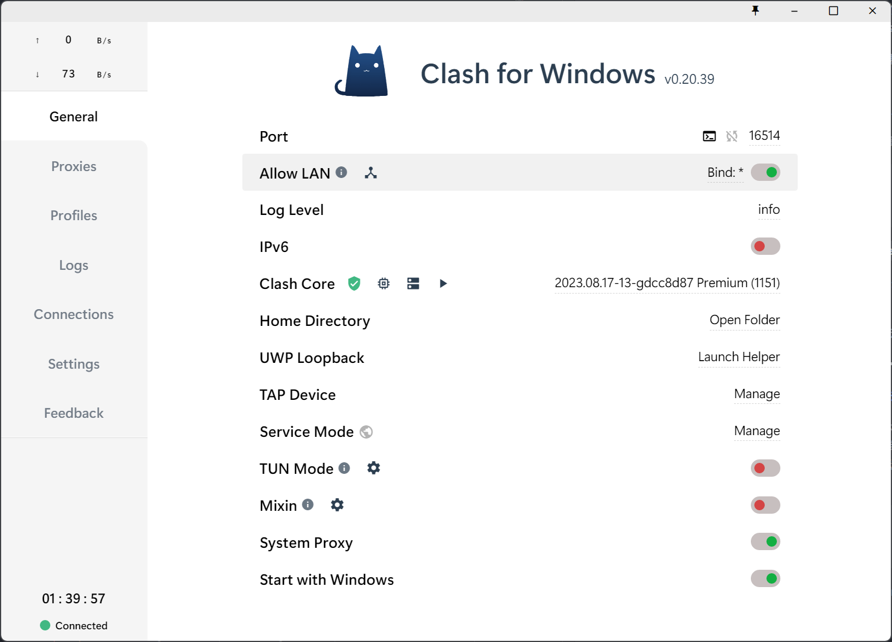](https://s2.loli.net/2024/01/22/sla3HO9UVu4wozn.png)
   这个方法需要 Windows 10/11 22H2 和 WSL 2.0.5 及以上版本
   你可以使用 winver 和 wsl -v 查看你的 Windows 和 WSL 版本。
   如果你使用这个方法，你需要确保 Clash 客户端中设置的系统代理类型为 HTTP 而不是 PAC，否则无法代理 HTTPS 请求:
   [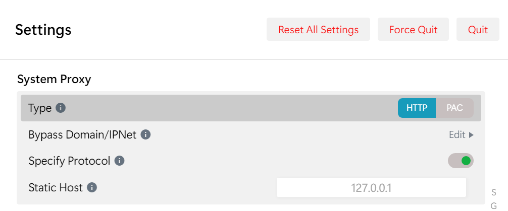](https://s2.loli.net/2024/01/24/Y9DhxRw47tzlWIH.png)
   在 WSL [2.0.5 版本](https://github.com/microsoft/WSL/releases/tag/2.0.5)后，一些特性得以稳定，这里要用到的是[镜像模式网络](https://learn.microsoft.com/zh-cn/windows/wsl/networking#mirrored-mode-networking)。
   在 C:\Users\<UserName>\.wslconfig 文件中 (如果不存在就手动创建一个) 加入以下内容:

```
[wsl2]
networkingMode=mirrored

```

不过需要注意，shell 的配置文件中不能再 export http_proxy=...

## Docker相关

### 安装docker-ce

#### kali

```bash
# 更新现有的软件包列表
sudo apt update
# 安装所需工具包
sudo apt -y install curl gnupg2 apt-transport-https software-properties-common ca-certificates
# 导入用于签署Docker软件包的Docker GPG密钥：
curl -fsSL https://download.docker.com/linux/debian/gpg | sudo apt-key add -
# 添加包含Docker CE最新稳定版本的Docker存储库：
echo "deb [arch=amd64] https://download.docker.com/linux/debian buster stable" | sudo tee  /etc/apt/sources.list.d/docker.list
# 更新apt包索引
sudo apt update
# 在Kali Linux上安装Docker CE
sudo apt install docker-ce docker-ce-cli containerd.io
# 检查安装的Docker版本
docker version
```

#### ubuntu

[ubuntu安装docker详细步骤 - 腾讯云开发者社区-腾讯云 (tencent.com)open in new window](https://cloud.tencent.com/developer/article/1854430)
[Docker 入门指南：如何在 Ubuntu 上安装和使用 Docker - 卡拉云 (kalacloud.com)open in new window](https://kalacloud.com/blog/how-to-install-and-use-docker-on-ubuntu/)
使用如下脚本来安装 docker 即可:

```bash
# Install the latest version docker
curl -s https://get.docker.com/ | sh

# Run docker service
systemctl start docker
```

旧版安装指令:

```bash
# 更新现有的软件包列表
apt update
# 安装所需工具包
sudo apt install apt-transport-https ca-certificates curl gnupg-agent  software-properties-common
# 然后将官方 Docker 版本库的 GPG 密钥添加到系统中：
curl -fsSL https://download.docker.com/linux/ubuntu/gpg | sudo apt-key add -
# 将 Docker 版本库添加到APT源：
sudo add-apt-repository "deb [arch=amd64] https://download.docker.com/linux/ubuntu focal stable"
# 用新添加的 Docker 软件包来进行升级更新。
sudo apt update
# 确保要从 Docker 版本库，而不是默认的 Ubuntu 版本库进行安装：
apt-cache policy docker-ce
# 安装 Docker ：
sudo apt install docker-ce
# 现在 Docker 已经安装完毕。我们启动守护程序。检查 Docker 是否正在运行：
sudo systemctl status docker
# 设置 docker 开机自动启动
sudo systemctl enable docker.service
```

#### debian

[在 Debian 上安装 Docker 引擎 | Docker 文档 --- Install Docker Engine on Debian | Docker Docsopen in new window](https://docs.docker.com/engine/install/debian/#install-using-the-repository)
[Index of linux/debian/dists/ (docker.com)open in new window](https://download.docker.com/linux/debian/dists/)

1. 设置 Docker 的 apt 存储库

```bash
# Add Docker's official GPG key:
sudo apt-get update
sudo apt-get install ca-certificates curl
sudo install -m 0755 -d /etc/apt/keyrings
sudo curl -fsSL https://download.docker.com/linux/debian/gpg -o /etc/apt/keyrings/docker.asc
sudo chmod a+r /etc/apt/keyrings/docker.asc

# Add the repository to Apt sources:
echo \
  "deb [arch=$(dpkg --print-architecture) signed-by=/etc/apt/keyrings/docker.asc] https://download.docker.com/linux/debian \
  $(. /etc/os-release && echo "$VERSION_CODENAME") stable" | \
  sudo tee /etc/apt/sources.list.d/docker.list > /dev/null
sudo apt-get update
```

2. 安装 Docker packages

```bash
sudo apt-get install docker-ce docker-ce-cli containerd.io docker-buildx-plugin docker-co
```

### docker配置代理

```bash
sudo mkdir -p /etc/systemd/system/docker.service.d
sudo vim /etc/systemd/system/docker.service.d/proxy.conf

[Service]
Environment="HTTP_PROXY=http://127.0.0.1:7890/"
Environment="HTTPS_PROXY=http://127.0.0.1:7890/"
Environment="NO_PROXY=localhost,127.0.0.1"
```


## 代码相关

### Centos7安装node后重定向报错

```
yum install nodejs npm cnpm -y
```

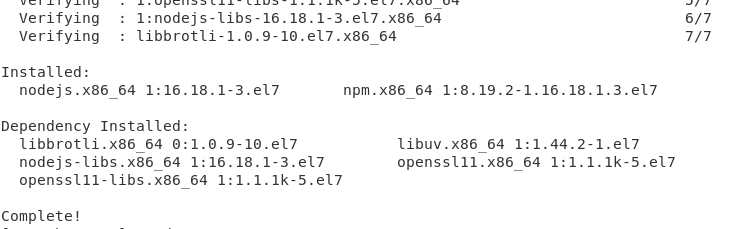
但是报错如下

```
[root@bogon ~]# node -v
node: relocation error: /lib64/libnode.so.93: symbol FIPS_selftest, version OPENSSL_1_1_0g not defined in file libcrypto.so.1.1 with link time reference
[root@bogon ~]# npm -v
node: relocation error: /lib64/libnode.so.93: symbol FIPS_selftest, version OPENSSL_1_1_0g not defined in file libcrypto.so.1.1 with link time reference

```

openssl装了新版本，但是没替换

解决办法

```
mv openssl openssl.bak
mv openssl111/ openssl
```


### 解决 Go 中使用 Sqlite 报错 go-sqlite3 requires cgo to work

Windows 10 系统
在使用 `GORM` 中连接 `SQlite` 数据库时，启动项目报错，错误信息如下

```
Binary was compiled with 'CGO_ENABLED=0', go-sqlite3 requires cgo to work. This is a stub
```

从错误信息里可以看到，是 `cgo` 没跑起来和 `CGO_ENABLED=0`，我隐约记得以前遇到过，这是因为Windows上面默认是没有 `gcc` 的，所以 `cgo` 跑不起来。Windows 上面可以安装 `MinGW` 获得 `gcc`
总之，就是 `SQlite` 需要 `C` 环境，`cgo` 也需要 `C` 环境，这都要 `gcc` 来支持

> PS：这也是为什么这种错误大多发生在 Windows 上的原因，因为 Mac和 Linux 都默认安装了 `gcc`

**解决步骤**

1. 点这个[链接](https://sourceforge.net/projects/mingw-w64/files/Toolchains%20targetting%20Win64/Personal%20Builds/mingw-builds/8.1.0/threads-posix/sjlj/x86_64-8.1.0-release-posix-sjlj-rt_v6-rev0.7z)下载 `MinGW` 的压缩包。或者访问[MinGW-w64 - for 32 and 64 bit Windows Files](https://sourceforge.net/projects/mingw-w64/files/)找到 `x86_64-posix-xxxx` 链接，点击它下载

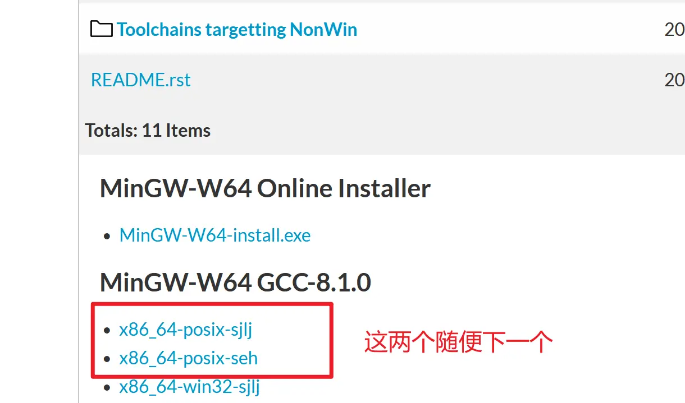

2. 解压后会得到一个 `mingw64` 的文件夹，把这个文件夹复制到 `C:\Program Files` 目录下，把 `C:\Program Files\mingw64\bin` 这个路径添加到 `PATH `系统环境变量（这个不会的得自己百度了）

`bin` 目录下有很多可执行文件，可以用来编译执行 `C`、`C++` 代码。把bin目录加入到 `PATH` 系统环境变量是为了直接执行 `gcc` 等命令可以正确找到可执行文件
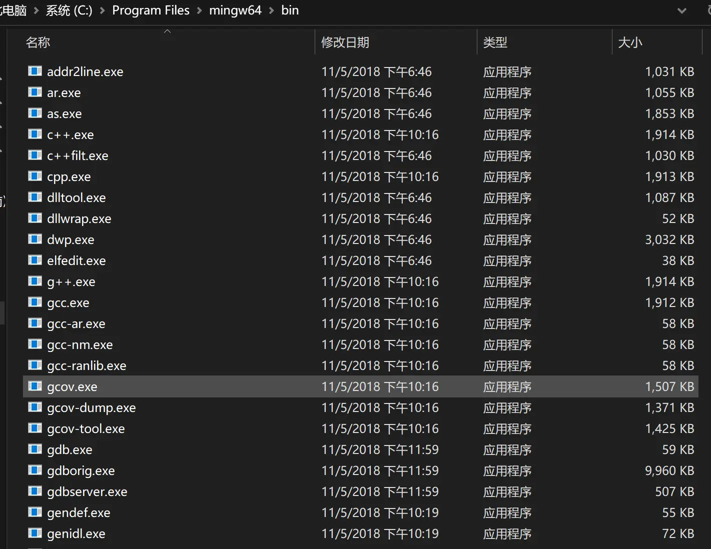
`PATH` 系统环境变量
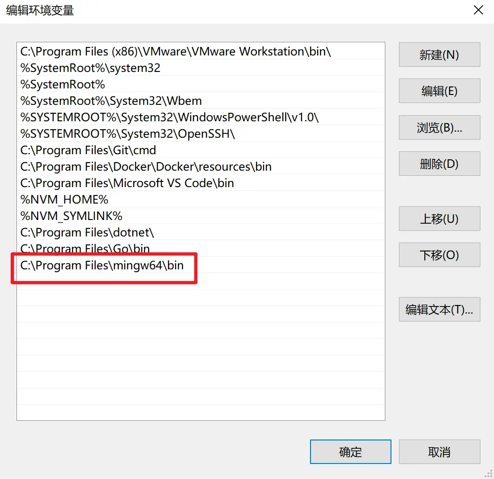

3. 添加到 `PATH` 系统环境变量后，在终端执行下面命令开启 `cgo`

```shell
$ go env -w CGO_ENABLED=1
```

1. 重启你当前的终端或者新开一个终端tab，这样环境变量才会生效。如果是在 `VS Code` 的终端执行命令，需要重启 `VS Code` 
2. 最后正常启动项目即可，第一次启动项目可能会有点慢，因为需要执行 `cgo` 编译打包好 `SQlite` 相关的东西

> 来自: [解决 Go 中使用 Sqlite 报错 go-sqlite3 requires cgo to work - 付小晨](https://fuxiaochen.com/blog/fix-sqlite-requires-cgo)


### Goland 无法debug

报错日志如下：
couldn’t start listener: listen tcp: address 0:0:0:0:0:0:0:1:56648: too many colons in address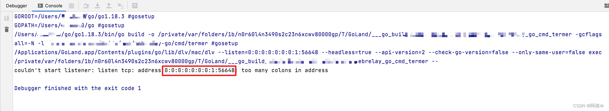我使用的Goland版本为2021.2.3
从以上报错信息可以看出是ip解析相关的问题，经过了各种办法最终找到了解决方案：

1. **第一步**：
   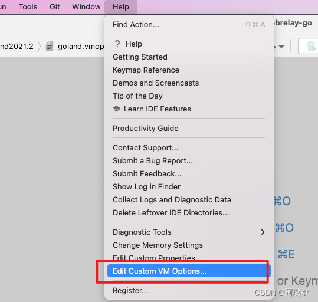
2. **第二步**：
   在Goland中：Help->Edit Custom VM options, 打开文件后如下图
   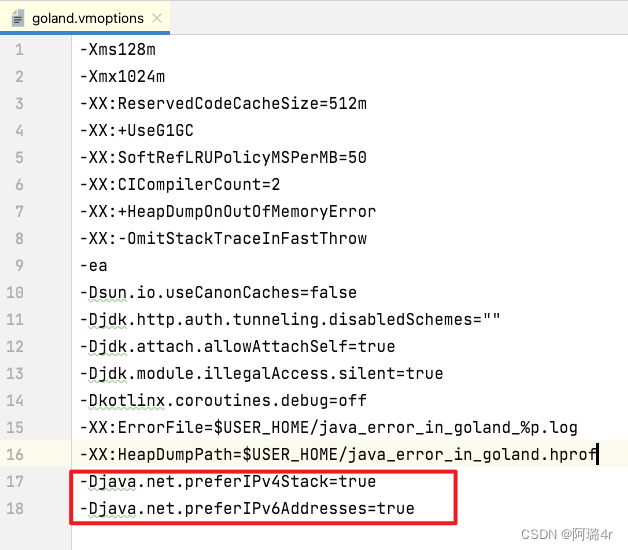
   在最后配置如下两行

```
-Djava.net.preferIPv4Stack=true
-Djava.net.preferIPv6Addresses=true
```

再次debug发现无法Step Over,需要重新安装dlv工具

```
git clone https://github.com/go-delve/delve.git
cd delve/cmd/dlv/
go build
go install
```

GOBIN目录将会生成dlv可执行文件，最后将添加到Edit Custom VM options 中即可。$GOPATH改为自己电脑的路径，go env命令可以查看

```
-Ddlv.path=$GOPATH/bin/dlv
```

> 来自: [Goland无法debug\地址解析出错\无法下一步操作-CSDN博客](https://blog.csdn.net/asc_123456/article/details/125424500)


### VS Code 集成终端上出现意外的 ANSI 转义码

使用了oh-my-posh，在打开nodejs的项目时，我的vscode中的Windows powershell打开时出现这行代码：
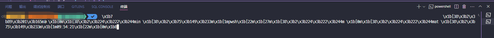

```
 \x1b7                                                                                                                                                          \x1b[38\x3b2\x3b89\x3b201\x3b165m \x1b[0m\x1b[38\x3b2\x3b224\x3b222\x3b244min \x1b[38\x3b2\x3b75\x3b149\x3b233m\x1b[1mpwsh\x1b[22m\x1b[27m\x1b[38\x3b2\x3b224\x3b222\x3b244m \x1b[0m\x1b[38\x3b2\x3b224\x3b222\x3b244mat \x1b[38\x3b2\x3b75\x3b149\x3b233m\x1b[1m09:54:21\x1b[22m\x1b[0m\x1b8
```

解决方式：在vscode设置处搜索shell集成，把如下勾选取消。
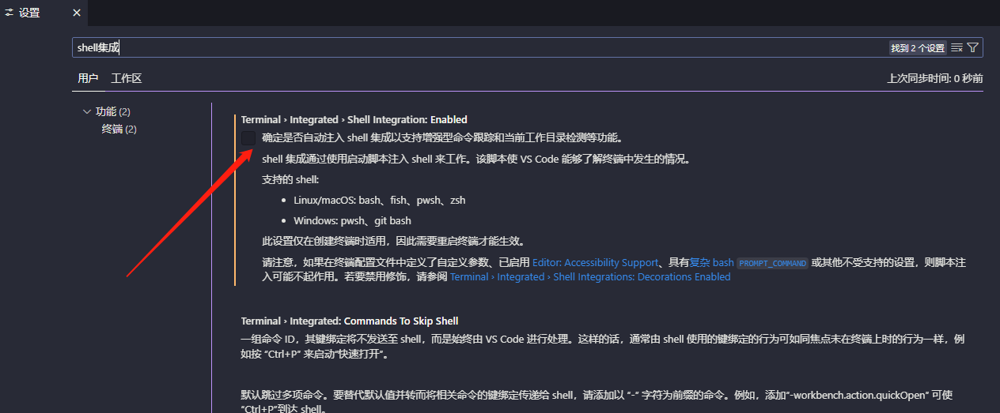


### vscode中docker插件无法连接

报错` Failed to connect. Is Docker running  Error: permission denied while trying connect .... `
J解决方案：普通用户增加到docker组中

```bash
sudo groupadd docker          #添加docker用户组
sudo gpasswd -a $USER docker  #将当前用户添加至docker用户组
newgrp docker                 #更新docker用户组
```

添加后重新登录vscode，用户重新连接后docker插件会正常运行。

### linux(deepin)安装配置go

（apt-get install golang安装不是最新版）

```
# 直接在国内官网安装golang
sudo wget https://studygolang.com/dl/golang/go1.19.2.linux-amd64.tar.gz

# 然后将上面下载的golang安装包解压到/usr/local/这个目录，解压后会自动生成一个go文件夹目录
sudo tar -zxvf go1.19.2.linux-amd64.tar.gz -C /usr/local/

# Deepin 还是直接编辑sudo vim /etc/bash.bashrc文件就可以，直接追加下面的配置
sudo vim /etc/bash.bashrc

# 在文件的最下面增加Go的环境变量---bashrc文件begin
export GOROOT=/usr/local/go
export GOPATH=/home/gowork
export PATH=$PATH:$GOROOT/bin:$GOPATH/bin

第一个就是我们刚刚安装Go的路径，Go的安装路径
第二个这里是Go的工作空间，也就是工作路径；自己创建的目录，这个下面自己创建src、pkg、bin
第三个环境变量
# 在文件的最下面增加Go的环境变量---bashrc文件end

sudo mkdir /home/gowork

# 刷新环境变量配置
source /etc/bash.bashrc

go env
# go env环境变量设置
go env -w GOPROXY=https://goproxy.io,direct
go env -w GOSUMDB=sum.golang.google.cn
go env -w GO111MODULE=on #有""不用设置
```

> 来自: https://zhuanlan.zhihu.com/p/588475095