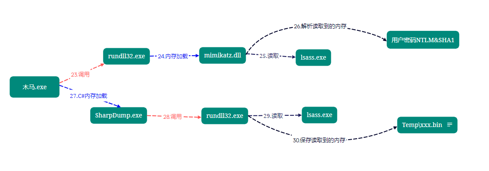

# 其他


## 一些小技巧

### 1、如何让windows的cmd拥有linux的命令

安装git，然后把git的如下路径添加到Path环境变量

```
******\Git\usr\bin
```

### 2、Git批量修改提交人信息

```
git filter-branch --env-filter 'export GIT_AUTHOR_EMAIL=yourname@163.com' --
git filter-branch --env-filter 'export GIT_COMMITTER_EMAIL=yourname@163.com' --
git filter-branch -f --env-filter 'export GIT_COMMITTER_NAME=yourname' --
git filter-branch -f --env-filter 'export GIT_AUTHOR_NAME=yourname' --
git push -f origin main
```


### 3、Powershell修改profile

- 所有用户，所有主机 - `$PSHOME\Profile.ps1`
- 所有用户，当前主机 - `$PSHOME\Microsoft.PowerShell_profile.ps1`
- 当前用户，所有主机 - `$HOME\Documents\WindowsPowerShell\Profile.ps1`
- 当前用户，当前主机 - `$HOME\Documents\WindowsPowerShell\Microsoft.PowerShell_profile.ps1`

例如

```
notepad $PSHOME\Microsoft.PowerShell_profile.ps1
```


### 4、CMD和Powershell显示执行命令时间

Powershell：将如下代码添加到profile文件

```
function prompt {
    # 显示当前时间
    $currentTime = Get-Date -Format "yyyy-MM-dd HH:mm:ss"
    Write-Host "Time: $currentTime" -NoNewline -ForegroundColor Green

    # PowerShell默认提示符
    " PS $($executionContext.SessionState.Path.CurrentLocation)$('>' * ($nestedPromptLevel + 1)) "
}
```


CMD：新建一个系统变量 PROMPT 值填入 $T$S$P$G 并保存，然后重启 CMD


### 5、某应用添加到右键

以Typora为例，右键某文件夹，以Typora打开：

```
Windows Registry Editor Version 5.00

[HKEY_CLASSES_ROOT\Directory\shell\Typora]
@="Open in Typora"
"Icon"="D:\\install\\Typora\\resources\\assets\\app.ico"

[HKEY_CLASSES_ROOT\Directory\shell\Typora\command]
@="\"D:\\install\\Typora\\Typora.exe\" \"%1\""

```

右键文件夹里的空白处，以Typora打开：

```
Windows Registry Editor Version 5.00

[HKEY_CLASSES_ROOT\Directory\Background\shell\Typora]
@="Open in Typora"
"Icon"="\"D:\\install\\Typora\\resources\\assets\\app.ico\""

[HKEY_CLASSES_ROOT\Directory\Background\shell\Typora\command]
@="\"D:\\install\\Typora\\Typora.exe\" \"%V\""

```

### 6、使用xrdp连接ubuntu桌面优化&黑屏解决

如果不做任何配置，启动之后的桌面是非常别扭的，因为是Gnome的原始桌面，没有左侧的任务栏，窗口也没有最小化按钮，等等一些列问题。解决方案也很简单：

```shell
vim ~/.xsessionrc
# 添加：
export GNOME_SHELL_SESSION_MODE=ubuntu
export XDG_CURRENT_DESKTOP=ubuntu:GNOME
export XDG_CONFIG_DIRS=/etc/xdg/xdg-ubuntu:/etc/xdg
# 重启xrdp
sudo systemctl restart xrdp.service
```

> 一定要在上面步骤执行完后再改下面的，否则还是黑屏，否则需要reboot主机。

**当你的本机没有注销的话，远程桌面就会黑屏**，最佳解决策略就是退出本地登录，也就是注销登录。或者

```shell
sudo vim /etc/xrdp/startwm.sh
# 添加配置
unset DBUS_SESSION_BUS_ADDRESS
unset XDG_RUNTIME_DIR
# 重启xrdp
sudo systemctl restart xrdp.service
```

### xrdp卡顿解决

```shell
vim /etc/sysctl.conf
# 添加
net.core.rmem_max = 12582912
net.core.wmem_max = 8388608
# 执行
sudo sysctl -p
# 重启 xrdp 服务生效
sudo systemctl restart xrdp
```


## 新知识

### 1、NBNS和mDNS协议

windwos默认开启的三种协议，这三种协议分别是链路本地多播名称解析（LLMNR）、名称服务器(NBNS) 协议和多播DNS（mDNS）协议。

- LLMNR：链路本地多播名称解析（LLMNR）是一个基于域名系统（DNS）数据包格式的协议，IPv4和IPv6的主机可以通过此协议对同一本地链路上的主机执行名称解析。Windows 操作系统从 Windows Vista开始就内嵌支持，Linux系统也通过systemd实现了此协议。它通过UDP 5355端口进行通信，且LLMNR支持IPV6。
- NBNS：网络基本输入/输出系统(NetBIOS) 名称服务器(NBNS) 协议是 TCP/IP 上的 NetBIOS (NetBT) 协议族的一部分，它在基于 NetBIOS 名称访问的网络上提供主机名和地址映射方法。通过UDP 137端口进行通信，但NBNS不支持IPV6。

- mDNS：在计算机网络中 ， 多播DNS （ mDNS ）协议将主机名解析为不包含本地名称服务器的小型网络中的IP地址。 它是一种零配置服务，使用与单播域名系统 （DNS）基本相同的编程接口，数据包格式和操作语义。 虽然Stuart Cheshire将mDNS设计为独立协议，但它可以与标准DNS服务器协同工作。它通过UDP 5353端口进行通信，且MDNS也支持IPV6。

目前仅有windows10支持mdns，经测试发现，禁用了LLMNR后mDNS也会被禁用。

有时间看下这个[InveighZero：一款基于C#的数据欺骗和MitM工具-腾讯云开发者社区-腾讯云 (tencent.com)](https://cloud.tencent.com/developer/article/2274258?areaSource=102001.10&traceId=3OY3DrXx8O376asMyCit0)

[BadTunnel：跨网段劫持广播协议 - 乌云 Drops 文章合集 - 开发文档 - 文江博客 (wenjiangs.com)](https://www.wenjiangs.com/doc/nhbok8c60lwy)

### 2、Windows远程桌面连接相关的进程

> from ChatGPT

当使用远程桌面连接连接到 Windows 主机时，以下是一些可能在目标主机上运行的与远程桌面连接相关的进程：

Termsrv.exe：这是 Windows 远程桌面会话主机服务的进程。它负责监听和管理远程桌面连接请求，并为客户端提供会话支持。

Rdpclip.exe：这是 Windows 远程桌面剪贴板服务的进程。它用于在本地和远程主机之间共享剪贴板内容，使用户可以在远程会话中复制和粘贴文本、图像和文件等。

Rdpinit.exe：这是 Windows 远程桌面初始化程序的进程。它负责启动和初始化远程桌面会话。

Lsass.exe：这是本地安全授权子系统服务的进程，负责验证用户身份和处理安全策略。在远程桌面连接过程中，lsass.exe 进程参与用户的身份验证流程。

Svchost.exe（包含 TermService 服务）：Svchost.exe 是一个通用的 Windows 进程守护程序，用于托管多个系统服务。当远程桌面服务 (TermService) 启动时，它会在 Svchost 进程中运行。

这些进程是与远程桌面连接直接相关的一些常见进程。请注意，实际的进程可能因不同的 Windows 版本、配置和环境而有所变化。此外，目标主机上可能还会有其他后台进程和服务在运行，这些进程与系统和其他应用程序的正常运行有关。

### 3、CS梼杌插件里两个抓密码功能区别

Mimikatz Logon Passwords ：内存加载mimikatz到目标主机，然后执行`sekurlsa::logonpasswords`

DumpLsass SharpDump ：先内存加载一个SharpDump.exe，然后调用rundll32执行，把从内存里抓到的内容保存在xxx.out文件里，然后gz压缩成.bin文件，这个文件会留在靶机上，下载下来解压，用mimakatz读就行了。



## 报错解决

1、Centos7安装node后重定向报错

```
yum install nodejs npm cnpm -y
```


但是报错如下

```
[root@bogon ~]# node -v
node: relocation error: /lib64/libnode.so.93: symbol FIPS_selftest, version OPENSSL_1_1_0g not defined in file libcrypto.so.1.1 with link time reference
[root@bogon ~]# npm -v
node: relocation error: /lib64/libnode.so.93: symbol FIPS_selftest, version OPENSSL_1_1_0g not defined in file libcrypto.so.1.1 with link time reference
```

openssl装了新版本，但是没替换


解决办法

```
mv openssl openssl.bak
mv openssl111/ openssl
```


### 
