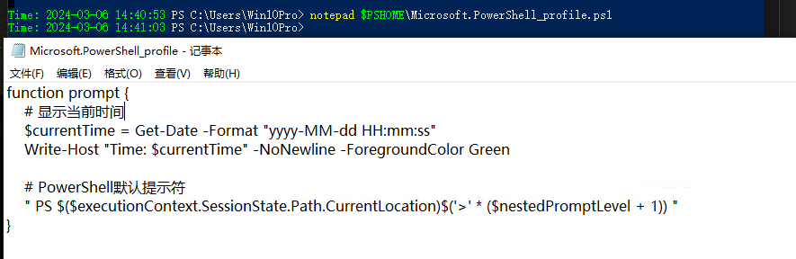
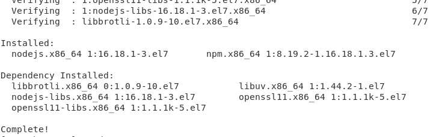
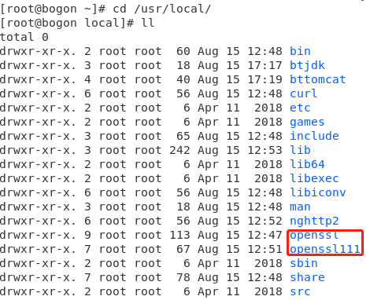
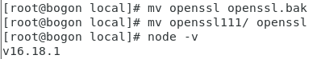

# 其他


## 一些小技巧

### 1、如何让windows的cmd拥有linux的命令

安装git，然后把git的如下路径添加到Path环境变量

```
******\Git\usr\bin
```

### 2、Git批量修改提交人信息

```
git filter-branch --env-filter 'export GIT_AUTHOR_EMAIL=yourname@163.com' --
git filter-branch --env-filter 'export GIT_COMMITTER_EMAIL=yourname@163.com' --
git filter-branch -f --env-filter 'export GIT_COMMITTER_NAME=yourname' --
git filter-branch -f --env-filter 'export GIT_AUTHOR_NAME=yourname' --
git push -f origin main
```


### 3、Powershell修改profile

- 所有用户，所有主机 - `$PSHOME\Profile.ps1`
- 所有用户，当前主机 - `$PSHOME\Microsoft.PowerShell_profile.ps1`
- 当前用户，所有主机 - `$HOME\Documents\WindowsPowerShell\Profile.ps1`
- 当前用户，当前主机 - `$HOME\Documents\WindowsPowerShell\Microsoft.PowerShell_profile.ps1`

例如

```
notepad $PSHOME\Microsoft.PowerShell_profile.ps1
```


### 4、CMD和Powershell显示执行命令时间

Powershell：将如下代码添加到profile文件

```
function prompt {
    # 显示当前时间
    $currentTime = Get-Date -Format "yyyy-MM-dd HH:mm:ss"
    Write-Host "Time: $currentTime" -NoNewline -ForegroundColor Green

    # PowerShell默认提示符
    " PS $($executionContext.SessionState.Path.CurrentLocation)$('>' * ($nestedPromptLevel + 1)) "
}
```



CMD：新建一个系统变量 PROMPT 值填入 $T$S$P$G 并保存，然后重启 CMD


## 新知识

### 1、NBNS和mDNS协议

windwos默认开启的三种协议，这三种协议分别是链路本地多播名称解析（LLMNR）、名称服务器(NBNS) 协议和多播DNS（mDNS）协议。

- LLMNR：链路本地多播名称解析（LLMNR）是一个基于域名系统（DNS）数据包格式的协议，IPv4和IPv6的主机可以通过此协议对同一本地链路上的主机执行名称解析。Windows 操作系统从 Windows Vista开始就内嵌支持，Linux系统也通过systemd实现了此协议。它通过UDP 5355端口进行通信，且LLMNR支持IPV6。
- NBNS：网络基本输入/输出系统(NetBIOS) 名称服务器(NBNS) 协议是 TCP/IP 上的 NetBIOS (NetBT) 协议族的一部分，它在基于 NetBIOS 名称访问的网络上提供主机名和地址映射方法。通过UDP 137端口进行通信，但NBNS不支持IPV6。

- mDNS：在计算机网络中 ， 多播DNS （ mDNS ）协议将主机名解析为不包含本地名称服务器的小型网络中的IP地址。 它是一种零配置服务，使用与单播域名系统 （DNS）基本相同的编程接口，数据包格式和操作语义。 虽然Stuart Cheshire将mDNS设计为独立协议，但它可以与标准DNS服务器协同工作。它通过UDP 5353端口进行通信，且MDNS也支持IPV6。

目前仅有windows10支持mdns，经测试发现，禁用了LLMNR后mDNS也会被禁用。

有时间看下这个[InveighZero：一款基于C#的数据欺骗和MitM工具-腾讯云开发者社区-腾讯云 (tencent.com)](https://cloud.tencent.com/developer/article/2274258?areaSource=102001.10&traceId=3OY3DrXx8O376asMyCit0)

[BadTunnel：跨网段劫持广播协议 - 乌云 Drops 文章合集 - 开发文档 - 文江博客 (wenjiangs.com)](https://www.wenjiangs.com/doc/nhbok8c60lwy)


## 报错解决

1、Centos7安装node后重定向报错

```
yum install nodejs npm cnpm -y
```



但是报错如下

```
[root@bogon ~]# node -v
node: relocation error: /lib64/libnode.so.93: symbol FIPS_selftest, version OPENSSL_1_1_0g not defined in file libcrypto.so.1.1 with link time reference
[root@bogon ~]# npm -v
node: relocation error: /lib64/libnode.so.93: symbol FIPS_selftest, version OPENSSL_1_1_0g not defined in file libcrypto.so.1.1 with link time reference
```

openssl装了新版本，但是没替换



解决办法

```
mv openssl openssl.bak
mv openssl111/ openssl
```



### 
