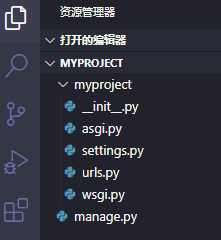
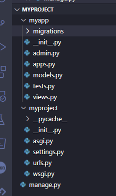
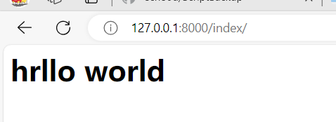
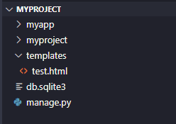
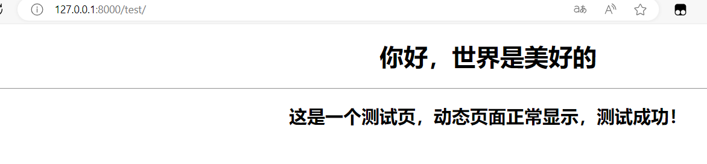
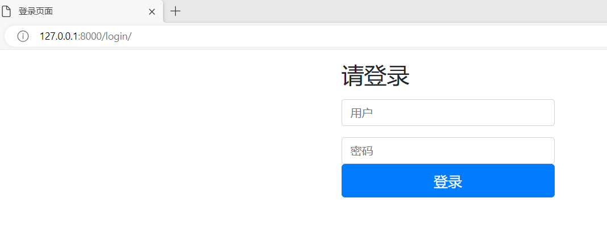
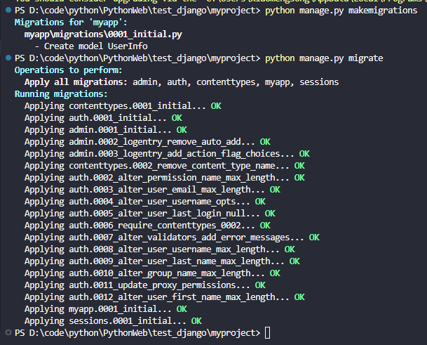
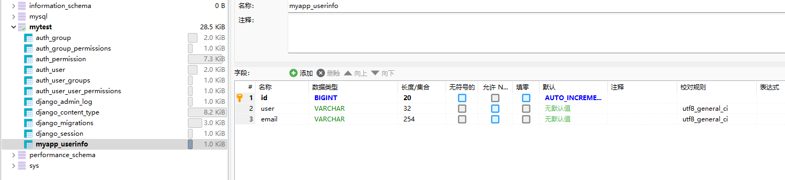
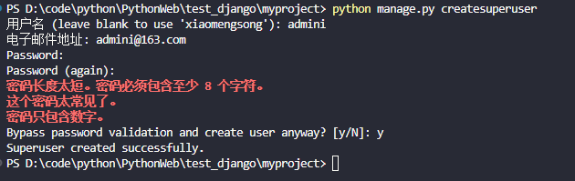
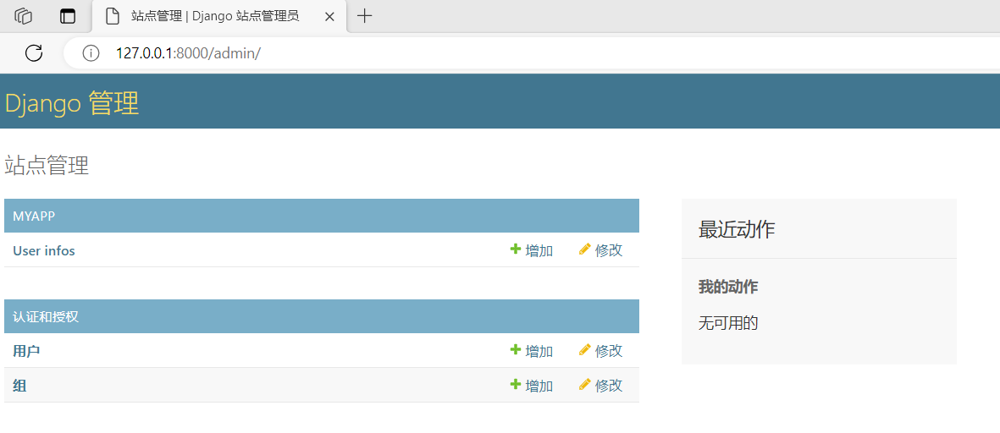

# Django第一次使用记录

## 创建项目

```
pip install django
mkdir test_django
cd test_django
django-admin.exe startproject myproject (# python的Scripts/文件夹路径加入环境变量Path里才能直接写执行)

```

项目建立后目录结构



```
manage.py  # 简单的命令文件封装文件，可以通过这个文件生成应用程序
myproject/ # 一个目录，与项目名称一样，称为项目目录
__init.py__ # 一个空文件，用来告诉Python这是myproject目录的一个模块
settings.py # 项目配置文件，包含一些初始化设置
urls.py # # 存放URL表达式的文件，这里定义的每一个URL都对应一个视图函数，这个文件称为路由文件
wsgi.py # 服务器程序和应用程序的一个协议接口，规定了使用的接口和功能，这个文件不需修改， Django已为项目配置好
```

## 创建应用程序

```
cd myproject
python manage.py startapp myapp
```



```
myapp/
__init__.pyadmin.py　　# 配置管理后台，写少量代码就可以启用Django Admin管理后台
apps.py：　　# 存放当前应用程序的配置
models.py　 # 存放数据库相关的内容
tests.py　　# 可在这个文件写测试代码以对当前应用程序进行测试
views.py　　# 存放业务请求功能的代码
migrations/ # 这个文件夹中的文件保存该应用程序的数据库表与变化的相关内容
```

## 静态HTML页面

1、业务逻辑代码

业务逻辑代码按照Django的约定一般要写在views.py文件中，换句话说就是要在views.py文件中生成一个视图函数并在其中编写代码。

```python
from django.shortcuts import HttpResponse
# Create your views here.
def indec(request):
    return HttpResponse('<h1>hrllo world</h1>')
```

2、建立URL与视图函数的对应关系

URL与视图函数的对应关系要放在`urls.py`文件中，对应关系以URL配置项形式放在文件中的一个列表变量中。

第二个参数`views.index`指的是`views.py`文件中的函数。

```python
from django.contrib import admin
from django.urls import path
from myapp import views

urlpatterns = [
    path('admin/', admin.site.urls),
    path('index/',views.index),
]
```

3、启动程序

```
python manage.py runserver
```

访问http://127.0.0.1:8000/index/



## 动态加载HTML页面

新建`templates`文件夹，在里面新建test.html文件



```html
<!DOCTYPE html>
<html lang="en">

<head>
    <meta charset="UTF-8">
    <title>测试模板</title>
</head>

<body>
    <div align="center">
        <h1>{{ hi }}</h1>
        <hr>
        <h2>{{ test }}</h2>
    </div>
</body>

</html>
```

然后在settings.py中指定templates文件夹

```python
TEMPLATES = [
    {
        'BACKEND': 'django.template.backends.django.DjangoTemplates',
        'DIRS': [BASE_DIR/'templates'],
        ......
```

在views.py中定义

```python
def test(request):
    hi='你好，世界是美好的'
    test='这是一个测试页，动态页面正常显示，测试成功！'
    return render(request,'test.html',{'hi':hi,'test':test})
```

urls.py中添加test的路径

```python
urlpatterns = [
    path('admin/', admin.site.urls),
    path('index/',views.index),
    path('test/', views.test)
]

```

效果



##  配置静态文件

要让Django找到这些文件必须进行设置，首先在`setttings.py`文件的`INSTALLED_APPS`代码块中要有`django.contrib.staticfiles`这一行

然后在`setttings.py`文件中增加以下代码。

```python
STATIC_URL = '/static/'
STATICFILES_DIRS = [
    os.path.join(BASE_DIR, 'static'),
]
```

需要在项目根目录下新建文件夹`static`，将网页要引用的静态文件或相关文件夹保存在这里。

然后在`templates`文件夹中添加`login.html`

```html


<html lang="zh-CN">

<head>
    
    <meta charset="UTF-8">
    <title>登录页面</title>
    <link href="" rel="stylesheet">
    <link href="" rel="stylesheet">
    <link rel="stylesheet" href="">
    <script src=""></script>
    <script src=""></script>
</head>

<body>
    <div class="container">
        <form class="form-signin" method="post" action="">
            
            <h2 class="form-signin-heading">请登录</h2>
            <p></p>
            <p></p>
            <label for="username" class="sr-only">用户名</label>
            <input type="text" id="username" name="username" class="form-control" placeholder="用户" required autofocus>
            <p></p>
            <p></p>
            <label for="password" class="sr-only">密 码</label>
            <input type="password" id="password" name="password" class="form-control" placeholder="密码" required>
            <button class="btn btn-lg btn-primary btn-block" type="submit">登录</button>
        </form>
    </div> <!-- /container -->
</body>

</html>
```

除了sigin.css以外，都是下载好直接放static文件夹，sigin.css自己编的

```css
.form-signin{
    max-width: 330px;
    padding: 15px;
    margin: 0 auto;
}

.form-signin-heading{
    margin-bottom: 10px;}
```

ps

```
<link href="" rel="stylesheet">
这句代码会被Django渲染成
<link href="/static/bootstrap/css/bootstrap.min.css" rel="stylesheet">
```

`views.py`中写后台处理逻辑

```python
from django.shortcuts import redirect

def login(request):
    if request.method == "GET":# 打开login.html页面
        return render(request, "login.html")
    else:# 从表单提取用户名
        username = request.POST.get('username')# 从表单提取密码
        password = request.POST.get('password')
        if (username=='test' and password=='123'):# 用户名与密码都正确时，定向到test.html渲染的页面
            return redirect('/test/')
        else:
            return render(request, "login.html", {'error': '用户名或密码错误！'})
```

`urls.py`中添加

```python
urlpatterns = [
	....
    path('login/',views.login),
]
```

效果



## 连接数据库

用命令生成项目与应用程序后，项目根目录下会生成一个默认的数据库`db.sqlite3`，在`settings.py`文件中有这个数据库的默认连接，

```python
DATABASES = {
    'default': {
        'ENGINE': 'django.db.backends.sqlite3',  # 数据库引擎，指明数据库类型
        'NAME': BASE_DIR / 'db.sqlite3',  # 指明数据库所在位置，本项目中数据库位置：/myproject/db.sqlites
    }
}

```

ps.   Django可以生成数据库表，不能生成数据库，生成数据库要用到数据库原生命令。

不想使用sqlite3可以换成mysql等，只需要

```shell
pip install pymysql
```

在settings.py中设置DATABASES代码块

```python
DATABASES = {
    'default': {
        # 'ENGINE': 'django.db.backends.sqlite3',
        # 'NAME': BASE_DIR / 'db.sqlite3',
        'ENGINE': 'django.db.backends.mysql', # 数据库引擎，指明数据库类型
        'NAME': 'mytest',  # 数据库名称，需要先手动建个数据库
        'HOST': 'localhost',
        'PORT': '3306',
        'USER': 'root',
        'PASSWORD': '123456',
    }
}

```

然后在`/myproject/myapp/models.py`中建立数据表

```python
from django.db import models

# Create your models here.
class UserInfo(models.Model):
    user=models.CharField(max_length=32,verbose_name='姓名')
    email=models.EmailField(verbose_name='邮箱')
    def __str__(self):
        return self.user
```

`models.py`中有了代码，它所属的应用程序必须在`settings.py`的`INSTALLED_APPS`代码块中注册

```python

INSTALLED_APPS = [
    'django.contrib.admin',
    'django.contrib.auth',
    'django.contrib.contenttypes',
    'django.contrib.sessions',
    'django.contrib.messages',
    'django.contrib.staticfiles',
    'myapp', #新增
]

```

在项目目录`/myproject/myproject/__init__.py`中编写以下代码，指明以`pymysql`模块代替`MySQLdb`模块，这里要十分注意字母的大小写。

```python
import pymysql
pymysql.install_as_MySQLdb()
```

最后运行命令生成数据表，在终端输入以下命令：

```shell
python manage.py makemigrations
python manage.py migrate
```



可以看到该数据库中新增了很多表，最主要的是`myaap_userinfo`



Django生成数据表时会把`models.py`中的类名转成小写，然后在前面加上应用程序的名字和下划线，如`myapp_userinfo`。以`auth_`和`django_`开头的数据表是Django自动生成的系统表。

## 使用Django建立后台管理系统

注册数据库表，在`/myproject/myapp/admin.py`中注册`models.py`生成的数据表，代码如下。

```python
from django.contrib import admin

# Register your models here.
from .models import UserInfo
# 注册数据库表
# 自定义数据模型在管理后台的显示样式
class UserInfoAdmin(admin.ModelAdmin):
# 指明在Django Admin管理后台列表模式下显示哪几个字段
    list_display=('user','email')
# admin.site.register()函数表示：如果只有一个参数，以默认方式在后台显示或管理数据表；如果有第二个参数，就按第二个参数传入的类定制的方式显示和管理数据表。
admin.site.register(UserInfo,UserInfoAdmin)
```

为了使后台管理系统用中文显示，需要在`settings.py`中修改`LANGUAGE_CODE`、`TIME_ZONE`两个变量，修改的值如下。

```python
# LANGUAGE_CODE = 'en-us'
LANGUAGE_CODE = 'zh-hans'
# TIME_ZONE = 'UTC'
TIME_ZONE = 'Asia/Shanghai'
```

创建后台管理超级用户，需在命令行终端输入

```
python manage.py createsuperuser
```

按提示输入用户名、电子邮箱地址、密码等相关信息



http://127.0.0.1:8000/admin/  这个URL就是项目搭建开始的时候就默认生成的



